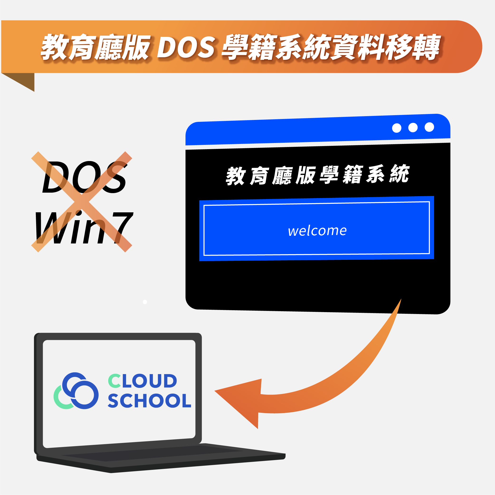
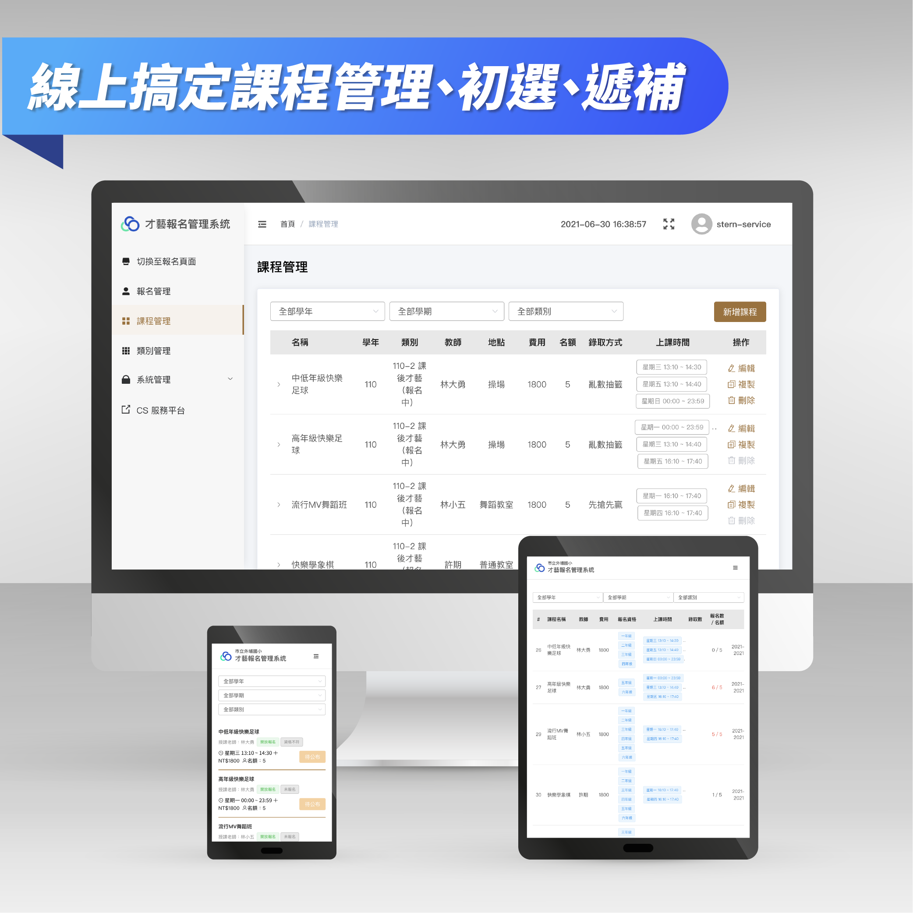
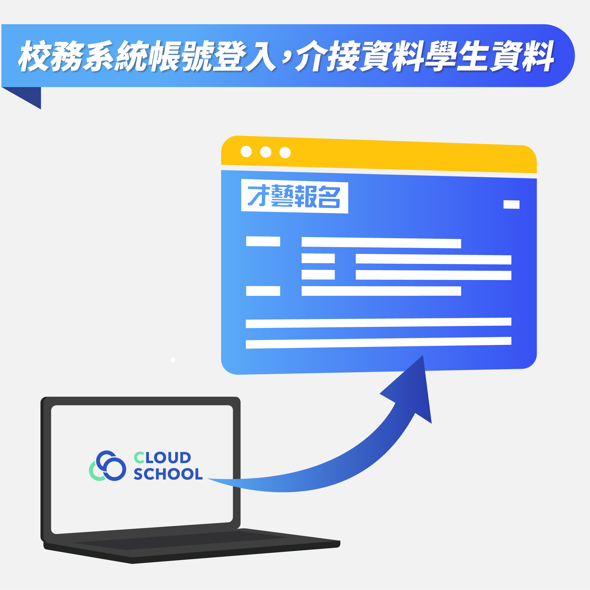

# Cloud School 雲端校務系統

## 新推出！增值賦能產品


* [Cloud School 雲端校務系統擴充服務平台](https://lihi1.com/Sm0PM)
* 欲申請測用請來電洽詢：04-2358-2259


### 【1】教育廳版 DOS 學籍系統資料移轉

教育廳於民國 83 年開發完成的學務系統已於 90 年後陸續停用，多數學校在廳版系統所留存的學籍資料並未進行移轉，仍保留在校內機器中，且必須使用 Win7 系統並架設 DOS 虛擬機，才能查詢學生資料。本公司已開發完成移轉程式，能將廳版學籍資料移轉到 Cloud School 雲端校務系統中，方便註冊業務操作，且可安心淘汰過舊的軟體。

目前已有多所國中移轉成功，如須申請相關服務，請來電諮詢！

### 【2】Activity+ 課程報名系統

Cloud School Activity+ 是專為學校打造的課程報名系統，適用於課後活動、社團、課後照護班等報名與管理。使用雲端校務系統帳號認證，學校管理者線上發佈才藝課程內容，學生、家長線上報名，可設定抽籤、候補機制，雙方即時掌握報名狀況。

### 【3】Cloud School HR 教職員差假

Cloud School HR 是一款專為學校生態打造的人事管理系統。 適應學校多元工作夥伴及差勤制度。 更有效率地進行管理、申請與追蹤，同時解決差勤異動所帶來的課務調整需求。 讓您隨時掌握最新狀況，差勤、課務資訊不遺漏。

## Cloud School 雲端校務系統特色

* **高擴展的雲端環境架構**
  * 採用 Ngnix HA 高可用性、易於擴展的系統環境。
  * 採用 docker 雲端服務部署。
  * 提供集中版單一入口學務系統。
  * 提供校端版校務應用系統，可介接局端 API 伺服器。
* **最先進框架系統**
  * 採用企業級的框架 Zend Framework3，搭配 Memcached 外部快取記憶，讓系統更穩定、效能更提升。
  * 搭配強大的 Doctrine ORM，資料庫存取均透過物件關聯對映的方式，符合物件導向之現代化軟體思維。
  * 採用 ACL（Access Control List）權限控管每個模組的存取控制，杜絕不當連線。
* **高效能的資料庫與檔案系統**
  * 採用 MySQL 先進的關聯式資料庫（InnoDB），提供安全、一致的資料保護及防錯處理。
  * 採用 MongoDB 儲存檔案，檔案存取及管理效能全面進化。
* **安全便利的學籍資料交換**
  * 符合教育部最新的學籍電子交換標準 4.1 版 json 及 xml 交換規格。
  * 支援學籍電子交換標準 3.0 版。
  * 市內轉學生學籍交換在系統內交換完成。
  * 縣市轉學生學籍交換可透過 API 與教育部交換平台交換。
* **標準安全的 API 介接服務**
  * 採用業界標準 OAuth 2.0 認證授權。
  * 支援親師生 SSO 單一帳號登入服務。
  * 提供局內系統 API 介接伺服器，嚴格控管資料連線，避免資料庫連線授權浮濫。
  * 提供學校伺服器 API 介接，可透過 Restful 服務取出自己學校的學籍名單，擴展應用範圍。

## Cloud School 雲端校務系統操作介面與模組功能

* **直覺式介面操作**

  重新設計使用者介面，使用者在一致的操作體驗下，能快速的熟悉整個系統。

* **優秀的前端框架**

  採用強悍的前端開發框架 Bootstrap，建構於最新的 Html5 技術上，並延續 SFS3 學務系統的操作習慣，提供更友善的前端界面。

* **非同步動態網頁設計**

  增加自動完成功能，有效減少網頁流量、增快反應速度。

* **表單資料驗證**

  使用者填送之資料會先經過格式檢驗，符合要求之資料才會存入資料庫，避免不必要之人工輸入錯誤。

* **簡化整合功能**

  整合、改善 SFS3 學務系統模組的設計，將相近功能合併統整。避免模組資料不同步。

* **課程設定彈性化**

  可個別設定班級課程，例如特殊班、技藝班等設定不同的參數。

* **編碼支援多國語**

  文字編碼由 big5 改為 utf8mb4 ，減少姓名亂碼問題。

Copyright © 2018-2021 [思騰資訊](https://www.cloudschool.com.tw/) 版權所有

