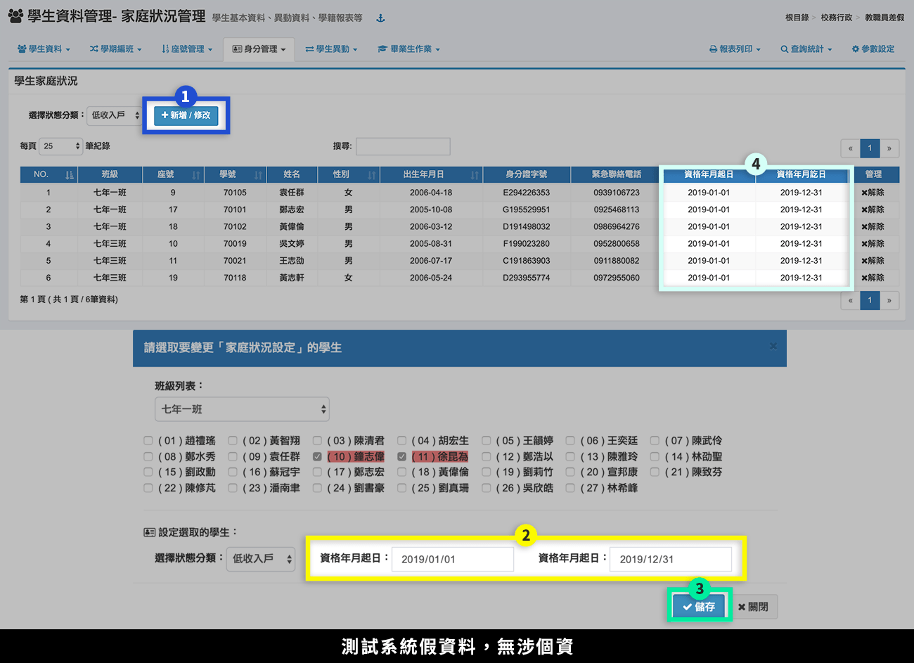
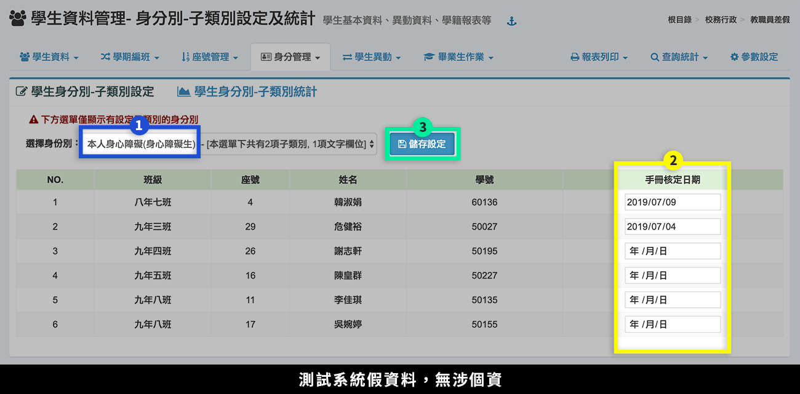

# 學期初設定大補帖

## 資訊組

### [學校基本資料](../xi-guan-li-mo/school.md)

1. 基本資料：確定學校全銜、學校短稱、學校簡稱、英文名稱。
2. 處室資料：新增、刪減處室單位以符合貴校編制。
3. 職稱資料：新增、刪減職稱資料，並對應到正確的所屬處室。

### [教師資料](../jiao/jiao-liao.md)

1. 現職教職員資料：編修教師基本資料與職稱。
2. 新進教職員：新增新任教職員帳號、基本資料。


依照新學年度教師資料進行資料異動作業，若有新新進教師，請進行新增帳號作業，若有大量教職員帳號要建立，可採用批次匯入作業。


### [模組管理](../xi-guan-li-mo/module.md)

1. 指定系統管理員
2. 角色模擬：設定擁有「角色模擬」功能的使用者。
3. 模組管理：
   * 點選「管理」可進行「模組授權」，調整授權單位。
   * 點選「管理」可進行「模組設定」，調整模組位在選單的位置。
   * 點選「調整」可進行「參數設定」。
4. 分類管理：新增、刪減分類。

## 註冊組

### **前置作業**

1. [SFS3 升級後檢查](../xi-guan-li-mo/system.md#sfs3-sheng-cha)：升級後姓名錯誤檢查（剛從 SFS3 轉至雲端校務系統時，需操作此步驟）。
2. [畢業生轉出作業](../jiao/sheng-liao-guan-li.md#bi-ye-zhuan-chu)：先完成舊年度畢業生轉出作業。

### 學期初設定

1. [開學日設定](../jiao/qi-chu-ding.md#1-kai-xue-ri)。
2. [班級設定](../jiao/qi-chu-ding.md#2-ban-ji)。
3. [上課日設定](../jiao/qi-chu-ding.md#3-shang-ke-ri)（設定完上課日，才會自動複製上學期教師職稱）。


學期初設定到這裡，已經可以另外進行學期編班作業、教職員資料異動。


### 學生資料管理

1. 學生資料：編修[學生基本資料](../jiao/sheng-liao-guan-li.md#sheng-liao)與[身分別](../jiao/sheng-liao-guan-li.md#shen-fen-guan-li)。
2. 維護、更新[父母監護人資料](../jiao/sheng-liao-guan-li.md#fu-mu-jian-hu-ren-zi-liao)。
3. [學期編班](../jiao/sheng-liao-guan-li.md#xue-qi-bian-ban-1)：(舊生升級後年級間編班作業)
   * 步驟一：請先進行「複製上學期學生編班資料」，將舊生進行年級升級（年級升級作業需要有數秒的運作時間，請耐心等候）。
   * 步驟二：若本學年度舊生班級數有減班，按下「複製上學期學生編班資料」後，會有減班的班級學生未參與編班，請點選「在籍生尚未編班人數: ＿人，按下編修」。
   * 步驟三：同年級編班作業
     * 若為國小二升三、四升五，已進行統一編班作業且取得編班結果，可以採用「本學期編班資料匯入」。
     * 若只是局部班級學生調整，請使用「編修」作業，進行年級間學生班級調整。詳細之操作請參閱官方說明手冊
   * 步驟四：新學年班級[座號速編](../jiao/sheng-liao-guan-li.md#zuo-hao-su-bian)。
4. 「[匯入新生資料](../jiao/sheng-liao-guan-li.md#hui-ru-xin-sheng-zi-liao)」或「[新生編班（適用國中）](../jiao/xin-sheng-ban-yong-zhong.md)」。

### [評語庫管理](../jiao/cheng-he-guan-li.md#guan-li)

可統一設定全校性評語庫。

### [自訂成績單](../jiao/cheng-guan-li.md#zi-cheng)

可由註冊組統一設定全校成績單樣式，或使用本系統預設成績單。

### 教育部學籍交換規格 4.1 調整設定


為配合教育部學生學籍交換規格 4.1 版之調整，本系統資料需新增以下欄位，並請老師協助校正資料。


#### 鄉土（本土）語言-設定語言類型

請註冊組長提醒鄉土語言任課老師，在輸入「學習描述文字」時進行設定。

1. 任教鄉土語言老師，到**「教職員>學生成績管理」**。
2. 點選**「學習描述文字編修」**。
3. 針對個別學生選擇**「語言類型」**，可按下**「鍵盤圖示」**一次設定整班。

#### 學生家庭狀況-資格日期起訖

1. 按下**「新增/修改」**。
2. 選完學生後，登錄**「資格日期起訖」**。
3. 按下**「儲存」**。
4. 編修完成後顯示於標示處。

#### 本人身障-身心障礙核定日期

1. 到「註冊組>學生資料管理>身分管理>身分別-子類別設定及統計」，選擇**「本人身心障礙」**類。
2. 設定**「手冊核定日期」**。
3. 按下**「儲存設定」**。

## 教學組

### 學期初設定

1. 確認是否完成開學日、班級、上課日設定。
2. 依照學期初設定模組編號完成：
   1. [課程](../jiao/qi-chu-ding.md#5-ke-cheng)：設定各年級的課程科目以及各科的節數、加權、評量次數、配分比例與所屬比例。
   2. [配課](../jiao/qi-chu-ding.md#6-pei-ke)：各班的課程任課教師與任教節數之安排。
   3. [節次](../jiao/qi-chu-ding.md#7-jie-ci)：設定每日上課節數。
   4. [導師](../jiao/qi-chu-ding.md#8-dao-shi)：安排各年級各班之級任導師。
   5. [專科教室](../jiao/qi-chu-ding.md#9-zhuan-ke-jiao-shi)：設定專科教室開放與不開放預約的時間。
   6. [課表設定](../jiao/qi-chu-ding.md#10-ke-biao)：安排各班每日之課表與教室使用。


請留意：新學年度年級若有增班，增加的班級無法複製上學期課程，請進入「編修」介面，然後再使用同年級課程複製的方始處理。


### 課程對應


為配合教育部學生學籍交換規格 4.1 版之調整，本系統資料需新增以下欄位，並請老師協助校正資料。


請至「學期初設定>其他」設定

1. 選擇科目設定：**九年一貫科目**或 **12 年國教科目**。
2. 在每個科目列表中按下**「編修」**。
3. 選擇**「學籍交換對應科目」**（除了非領域課程都要設定對應之科目），請注意只能以下拉選單內之科目設定。
4. 按下**「存擋」**。
5. 標示處呈現設定好之科目。


* 設定好九年一貫所有科目後，接下來請設定 12 年國教科目。
* 本項設定後，只要設定一次即可，如果有新設科目也必須要設定科目的對應。

