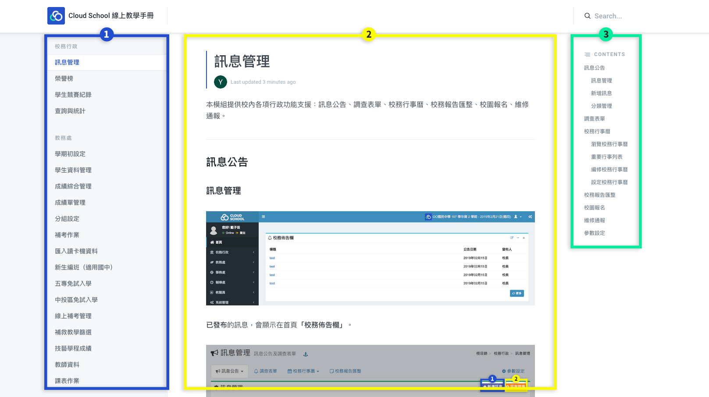

# 關於此線上教學手冊


* 本教學手冊功能截圖來自 Cloud School 測試系統，其匯入的資料為假資料，無涉個資安全問題。
* 教學手冊定期更新內容，製作內容需要人力與時間，若無即時同步系統功能，請使用者見諒。


## 如何使用教學手冊

1. 左側選單依照系統模組名稱分類，每一模組一頁。
2. 中間為教學手冊內容，以系統截圖作說明，請使用者參照標號對應下方說明文字。
3. 右側選單為該頁大綱，也就是該模組的子功能項目。

