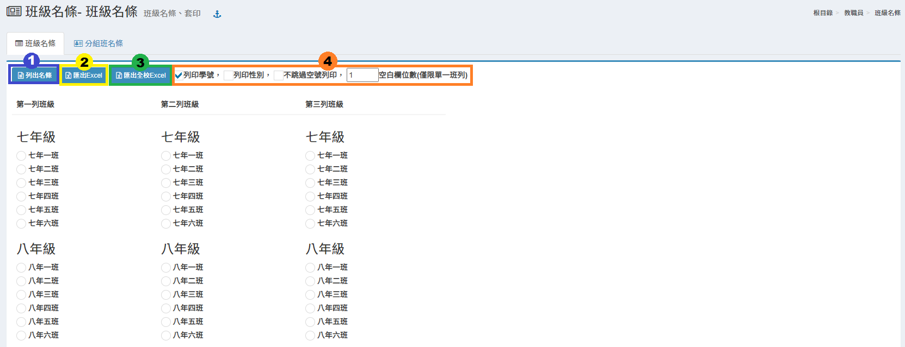

# 班級名條

## 班級名條

1. 至少在第一列中選擇一班，按下**「列出名條」**即可列出所選班級名條並列印。
2. 選擇班級後可以按下**「匯出Excel」**下載班級名條。
3. 或可按下**「匯出全校Excel」**下載全校班級名條。
4. 勾選名條是否含有「學號」、「性別」欄位，或不跳過空號列印，輸入顯示空白欄位數。

## 分組班名條

1. 至少在第一列中選擇一班，按下**「列出名條」**即可列出所選分組班級名條並列印。
2. 選擇班級後可以按下**「匯出分組Excel」**下載分組班級名條。
3. 或可按下**「匯出全校分組Excel」**下載全校分組班級名條。
4. 勾選是否有性別欄位。
