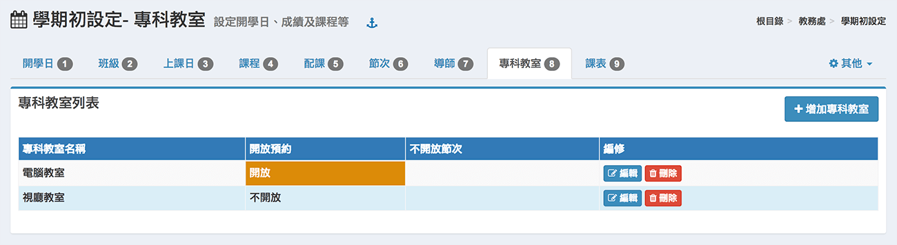

# 課表查詢

## 班級課表

1. 本功能查詢各班級課表，也可查詢教師課表。點選下拉選單可查詢班級課表。
2. 按該班任課教師旁 **「課表」** 按鈕圖示，可觀看該教師課表。

## 教師課表

1. 本功能查詢各班級課表，也可查詢教師課表。點選下拉選單可查詢班級課表。
2. 按該班任課教師旁 **「課表」** 按鈕圖示，可觀看該教師課表。

## 專科教室課表

.png>)

## 空堂查詢

## 預約專科教室

1. 系統設定可預約兩周內之專科教室請按 **「圖釘」** 圖示按鈕預約，過期就無法取消及預約。
2. 教師只可取消個人預約，如預約後不使用，應事先取消預約，請按 **「刪除」** 圖示按鈕取消，以維其他老師預約權利。

* 專科教室預約設定，請在學期初設定之專科教室內設定。


要調整「專科教室預約限定期間日數」（預設為14日），請系統管理員到「系統管理 > 模組管理」調整，如下圖：


