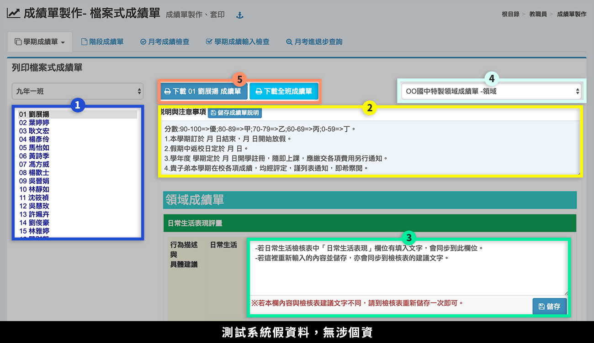
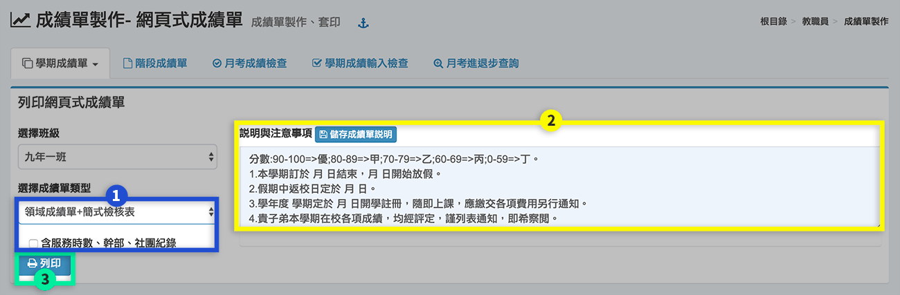

# 成績單製作

## 學期成查詢績單



本功能提供導師或級任教師列印班級學期成績單。

1. 選擇**「學生」**，右方會出現該名學生學期成績資訊。
2. 要列印成績單前，可修改**「說明與注意事項」**，並按下**「儲存成績單說明」**。
3. 導師可在標示處輸入**「日常生活建議」**，此欄位會呈現在預設成績單的「導師評語與建議」。日常生活建議也可在「日常生活檢核表」中填寫，兩個模組資料會同步更新。
4. 選擇**「成績單的格式」**：系統提供「預設領域成績單」與「預設學科成績單」，若貴校註冊組有自訂成績單，則有額外選項可選擇 。
5. 可**「下載該生成績單」**或**「下載全班成績單」**。




1. 選擇**「成績單類型」**，可勾選**「含服務時數、幹部、社團紀錄」**。
2. 可修改**「說明與注意事項」**，直接在標示處編輯文字之內容，完成後按下**「儲存成績單說明」**。
3. 按下**「列印」**印製該班學生成績單。



## 階段成績單

本功能提供導師或級任教師列印班級本學期之階段成績單。

1. 選擇**「學生」**，右方會出現該名學生階段成績資訊。
2. 選擇**「階段別」**。
3. 選擇**「成績單格式」**。系統提供「預設階段成績單」，若貴校註冊組有自訂成績單，則有額外選項可選擇 。
4. 輸入**「日常成績統計時間」**，系統會統計該段時間內，學生之出缺勤、獎懲、服務時數。
5. 可勾選**「加權平均」**。
6. 下載該生或全班成績單。

## 月考成績檢查

本功能提供導師或級任教師觀看班級之階段成績輸入狀況。

1. 標示處呈現該班學生月考成績。
2. 如果科目太多，可以拉動下方拉軸，觀看右方被遮蓋之內容。

## 學期成績輸入檢查

本功能提供導師或級任教師觀看班級之學期成績輸入狀況。

## 月考進退步查詢

本功能提供導師或級任教師觀看班級學生各階段成績進退步狀況。

