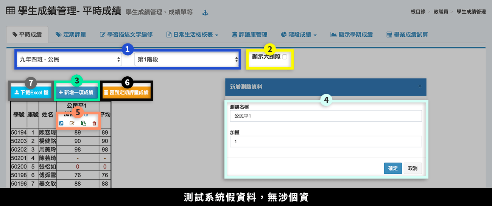
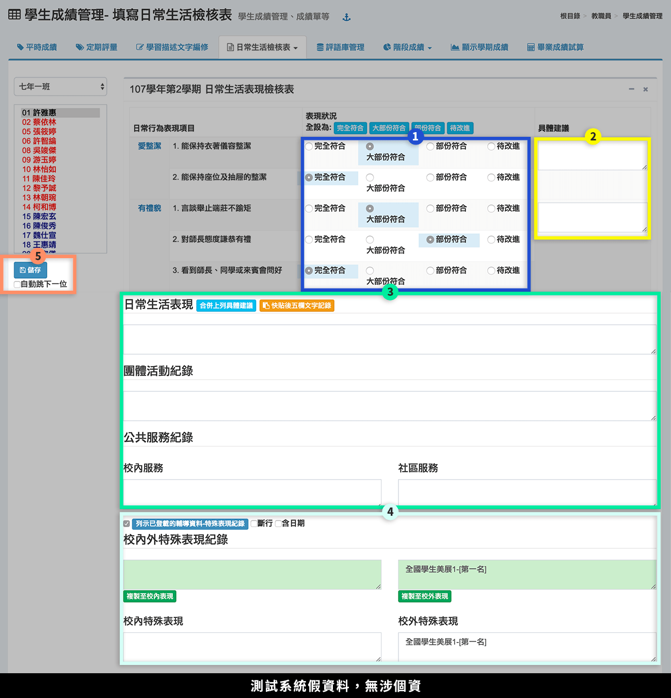
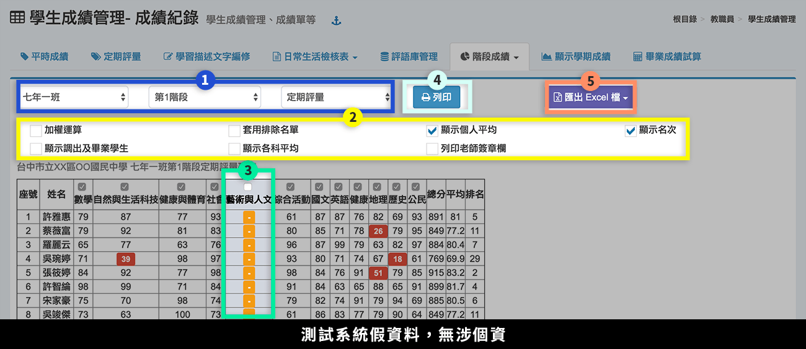
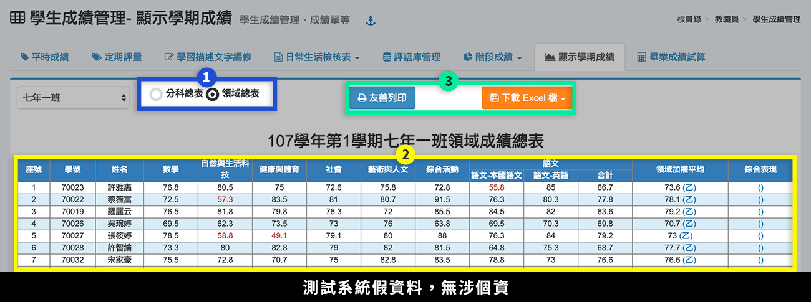
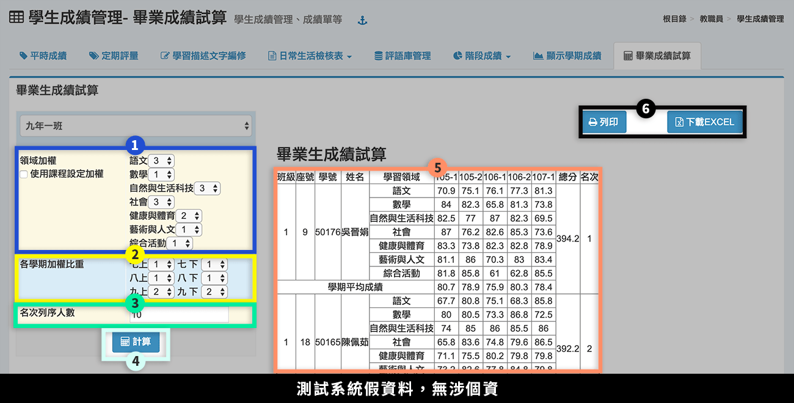

# 學生成績管理

## 平時成績

1. 選擇**「班級-任教科目」**、**「階段別」**。
2. 勾選是否顯示**「學生大頭照」**。
3. 按下**「新增一項成績」**，會彈出快顯示窗，可新增多筆平時成績。
4.  編輯成績**「名稱」**、**「加權」**，按下**「確定」**。

    每筆平時成績皆能自行設定其加權，平均會依照加權數計算。加權數至少為 1 才會列入計算。
5. 在成績欄位中可透過多種方式輸入成績：快顯示窗輸入、頁面中輸入、Excel 快貼，亦可刪除成績。
6. 完成階段的平時成績輸入，務必按下**「匯到定期評量成績」**，點擊後系統才會計算成績並匯入定期評量，畫面將自動跳轉至定期評量成績輸入頁面。
7. 可**「下載成績 Excel 檔」**。

## 定期評量

.png>)

1. 選擇**「班級-任教科目」**、**「階段別」**。
2. 勾選是否顯示**「學生大頭照」**。
3. 在成績欄位中可透過多種方式輸入成績：快顯示窗輸入、頁面中輸入、Excel 快貼，亦可刪除成績。
4. 也可以匯入成績 Excel 檔。
5. 可**「結算學期成績」**（期末適用，會結算每個階段成績）。
6. 完成定期評量成績輸入，並確認無誤後，務必按下**「匯送到教務處」**，成績將會上鎖、不得修改。若仍需修改，請聯繫教務處解鎖。
7. 可**「下載成績 Excel 檔」**。

## 學習描述文字編修

1. 選擇**「任教班級-科目」**。
2. 選擇**「努力程度」**，可按下標題列的鍵盤圖示，可一次設定全班學生的努力程度，在個別進行編修。
3. 輸入**「學習描述文字」**，或是點選最右側的圖示，會彈出快顯視窗，即可選擇預設的評語或自訂的評語。
4. 可**「顯示上學期評語」**。
5. 可將 Excel 的描述文字匯入系統，按下**「使用快貼輸入學習描述文字」**，並參照系統說明匯入。
6. 點擊**「下載學期成績」**可下載該科目學期成績。

## 日常生活檢核表

### 填寫日常生活檢核表

1. 勾選學生**「表現狀況」**。
2. 填寫**「具體建議」**。
3. 輸入**「日常生活表現」**、**「團體活動紀錄」**、**「公共服務紀錄」**，日常生活表現可合併列出上列建議。亦可使用範例檔快貼匯入。
4. 輸入校內外特殊表現紀錄，亦可從輔導紀錄的特殊表現匯入，請勾選「列示已登載的輔導資料」，並點選複製至校內／校外表現即可直接匯入。
5. 按下**「儲存」**，儲存該次編輯。


輔導紀錄>特殊表現，可匯入學生榮譽榜資料。因此要在日常生活檢核表匯入特殊表現時，請先確認 [輔導紀錄>特殊表現](../undefined-1/sheng-guan-li.md#te-shu-biao-xian) 是否有資料。


### 日常生活表現列表

> 此處填入的資料即是「日常生活檢核表中的**日常生活表現**」，也是「學期成績單中的**日常生活評語**」。

1. 選擇**「班級」。**
2. 輸入**「日常行為表現描述文字」**或是點選最右側的對話框圖示，會彈出快顯視窗，即可選擇預設的評語或自訂的評語。
3. 按下**「儲存」**。
4. 也可以使用**「快貼輸入」**批次處理學生日常行為表現評語，請參照使用說明操作。

## 評語庫管理

提供教師可自行設訂常用評語庫。

.png>)

1. 選擇「**評語類別」**，按下**「齒輪圖示」**可新增、編修類別。
2. 選擇**「評語等級」**，按下**「齒輪圖示」**可新增、編修等級。
3. 按下**「新增評語」**新增一則評語，按下**「快貼新增評語」**可一次新增多則評語。
4. 可**「下載評語(代碼)」**，方便教師直接輸入代碼登打評語。
5. 勾選評語後，可**「刪除評語」**。
6. 點擊評語欄位可直接編修評語。
7. 按下**「儲存」**，儲存該次編輯。

## 階段成績

### 本學期階段成績

本功能可查詢本學期任課班級學生階段成績。

1. 選擇**「班級」**、**「階段別」**、**「顯示模式」**。
2. 勾選統計的選項。
3. 勾選或取消勾選統計的科目，預設為全選。
4. 按下**「列印」**，可列印當前設定的成績結果。
5. 也可以將成績結果**「匯出將 Excel 檔」**。

### 本班歷次階段成績

1. 選擇**「學期」**、**「階段別」**。
2. 標示處顯示該班該次階段成績總表。
3. 可點選總分計算方式及科目重新計算。
4. 可以**「列印」**成績查詢結果。
5. 可以**「下載」**本班歷次定期評量成績歷年總表。

## 顯示學期成績

1. 選擇顯示**「分科總表」**或**「領域總表」**。
2. 標示處顯示該班成績總表。
3. 可以**「列印」**或**「下載 Excel 檔」**。

## 畢業成績結算

1. 選擇各**「領域加權」**，或勾選**「使用用課程設定加權」**數值（勾選後，系統會直接運算課程加權分數，不需另外選擇右側科目權重欄位）。
2. 選擇各**「學期加權比重」**。
3. 填入**「名次列印名數」**。
4. 按下**「計算」**。
5. 標示處顯示試算結果。
6. 可**「列印」**，或**「下載 Excel」**檔案。
