# 導師作業

## 學籍管理



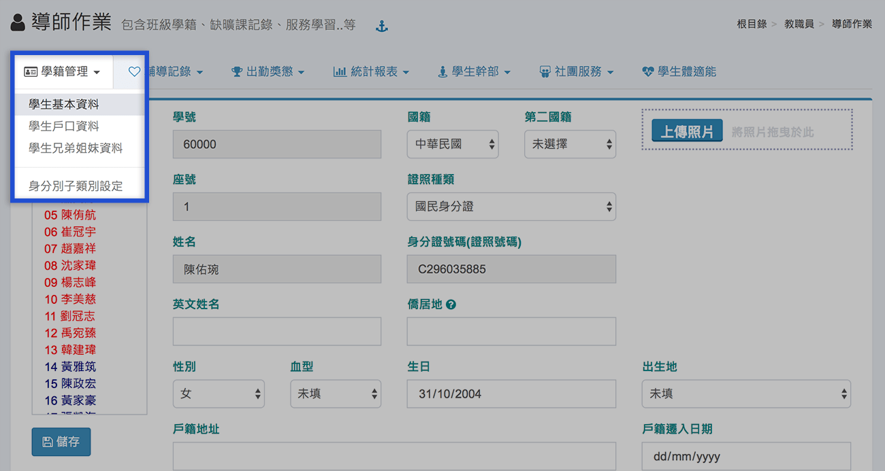



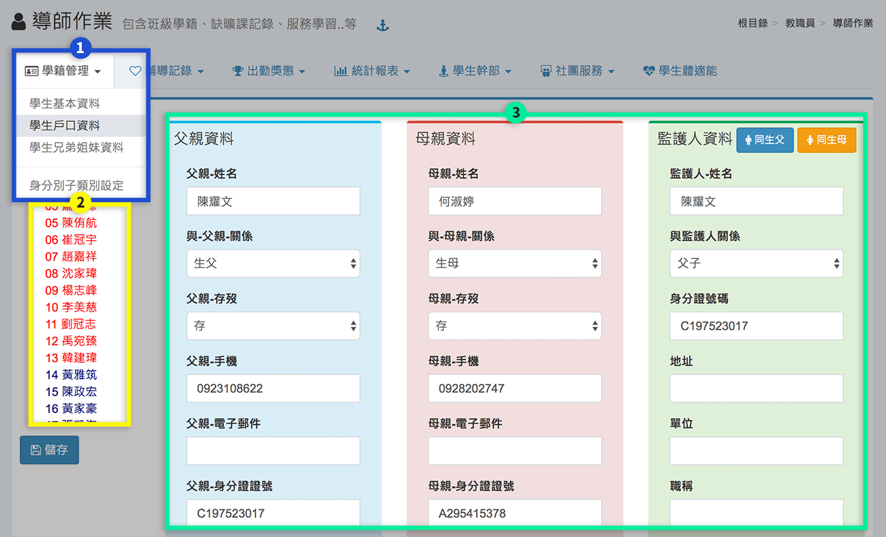

1. 請選擇 **「學生戶口資料」**
2. 請點選學生
3. 依學生資料修改表單，修改完成後請按 **「儲存」** 按鈕儲存資料。



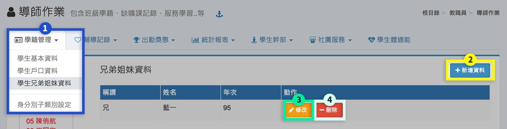

1. 請點選學生後，會出現學生兄弟姊妹之資料
2.  要新增該學生之兄弟姊妹，請按 **「新增資料」** 按鈕，會出現跳出視窗如下圖。

    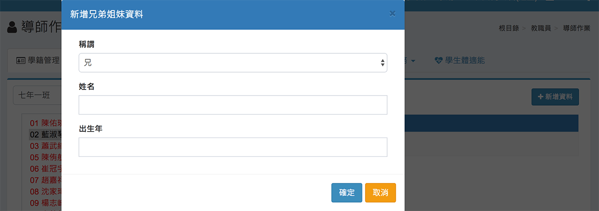\
     :pencil:`輸入該生要新增之兄弟姊妹資料後按 「確定」 按鈕級可儲存資料。`
3. 要修改某筆資料，請按 **「修改」** 按鈕，於跳出之視窗內修改資料後，按 **「確定」** 按鈕級可儲存資料。
4. 要刪除某筆資料，請按 **「刪除」** 按鈕，於確認刪除後刪除。



* 本功能是提供導師或級任教師修改學生身分別，如果不開放導師修改請於權限設定只有教務處可以使用。
* 此部分需要先在學生基本資料設定學生身分別(身障、原住民...)，在此功能才可以設定學生身分子類別

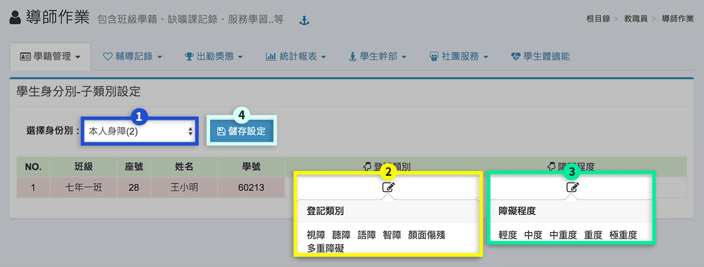

1. 請選擇身分別，系統才會從班級學生符合此身分別挑出名單列出。
2. 選擇學生，將滑鼠移到登記類別欄位，會出現編輯及刪除按鈕，就可點選按鈕做編輯。
3. 選擇學生，將滑鼠移到障礙程度欄位，會出現編輯及刪除按鈕，就可點選按鈕做編輯。
4. 在欄位最上方手指圖示可以快速設定全部出現學生之類別及程度。



## 輔導記錄



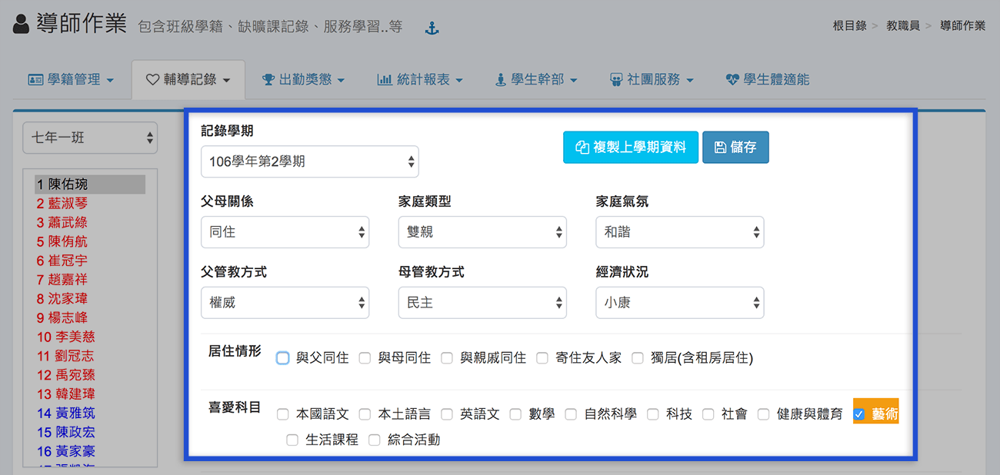



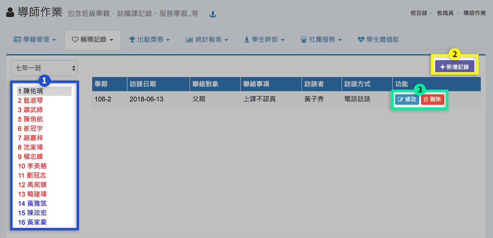

1. 請選擇要記錄訪談之學生。
2.  新增紀錄請按 **「新增紀錄」** 按鈕，會跳出新視窗如下圖。

    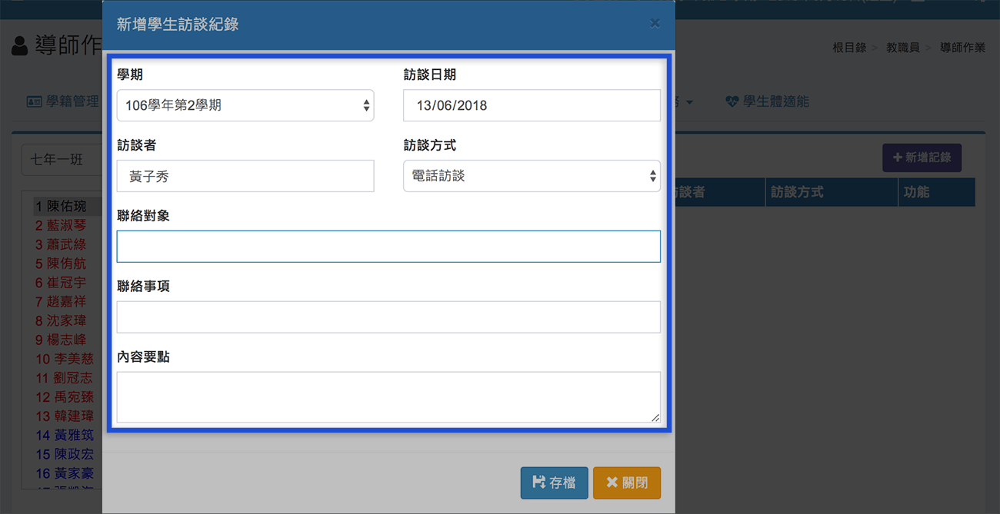\
     :pencil:  `請填入相關訪談資料後，按 「存檔」 按鈕儲存資料。`
3. 要修改紀錄請按 **「修改」** 按鈕圖示，跳出新視窗後，請修改資料後，按儲存按鈕來儲存輸入之資料。要刪除紀錄請按 **「刪除」** 按鈕圖示，在確定後刪除。



.png>)

1. 標示處會列出當學期該班學生所有的訪談紀錄。
2. 導師可**「下載」**、**「列印」**該班紀錄。



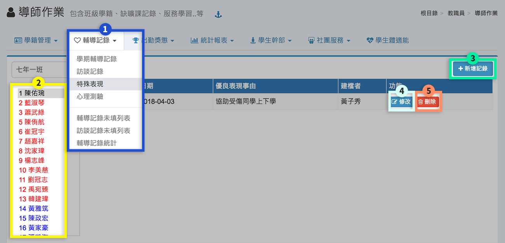

1. 請選擇 **「特殊表現」**
2. 請選擇要記錄訪談之學生。
3.  新增紀錄請按 **「新增紀錄」** 按鈕，會跳出新視窗如下圖。

    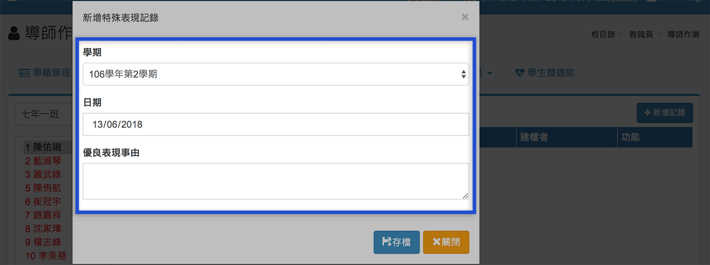\
     :pencil:  `請填入相關訪談資料後，按 「存檔」 按鈕儲存資料。`
4. 要修改紀錄請按 **「修改」** 按鈕圖示，跳出新視窗後，請修改資料後，按儲存按鈕來儲存輸入之資料。
5. 要刪除紀錄請按 **「刪除」** 按鈕圖示，在確定後刪除。




若導師無法編修心理測驗，請聯繫輔導處，到[學生輔導管理](../undefined-1/sheng-guan-li.md#ding)進行參數設定。


.png>)

1. 按下**「編修心理測驗」**，在彈跳視窗中可新增、編修心理測驗名稱。
2. 按下**「快貼批次匯入」**，可一次匯入全班心理測驗成績。
3. 也可以逐位學生輸入成績。
4. 在學生成績欄位中，可「修改」或**「刪除」**測驗成績。
5. 按下**「列印本學期測驗」**，可列印全班有測驗學生之成績。





本功能是統計導師填寫班級輔導紀錄狀況，請點選學期出現如下圖。 \

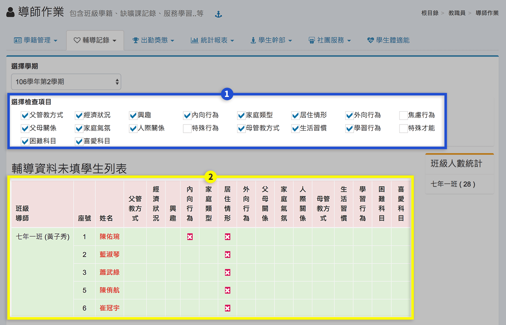

1. 請選擇要查詢的統計項目。
2. 在下方會出現填寫狀況。



本功能是統計導師填寫班級訪談紀錄狀況，請點選學期出現如下圖。

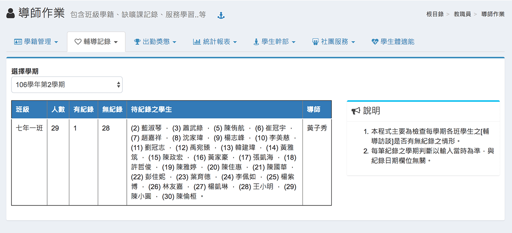



本功能是統計各項紀錄狀況，請點選學期出現如下圖。

1. 選擇統計類別。
2. 呈現統計圖表。
3. 呈現統計資料。



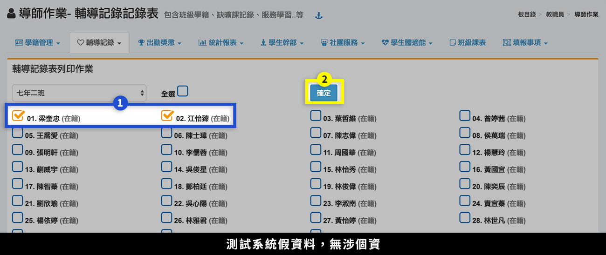

1. 勾選要列印的學生。
2. 按下**「確定」**後，會彈跳出列印視窗。



## 出勤獎懲




導師作業下的缺曠課登記只能處理當學期學生缺曠課資料。


.png>)

1. 選擇要登錄之**「日期」**。
2. 勾選請假學生請假**「節數」**。
3. 選擇**「假別」**。
4. 若是請假整天，可勾選「整天」，並設定整天是否含升降旗。
5. 登錄完畢請按 **「儲存登記」** 按鈕。



本功可列出全班或個人缺曠課明細，統計國中以節數為統計單位；國小以日數為統計單位，不足 1 日不列入統計；集會只統計升降旗曠課的學生。  

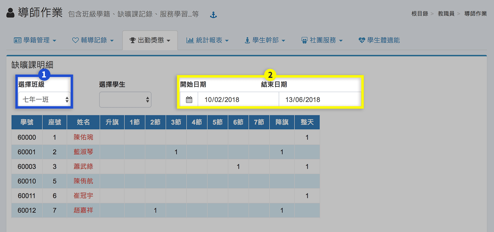

1. 列出全班明細，請先選擇班級，不選擇學生。
2.  請輸入統計日期期限，下方即會列出全班明細。 

    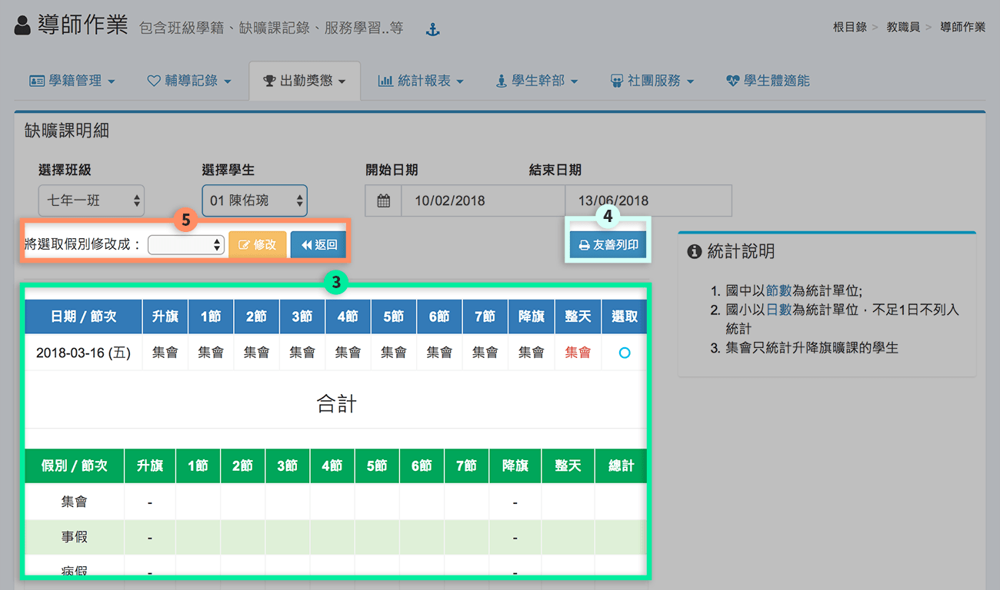
3. 選擇個別學生下方會分別列出請假明細及請假類別統計時數統計。
4. 按 **「友善列印」** 可以列印出該生個人勤惰明細表。
5. 如需修改假別，可於列表中選擇欲修改之項目，點選假別，並按 **「修改」** 以改變假別。



本功能提供當學期開學日起至輸入日期的班級缺曠課統計。 

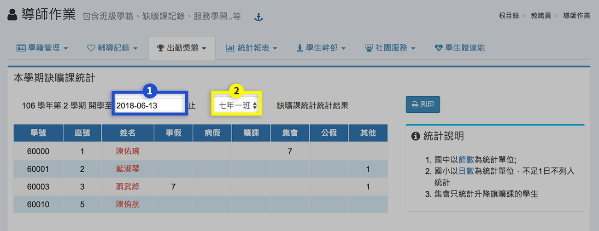

1. 選擇日期。
2. 選擇班級。



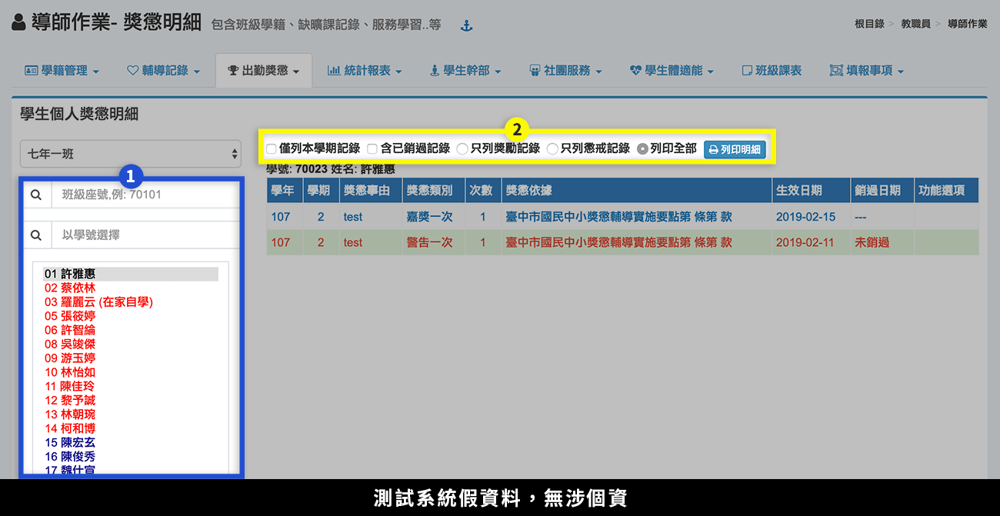

1. 選擇學生後，在右方區塊會出現該學生所有獎懲紀錄。
2. 可勾選「僅列本學期記錄、含已銷過記錄、只列獎勵記錄、只列懲戒記錄、列印全部」，再按**「列印明細」**按鈕，即可列印該生獎懲紀錄。



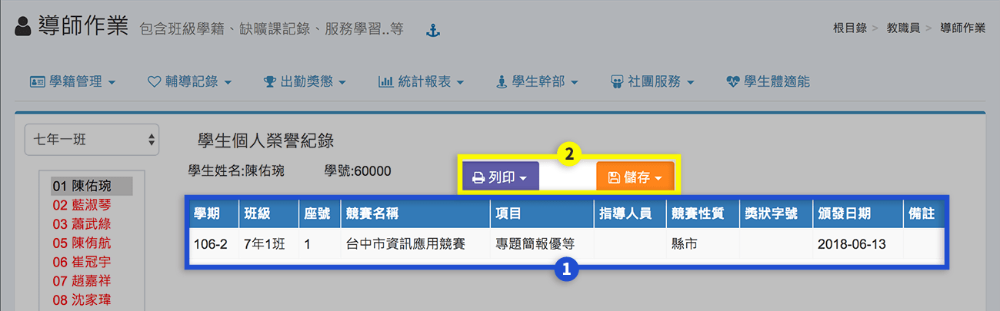

1. 選擇學生後會顯示該生榮譽紀錄。
2. 按 **「列印」** 按鈕可列印該生或全班紀錄。



## 統計報表



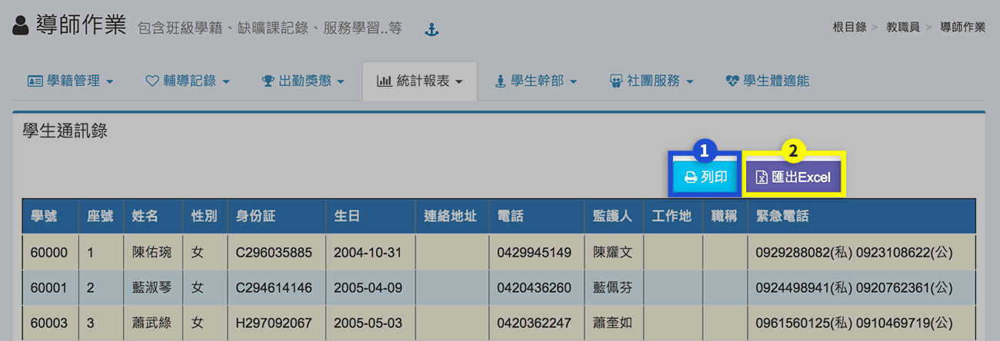

1. 按 **「列印」** 按鈕可列印全班通訊錄。
2. 按 **「匯出EXCEL」** 按鈕可將資料存成 excel 檔案格式下載。



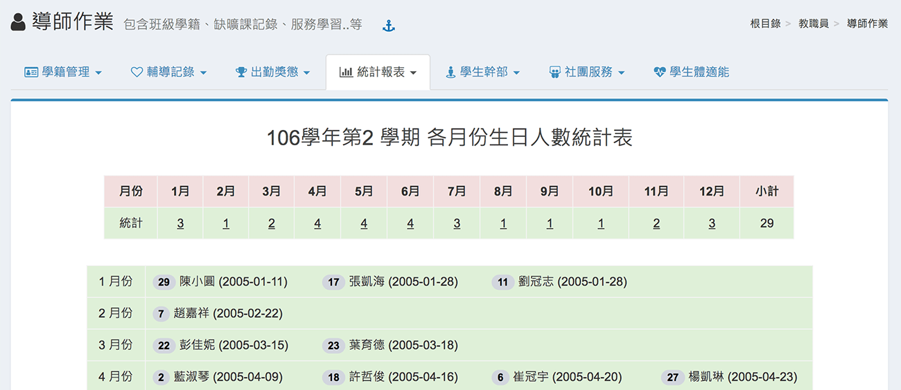



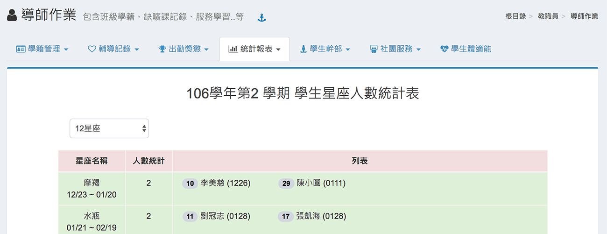



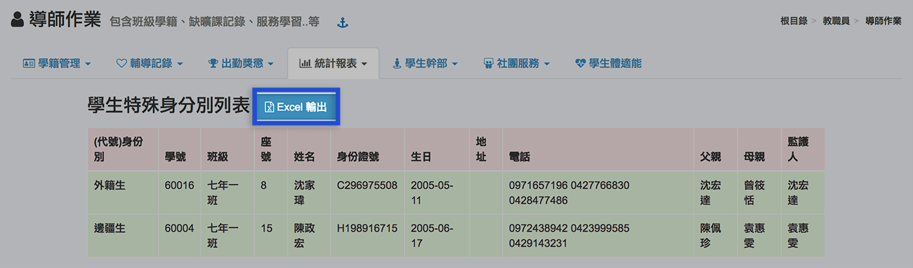



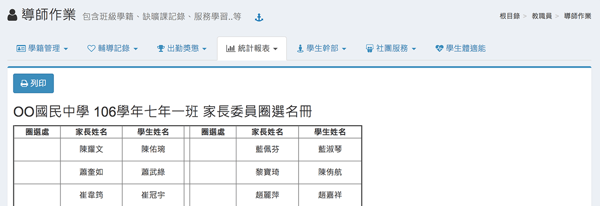



## 學生幹部



班級幹部名稱若不符合貴校設定，請系統管理者修改。

1. 輸入方式以滑鼠拖拉下方學生方塊至上方綠色區塊該職稱內放置。
2. 設定完成後點選存檔 保留設定。
3. 要修改職稱人員，直接拉其他學生方塊至該職稱即覆蓋該設定，修改後點選 **「存檔」** 保留設定。
4. 如果要刪除該職稱人員也可點選職稱內學生學號下方之圖式刪除，修改後點選 **「存檔」** 保留設定。



小老師科目名稱若不符合貴校設定，請系統管理者增加修改。

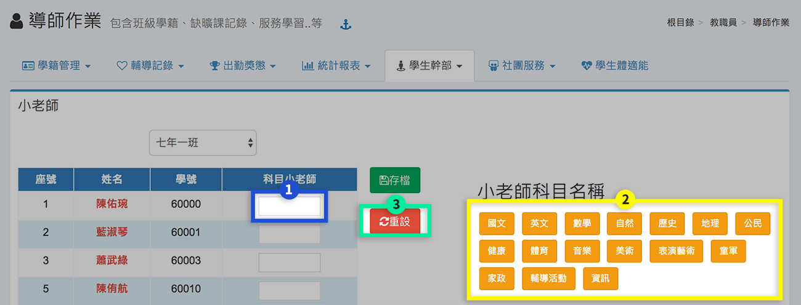

1. 可直接於選定之學生輸入位置鍵盤輸小老師科目，同樣修改後點選存檔 保留設定。
2. 快速輸入方式以先點選學生名字該列任何位置或輸入位置皆可，然後分別依參數設定之團體名稱及幹部名稱點選，設定完成後點選存檔。需要修改，依上述方式點選，同樣修改後點選 **「存檔」** 保留設定。
3. 要重新輸入該班資料，可點選 **「重設」** 清空所有表單資料。



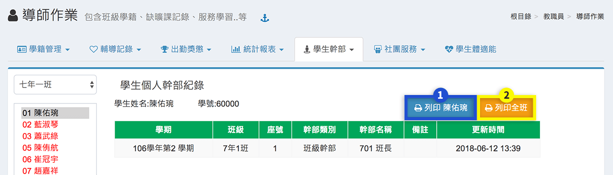

1. 請選擇學生，右方會列出該生所有幹部紀錄，按 **「列印」** 按鈕可列印該生紀錄。
2. 按 **「列印全班」** 按鈕可列印該班所有學生幹部紀錄。



## 社團服務



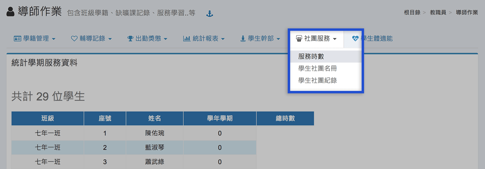



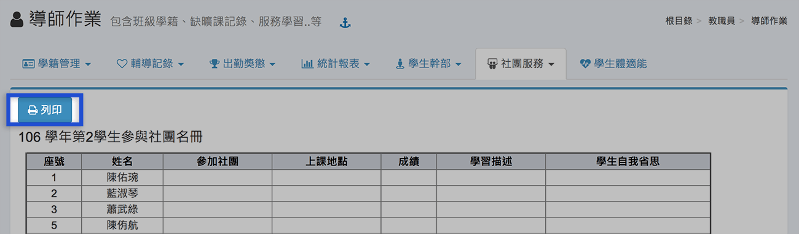



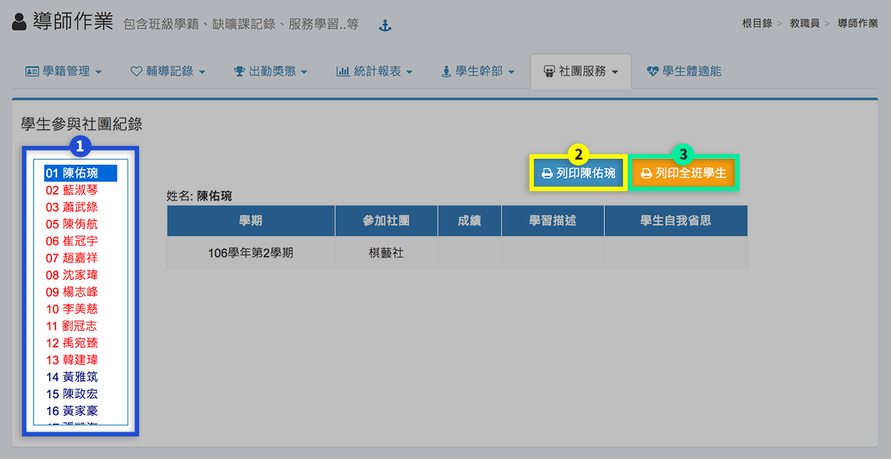

1. 請選擇學生，右方會列出該生參與社團紀錄。
2. 按 **「列印」** 按鈕可列印該生紀錄 。
3. 按 **「列印全班」** 按鈕可列印該班所有學生參與社團紀錄。



## 學生體適能



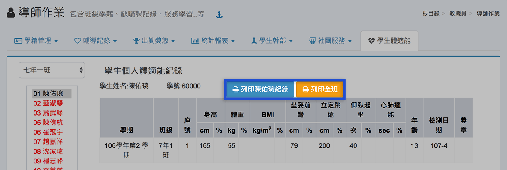



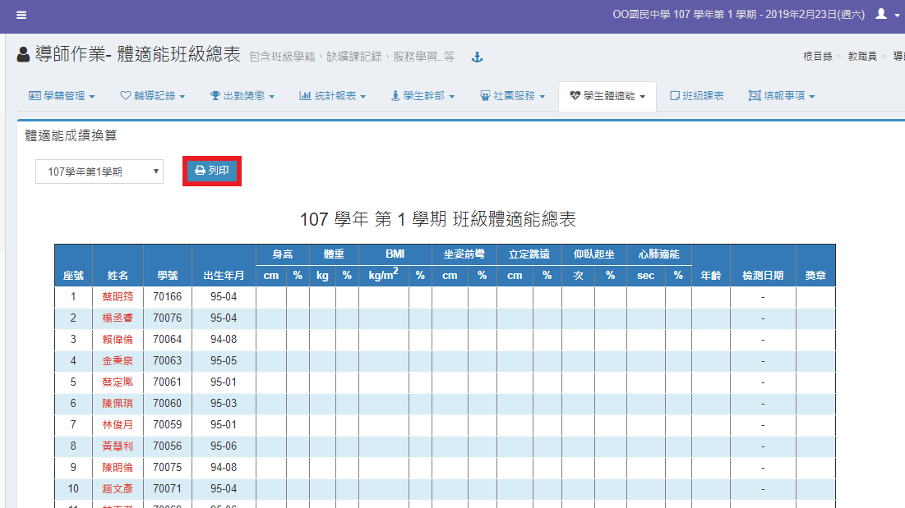



## 班級課表


若導師無法編輯，請確認貴校作業流程「是否開放導師編修課表」。參數設定路徑：[教務處>學期初設定>參數設定](../jiao/qi-chu-ding.md#ding)。


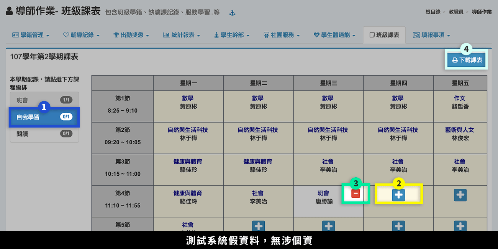

1. 選擇導師自己的課程。
2. 在課表中的空堂按下**「+」**，即設定完畢。
3. 按下**「-」**，可刪除自己的排課設定。
4. 編修完成後可**「下載課表」**。

## 填報事項



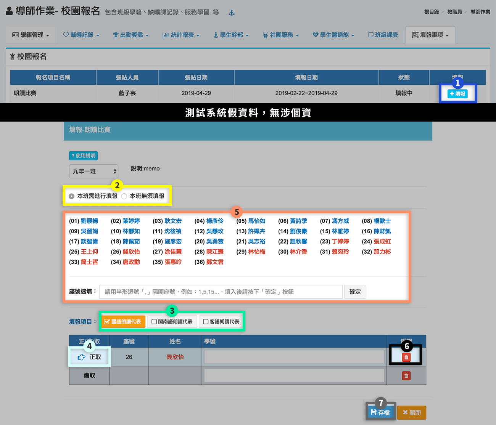

1. 若貴校有填報中的校園報名項目，則導師介面可按下**「填報」**。
2. 選擇**「是否填報」**。
3. 選擇**「填報項目」**。
4. 點擊要填報的項目，會出現**「手指」**圖示。
5. 選擇要填報的**「學生」**，或以座號輸入。
6. 已填報的學生，也可以**「刪除」**。
7. 填報完畢請按**「存檔」**。



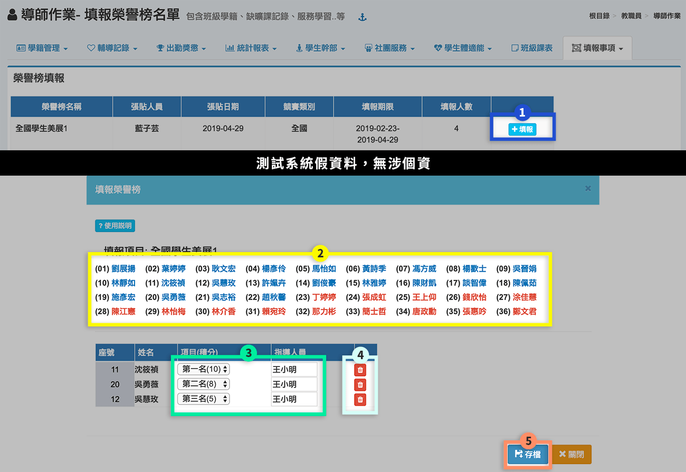

1. 若貴校有填報中的榮譽榜項目，則導師介面可按下**「填報」**。
2. 點選**「學生姓名」**，下方會新增填報學生。
3. 選擇榮譽**「項目與積分」**。
4. 已填報的學生，也可以**「刪除」**。
5. 填報完畢請按**「存檔」**。




本模組功能須由教務處到 [學生資料管理>參數設定](../jiao/sheng-liao-guan-li.md#ding)，才能開放導師編修升學學校。


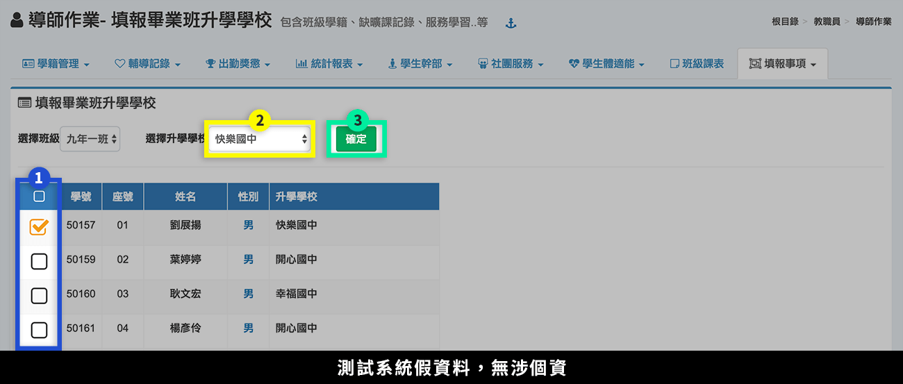

1. 勾選**「學生」**。
2. 選擇**「升學學校」**。
3. 按下**「確定」**，即設定完成。


