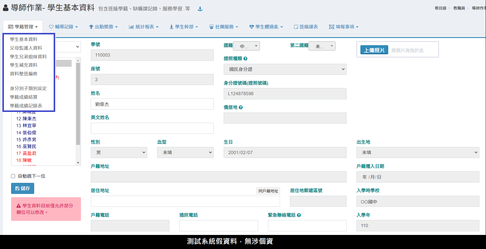
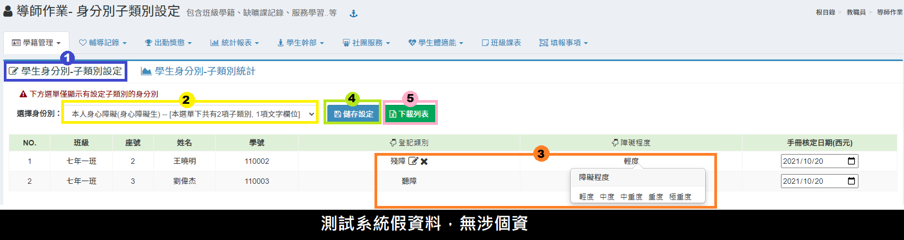
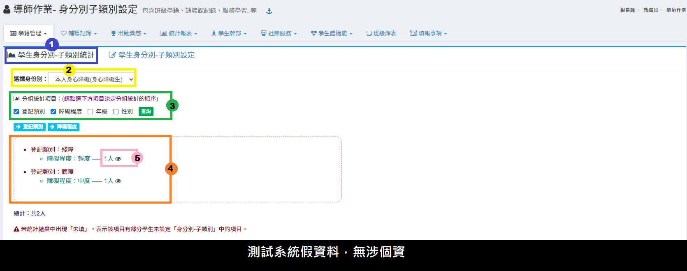
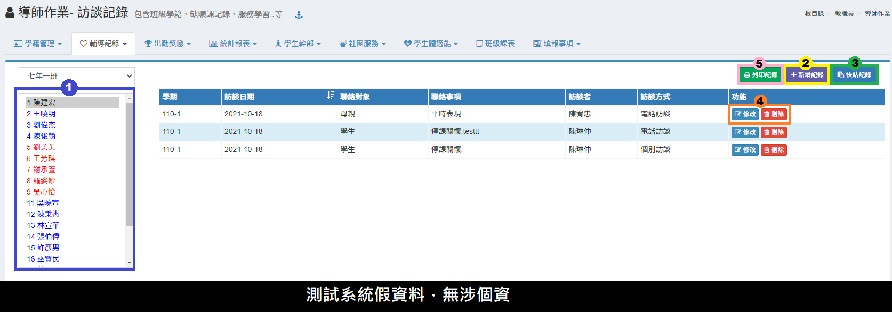
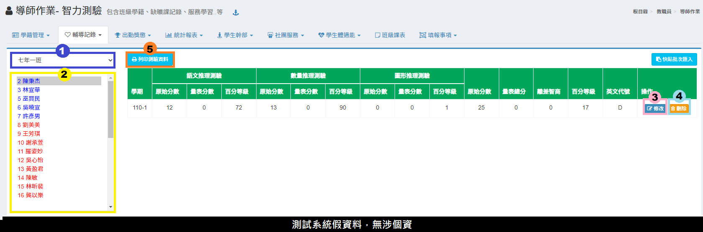
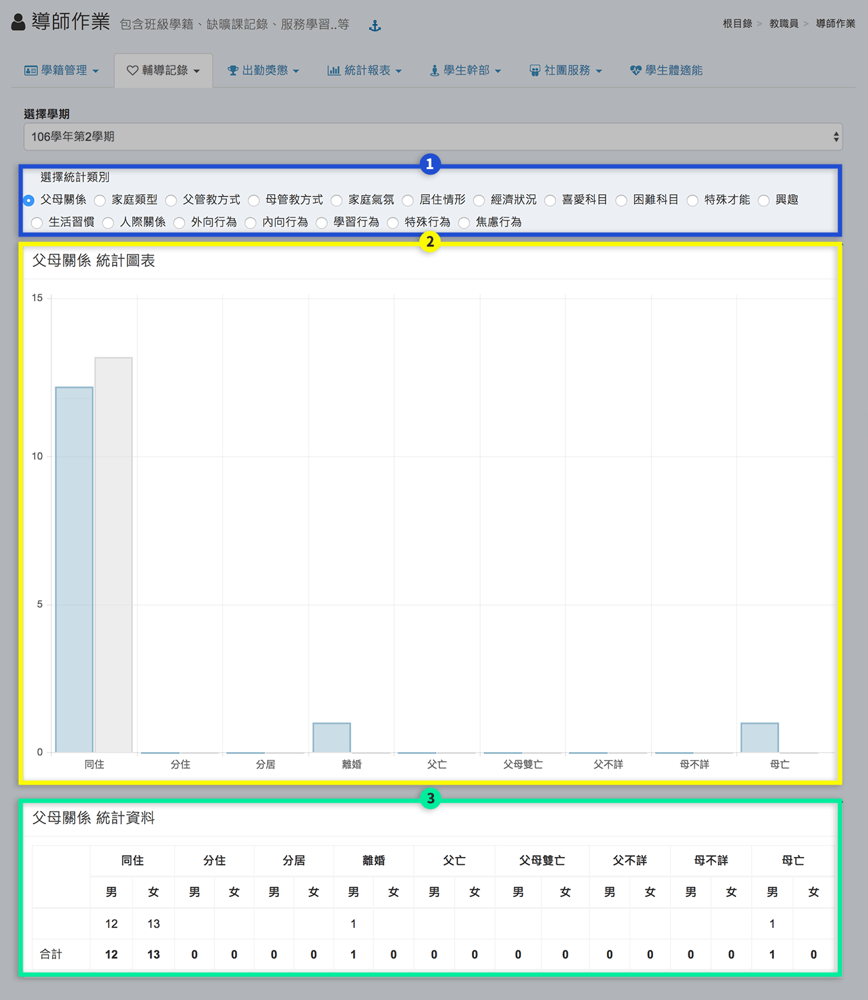
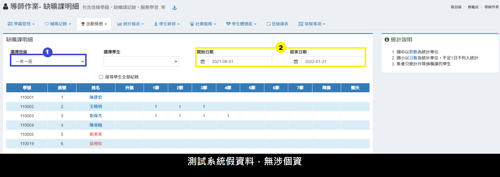
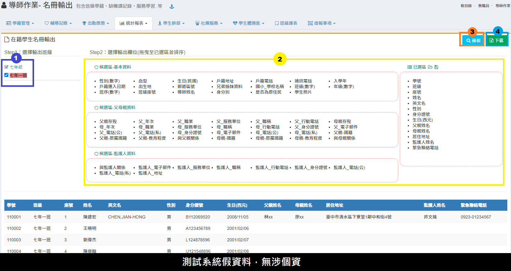
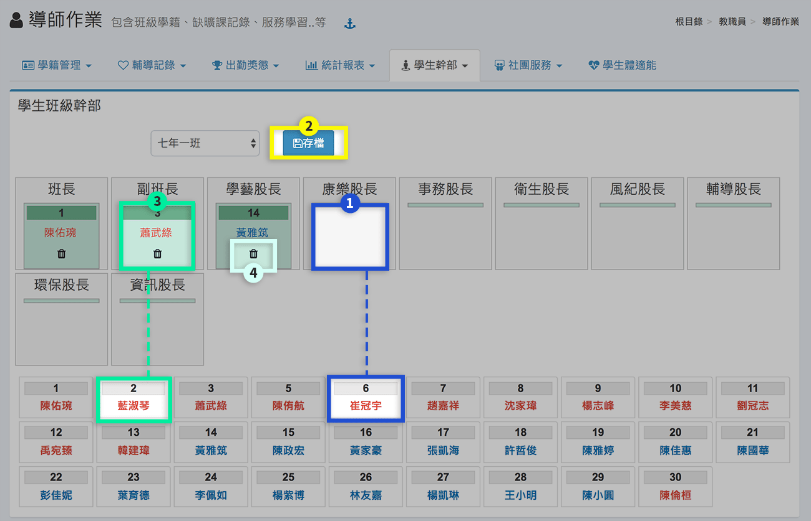

# 導師作業

## 學籍管理




請點選學生後，依學生資料修改表單，修改完成後請按 「儲存」 按鈕儲存資料


若導師無法編修學生基本資料，請聯繫教務處，到[學生資料管理](../jiao/sheng-liao-guan-li.md#ji-ben-zi-liao)進行[參數設定](../jiao/sheng-liao-guan-li.md#can-shu-she-ding)。





1. 請選擇 **「父母監護人資料」**。
2. 請點選學生
3. 請依監護人資料修改表單。
4. 修改完成後請按 **「儲存」** 按鈕儲存資料。如勾選自動跳下一位將於儲存後自動跳選至下一位學生。


若導師無法編修父母監護人資料，請聯繫教務處，到[學生資料管理](../jiao/sheng-liao-guan-li.md#ji-ben-zi-liao)進行[參數設定](../jiao/sheng-liao-guan-li.md#can-shu-she-ding)。





1. 請點選學生後，會出現學生兄弟姊妹之資料
2.  要新增該學生之兄弟姊妹，請按 **「新增資料」** 按鈕，會出現跳出視窗如下圖。

    \
    &#x20;:pencil:`輸入該生要新增之兄弟姊妹資料後按 「確定」 按鈕級可儲存資料。`
3. 要修改某筆資料，請按 **「修改」** 按鈕，於跳出之視窗內修改資料後，按 **「確定」** 按鈕即可儲存資料。
4. 要刪除某筆資料，請按 **「刪除」** 按鈕，於確認刪除後刪除。




1. 選取 **「班級選單」** 可以切換成不同的班級。
2. 點選 **「學生列表」** 可以切換不同的學生。
3. 填寫內容呈現在標示處。
4. 點選**「編輯」**、**「刪除」**可編修/刪除填寫內容。 僅能編輯已開放給導師編輯權限的項目內容。&#x20;


若導師無法填報需由導師填報之補充資料，請聯繫教務處，到[學生資料管理>補充資料](../jiao/sheng-liao-guan-li.md#bu-chong-zi-liao)進行設定。





1. 選取**「班級選單」**可以切換成不同的班級。
2. 選擇要編修的**「資料欄位」**。
3. 按下**「開始編輯」**。
4. 標示處可編修整班學生資料。
5. 按下**「儲存結果」**，完成本次編修。



* 本功能是提供導師或級任教師修改學生身分別，如果不開放導師修改請於權限設定只有教務處可以使用。
* 此部分需要先在學生基本資料設定學生身分別(身障、原住民...)，在此功能才可以設定學生身分子類別

**一.學生身分別-子類別設定**

1. 選擇學生身分別-子類別設定。
2. 請選擇**「身分別」**，系統會將班級學生符合此身分別挑出名單列出。
3. 選擇學生，將滑鼠移到登記類別/障礙程度欄位，會出現編輯及刪除按鈕，就可點選按鈕做編輯。在欄位最上方手指圖示可以快速設定全部出現學生之類別及程度。
4. 修改完畢按下**「儲存設定」**儲存此次編輯。
5. 點選**「下載列表」**可下載學生身分別子類別資料。

**二.學生身分別-子類別統計**

1. 請選擇學生身分別-子類別統計。
2. 請選擇**「身分別」**。&#x20;
3. 勾選**「分組統計項目」**後點擊**「查詢」** 。
4. 統計資料顯示於標示處。
5.  點擊眼睛符號可查看學生明細，如下圖

    




1. 選擇**「班級」**。
2. 選擇**「成績計算方式」**及勾選**「成績單顯示項目」**。
3. 班級學籍成績一覽表顯示於標示處 。
4. 可**「列印」**或**「下載」**學籍成績結算表。




1. 選擇**「班級」**。&#x20;
2. 選擇**「成績計算方式」**。&#x20;
3. 選擇**「學生」**。&#x20;
4. 勾選是否**「列印職章」**。&#x20;
5. 勾選列印方式及項目。&#x20;
6. 點擊**「確定」**，將會跳出列印視窗可列印學籍成績紀錄表。



## 輔導記錄








1. 請選擇要記錄訪談之學生。
2.  新增紀錄請按 **「新增紀錄」** 按鈕，會跳出新視窗如下圖。

    \
    &#x20;:pencil:  `請填入相關訪談資料後，按 「存檔」 按鈕儲存資料。`
3. 如有多筆訪談紀錄，可點擊**「快貼紀錄」**跳出新視窗，如下圖，按照使用說明操作即可
4. 要修改紀錄請按 **「修改」** 按鈕圖示，跳出新視窗後，請修改資料後，按儲存按鈕來儲存輸入之資料。要刪除紀錄請按 **「刪除」** 按鈕圖示，在確定後刪除。
5. 點擊**「列印」**可列印該生訪談紀錄列表。



.png>)

1. 標示處會列出當學期該班學生所有的訪談紀錄。
2. 導師可**「下載」**、**「列印」**該班紀錄。




1. 請選擇 **「特殊表現」**
2. 請選擇要記錄特殊表現之學生。
3. 新增紀錄請按 **「新增紀錄」** 按鈕，會跳出新視窗如下圖。\
   &#x20;:pencil:  `請填入相關紀錄後，按 「存檔」 按鈕儲存資料。`
4. 要修改紀錄請按 **「修改」** 按鈕圖示，跳出新視窗後，請修改資料後，按儲存按鈕來儲存輸入之資料。
5. 要刪除紀錄請按 **「刪除」** 按鈕圖示，在確定後刪除。




若導師無法編修心理測驗，請聯繫輔導處，到[學生輔導管理](../undefined-1/sheng-guan-li.md)進行[參數設定](../undefined-1/sheng-guan-li.md#can-shu-she-ding)。


.png>)

1. 按下**「編修心理測驗」**，在彈跳視窗中可新增、編修心理測驗名稱。
2. 按下**「快貼批次匯入」**，可一次匯入全班心理測驗成績。
3. 也可以逐位學生輸入成績。
4. 在學生成績欄位中，可**「修改」**或**「刪除」**測驗成績。
5. 按下**「列印本學期測驗」**，可列印全班有測驗學生之成績。




若導師無法編修智力測驗，請聯繫輔導處，到[學生輔導管理](../undefined-1/sheng-guan-li.md)進行[參數設定](../undefined-1/sheng-guan-li.md#can-shu-she-ding)。


1. 僅會顯示**「任教班級」**。
2. 選擇**「學生」。**
3. 在學生成績欄位中，可**「修改」**測驗成績。
4. 點擊**「刪除」**可刪除測驗成績。
5. 按下**「列印本學期測驗」**，可列印全班有測驗學生之成績。


每學期每位學生只會有一筆資料，重複匯入將會覆蓋原資料。





若導師無法編修興趣測驗，請聯繫輔導處，到[學生輔導管理](../undefined-1/sheng-guan-li.md)進行[參數設定](../undefined-1/sheng-guan-li.md#can-shu-she-ding)。


.png>)

1. 僅會顯示**「任教班級」**。
2. 選擇**「學生」。**
3. 在學生成績欄位中，可**「修改」**測驗成績。
4. 點擊**「刪除」**可刪除測驗成績。
5. 按下**「列印本學期測驗」**，可列印全班有測驗學生之成績。


每學期每位學生只會有一筆資料，重複匯入將會覆蓋原資料。





若導師無法編修性向測驗，請聯繫輔導處，到[學生輔導管理](../undefined-1/sheng-guan-li.md)進行[參數設定](../undefined-1/sheng-guan-li.md#can-shu-she-ding)。


1. 僅會顯示**「任教班級」**。
2. 選擇**「學生」。**
3. 在學生成績欄位中，可**「修改」**測驗成績。
4. 點擊**「刪除」**可刪除測驗成績。
5. 按下**「列印本學期測驗」**，可列印全班有測驗學生之成績。





本功能是統計導師填寫班級輔導紀錄狀況，請點選學期出現如下圖。 \

1. 請選擇要查詢的統計項目。
2. 在下方會出現填寫狀況。



本功能是統計導師填寫班級訪談紀錄狀況，請點選學期出現如下圖，可依紀錄次數篩選。




本功能是統計各項紀錄狀況，請點選學期出現如下圖。

1. 選擇統計類別。
2. 呈現統計圖表。
3. 呈現統計資料。




1. 勾選要列印的學生。
2. 可勾選是否需要**「列印職章」**。
3. 按下**「確定」**後，會彈跳出列印視窗。



## 出勤獎懲




* 目前僅國小校務系統開放導師新增學生缺曠課紀錄
* 導師作業下的缺曠課登記只能處理當學期學生缺曠課資料。


1. 選擇要登錄之**「日期」**。
2. 勾選請假學生請假**「節數」**。
3. 選擇**「假別」**。
4. 若是請假整天，可勾選**「整天」**。
5. 登錄完畢請按 **「儲存登記」** 按鈕。
6. 如欲刪除學生缺曠紀錄，請點擊「刪除」。


如需修改導師已登記之學生假別，請聯繫學務處至[缺曠課管理模組](../undefined/que-guan-li.md#xiu-gai-jia-bie)進行修改。




本功可列出全班或個人缺曠課明細，統計國中以節數為統計單位；國小以日數為統計單位，不足 1 日不列入統計；集會只統計升降旗曠課的學生。 &#x20;

1. 列出全班明細，請先選擇班級，不選擇學生。
2. 請輸入統計日期期限，下方即會列出全班明細。&#x20;
3.  選擇個別學生下方會分別列出請假明細及請假類別統計時數統計，如下圖

    
4. 按 **「友善列印」** 可以列印出該生個人勤惰明細表。



本功能提供當學期的班級缺曠課統計。&#x20;

1. 選擇**「班級」**，班級缺曠課明細顯示於下方，點擊學生姓名可查看該生歷年請假紀錄。
2. 點擊**「列印」**可列印班級缺曠課統計表。




1. 選擇**「班級」**，班級歷年缺勤紀錄將顯示於下方資訊欄。
2. 如需列印，請點擊**「列印」**。




1. 選擇學生後，在右方區塊會出現該學生所有獎懲紀錄。
2. 可勾選「僅列本學期記錄、含已銷過記錄、只列獎勵記錄、只列懲戒記錄、列印全部」，再按**「列印明細」**按鈕，即可列印該生獎懲紀錄。



本功能可統計班級學生獎懲紀錄。

1.點擊**「列印本班」**可下載班級獎懲統計doc檔供列印。




1. 選擇學生後會顯示該生榮譽紀錄。
2. 按下**「列印」** 按鈕可列印該生或全班紀錄。按下**「儲存」**可儲存該生或全班榮譽紀錄表。



## 統計報表




1. 按 **「列印」** 按鈕可列印全班通訊錄。
2. 按 **「匯出EXCEL」** 按鈕可將資料存成 excel 檔案格式下載。




1. 勾選**「班級」**。&#x20;
2.  選擇候選區**「輸出欄位」**，使用滑鼠將選項拖曳至已選區。

    點選已選區右方**「儲存」**圖示，可存取該次選擇項目設定。&#x20;

    點選已選區右方**「資料夾」**圖示，可載入先前儲存的欄位設定值。
3. 點擊**「檢視」**，下方資訊欄將顯示名冊預覽。
4. 點擊**「下載」**即可下載學生名冊。












1. 點選數字可顯示學生明細。
2. 點選放大鏡圖示將以網頁方式開啟該項目學生列表。 點選**「文件」**圖示可下載該項目學生名單excel檔。







## 學生幹部




1. 輸入方式以滑鼠拖拉下方學生方塊至上方區塊對應職稱內放置。
2. 設定完成後點選**「存檔」**儲存此次編輯。
3. 要修改職稱人員，直接拉其他學生方塊至該職稱即覆蓋該設定，修改後點選 **「存檔」** 保留設定。
4. 如果要刪除該職稱人員也可點選職稱內學生學號下方之圖式刪除，修改後點選 **「存檔」** 保留設定。




1. 選擇**「學期」**。
2. 選擇學生並點選右方幹部選項，系統將帶入幹部名稱。
3. 點擊**「存檔」**可儲存班級幹部資料。
4. 點擊**「重設」**清空資料，需要再按**「存檔」**方能紀錄此次編修。



小老師科目名稱若不符合貴校設定，請系統管理者增加修改。

1. 可直接於選定之學生輸入位置鍵盤輸小老師科目，修改後點選**「存檔」**儲存此次編輯。
2. 快速輸入方式以先點選學生名字該列任何位置或輸入位置皆可，然後分別依參數設定之小老師名稱點選，設定完成後點選存檔。需要修改，先清空原欄位內容，再依上述方式點選，同樣修改後點選 **「存檔」** 保留設定。
3. 要重新輸入該班資料，可點選 **「重設」** 清空所有表單資料，需要再按**「存檔」**方能儲存此次編修。




1. 請選擇學生，右方會列出該生所有幹部紀錄，按 **「列印」** 按鈕可列印該生紀錄。
2. 按 **「列印全班」** 按鈕可列印該班所有學生幹部紀錄。




若班級幹部名稱/科目小老師不符合貴校設定，請聯繫系統管理者至[學生幹部](../undefined/sheng-bu.md)的[參數設定](../undefined/sheng-bu.md#can-shu-she-ding)調整。


## 社團服務












1. 請選擇學生，右方會列出該生參與社團紀錄。
2. 按 **「列印」** 按鈕可列印該生紀錄 。
3. 按 **「列印全班」** 按鈕可列印該班所有學生參與社團紀錄。



## 學生體適能











## 班級課表


若導師無法編輯，請確認貴校作業流程「是否開放導師編修課表」。參數設定路徑：[教務處>學期初設定>參數設定](../jiao/qi-chu-ding.md#can-shu-she-ding)。


1. 選擇導師自己的課程。
2. 在課表中的空堂按下**「+」**，即設定完畢。
3. 按下**「-」**，可刪除自己的排課設定。
4. 編修完成後可**「下載課表」**。

## 填報事項




1. 若貴校有填報中的校園報名項目，則導師介面可按下**「填報」**。
2. 選擇**「是否填報」**。
3. 選擇**「填報項目」**。
4. 點擊要填報的項目，會出現**「手指」**圖示。
5. 選擇要填報的**「學生」**，或以座號輸入。
6. 已填報的學生，也可以**「刪除」**。
7. 填報完畢請按**「存檔」**。




1. 若貴校有填報中的榮譽榜項目，則導師介面可按下**「填報」**。
2. 點選**「學生姓名」**，下方會新增填報學生。
3. 選擇榮譽**「項目與積分」**。
4. 已填報的學生，也可以**「刪除」**。
5. 填報完畢請按**「存檔」**。




本模組功能須由教務處到 [學生資料管理>參數設定](../jiao/sheng-liao-guan-li.md#can-shu-she-ding)，才能開放畢業班導師編修升學學校。


1. 勾選**「學生」**。
2. 選擇**「升學學校」**。
3. 按下**「確定」**，即設定完成。


