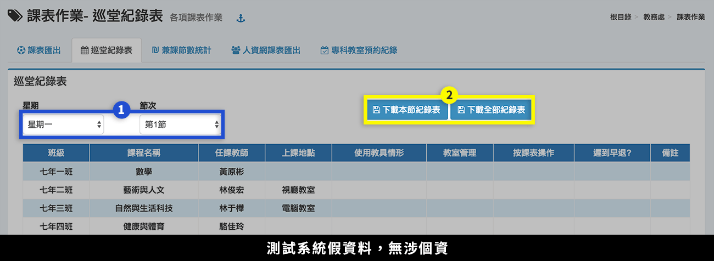
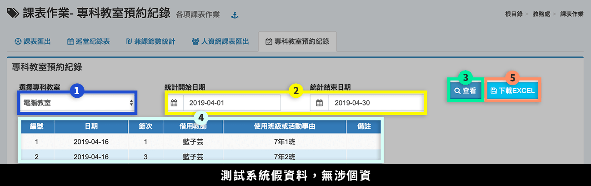

# 課表作業

## 課表匯出

1. 可**「匯出 Excel 班級課表」**。
2. 可**「下載EXCEL教師課表」、「下載WORD教師總表」，**尺寸為 A3。
3. 可「**下載專科教室課表**」。

## 巡堂紀錄表

1. 選擇**「星期」**、**「節次」**，下方呈現該節次教師任課情形。
2. 可**「下載本節紀錄表」**或**「下載全部記錄表」**。

## 兼課節數統計

.png>)

1. 選擇統計**「學期」**。
2. 輸入**「統計起始日期」**。
3. 標示處呈現教師兼課情形。
4. 可**「下載 Doc 或 Excel 檔」**。

## 人資網課表匯出




1. 選擇**「學期」**。
2. 按下「**彈性及特殊班級課程參照**」。
3. 勾選**「年級」。**
4. 按下「**編輯**」。
5. 設定**「科目的對應」**，按下**「存檔」**儲存該次編輯。
6. 按下套用科目設定的**「複製圖示」**即可套用其科目設定至其他年級。




1. 選擇**「學期」**。
2. 按下**「語言課程語系對應」**。
3. 勾選**「年級」**。
4. 按下課程的**「編輯鈕」**。
5. 設定**「語系的對應」**，按下**「存檔」**儲存該次編輯。
6. 按下套用語系設定的**「複製圖示」**即可將此語系設定套用至所有科目
7. 完成全部「彈性及特殊班級課程參照」與「語言課程語系對應」後，可按下**「配課表下載」或「API匯出」**即可下載配課表或傳送至人資網。




API匯入方式需要教師之身分證號及須於人力資源網A1.31設定期初名單(教職員名單)，所以需要在系統內設定好教師身分證號。


## 專科教室預約紀錄

1. 選擇**「專科教室」**。
2. 輸入**「統計起始日期」**。
3. 按下**「查看」**。
4. 標示處顯示**「預約情形」**。
5. 可**「下載 Excel 檔」**。
