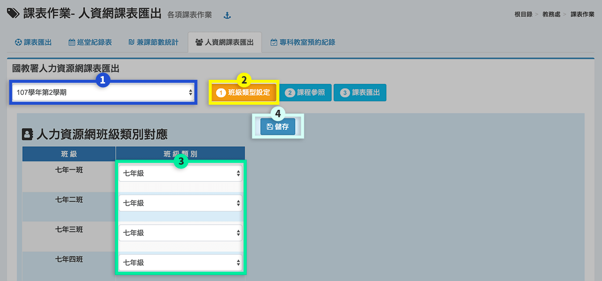

# 課表作業

## 課表匯出

1. 可**「匯出 Excel 班級課表」**。
2. 可**「下載教師總表 Doc 檔」**，尺寸為 A3。

## 巡堂紀錄表

1. 選擇**「星期」**、**「節次」**，下方呈現該節次教師任課情形。
2. 可**「下載本節紀錄表」**或**「下載全部記錄表」**。

## 兼課節數統計

1. 選擇統計**「學期」**。
2. 輸入**「統計起始日期」**。
3. 標示處呈現教師兼課情形。
4. 可**「下載 Doc 或 Excel 檔」**。

## 人資網課表匯出




1. 選擇**「學期」**。
2. 按下**「班級類型設定」**。
3. 對應**「班級類別」**。
4. 完成編輯後，按下**「儲存」**。




1. 選擇**「學期」**。
2. 按下**「課程參照」**。
3. 勾選**「年級」**。
4. 按下課程的**「編輯鈕」**。
5. 設定**「科目的對應」**。
6. 按下**「存檔」**儲存該次編輯。
7. 完成全部「班級類型設定」與「課程參照」後，可按下**「課表匯出」**，即可傳送至人資網。



## 專科教室預約紀錄

1. 選擇**「專科教室」**。
2. 輸入**「統計起始日期」**。
3. 按下**「查看」**。
4. 標示處顯示**「預約情形」**。
5. 可**「下載 Excel 檔」**。

