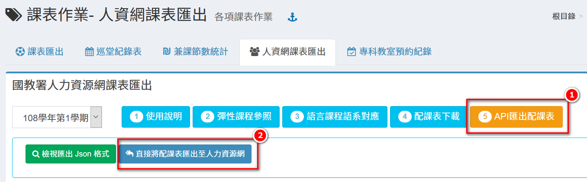

# 課表作業

## 課表匯出

1. 可**「匯出 Excel 班級課表」**。
2. 可**「下載EXCEL教師課表」、「下載WORD教師總表」，**尺寸為 A3。
3. 可「**下載專科教室課表**」。

## 巡堂紀錄表

1. 選擇**「星期」**、**「節次」**，下方呈現該節次教師任課情形。
2. 可**「下載本節紀錄表」**或**「下載全部記錄表」**。

## 兼課節數統計

.png>)

1. 選擇統計**「學期」**。
2. 輸入**「統計起始日期」**。
3. 標示處呈現教師兼課情形。
4. 可**「下載 Doc 或 Excel 檔」**。


如欲調整「兼課節數統計」相關設定請至本模組 [參數設定](biao-zuo.md#undefined)。


## 人資網課表匯出



<figure><figcaption></figcaption></figure>

請詳閱人資網課表匯出操作步驟說明。



> 請於學期初設定中九年一貫科目設定及12年國教科目設定中將學籍交換-科目對應設定好。

<figure><figcaption></figcaption></figure>

<figure><figcaption></figcaption></figure>

1. 請於學期初設定模組中，點擊**「其他」。**
2. 設定**「九年一貫科目設定」**、**「12年國教科目設定」。**
3. 點擊**「編修」**進行學籍交換科目對應設置。




1. 按下「**彈性及特殊班級課程參照**」。
2. 勾選**「年級」。**
3. 按下「**編輯**」。

<figure><figcaption></figcaption></figure>

<figure><figcaption></figcaption></figure>

1. 設定**「領域的對應」。**
2. 設定**「科目的對應**。
3. 按下套用科目設定的**「複製圖示」**即可套用其科目設定至其他年級。




1. 按下**「語言課程語系對應」**。
2. 勾選**「年級」**。

<figure><figcaption></figcaption></figure>

<figure><figcaption></figcaption></figure>

1. 按下課程的**「編輯鈕」**。
2. 設定**「語系的對應」**，按下**「存檔」**儲存該次編輯。
3. 按下套用語系設定的**「複製圖示」**即可將此語系設定套用至所有科目
4. 完成全部**「彈性及特殊班級課程參照」**與**「語言課程語系對應」**後，可選擇使用**「配課表下載」或「API匯出」**即可下載配課表或傳送至人資網。（詳見下一頁籤）




將資料匯入人力資源網有兩種方式，請選擇一種處理，無須重複操作。\
1.**配課表下載**：下載人力網匯入配課表之檔案，並至人力網將該檔案匯入人力資源網。\
2.**API匯出**：操作「匯出至人力資源網」按鈕，本系統與人力資源網進行API對接，可直接將配課表匯入人力資源網(必須先設定教師身分證號碼)。


<figure><figcaption></figcaption></figure>

1. 使用**「配課表下載**」方式。
2. 系統會先檢查是否有各項設定，如果沒有會有錯誤訊息，請修正後再進行匯出動作。

如果沒有可檢視的錯誤，會有匯出之按鈕如下圖，請按**「匯出人力資源網配課表」**並下載儲存。

<figure><figcaption></figcaption></figure>

－－－－\
接下來登入 **人力資源網**&#x20;

<figure><figcaption></figcaption></figure>

1.點選**「B.授課/排課」**。

<figure><figcaption></figcaption></figure>

點按上圖紅色框區塊，進入如下圖。

<figure><figcaption></figcaption></figure>

1.**「匯入檔案」**，可匯入配課表。\
<mark style="color:red;">※請注意!!可以重複匯入，但是再次匯入會將之前的設定覆蓋，所以如只是小修改，請使用線上修改方式</mark>

2.**「匯入檔案」**可查看匯入的紀錄**。**

請按下圖次序操作**。**

<figure><figcaption></figcaption></figure>

1.點擊**「匯入配課表」**\
2.點選**「下一步」**，出現如下圖，請傳上附檔名為xls格式檔案

<figure><figcaption></figcaption></figure>

選好檔案後，點按**「範例格式匯入」**之按鈕。

<figure><figcaption></figcaption></figure>

匯入後會轉到如下圖，如有顯示匯入之錯誤，請修改後再次匯入。

<figure><figcaption></figcaption></figure>




將資料匯入人力資源網有兩種方式，請選擇一種處理，無須重複操作。\
1.**配課表下載**：下載人力網匯入配課表之檔案，並至人力網將該檔案匯入人力資源網。\
2.**API匯出**：操作「匯出至人力資源網」按鈕，本系統與人力資源網進行API對接，可直接將配課表匯入人力資源網(必須先設定教師身分證號碼)。



API匯出方式需要教師之身分證號及須於人力資源網A1.31設定期初名單(教職員名單)，所以需要在系統內設定好教師身分證號。


<figure><figcaption></figcaption></figure>

1. 使用**「API匯出配課表」**，可直接將配課表匯入到人力資源網。
2. 請點擊**「直接將配課表匯出至人力資源網」**，系統會先檢查是否各項設定，如果沒有問題，就可以點擊直接將配課表匯入人力資源網

匯出後會有匯出訊息如下圖，訊息為 "fail": 0,"success": 147，代表失敗0筆，成功147筆

<figure><figcaption></figcaption></figure>

匯出後，請進入**人力資源網**做後續設定(依各校不同)，如分組設定、經費設定等。


請注意，資料可以重複匯入人資網，但是如果已經有在人力資源網設定課表相關資料將會被覆蓋!!建議如果已經手動在人力資源網系統設定過資料，請直接進入人力資源網修改，不要再次匯入!!




## 專科教室預約紀錄

1. 選擇**「專科教室」**。
2. 輸入**「統計起始日期」**。
3. 按下**「查看」**。
4. 標示處顯示**「預約情形」**。
5. 可**「下載 Excel 檔」**。

## 今日專科教室預約列表

1. 選擇**「專科教室」**。
2. 標示處顯示今日專科教室預約情形。
3. 點擊**「列印」**可列印今日專科教室預約列表。


專科教室選項只有開放預約之專科教室才會顯示。


## 參數設定

兼課節數統計包含非上課日 (照學期初設定之上課日)

`是`

`否`
