# 成績單管理

## 學期成績單

### 檔案式成績單

> 提供 odt 檔案成績單，可根據貴校需求自訂版型。

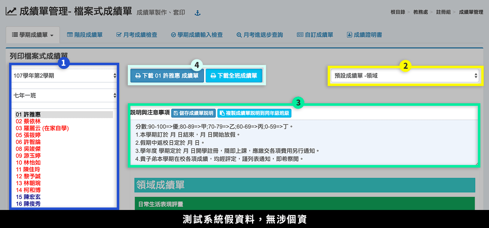

1. 選擇**「學期」**、**「班級」**、**「學生」**，右方會出現該名學生學期成績資訊。
2. 選擇**「成績單格式」**。若要使用自訂格式，請至 [自訂成績單，](cheng-guan-li.md#zi-ding-cheng-ji-chan)上傳自訂成績單後，即可在選單內選擇。
3. 可修改**「說明與注意事項」**，直接在標示處編輯文字之內容，完成後按下**「儲存成績單說明」**，亦可**「複製成績單說明到同年級班級」**。
4. 可**「下載該生或全班」**成績單。

### 網頁式成績單

> 提供網頁列印成績單。

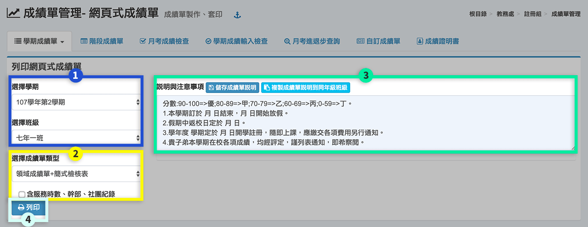

1. 選擇**「學期」**、**「班級」**。
2. 選擇**「成績單類型」**，可勾選**「含服務時數、幹部、社團紀錄」**。
3. 可修改**「說明與注意事項」**，直接在標示處編輯文字之內容，完成後按下**「儲存成績單說明」**，亦可**「複製成績單說明到同年級班級」**。
4. 按下**「列印」**印製該班學生成績單。

## 階段成績單

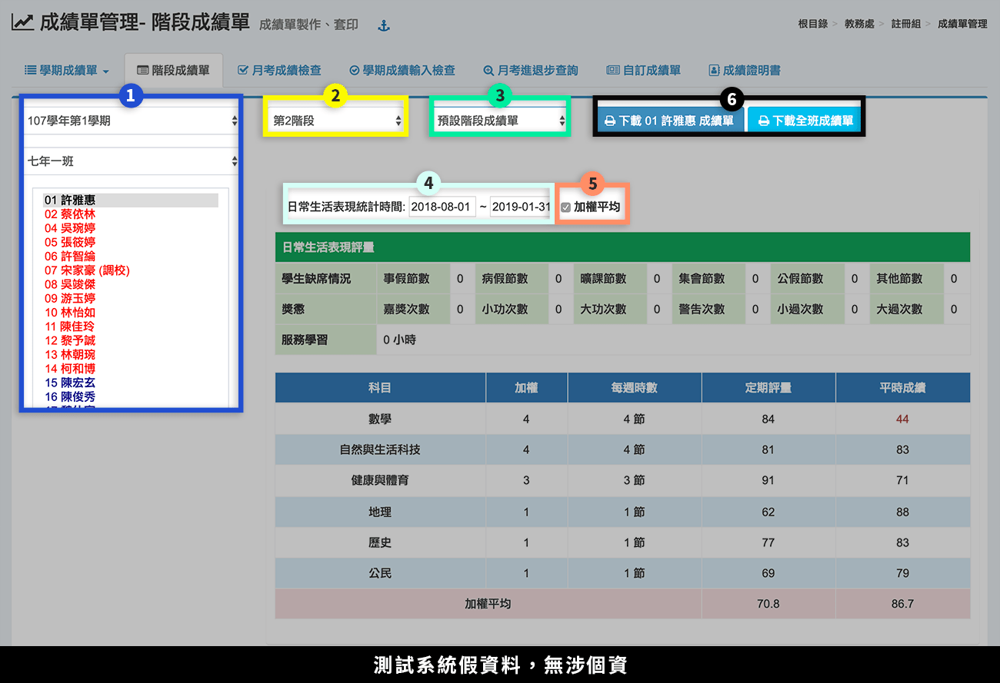

1. 選擇**「學期」**、**「班級」**、**「學生」**，右方會出現該名學生階段成績資訊。
2. 選擇**「階段別」**。
3. 選擇**「成績單格式」**。若要使用自訂格式，請至[ 自訂成績單，](cheng-guan-li.md#zi-ding-cheng-ji-chan)上傳自訂成績單後，即可在選單內選擇。
4. 輸入**「日常成績統計時間」**，系統會統計該段時間內，學生之出缺勤、獎懲、服務時數。
5. 可勾選**「加權平均」**。
6. 下載該生或全班成績單。

## 月考成績檢查

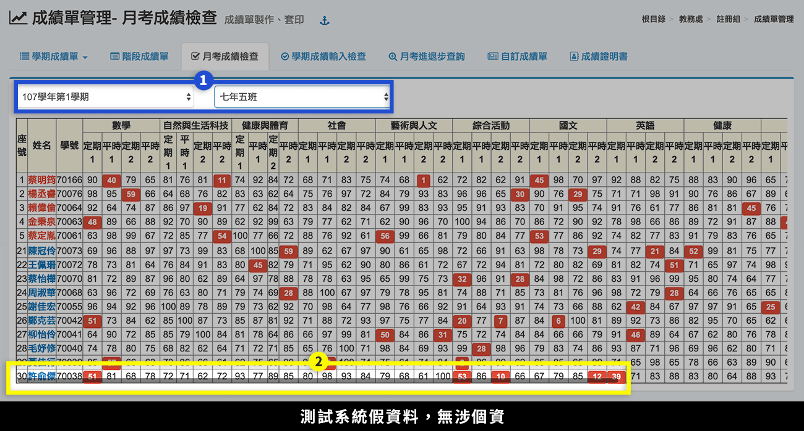

1. 選擇**「學期」**、**「班級」**，下方會呈現該班各科目定時、平時所有成績。
2. 若科目太多，可拉動下方拉軸，觀看右方被遮住的內容。

## 學期成績輸入檢查

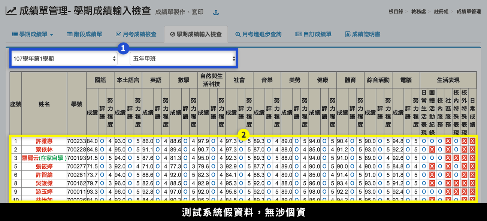

1. 選擇**「學期」**、**「班級」**，下方會呈現該班各科目定時、平時所有成績。
2. 若科目太多，可拉動下方拉軸，觀看右方被遮住的內容。

## 月考進退步查詢

> 提供班級學生各階段成績進退步狀況查詢。

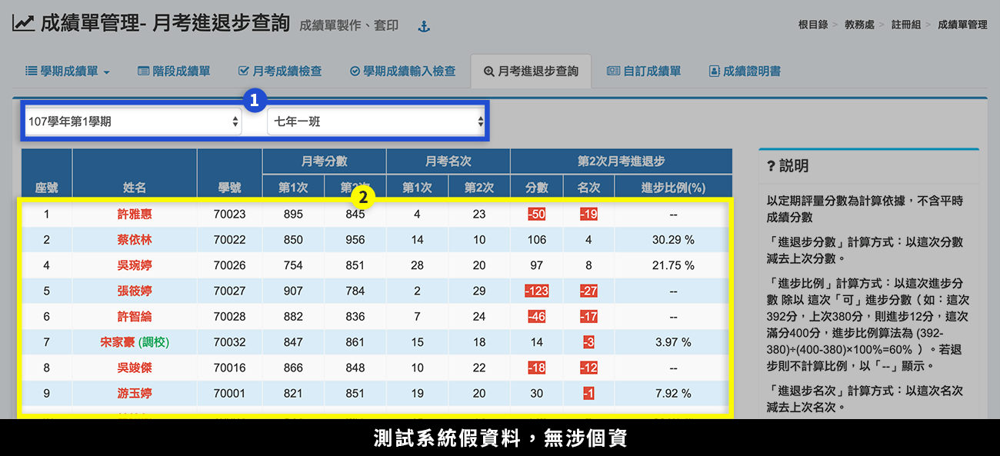

1. 選擇**「學期」**、**「班級」**。
2. 標示處呈現該班學生月考進退步情形。

## 自訂成績單

提供各校自行設計成績單版型，請依下列步驟操作。



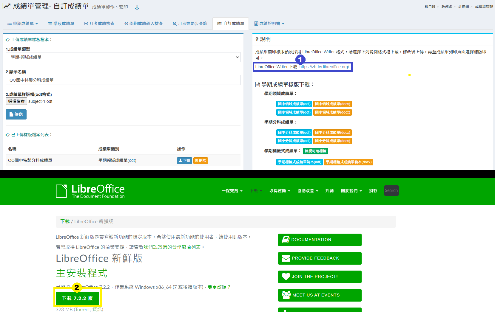

1. 點擊 [LibreOffice Writer](https://zh-tw.libreoffice.org) 下載連結。
2. 下載 LibreOffice 軟體，建議下載 6.1.4 以上版本，下載後請安裝至本機。



### 一、下載要自訂的成績單範本

.png>)

1.請務必先下載本系統提供之成績單範本，以 LibreOffice 開啟檔案，再進行修改。

2.自訂標籤式成績單，可「**檢視可用標籤**」，並複製到成績單中，檢視可用標籤顯示如下圖

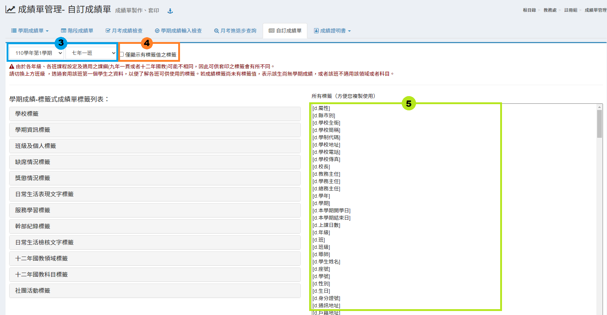

3.選擇「**年級**」、「**班級**」。&#x20;

4.可勾選「**僅顯示有標籤值的標籤**」，排除目前為空值的標籤。&#x20;

5.可用標籤將顯示於標示處5，可以直接複製貼上至範例檔。


* 由於各年級、各班課程設定及適用之課綱(九年一貫或者十二年國教)可能不相同，因此可供套印之標籤會有所不同。
* 若成績標籤尚未有標籤值，表示該生尚無學期成績，或者該班不適用該領域或者科目。


### 二、標籤式成績單


* 每種成績單樣本的套印標籤不同，請勿混為使用。
* 要製作標籤式成績單，請下載「標籤式成績單」樣板修改。


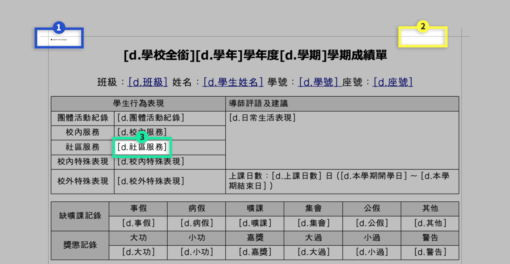

1. 請勿刪除左上角的套印標籤，套印後的學生成績單會自動隱藏。
2. 請勿刪除表格框線，此框線無寬度與色彩，套印後不會顯示。
3. 可自行更替 \[ ] 中的標籤內容，標籤內容請參考系統提供的可用套印標籤。
4. 編輯完成後，請存檔。

### 三、領域、分科、階段成績單


* 每種成績單樣本的套印標籤不同，請勿混為使用。
* 要製作領域、分科或階段成績單，請下載「對應的成績單」樣板修改。


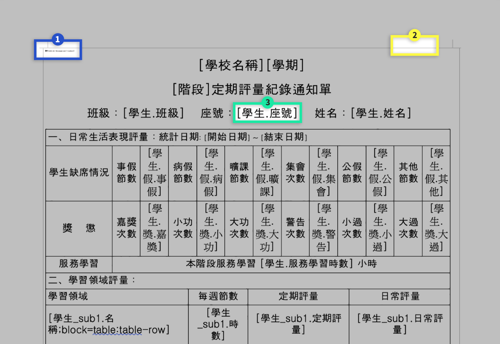

1. 請勿刪除左上角的套印標籤，套印後的學生成績單會自動隱藏。
2. 請勿刪除表格框線，此框線無寬度與色彩，套印後不會顯示。
3. 領域、分科、階段成績單的可用標籤，皆呈現在樣本檔案中，可自行更替、刪減 \[ ] 中的標籤內容。若樣板檔案中的標籤仍不符合貴校需求，請使用「標籤式成績單」字型設計樣板。
4. 編輯完成後，請存檔。


成績單提供之WORD樣板格式，目前僅供測試用，成績單仍以ODF開放文件為主。





* 請先至 [系統管理>學校基本資料>職稱資料 ](../xi-guan-li-mo/school.md#zhi-chen-zi-liao)上傳職稱的簽章檔。
* 系統提供之成績單樣本檔，預設會套印為**校長**、**教務主任**的簽章檔，若要修改，請參照下述步驟。


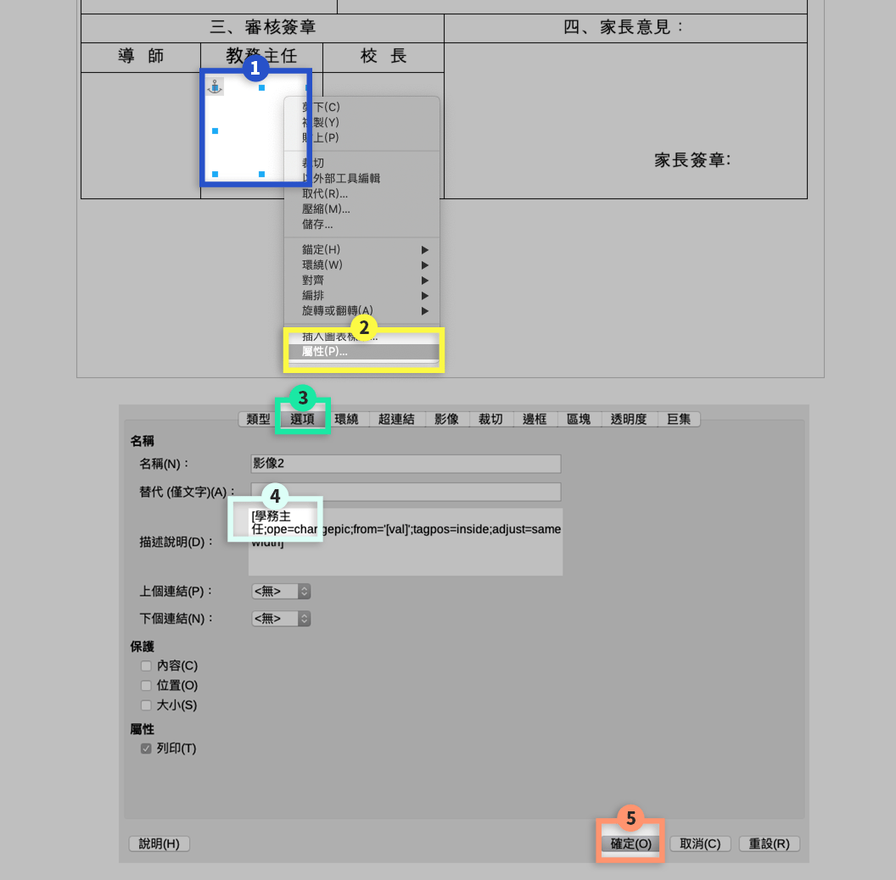

1. 以 LibreOffice 打開要編修的成績單樣本檔，**在簽章圖**（因無套印，所以是白色無外框）**上按右鍵**。
2. 選擇**屬性**。
3. 選擇**選項**。
4. 在描述說明中，將中文職稱文字，替換成要使用的職稱（務必與系統中的職稱一致）。
5. 按下**確定**。
6. 編輯完成後，請存檔。



完成編輯自訂成績單後，務必上傳至系統中。

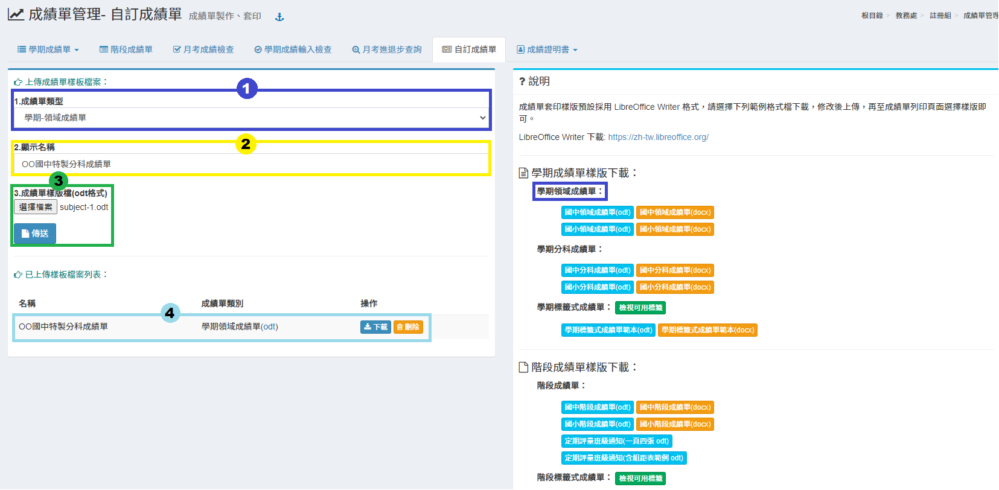

1. 選擇要上傳的**「成績單類型」**。
2. 輸入**「顯示名稱」**，此名稱會顯示在套印成績單的選單中。
3. 選擇**「成績單檔案」**，並按下**「傳送」**。
4. 上傳成功後，自訂成績單會顯示在標示處，可「**下載檔案」**或**「刪除」**。


注意！因每種成績單的套印標籤不同，若**成績單類型**選擇錯誤會有套印問題。




## 成績證明書

### 成績證明書

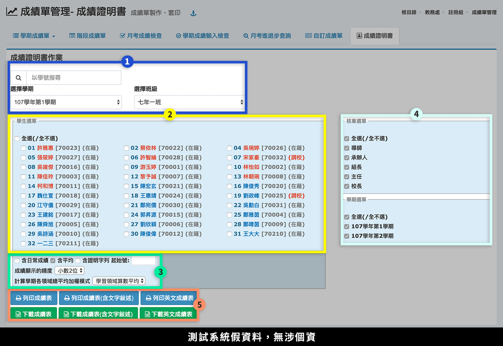

1. 選擇「學期」、「班級」，或以「學號」搜尋。
2. 選取要列印之學生（可多選或全選）。
3. 勾選要列印之成績條件。
4. 勾選核章選項及學期選項。
5. 選擇要列印的成績表。

### 特殊生成績證明書

本功能提供在學期間有中斷(如休學、出國)，在學學籍有中斷之學生列印成績證明書用。

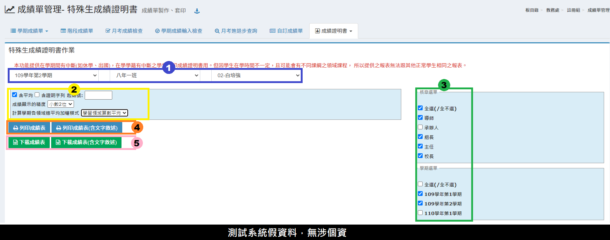

1. 選擇**「學期」**、**「班級」**、**「學生」。**&#x20;
2. 勾選要列印之成績條件。&#x20;
3. 勾選核章選項及學期選項。&#x20;
4. 可列印的成績表。&#x20;
5. 可下載成績表。

