# 成績綜合管理

## 定期評量

### 成績查詢

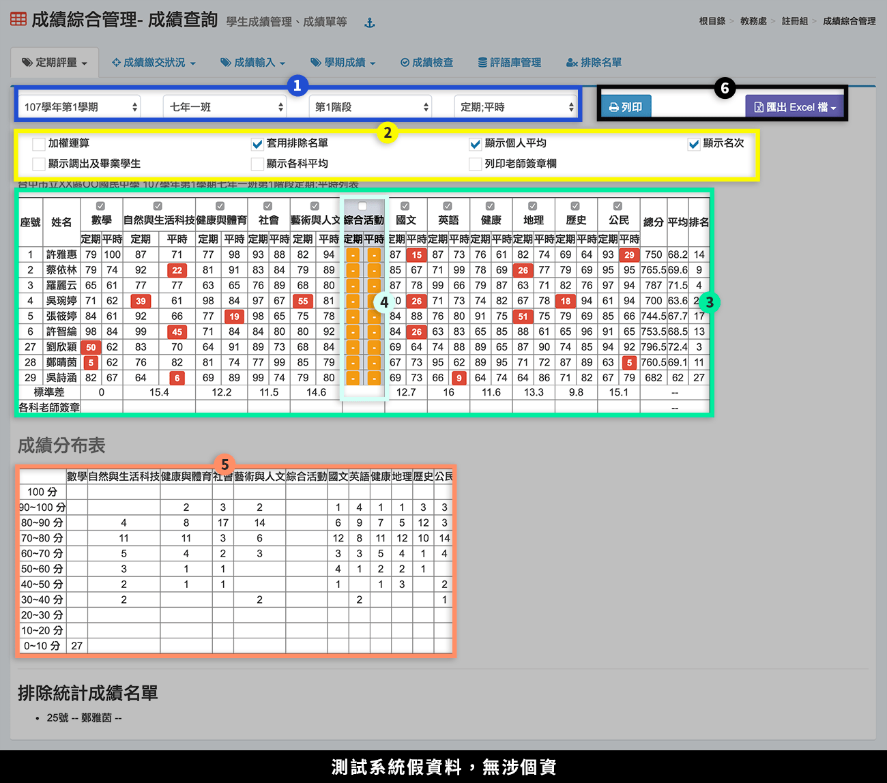

1. 選擇**「學期」**、**「班級」**、**「階段別」**、**「成績顯示模式」**。
2. 可勾選額外計算選項：加權運算、顯示調出生及畢業學生、套用排除名單、顯示各科平均、顯示個人平均、列印老師簽章欄、顯示名次。
3. 該班學生成績顯示在標示處。
4. 可**取消勾選某科目**，該科目則不列入總分計算。
5. 可查看成績組距分布結果。
6. 可**「列印」**該班成績，或**「匯出」**該班或全年級成績 Excel 檔。

### 定期評量-優異排名

1. 選擇**「學期」**、**「班級」**、**「階段別」**。
2. 選擇要計算優異排名的**「科目」**。
3. 勾選是否**「加權計算」**、**「套用排除名單」**，選擇計算**「全年級」**或**「該班級」**及輸入**「列出名次」**。
4. 按下**「開始處理」**。
5. 統計結果顯示在標示處。
6. 可下載**「統計結果 Excel 檔」**以及**「組距參考表」**。


若有學生成績須排除在外，請先至 [排除名單](cheng-he-guan-li.md#pai-chu-ming-chan) 設定學生。


### 定期評量-各班平均

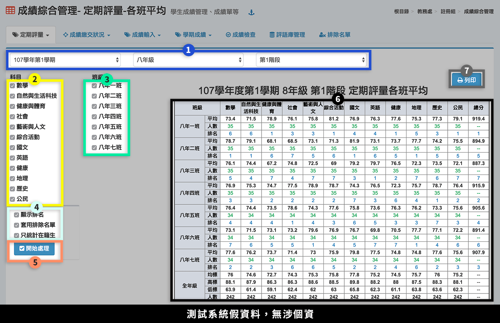

1. 選擇**「學期」**、**「年級」**、**「階段別」**。
2. 選擇要平均的**「科目」**。
3. 選擇要計算的**「班級」**。
4. 勾選是否**「顯示排名」**、**「套用排除名單」**、**「只統計在籍生」**。
5. 按下**「開始處理」**。
6. 統計結果顯示在標示處。
7. 可**「列印」**該次統計結果。

### 定期評量-歷次總表

> 可下載班級歷年階段成績總表

.png>)

1. 選擇**「年級」**。
2. 勾選要輸出成績的**「班級」**。
3. 勾選要輸出成績的**「學期」**。
4. 按下**「下載 Excel」**，Excel 檔案會依照班級、階段呈現學生成績。
5. 如欲下載橫式檔案格式，請按下**「下載橫式excel」**。

### 階段成績轉班

學期中轉班生階段成績轉班作業


操作階段成績轉班前，請先將學生調整到新班級。請參照[學生資料管理＞學期編班](sheng-liao-guan-li.md#xue-qi-bian-ban-1)。


1. 選擇轉班後的學生。
2. 選擇轉班前的階段成績。
3. 勾選要移轉成績的科目，預設為全選。
4. 按下**「搬移成績」**。
5. 搬移成功後，標示處會呈現新班級的成績。


* 新班級有輸入科目成績，如也列入須轉移之科目，會先將新班級之科目成績刪除，再將舊班級之科目成績移轉至新班級科目成績。
* 如果有出現該生原班學期成績， 請務必刪除原班學期成績!!若沒有刪除， 該生會有兩筆學期成績造成學期成績統計錯誤!! 刪除之後就不會再出現。


## 成績繳交狀況

### 成績繳交狀況

.png>)

.png>)

1. 選擇**「學期」**、**「年級」**、**「階段別」**。
2. 若任課老師已完成全班學生成績輸入，圖示會顯示為綠色。**鎖頭圖示**表示成績已匯至教務處，任課老師無法修改，**按一下可解鎖**。
3. 若班級有部分學生成績未輸入，則會顯示未輸入人數，且圖示為紅色。**鎖頭圖示**表示成績已匯至教務處，任課老師無法修改，**按一下可解鎖**。
4. 若全班成績都沒有輸入，則顯示 ✘ **圖示**。
5. 點擊此處**「鎖頭圖示」**可批次鎖定及開鎖。
6. 按下**「計算機」**圖示，可結算班級學期成績。
7. 勾選需求的列印項目後再勾選班級，可**「列印」**班級階段成績檢核表。
8. 按下**「放大鏡」**圖示，可查看該班學生成績。
9. 可於此處設定**「階段／學期成績開放查詢時間」**，會影響學生作業模組可查詢成績的時間，請詳見系統上的說明。
10. 如已有設定日期並儲存，即可點擊**「複製到各年級」**，將此日期設定複製至各年級。

### 成績繳交狀況 - 分組班

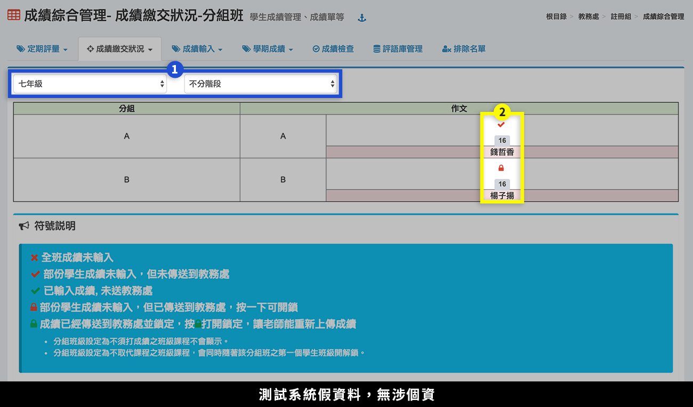

1. 選擇**「年級」**、**「階段別」**，即可查看分組科目成績狀況。
2. 標示處顯示成績繳交狀態，圖示意義請參考系統內說明。

### 努力程度及評語繳交狀況

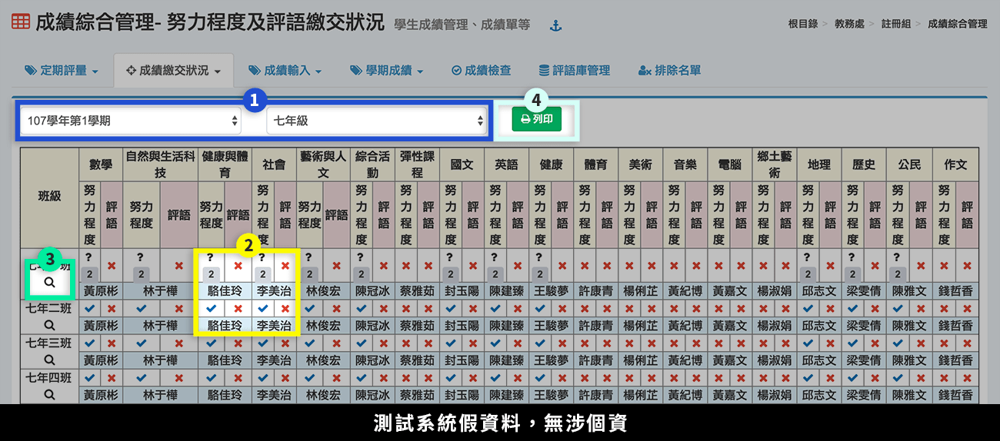

1. 選擇**「學期」**、**「年級」**。
2. 若班級有部分學生成績未輸入，則會顯示未輸入人數，以及呈現**黑色？**；若全班已輸入，則呈現**藍色✓**；若全班未輸入，則呈現**紅色 ✘**。點擊任一圖示，可查該班科目的努力程度、評語。
3. 按下**「放大鏡」**，可查看該班所有科目的努力程度、評語。

### 分組努力程度及評語繳交狀況

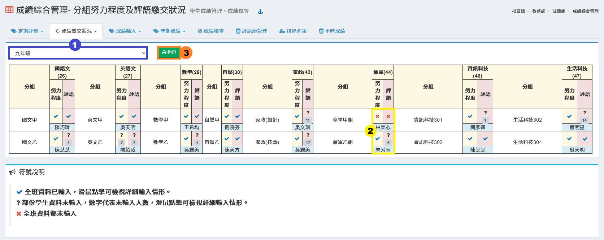

1. 選擇**「年級」。**
2. 若班級有部分學生成績未輸入，則會顯示未輸入人數，以及呈現**黑色？**；若全班已輸入，則呈現**藍色✓**；若全班未輸入，則呈現**紅色 ✘**。點擊任一圖示，可查該分組班科目的努力程度、評語，如下圖。

.png>)

## 成績輸入

### 班級階段成績

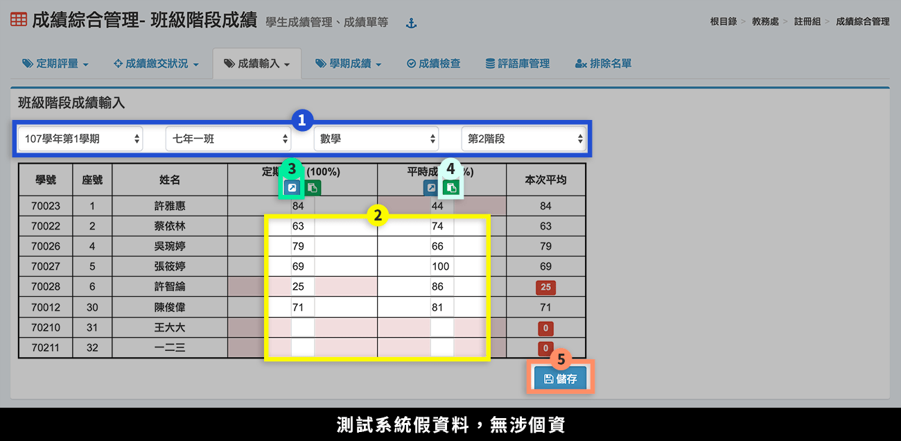

1. 選擇**「學期」**、**「班級」**、**「科目」**、**「階段別」**。
2. 在欄位中輸入學生成績。
3. 按下藍色圖示，可以在跳出視窗內輸入或修改成績。
4. 按下綠色圖示，可快貼 Excel 中的學生成績。請參考快貼說明操作。
5. 按下**「儲存」**，儲存該次編修結果。

### 個人階段成績

.png>)

1. 選擇**「學期」**、**「班級」**、**「學生」**。
2. 選擇要輸入成績的**「階段」**。
3. 在標示處可編輯學生個人階段成績。
4. 按下**「儲存」**，儲存該次編修。

### 個人學期成績

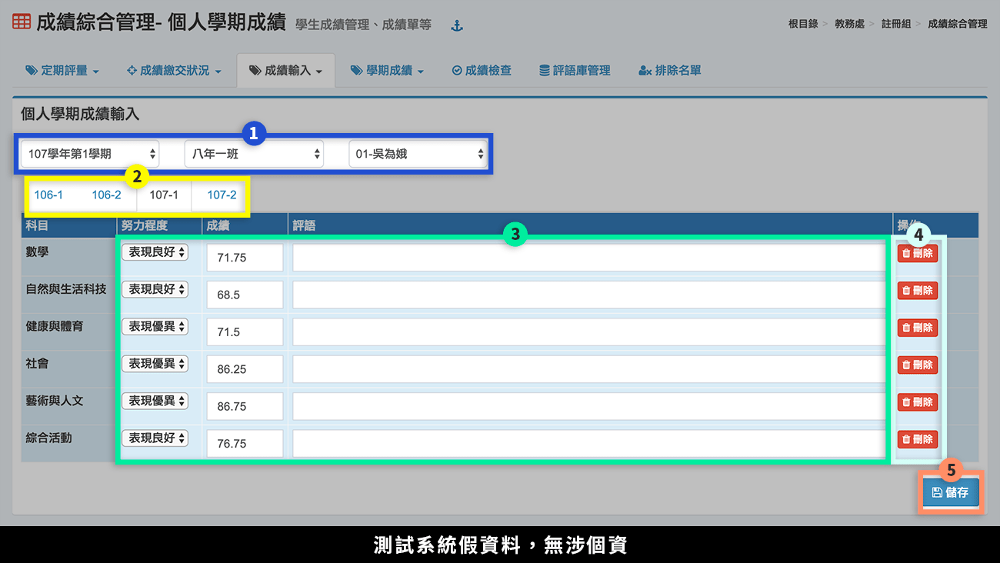

1. 選擇**「學期」**、**「班級」**、**「學生」**。
2. 選擇要輸入成績的**「學期」**。
3. 在標示處可編輯學生**努力程度**、**成績**、**評語**。
4. 可**「刪除」**學生成績。
5. 按下**「儲存」**，儲存該次編修。

### 彈性-社團活動成績


* 請先在「學期初設定」之「12年國教科目設定」中設定 「社團活動」課程事項。
* 本功能不提供九年一貫科目社團活動之成績處理。


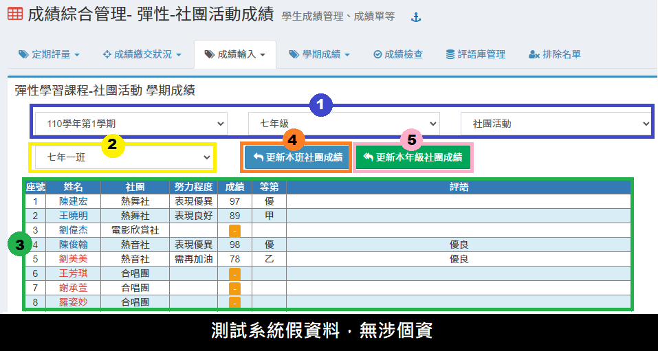

1. 選擇**「學期」**、**「年級」**、**「科目」**。
2. 選擇**「班級」。**
3. 標示處顯示學生成績狀態&#x20;
4. 按下**「更新本班成績」**，可以更新本班社團成績。
5. 按下**「更新本年級社團成績」**，可以更新本年級社團成績。


* 如果要使用本功能匯入社團成績，且要避免排課教師輸入社團成績，請於學期初設定將社團教師配課刪除(課程設定不能修改)。
* 在成績管理之成績繳交狀況無法看見匯入成績否，因為本成績是直接匯入學期成績。


## 學期成績

### 學期成績總表

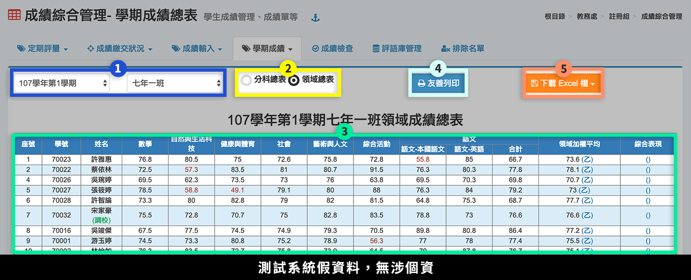

1. 選擇**「學期」**、**「班級」**。
2. 選擇**「分科總表」**或**「領域總表」**。
3. 學生成績會顯示在標示處。
4. 可**「列印」**該班學生成績總表。
5. 可**「下載全班、全年級分班、全年級」**成績總表 Excel 檔。

### 學期成績-優異排名

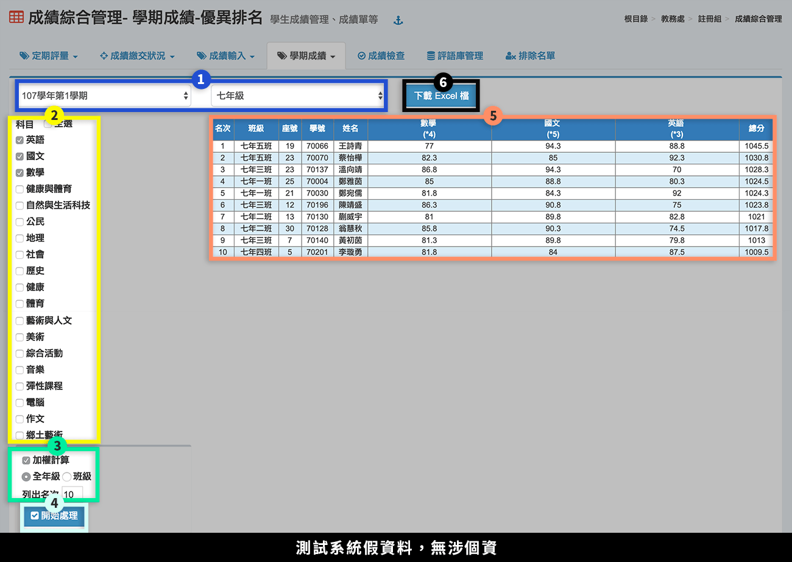

1. 選擇**「學期」**、**「年級」**。
2. 選擇要計算優異排名的**「科目」**。
3. 勾選是否**「加權計算」**，選擇計算**「全年級」**或**「該班級」**，輸入列出名次。
4. 按下**「開始處理」**。
5. 統計結果顯示在標示處。
6. 可下載**「統計結果 Excel 檔」**。

### 學期成績冊

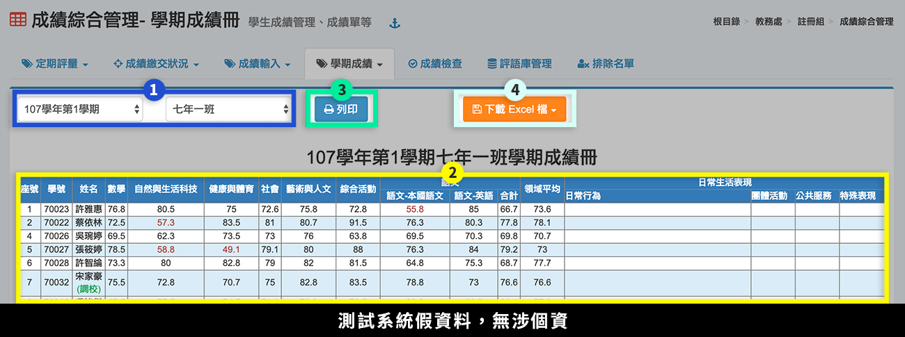

1. 選擇**「學期」**、**「班級」**。
2. 該班學生學期成績記錄會顯示在標示處。
3. 可**「列印」**該次統計結果。
4. 可**「下載全班、全年級分班 Excel 檔」**。

### 學期領域成績不及格統計

> 本功能會統計學生學期領域不及格(包含轉校生補登學期成績資料)人數，及補考後不及格之人數。

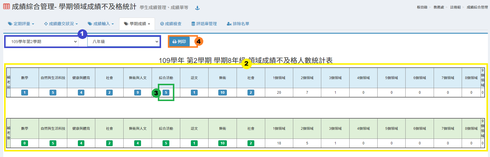

1. 選擇**「學期」**、**「年級」**。&#x20;
2. 該年級學期成績不及格人數統計會顯示在標示處。&#x20;
3. 點選**「領域不及格人數」**可以顯示該領域不及格名單，如下圖。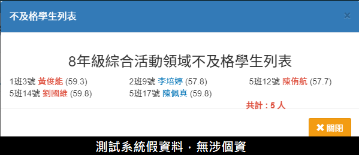
4. 可**「列印」**該次統計結果。

### 班級歷年科目學期成績總表

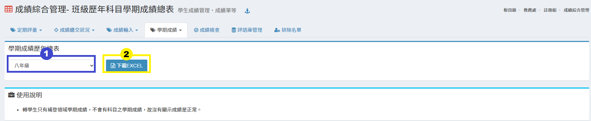

1. 選擇**「班級」**。
2. 點擊**「下載Excel」**，可下載班級學期成績歷年總表。


轉學生只有補登領域學期成績，不會有科目之學期成績，故沒有顯示成績是正常。


## 成績檢查

> 檢查該學期各階段成績儲存時為「空值」「或超過百分」的學生記錄。

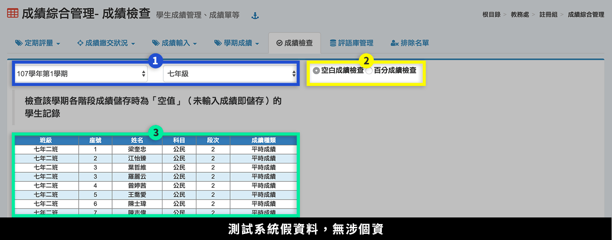

1. 選擇**「學期」**、**「年級」**。
2. 選擇**「空白成績檢查」**或**「百分成績檢查」**。
3. 標示處會顯示成績有「空值」或「超過百分」的紀錄。

## 評語庫管理

.png>)

1. 選擇**「評語類別」**，按下**「齒輪圖示」**可新增、編修類別。
2. 選擇**「評語等級」**，按下**「齒輪圖示」**可新增、編修等級。
3. 按下**「新增評語」**新增一則評語，按下**「快貼新增評語」**可一次新增多則評語。
4. 可**「下載評語(代碼)」**，方便教師直接輸入代碼登打評語。
5. 勾選評語後，可**「刪除評語」**。
6. 點擊評語欄位可直接編修評語。
7. 按下**「儲存」**，儲存該次編輯。

## 排除名單

> 適用於班級成績計算時，排除資源班學生成績。

.png>)

1. 選擇**「學期」**，並輸入排除學生之**「學號」**或**「座號」**。
2. 輸入**「排除原因」**。
3. 按下**「新增排除學生」**。
4. 按下**「垃圾桶」**圖示可**「刪除」**排除名單。
5. 按下**「複製上學期排除學生」**，可複製上學期排除名單資料至本學期。


* 建議不要在學期中任意更動排除名單設定，以免成績計算不如預期，造成學生、家長對學校成績處理失去信心。
* 若要使本列表於計算時生效，請務必於相關頁面勾選「**套用排除名單**」。


## 平時成績

> 可查看在籍生近兩學年內各科目階段平時成績輸入情況。

.png>)

1. 選擇**「學期」**、**「年級」**、**「任課老師（科目）」**、**「階段」**。
2. 點擊**「列印」**，可列印此平時成績列表。


* 此模組僅供查詢在籍生近兩學年內之科目平時成績。
* 任課老師須於[「教職員＞學生成績管理＞平時成績」](../jiao-1/sheng-cheng-guan-li.md#ping-shi-cheng-ji)輸入成績資訊，方能於此模組查詢科目平時成績紀錄。

