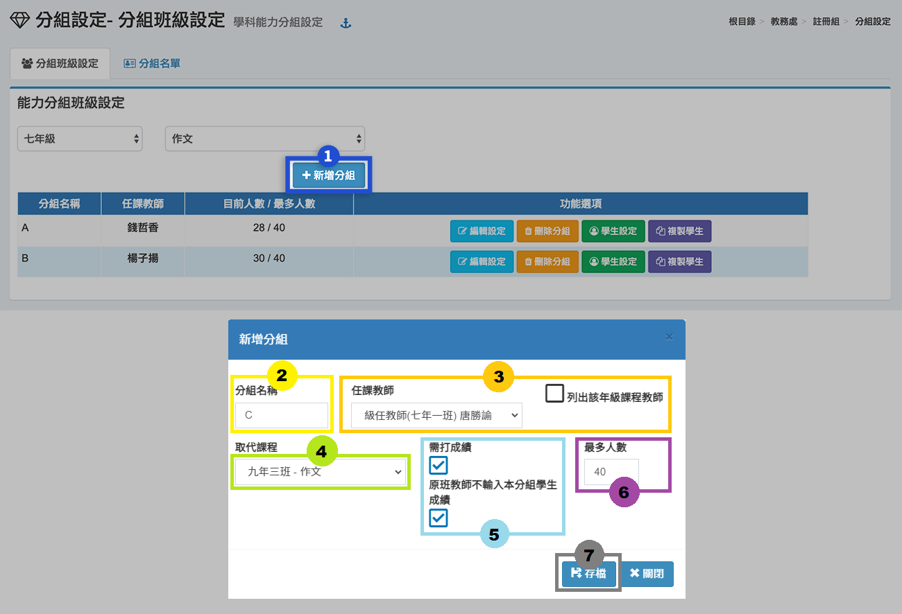

# 分組設定

## 分組班級設定




1. 按下**「新增分組」**，會彈出編輯視窗。
2. 輸入容易辨識班級科目的**「分組名稱」**。
3. 選擇**「任課教師」**，可勾選「列出該年級課程教師」，可以快速篩選出該年級該科目的任課教師，方便選擇。
4. 選擇**「取代課程」**，可不選擇。
   * 有取代課程：任課教師輸入成績的班級項目，將會被分組班級項目取代。
   * 沒有取代課程：任課教師在輸入成績的選單中，原班項目、分組班級項目都會出現。
5. 勾選**「是否需打成績」**：不需打成績，則此分組將不會出現在輸入成績的班級選單內。
6. 輸入分組班級**「最多人數」**。
7. 按下**「存檔」**，新增一個分組班。




1. 按下**「學生設定」**，會彈出編輯視窗。
2. 選擇學生**「班級」**。
3. 勾選該班**「學生」**。
4. 按下**「選擇」**
   。
5. 已選取學生會顯示在標示處，可繼續操作 2-4 步驟。
6. 按下**「儲存」**，完成該次編輯。




1. 按下**「複製學生」**。
2. 在要複製的分組班列表中（含本學期及過去學期），按下要複製的來源分組項目之**「複製學生」**，可以複製該分組的在籍學生。
3. 成功複製的學生會顯示在標示處。



## 分組名單

1. 選擇**「班級」**、**「分組科目」**。
2. 標示處會呈現該班分組狀況。
3. 按下**「列印名單」**，右方區塊會出現該年級班級。
4. 勾選要列印名條的班級。
5. 可按下**「列印名條」**或**「匯出 Excel」**。

