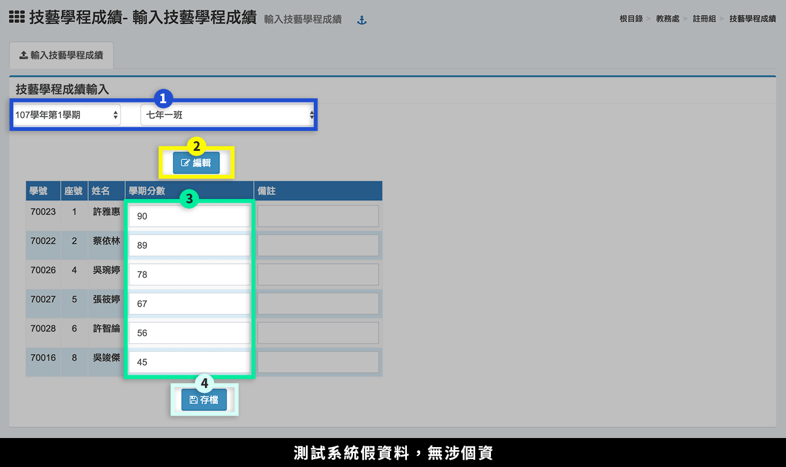

# 技藝學程成績

## 輸入技藝學程成績

1. 選擇**「學期」**、**「班級」**。
2. 按下**「編輯」**。
3. 輸入學生**「學期分數」**。
4. 按下**「存檔」**。

## 技藝學程成績紀錄

1. 選擇**「學期」**、**「班級」**。&#x20;
2. 點選**「學生」**，該生成績紀錄顯示於標示處。
3. 點擊**「列印(學生姓名)」**可列印學生個人技藝成績紀錄。
4. 點擊**「列印全班」**可列印該班級全班技藝成績紀錄。

