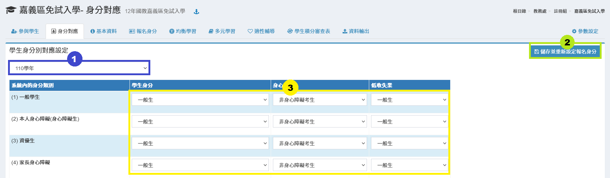
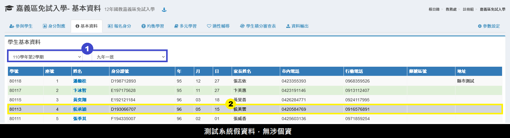
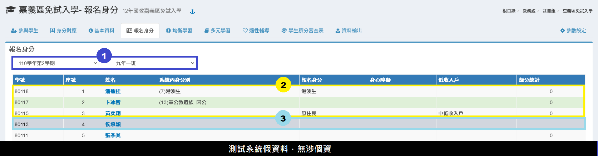
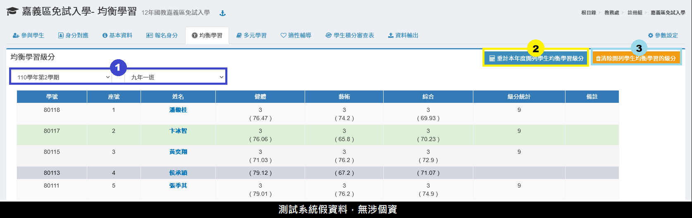
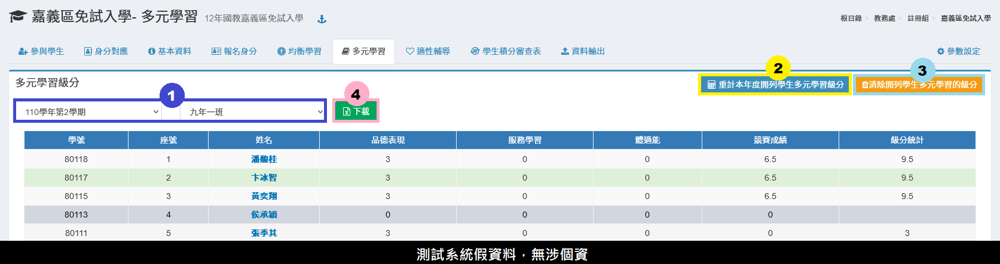
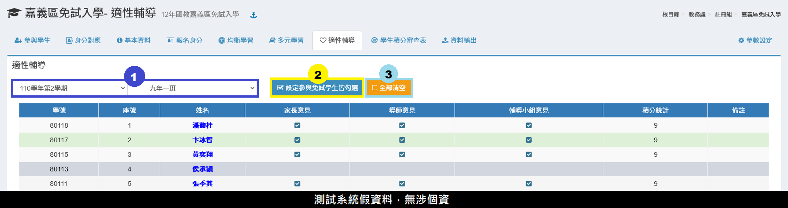
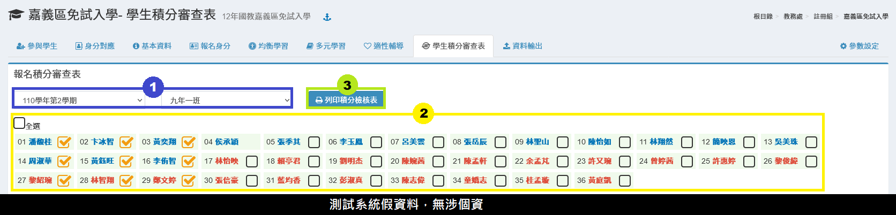

# 嘉義區免試入學

## 參與學生

1. 若要開列所有學生，直接按下**「開列本學期所有學生」**。
2. 若要開列部分學生，先選擇**「學期」**、**「班級」**。
3. 在學生列表中勾選或全選要開列的學生。
4. 按下**「開列選擇的學生」**。
5. 要刪除開列紀錄，按下**「撤銷開列本學期所有學生」**。

## 身分對應

1. 選擇**「學期」**。
2. 依序設定系統對應中投區免試入學身分。
3. 按下**「儲存並重新設定報名身分」**，可將對應設定儲存，並且將設定套用到已開列學生。


如果於身分對應後後，還有再新增開列學生，請於封存資料前再次執行本功能。


## 基本資料

1. 選擇**「學期」**、**「班級」**，下方會列出該班學生資料。
2. 沒有開列的學生會呈現灰底。


家長姓名、市內電話、行動電話擷取資料可至[參數設定](jia-yi-qu-mian-shi-ru-xue.md#undefined)中調整。


## 報名身分


於執行本功能前，請先於本模組之"[**身分對應**](jia-yi-qu-mian-shi-ru-xue.md#shen-fen-dui-ying)"功能設定對應及對應各學生之資料。


1. 選擇**「學期」**、**「班級」**，下方會列出該班學生資料。
2. 標示處顯示學生身分分數統計，
3. 沒有開列的學生會呈現灰底。

## 均衡學習

1. 選擇**「學期」**、**「班級」**。
2. 按下**「重計本年度開列學生均衡學習級分」**，可以計算成績。
3. 按下**「清除開列學生均衡學習的級分」**，可以清除資料。


* 健康與體育、藝術與人 文、綜合活動三領域，前 五學期平均及格或達丙等 者各得 3 分；\
  未達標準 0 分、最高為9分。


## 多元學習

1. 選擇**「學期」**、**「班級」**。
2. 多元學習計算由系統內資料計算，按下**「重計本年度開列學生多元學習級分」**按鈕計算。
3. 若要清除開列學生多元學習的級分，按下**「清除開列學生多元學習的級分」**按鈕。
4. 可**「下載」**多元學習學生清冊 Excel 檔。


多元學習級分計分標準參照每年度免試入學公告之比序項目積分方式。

* 沒有開列之學生背景為灰色。
* 品德表現:由本系統[獎懲](../undefined/sheng-guan-li.md)模組取得資料 。
* 服務學習:由本系統[學生服務學習](../undefined/sheng-fu.md)模組取得資料統計 。
* 體適能:由本系統[學生體適能](../undefined/sheng-neng.md)模組取得資料統計。
* 競賽成績:由本系統[學生競賽紀錄](../xiao-hang-zheng/sheng.md)模組取得資料統計。


## 適性輔導

> 本功能為設定家長意見、導師意見、輔導小組意見。

1. 按 **「設定參與免試學生皆勾選」** 按鈕，就可以一次設定三項皆勾選。
2. 按 **「全部清空」** 按鈕可以清除資料。

## 學生積分審查表

1. 選擇**「學期」**、**「班級」**。
2. 選擇**「學生」**或點擊**「全選」**選擇全部學生。&#x20;
3. 點擊**「列印積分檢核表」**，以新視窗開啟列印學生超額比序積分審查表。

## 資料輸出

1. 選擇**「學期」**。
2. 按下**「檢視內容」**，會彈出新視窗，可查看學生嘉義區免試入學報名資料。
3. 按下**「輸出 Excel」**，可下載學生嘉義區免試入學報名資料。


* 可以先檢視內容或直接下載Excel檔案， 下載Excel檔案如遇到無法下載時，請在檢視內容複製後貼上excel後儲存即可。
* 資料輸出是將資料整理好輸出為中嘉義區免試入學招生委員會所需要之格式。


## 參數設定

1. 嘉義區免試入學學校參加類別\
   `免試學區學校`　`非免試亦非共同學區學校`
2. 家長姓名取得欄位 \
   `父親`　`母親`　`監護人`
3. 市內電話取得欄位 \
   `戶籍電話`　`通訊電話`　`緊急聯絡電話`
4. 行動電話取得欄位　\
   `戶籍電話`　`通訊電話`　`緊急聯絡電話`
