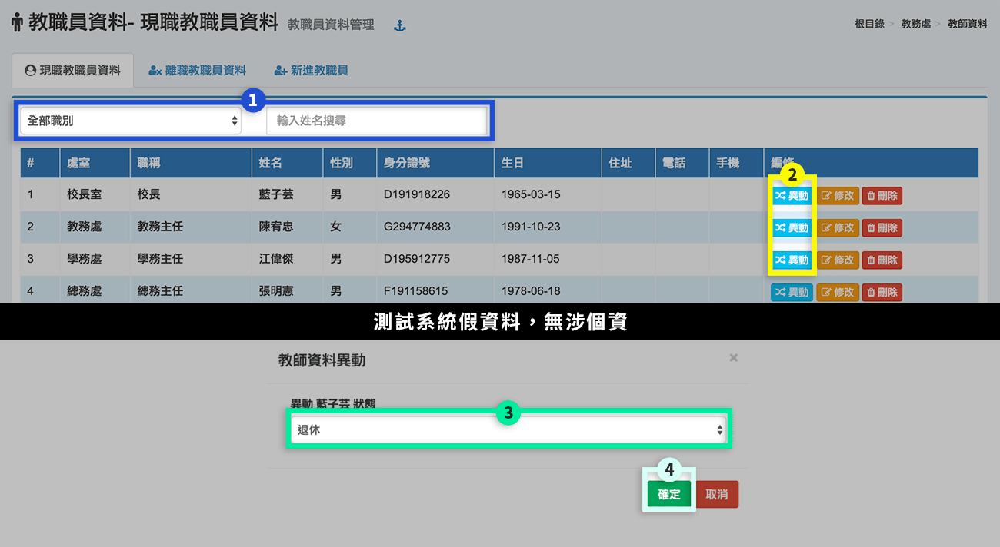
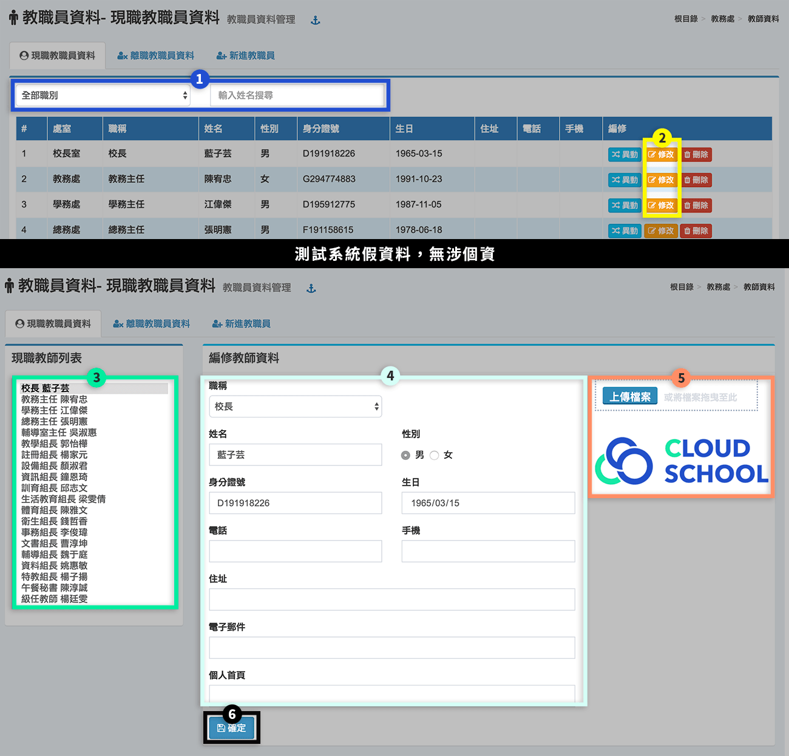
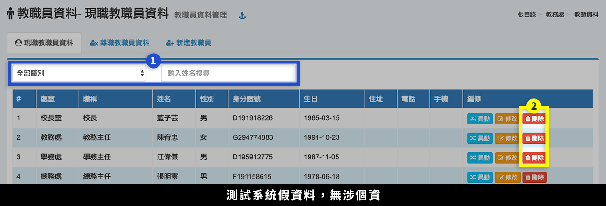
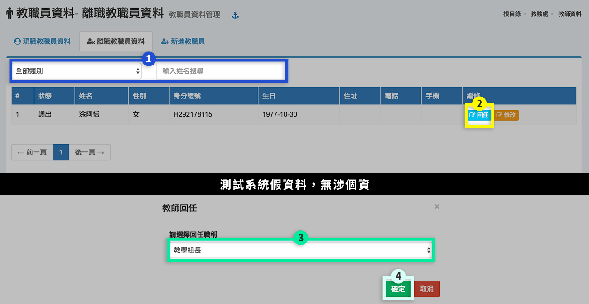
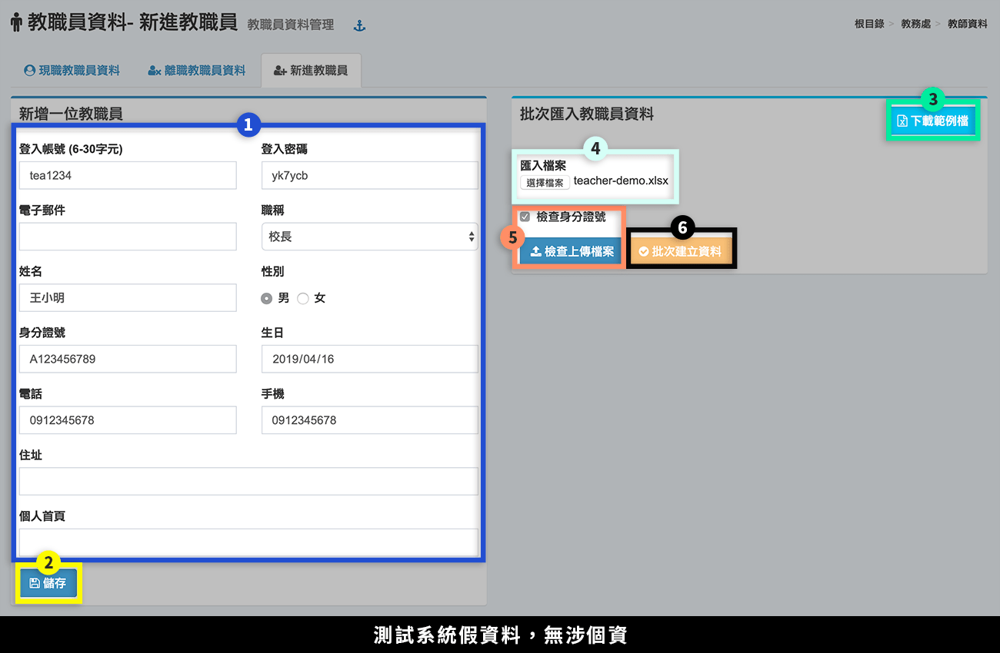

# 教師資料

## 現職教職員資料




1. 透過選擇**「職別」**或**「輸入姓名」**搜尋教師。
2. 按下**「異動」**，會彈出快顯示窗。
3. 選擇**「異動類別」**。
4. 按下**「確定」**，儲存該次編輯。




1. 透過選擇**「職別」**或**「輸入姓名」**搜尋教師。
2. 按下**「修改」**，會跳至編輯頁面。
3. 選擇**「教師」**。
4. 可編輯**「教師資料」**。
5. 按下**「上傳檔案」**，可新增教師照片。
6. 按下**「確定」**，儲存該次編輯。


注意! 如有教師職稱異動，請更正教師職稱而非更改教師姓名，如直接修改個人資料，原教職員資料將會被覆蓋。

例如：校長藍子芸異動為教務主任，請點選該頁面職稱選單選擇教務主任後按確定。





本功能僅能刪除剛建立不久的帳號資料，若該教師在系統中已經建立其他資料，為了保證系統資料完整性，該帳號無法刪除，請使用異動功能將該教師設為離職。


1. 透過選擇**「職別」**或**「輸入姓名」**搜尋教師。
2. 按下**「刪除」**，會彈出快顯示窗，若該教師已有關聯資料如排課、成績...等，則無法刪除。



## 離職教職員資料

> 可設定離職教師回任。

1. 透過選擇**「職別」**或**「輸入姓名」**搜尋教師。
2. 按下**「回任」**，會彈出快顯示窗。
3. 選擇**「回任職稱」**。
4. 按下**「確定」**，儲存該次編輯。

## 新進教職員

> 為新進教職員設定帳號與基本資料。

1. 輸入新進教師**「帳號與基本資料」**。
2. 按下**「儲存」**，新增一名教職員。
3. 若要批次匯入多位新進教職員，先**「下載範例檔」**。
4. 將編輯好的檔案**「匯入」**。
5. 勾選**「檢查身份證」**，並按下**「檢查上傳檔案」**。
6. 若檔案無誤，則可以按下**「批次建立資料」**。身分證錯誤的話，則會顯示紅底，請將錯誤欄位修正，再重新上傳。
