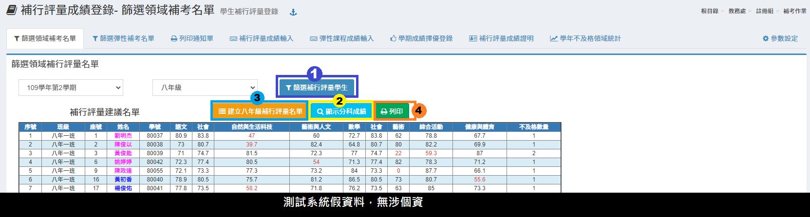
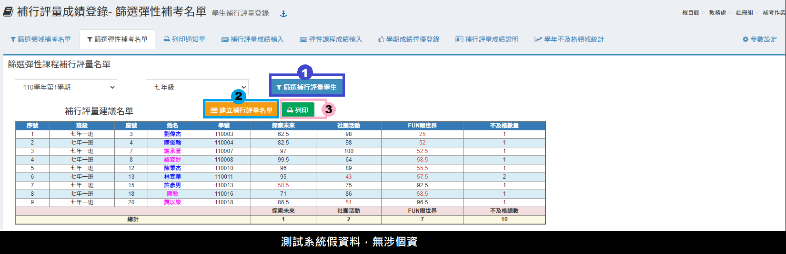
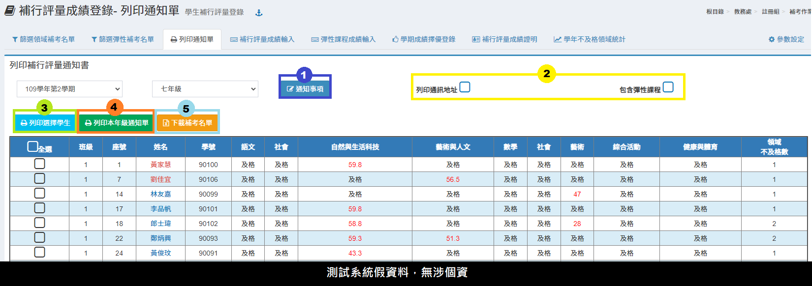
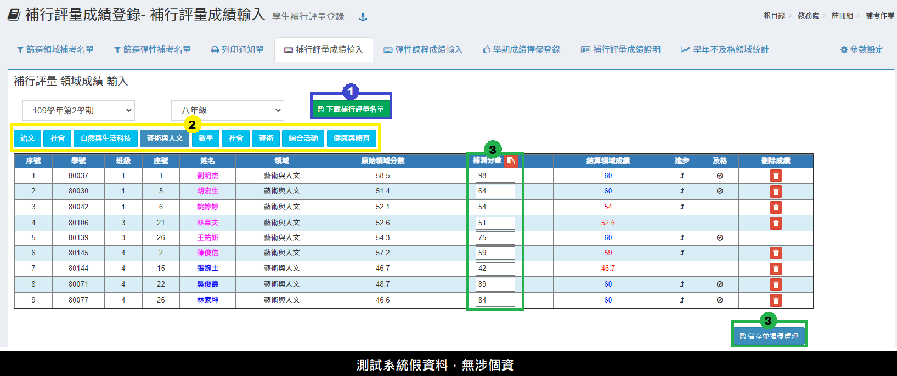
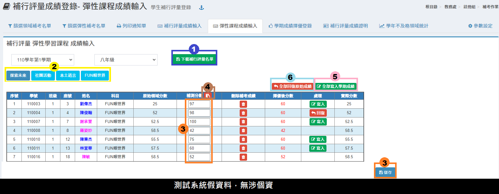
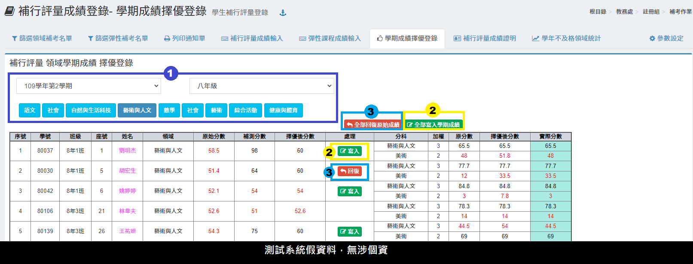
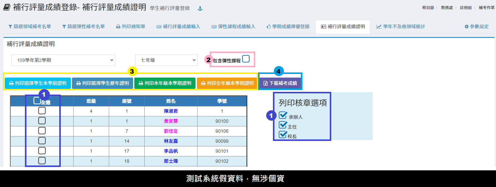
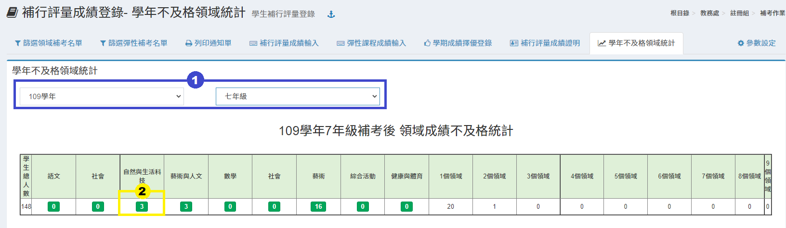

# 補考作業

## 篩選領域補行評量名單

1. 補考作業須先建立補考名單，選擇「學期」、「年級」後，再按下**「篩選補行評量學生」**，系統會依該學期年級之學期成績篩選出建議補考名單。
2. 可點擊「顯示分科成績」檢視領域分科的成績。
3. 如果名單沒有問題，即可按下**「建立年級補行評量名單」**按鈕，建立該年級領域補考名單。


要調整篩選成績的小數位數，請至 [參數設定](kao-zuo.md#ding) 操作。


## 篩選彈性課程補行評量名單

1. 補考作業須先建立補考名單，選擇「學期」、「年級」後，再按下**「篩選補行評量學生」**，系統會依該學期年級之學期成績篩選出建議補考名單。
2. 如果名單沒有問題，即可按下**「建立年級補行評量名單」**按鈕，建立該年級彈性課程補考名單。


要調整篩選成績的小數位數，請至 [參數設定](kao-zuo.md#ding) 操作。


## 列印通知單


建立補考名單後，才能列印通知單。


1. 按下**「通知事項」**，在跳出視窗內修改為正確內容並存檔，通知單會依照該內容列印通知。
2. 勾選列印條件。
3. 再依據需求勾選學生，按下**「列印選擇學生」**，列印學生補考通知。
4. 點擊「列印本年級通知單」可一鍵列印本年級需補考學生補考通知。
5. 點擊「下載補考名單」可下載該學期全年級補考名單。

## 補行評量成績輸入

1. 按下**「下載補行評量名單」**，可下載該年級依科目建立補考學生名冊 Excel 檔案。
2. 選擇**「領域」**，下方會出現該領域補考名冊。
3. 輸入成績後，按下**「儲存並擇優處理」**，系統會依據學生補考成績分別計算該領域各科之成績，但不會修改學期成績。

## 彈性課程成績輸入

1. 按下**「下載補行評量名單」**，可下載該年級依科目建立補考學生名冊 Excel 檔案。
2. 選擇**「彈性學習課程 」**，下方會出現該領域補考名冊
3. 輸入成績後，按下**「儲存」**，系統會依據學生補考成績分別計算該彈性課程之成績，但不會修改學期成績。&#x20;
4. 點擊紅色圖示可快貼補行評量成績，請依照快貼說明操作。
5. 按下**「全部寫入學期成績」**將全部學生成績擇優後分數寫入學期成績表。或點擊**「寫入」**針對個別學生寫入成績。&#x20;
6. 如欲恢復舊成績，可針對個別學生點選**「回復」**或**「全部回復原始成績」** 將已寫入學期成績表之成績恢復原來成績。

## 學期成績擇優登錄


須在 [補行評量成績輸入](kao-zuo.md#hang-liang-cheng-ru) 頁籤完成**「擇優處理成績」**，才能操作「學期成績擇優登錄」。


1. 選擇**「學期」**、**「年級」**，並選擇**「科目」**或**「全部科目」**分別進行。
2. 可針對個別學生按下**「寫入」**，或針對全部學生按下**「全部寫入學期成績」**按鈕， 將補考成績比原本學期高的成績，寫入學期成績表。
3. 如欲恢復舊成績，可針對個別學生按下**「回復」**，或針對全部學生按下**「全部回復原始成績」**按鈕，將已寫入學期成績表之成績恢復為原來成績。


如果學生成績有修改，需返回到 [補行評量成績輸入 ](kao-zuo.md#hang-liang-cheng-ru)更正成績後，按下**「擇優處理成績」**，才能接續本頁籤的寫入作業。


## 補行評量成績證明

1. 勾選**「學生」**及**「列印核章選項」**。
2. 勾選是否需要**「包含彈性課程」。**
3. 選擇要列印的**「證明格式」**。
4. 可點擊**「下載補考成績」**下載補考成績前後對照表。

## 學年不及格領域統計

1. 選擇**「學期」**、**「年級」**，該年級學期補考後成績不及格人數統計會顯示在標示處。
2. 點選領域不及格人數可以顯示該領域不及格名單。

## 參數設定

1. 及格成績篩選小數點位數\
   `四捨五入取整數`\
   `依照成績模組之小數位數`
2.  是否篩選體育專業領域及藝術才能專業領域

    `是`

    `否`
3.  成績證明列印成績選項

    `原領域成績`

    `補考成績`

    `採計成績`

