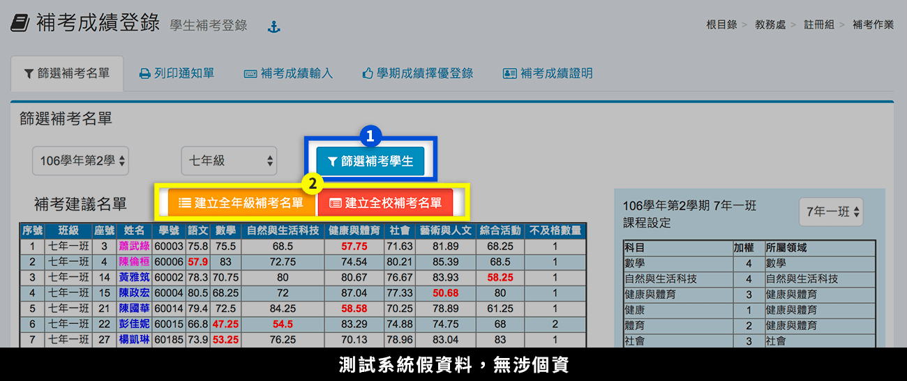
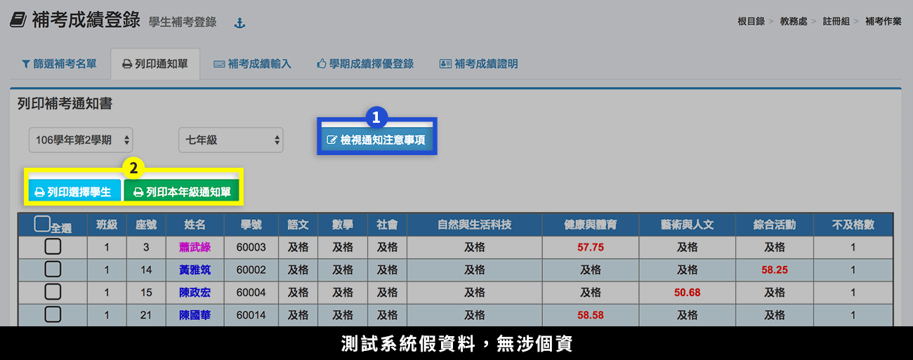
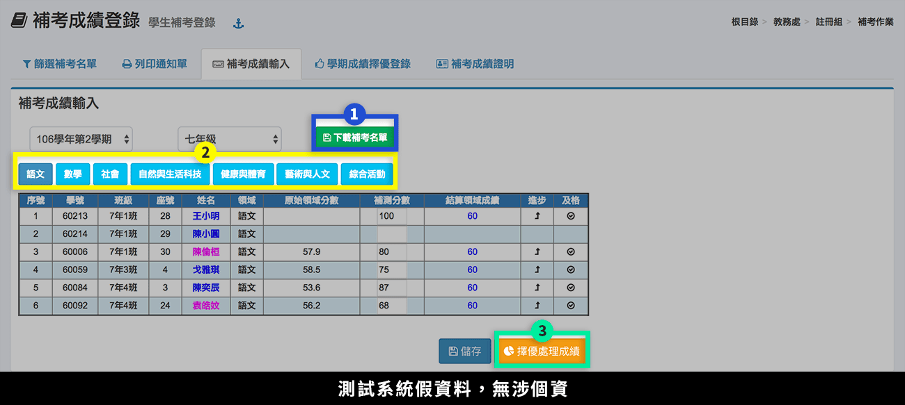
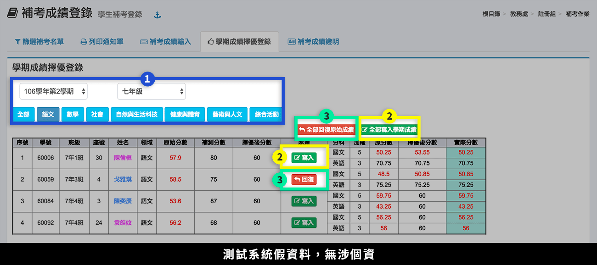
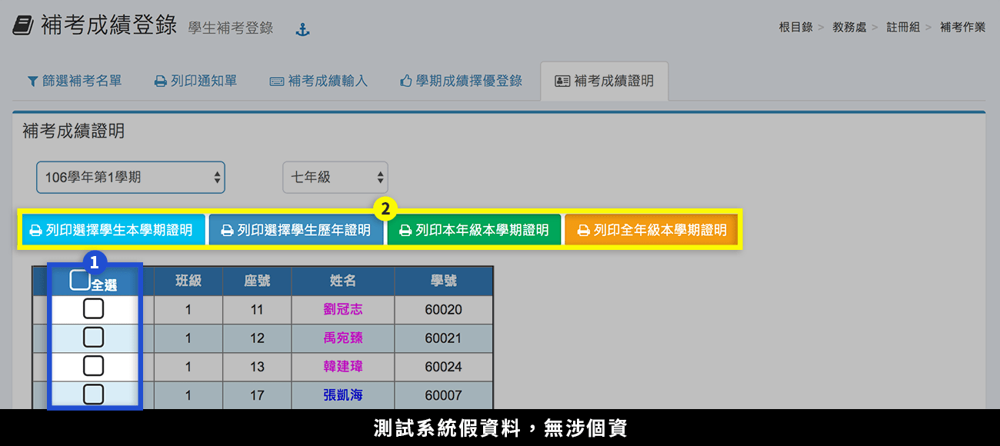

# 補考作業

## 篩選補行評量名單

1. 補考作業須先建立補考名單，選擇「學期」、「年級」後，再按下**「篩選補考學生」**，系統會依該學期年級之學期成績篩選出建議補考名單。
2. 如果名單沒有問題，即可按下**「建立年級補考名單」**或**「建立全年級補考名單」**按鈕，建立全年級補考名單。


要調整篩選成績的小數位數，請至 [參數設定](kao-zuo.md#ding) 操作。


## 列印通知單


建立補考名單後，才能列印通知單。


1. 按下**「檢視通知注意事項」**，在跳出視窗內修改為正確內容並存檔，通知單會依照該內容列印通知。
2. 再依據需求勾選學生，按下**「列印」**，列印學生補考通知。

## 補行評量成績輸入

1. 按下**「下載補考名單」**，可下載該年級依科目建立補考學生名冊 Excel 檔案。
2. 選擇**「領域」**，下方會出現該領域補考名冊。
3. 輸入成績後，按下**「擇優處理成績」**，系統會依據學生補考成績分別計算該領域各科之成績，但不會修改學期成績。

## 學期成績擇優登錄


須在 [補行評量成績輸入](kao-zuo.md#hang-liang-cheng-ru) 頁籤完成**「擇優處理成績」**，才能操作「學期成績擇優登錄」。


1. 選擇**「學期」**、**「年級」**，並選擇**「科目」**或**「全部科目」**分別進行。
2. 可針對個別學生按下**「寫入」**，或針對全部學生按下**「全部寫入學期成績」**按鈕， 將補考成績比原本學期高的成績，寫入學期成績表。
3. 如欲恢復舊成績，可針對個別學生按下**「回復」**，或針對全部學生按下**「全部回復原始成績」**按鈕，將已寫入學期成績表之成績恢復為原來成績。


如果學生成績有修改，需返回到 [補行評量成績輸入 ](kao-zuo.md#hang-liang-cheng-ru)更正成績後，按下**「擇優處理成績」**，才能接續本頁籤的寫入作業。


## 補行評量成績證明

1. 勾選**「學生」**。
2. 選擇要列印的**「證明格式」**。

## 參數設定

1. 及格成績篩選小數點位數 `四捨五入取整數 依照成績模組之小數位數 無條件進位取整數`

