# 學期初設定


使用外部排課系統者，請先完成 1\~4 步驟，並跳過 5\~9 步驟，直接至本模組的[10課表](qi-chu-ding.md#10-ke-biao) 匯入課表檔。


## 1 開學日

> 設定開學日、結業日、學期開始日期、學期結束日期等。




1. 按下**「本學期」**，修改本學期設定。
2. 按下**「新學期」**，新增一個新學期的資料。
3. 按下**「編修」**，編修一個學期的資料。
4. 按下**「查看」**，查看一個學期的資料。



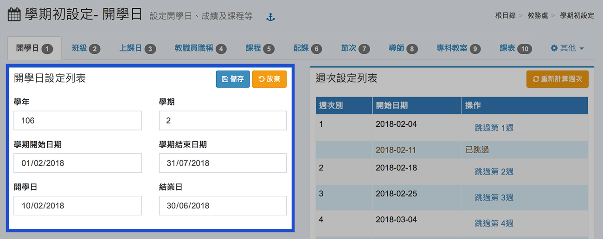

* 學期開始日期：新舊學期轉換日期，每學年第一學期設定為當年的 8 月 1 日，第二學期設定為當年的 2 月 1 日。
* 學期結束日期：每學年第一學期設定為當年的 1 月 31 日，第二學期設定為當年的 7 月 31 日。
* 開學日：學期開始上課日期，系統將以當週設為學期第一週。
* 結業日：學期結束上課日期。



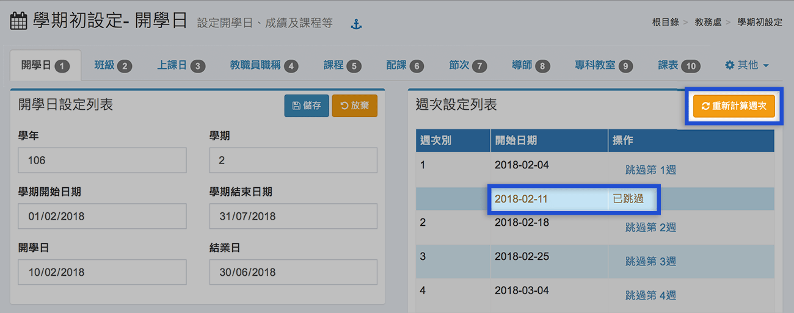

可跳過任一週或重新計算週次。




欲新增新學期，請點擊「新學期」，千萬不要直接編修現有學期的時間，否則將會影響當學期的資料。



若要編修「非本學期」的資料，請至畫面右上角的 [其他>參數設定](qi-chu-ding.md#can-shu-she-ding)，勾選「允許修改非本學期之資料」


## 2 班級





如本學期資料尚未設定，在編修欄會出現**「複製上學期資料」**按鈕，可按下後複製上學期資料至本學期。


1. 按下**「編修」**按鈕進入當學期的班級設定。
2. 非本學期的班級設定，預設只能**「查看」**，不可修改。如要修改，請至畫面右上角的[其他>參數調整](qi-chu-ding.md#can-shu-she-ding)，勾選**「允許修改本學期之前的資料」**為**「是」**。




1. 按下**「新增一個班級」**新增一個新的班級。
2. 按下**「修改」**編修一個班級設定。
3. 按下**「刪除」**刪除一個班級，如該班學生已編班或課程已設定，須先刪除編班資料或課程資料才可刪除班級。



.jpg>)

1. **「班序」**：此為班級排序，請輸入數字。\
   **「班名」**：如ㄧ、二、三...甲、乙、丙。\
   **「班級性質」**：普通班、特教班、藝才班、體育班、原住民教育班、實驗班、慈暉班、技藝專班。\
   **「班級屬性」**：非混齡、不分年級、混齡低年級...。\
   **「特教性質」**（特教班）：**身心障礙類**：智能障礙、視覺障礙、聽覺障礙、語言障礙、肢體障礙、腦性麻痺、身體病弱、情緒行為障礙、學習障礙、多重障礙、自閉症、發展遲緩、其他障礙。**資賦優異類**：一般智能資賦優異、學術性向資賦優異、藝術才能資賦優異、創造能力資賦優異、領導能力資賦優異、其他特殊才能資賦優異。\
   **特教班上課性質**（特教班）：集中式、分散式巡迴輔導。
2. 按下「確定」，儲存班級設定。


班級性質若選「特教班」，為混齡編制。





新學年若有**「減班」**，請先維持原來的班級編制，待操作學期編班，將所有學生升級，調整班級後再修正為正確的班級數。


## 3 上課日



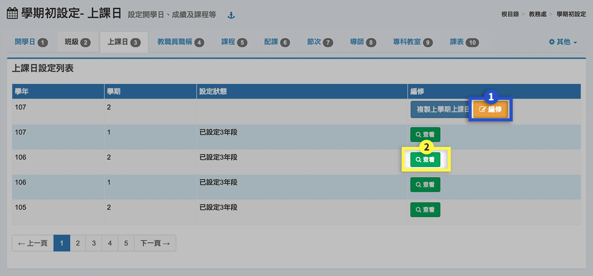


如本學期資料尚未設定，在編修欄會出現**「複製上學期資料」**按鈕，可按下後複製上學期資料至本學期。


1. 按下**「編修」**編輯本學期各學年上課日數。
2. 非本學期的上課日設定，預設只能**「查看」**，不可修改。如要修改，請至畫面右上角的[其他>參數設定](qi-chu-ding.md#can-shu-she-ding)，勾選**「允許修改本學期之前的資料」**為**「是」**。



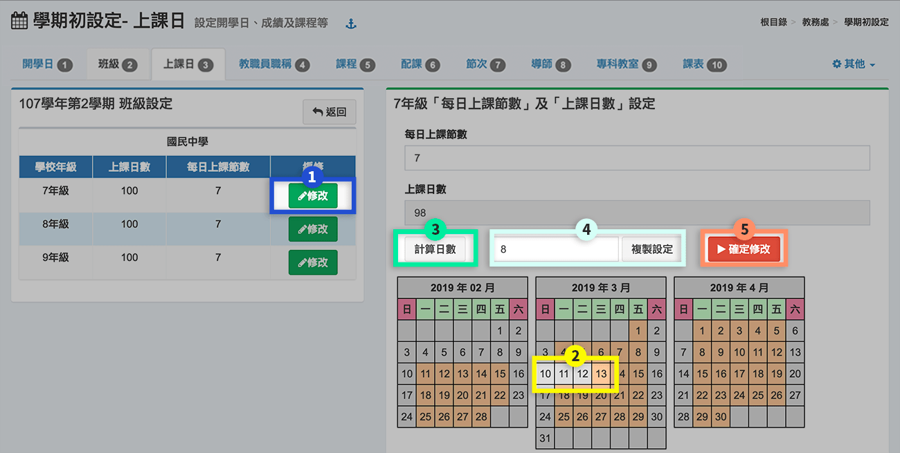

1. 進入編修畫面後，選擇設定的年級，按下**「修改」**。
2. 可點選日期以取消、新增上課日。（灰色為未選取）
3. 計算日數：系統會依照下方的日期，扣除假日及國定例假日（須自行點選），計算上課日數。
4. 複製設定：可將本年段設定複製到其他年段（複製之前先確定本年段設定是否存檔)。
5. 按下 **「確定修改」** 按鈕，將所設定之上課日進行存檔。



## 4 教職員職稱


* SFS3 系統每位教師只能紀錄一筆職稱資料，若有異動，則無法回查過去時間的職稱紀錄。
* 本系統設計每學期每位教職員都有一筆職稱紀錄，因此需要學期初需要進行設定。


1. 按下**「複製上學期之職稱設定」。**
2. 若同仁有職稱異動，再到「[教師資料](jiao-liao.md)」修改。


注意，當轉換到新學期時，系統管理員若未進行職稱複製或設定，一般教職員則無法登入！


## 5 課程





如本學期資料尚未設定，在編修欄會出現**「複製課程」**按鈕，可按下後複製上學年學期資料至本學期。


1. 按下**「編修」**編輯本學期課程設定。
2. 非本學期的課程設定，預設只能**「查看」**，不可修改。如要修改，請至畫面右上角的[其他>參數設定](qi-chu-ding.md#can-shu-she-ding)，勾選**「允許修改本學期之前的資料」**為**「是」**。



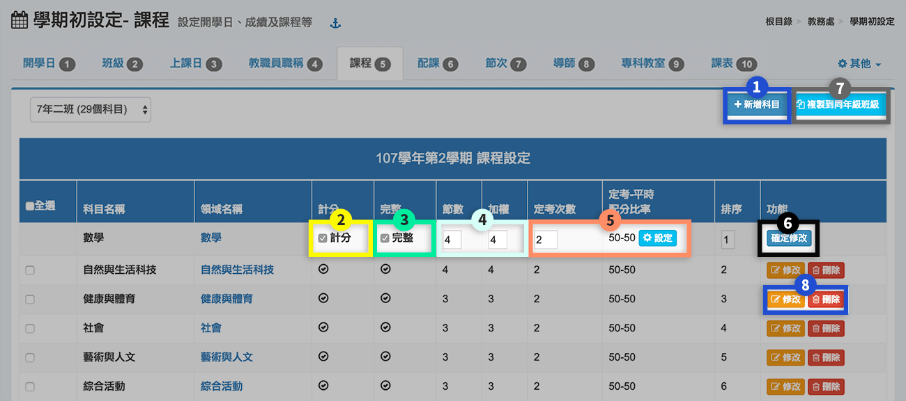

1. **新增科目**：新增一個新的科目。
2. **計分**：「勾選」則該科目必須輸入成績；「不勾選」仍可輸入成績，但不列入計算，亦不須設定加權與定考次數。
3. **完整**：「勾選」表示該科目有階段成績；「不勾選」表示僅輸入一次學期成績。
4. **節數、加權**：節數與加權並無相關，一般會設成一樣。節數為每週上課堂數，會影響配課與課表操作；加權設定則影響總成績計算時的加權。
5. **定考、平時配分**： 若該科目為完整，請設定定考次數，以及定考-平時配分比率，可選擇每次評量採相同或不同比例，系統會按照設定比率計算本科目的總成績。**特殊設定請參考下一頁籤**。
6. 儲存設定按下**「確定修改」**。
7. **複製到同年級班級**：將目前該班級所有課程複製到同年級班級。
8. **修改、刪除**：可針對所選科目修改課程設定；若要刪除一個科目，須先刪除配課及成績資料才能刪除。


* 如欲修改**「科目名稱」**以及**「所屬領域」**，可至畫面右上角 [其他>科目設定](qi-chu-ding.md#qi-ta) 修改，目前**九年一貫**與**十二年國教**課綱並行。





各校定考次數與配分皆不一樣，以下列三種狀況說明之，填入比例僅供參考：

1. 若該科目每階段考試的定期、平時成績比例**一致**，請在標示處 1 勾選並設定。
2. 若該科目每階段考試的定期、平時成績比例**不一致**，請在標示處 2 勾選並設定。
3. 若該科目只在部分階段有考試，請**將不考試的階段配分設為 0**。



## 6 配課



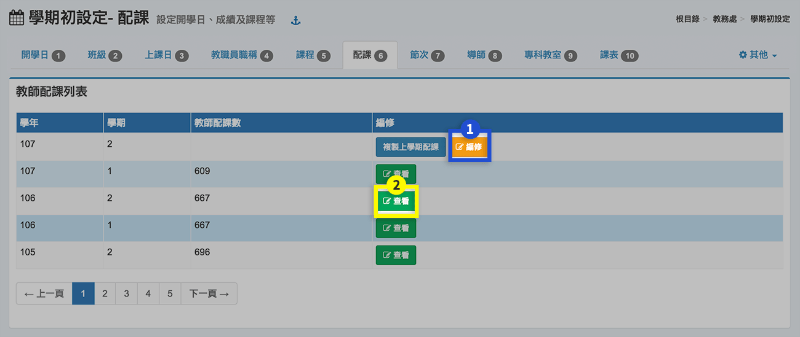


如本學期資料尚未設定，在編修欄會出現**「複製上學期資料」**按鈕，可按下後複製上學期資料至本學期。


1. 按下**「編修」**編輯本學期教師配課。
2. 非本學期的配課設定，預設只能**「查看」**，不可修改。如要修改，請至畫面右上角的[其他>參數設定](qi-chu-ding.md#can-shu-she-ding)，勾選**「允許修改本學期之前的資料」**為**「是」**。



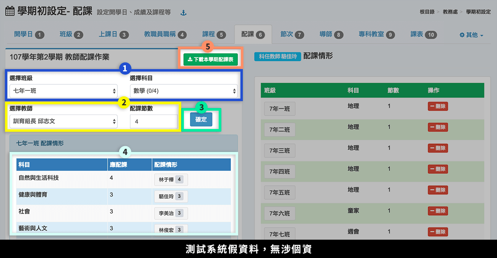

1. 選擇**「班級」**與**「科目（未配課節數/總節數）」**。
2. 選擇**「教師」**及設定**「節數」**。
3. 按下**「確定」**，儲存該次配課設定。
4. 標示處呈現該班已配課情形。
5. 可下載本學期配課表。




1. 按下配課情形中的**「教師姓名」**。
2. 標示處呈現該教師的配課情形，可按下**「刪除」**刪除一節配課。



## 7 節次





如本學期資料尚未設定，在編修欄會出現**「複製上學期資料」**按鈕，可按下後複製上學期資料至本學期。


1. 按下**「編修」**編輯本學期節次。
2. 非本學期的節次設定，預設只能**「查看」**，不可修改。如要修改，請至畫面右上角的[其他>參數設定](qi-chu-ding.md#can-shu-she-ding)，勾選**「允許修改本學期之前的資料」**為**「是」**。



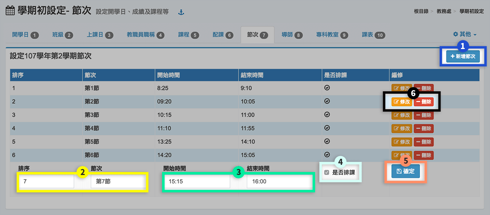

1. 按下**「新增節次」**，可新增一節。
2. 輸入**「排序」**與**「節次名稱」**。
3. 選擇**「開始時間」**與**「結束時間」**。
4. 勾選**「是否排課」**。
5. 按下**「確定」**，儲存該次設定。
6. 已設定之節次，可**「修改」**或**「刪除」**。


午休設定請至 [其他>參數設定](qi-chu-ding.md#can-shu-she-ding)。




## 8 導師





如本學期資料尚未設定，在編修欄會出現**「複製上學期資料」**按鈕，可按下後複製上學期資料至本學期。


1. 按下**「編修」**編輯本學期導師。
2. 非本學期的節次設定，預設只能**「查看」**，不可修改。如要修改，請至畫面右上角的[其他>參數設定](qi-chu-ding.md#can-shu-she-ding)，勾選**「允許修改本學期之前的資料」**為**「是」**。



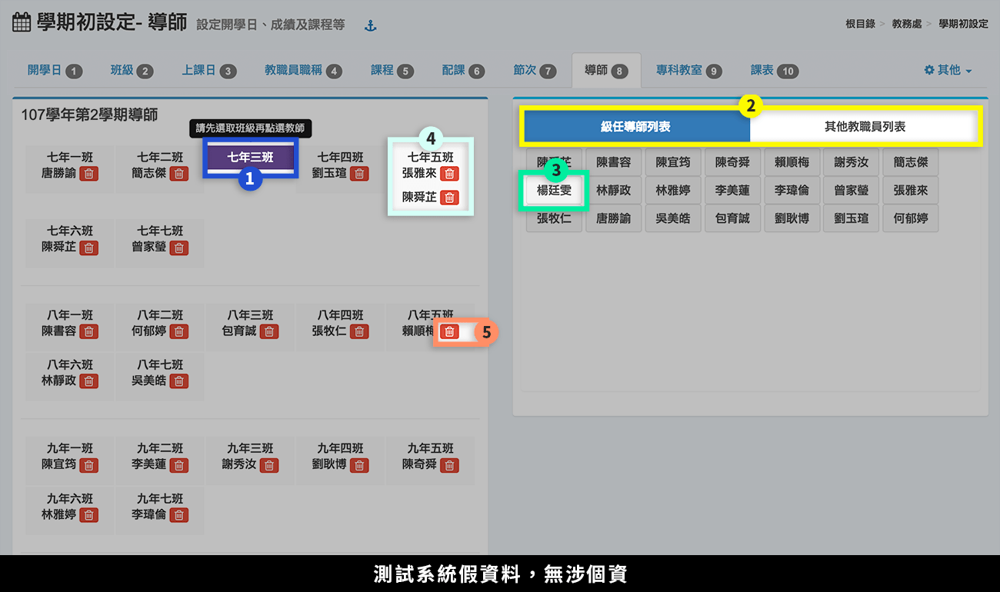

1. 選擇**「班級」**，背景為紫色表示選取成功。
2. 選擇**「教師列表」**：級任導師列表、其他教職員列表。
3. 點選**「教師姓名」**。
4. 一個班級可以設定多位導師。
5. 按下**「刪除」**圖示，可刪除該班導師設定。



## 9 專科教室




1. 按下**「增加專科教室」**，可新增專科教室。
2. 欲調整專科教室排序，先輸入**排序**，再按下**「重新排序」**。
3. 啟用中的教室，可點擊**「X」**停用。
4. 停用中的教室，可點擊黃色鈕**「尚未啟用」**啟用。
5. 可**「編輯」**或**「刪除」**現有專科教室。



在專科教室列表，按下「增加專科教室」，會跳出下列畫面。

1. 輸入**「專科教室名稱」**。
2. 勾選**「是否開放預約」**。
3. 按下**「設定不開放預約節次」**，會跳出下面節次表。
4. **「+」**圖示表示開放，點擊後會變成**「x」**圖示，表示不開放。
5. 按下**「確定」**，確認不開放節次設定。
6. 按下**「存檔」**，儲存該次專科教室設定




要調整「專科教室預約限定期間日數」（預設為14日），請系統管理員到「[系統管理 > 模組管理](../xi-guan-li-mo/module.md#mo-zu-guan-li)」調整，如下圖：


1. 到「根目錄 > 教職員」（或該模組放置位置）。
2. 在「課表查詢」按下**「調整」**。
3. 輸入預約限定日數。
4. 按下**「確定」**。



## 10 課表

> 提供直覺化的排課作業，減少行政人員的負擔。另支援外部排課系統匯入資料：一也、欣河、STC。

### 使用 Cloud School 排課



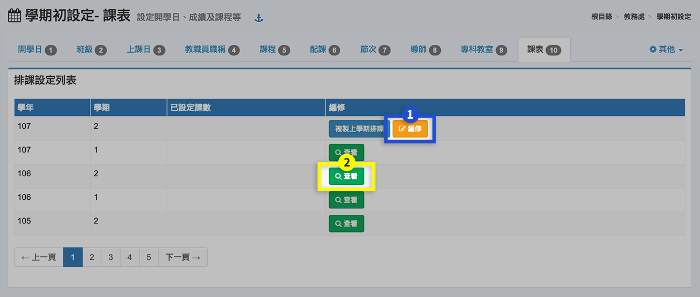


如本學期資料尚未設定，在編修欄會出現**「複製上學期資料」**按鈕，可按下後複製上學期資料至本學期。


1. 按下**「編修」**編輯本學期課表。
2. 非本學期的節次設定，預設只能**「查看」**，不可修改。如要修改，請至畫面右上角的[其他>參數設定](qi-chu-ding.md#can-shu-she-ding)，勾選**「允許修改本學期之前的資料」**為**「是」**。




1. 選擇**「班級」**。
2. 選擇**「科目」**。
3. 在欲排課的節次點擊**「＋」**。
4. 完成後如標示處所示，會出現科目、任課教師，並可點擊**「＠」**選擇教室。
5. 選擇教師姓名，系統會列出該教師的課表。
6. 點選**「下載課表」**，可下載班級課表、全校課表、全校教師課表、專科教室課表。



### 使用外部排課系統




1. 按下**「匯入課表」**。
2. 如有配課或已複製上學期配課，請先按下**「清除本學期已配課、課表及分組設定」**，才能繼續匯入外部系統之課表。
3. 選擇**「排課系統」**。
4. 選擇**「檔案」**。
5. 按下**「匯入檔案」**，匯入課表。



使用外部系統匯入課表後，須對應本系統之教師、課程、教室。

1. 按下**「對應教師」**。
2. 選擇匯入之教師資料。
3. 點選系統內部教師資料。
4. 完成對應入標示處，可點擊「垃圾桶」圖示刪除。
5. 對應課程、對應教室，如上述步驟操作。
6. 完成對應後，按下**「寫入課表」**。



## 其他

### 參數設定

1. 學期下拉選單顯示學期數（留空或 0，表示顯示全部）\
   `0`
2. 允許修改非本學期之資料\
   `否`\
   `是`
3. 課表編修-開放導師編修課表\
   `不開放`\
   `開放`
4. 課表編修-鎖課列表，多節課以逗號隔開\
   `1-1,2-3,3-5,4-4`
5. 課表編修-午休在第幾節之後\
   `4`
6. 課表編修-限制教師衝堂可排課\
   `限制`\
   `不限制`
7.  課表-開放瀏覽

    `開放`

    `關閉`

### 九年一貫科目設定



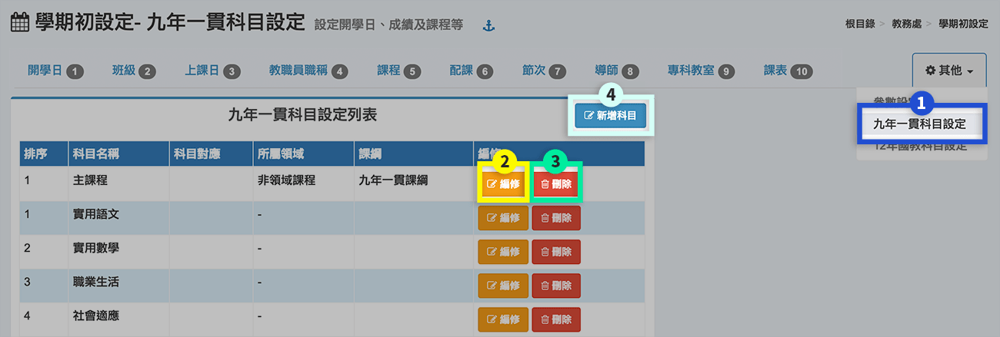

1. 按**「其他」**，選取**「科目設定」** 進入。
2. 按**「編修」**，修改科目設定，**注意！** 修改科目名稱時，會影響所有的班級配課名稱。
3. 按**「刪除」**，刪除一個科目（先確定對應的班級課程資料清除後，才可刪除）
4. 按**「新增科目」**，可以新增一個科目。




1. 輸入**「科目名稱」**。
2. 選擇**「所屬領域」**。
3. 系統會直接產生**學籍交換對應科目**。
4. 輸入科目**「排序」**。
5. 按下**「存檔」**，儲存科目。



### 12 年國教科目設定



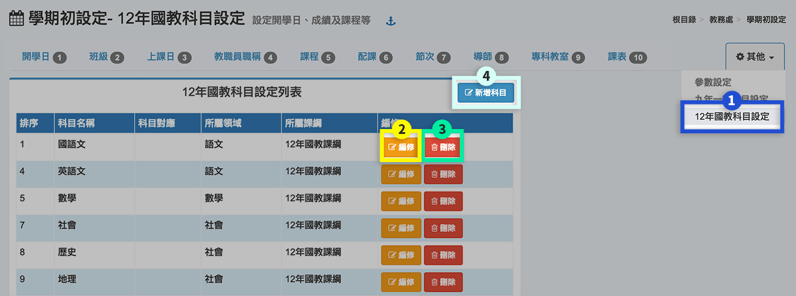

1. 按**「其他」**，選取**「科目設定」**進入。
2. 按**「編修」**，修改科目設定，**注意！** 修改科目名稱時，會影響所有的班級配課名稱。
3. 按**「刪除」**，刪除一個科目（先確定對應的班級課程資料清除後，才可刪除）
4. 按**「新增科目」**，可以新增一個科目。




1. 輸入**「科目名稱」**。
2. 選擇**「所屬領域」**。
3. 系統會直接產生**學籍交換對應科目**。
4. 輸入科目**「排序」**。
5. 按下**「存檔」**，儲存科目。


