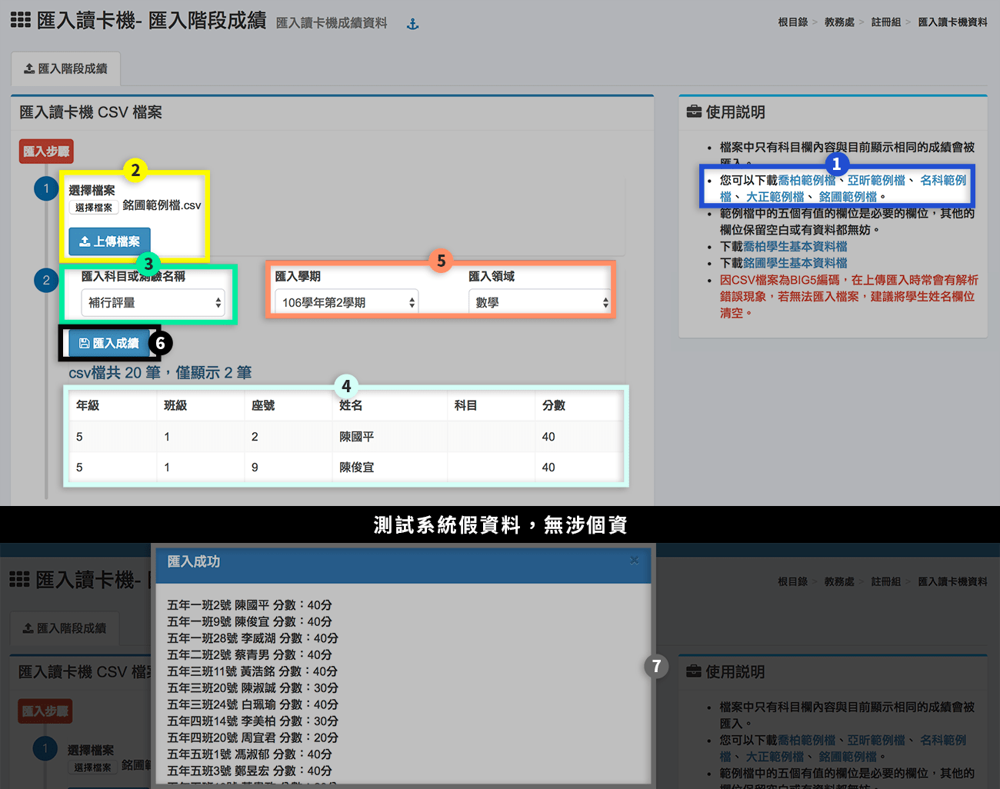
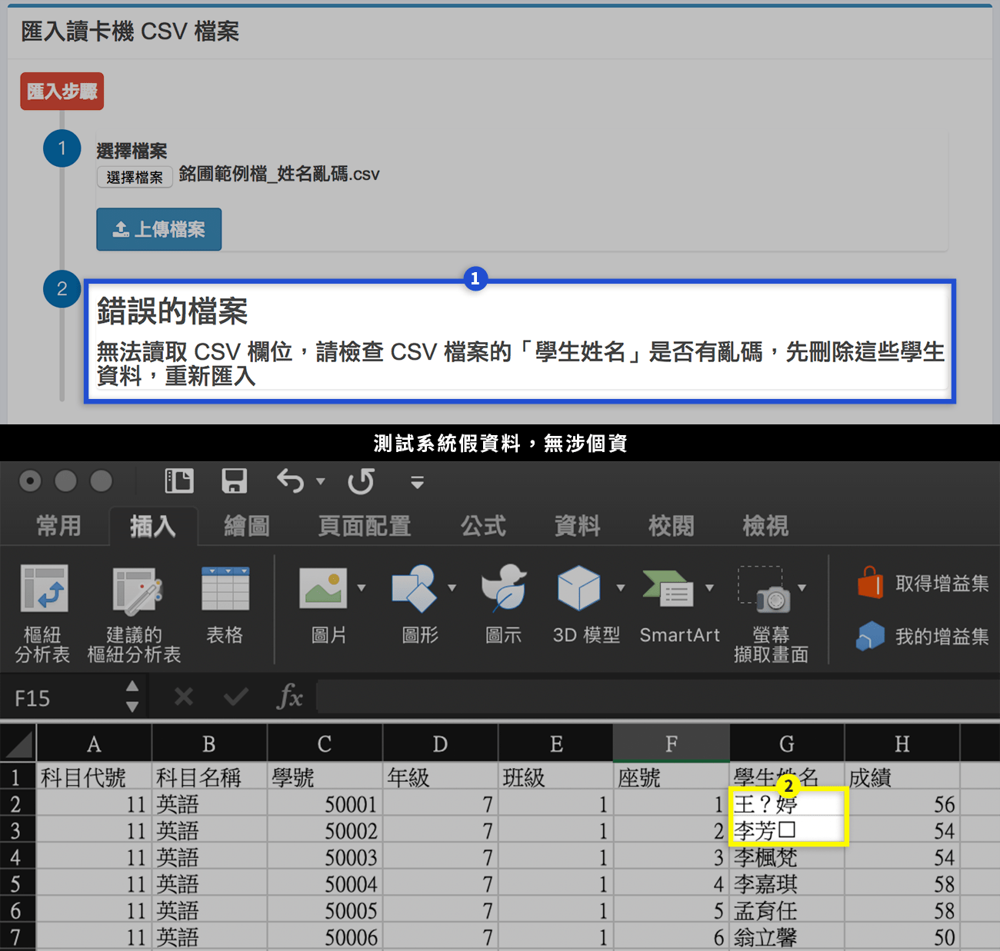

# 匯入讀卡機資料

### 匯入階段成績

1. 可先下載成績匯入範例檔，範例檔中的五個有值的欄位是必要的欄位，其他的欄位可留空。
2. 選擇匯入檔案，按下**「上傳檔案」**。
3. 選擇**「匯入科目或測驗名稱」**，補行評量成績也是在此匯入。
4. 標示處會顯示部份匯入資料，僅供檢視，不會呈現所有資料。
5. 選擇匯入「學期」、「領域」。
6. 按下**「匯入成績」**。
7. 當匯入成功，會彈出快顯視窗，會呈現所有匯入資料。

### 匯入失敗解決方法


* 讀卡機匯出檔出現亂碼是因為使用** Big5 編碼**，造成許多常見中文字會變成亂碼，如：許、功、蓋、珮、俞、...等。
* 本系統是使用世界通用的萬國碼 UTF8MB4，若此問題造成諸多不便，請聯繫讀卡機公司，將編碼改為 UTF8，即可呈現編列至 Unicode（萬國碼）的所有字元。


1. 若上傳完匯入檔後，出現錯誤提醒，如標示處。
2. 請打開該 CSV 檔，找出姓名有問題的學生，如：「？」、「☐」，將這些學生姓名清空，存檔後再匯入。若還是出現錯誤，則將這些學生資料刪除，到 [成績綜合管理>成績輸入 ](cheng-he-guan-li.md#cheng-ji-shu-ru)改以手動輸入成績。
