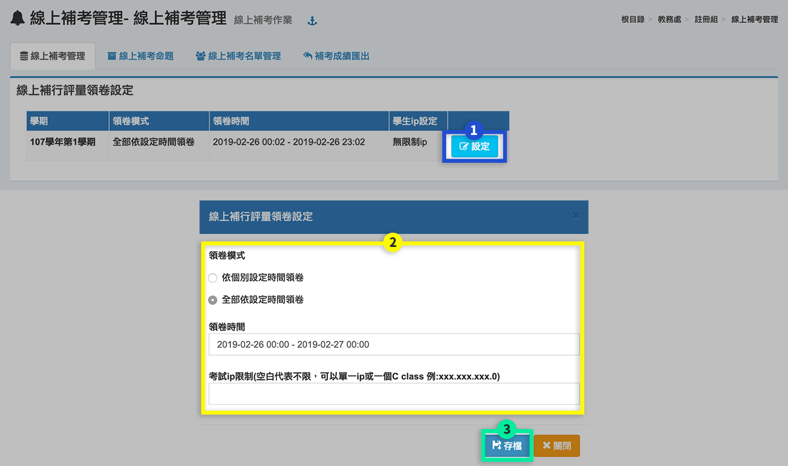
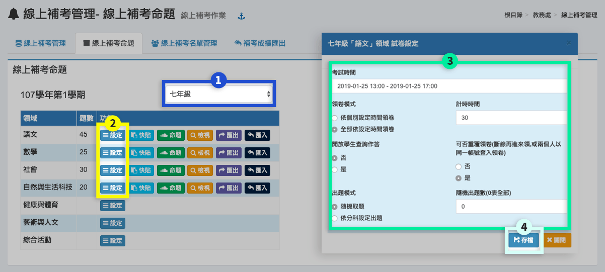
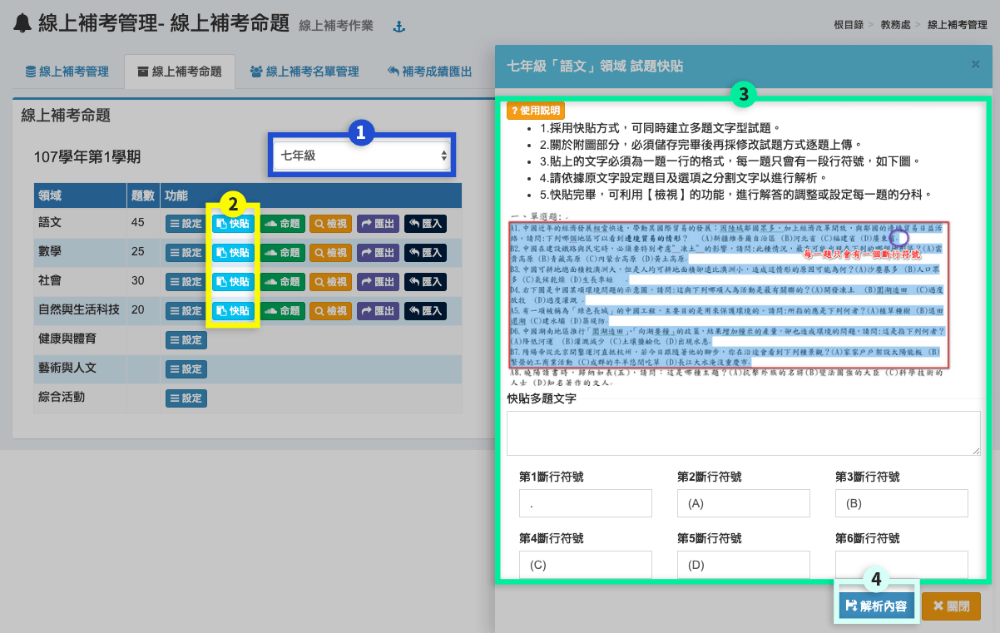
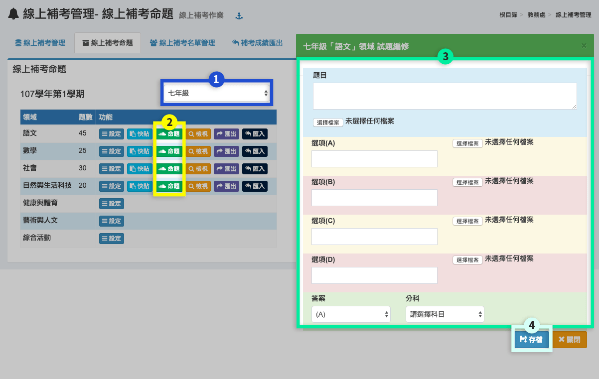
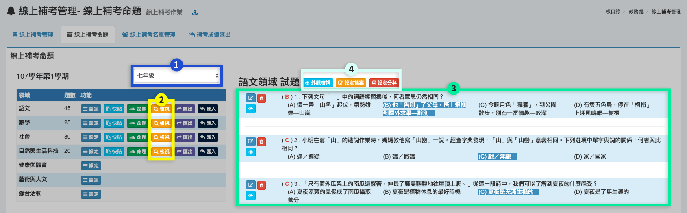
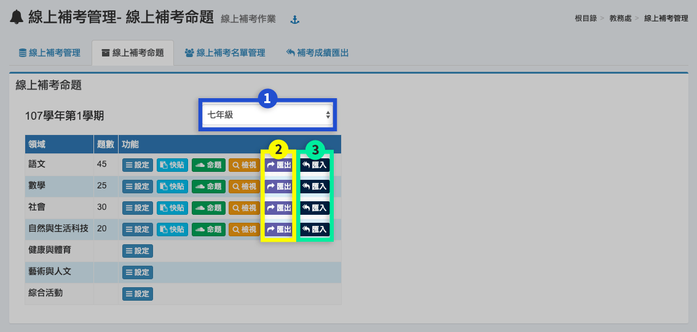
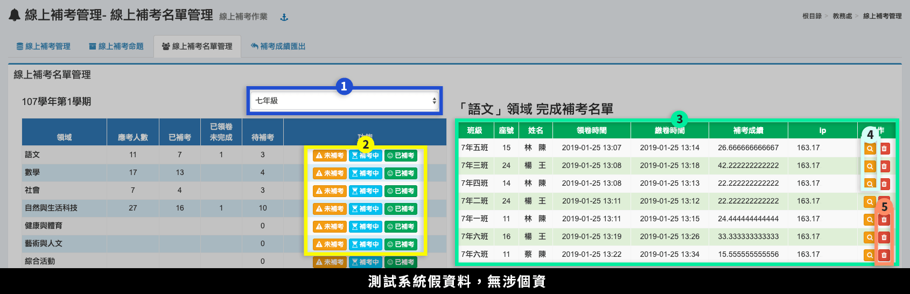
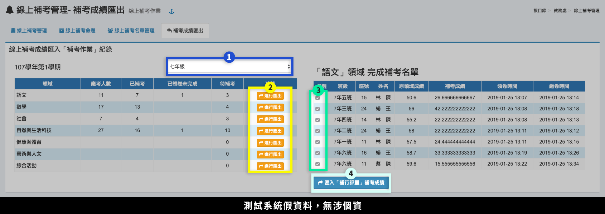

# 線上補考管理


1. 本模組配合本系統之 [補考作業](kao-zuo.md) 模組，須先在補考作業模組**產生補考名單**，本模組會抓取所有已經有補考名單之最後一個學期進行作業。
2.  本模組也須配合新增 [學生線上考試](../sheng/sheng-shang-kao.md) 模組，須將權限開放給全部學生，於測驗設定的時間內

    ，學生登入後進入學生線上考試模組，會出現該生需要補考的科目，並可以領卷考試。


## 線上補考管理

1. 當 [補考作業](kao-zuo.md) 模組產生補考名單後，即可在此頁面按下**「設定」**。
2. 進行**「領卷設定」**：領卷模式、領卷時間、考試 ip 限制。
3. 按下**「存檔」**。

## 線上補考命題


要操作此功能，請先至 [線上補考管理](shang-kao-guan-li.md#xian-shang-bu-kao-guan-li) 操作領卷設定。





1. 選擇**「年級」**。
2. 針對不同科目，按下**「設定」**。
3. 標示處可設定：考試時間、領卷模式、計時時間、開上學生查詢作答、可否重複領卷、出題模式、隨機出題數。
4. 按下**「存檔」**，儲存該科目設定。




1. 選擇**「年級」**。
2. 針對不同科目，按下**「快貼」**。
3. 標示處可操作題目快貼，按下**「說明」**瀏覽操作教學：可以從檔案複製文字題目並依設定之分隔符號，解析每一題為單行文字之內容為題目及選項(一題為單一整行，否則會出錯)。
4. 按下**「解析內容」**，選擇解析出的內容為「題目」或「選項」，並依需要設定是否儲存。




1. 選擇**「年級」**。
2. 針對不同科目，按下**「命題」**。
3. 標示處可逐題輸入題目、選項及上傳修改附圖、答案及科目選項。
4. 按下**「存檔」**，儲存該命題設定。




1. 選擇**「年級」**。
2. 針對不同科目，按下**「檢視」**。
3. 標示處可瀏覽已完成的命題，並可編輯、刪除、檢視題目可。
4. 可進行全部題目的**「外觀檢視」**、**「設定答案」**、**「設定分科」**。




1. 選擇**「年級」**。
2. 本系統題庫只保留一次段考題庫，若要下次能繼續使用同題庫，按下**「匯出」**可將題庫匯出。
3. 並於下次**「匯入」**題庫。&#x20;


匯出時會將圖片以文字編碼方式存於檔案中，於匯入後恢復圖片格式




## 線上補考名單管理


* 如果學生需補考不在名單內，請至 [補考作業>篩選補行評量名單 ](kao-zuo.md#shai-xuan-ling-yu-bu-hang-ping-liang-ming-chan)內重新篩選學生，名單就會同時同步更新。
* 本功能不提供列印補考通知書及名單下載，請直接在 [補考作業>列印通知單 ](kao-zuo.md#lie-yin-tong-zhi-chan)列印下載。


1. 選擇**「年級」**。
2. 按下**「未補考」**或**「補考中」**或**「已補考」**。
3. 標示處會出現對應的學生名單。
4. 在「已補考」名單，按下**「檢視」**圖示，可查看學生作答結果。
5. 在「已補考」名單，按下**「刪除」**圖示，可刪除學生考試紀錄，學生則必須重新補考。

## 補考成績匯出

1. 選擇**「年級」**。
2. 選擇領域，按下**「進行匯出」。**
3. 勾選要匯入的學生。
4. 按下**「匯入補行評量補考成績」**，完成補考成績匯入。
