# 學生資料管理

## 學生資料

### 基本資料

> 此為學生重要個人資料，請妥善管理、維護。

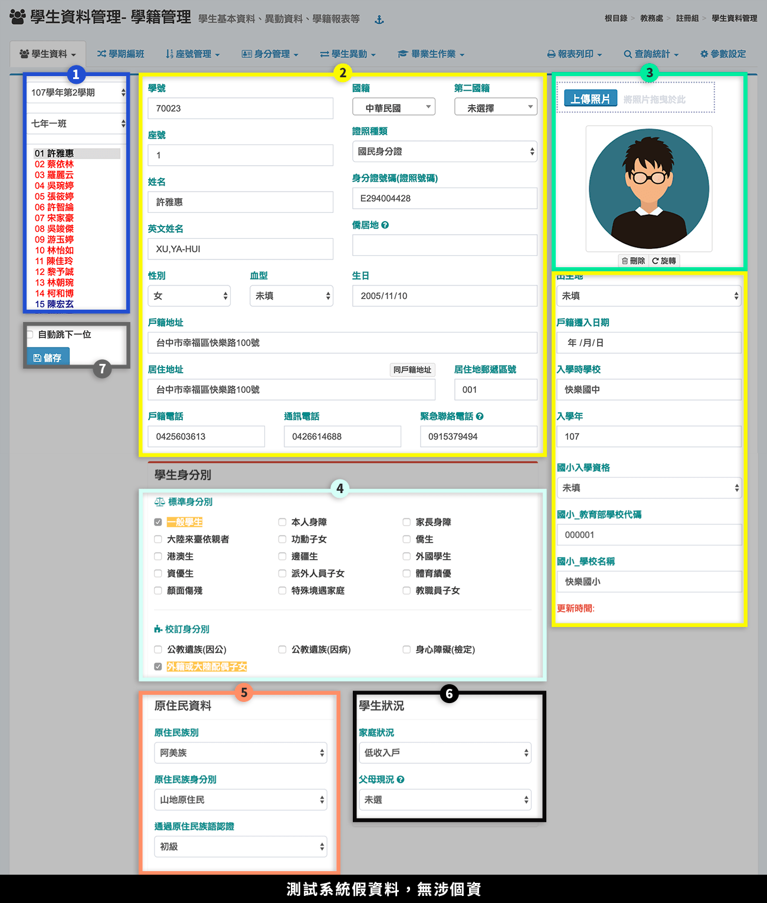

1. 選擇**「學期」**、**「班級」**、**「學生姓名」**。
2. 編輯**「學生基本資料」**。
3. 按下**「上傳照片」**，可上傳學生照片，亦可**「刪除」**、**「旋轉」**照片，大量上傳請至 [學生資料&gt;批次上傳學生照片](sheng-liao-guan-li.md#pi-ci-shang-sheng-zhao-pian) 操作。
4. 勾選學生**「身分別」**，提供標準身分別、校訂身分別，編輯身分別請至 [身分管理&gt;學生身分別-子類別及選項管理](sheng-liao-guan-li.md#shen-fen-zi-guan-li)。
5. 選擇**「原住民資料」**：原住民族別、原住民身分別、通過原住民族語認證。
6. 選擇**「學生狀況」**：家庭狀況、父母現況。
7. 編修完畢，按下**「儲存」**，並可勾選「自動跳下一位」。


欲開放導師編修學生基本資料，請至 [參數設定](sheng-liao-guan-li.md#ding) 調整，可設定**部分開放**。


### 父母監護人資料

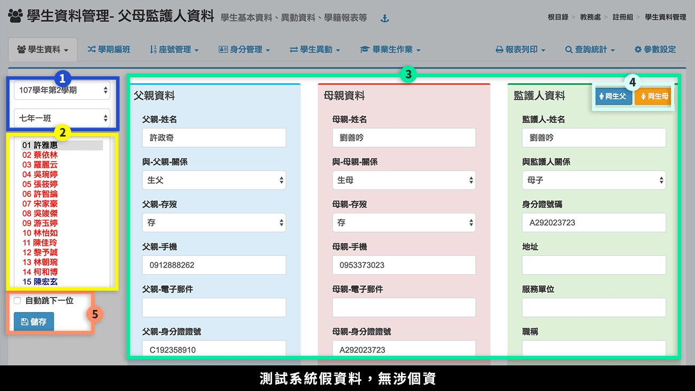

1. 選取 **「學期選單」** 及 **「班級選單」** 可以切換成不同學期的班級。
2. 點選 **「學生列表」** 可以切換不同的學生。
3. **「父母親及監護人資料編輯區」** 編修該生的父母親及監護人資料。
4. 點選 **「同生父」** 或 **「同生母」** 按鈕，可以複製父或母親資料到監護人資料區，但部分欄位仍需手動輸入。
5. 可勾選**「自動跳下一位」**，系統會在儲存後跳下一號學生，接著 **「儲存」** 異動的資料。

### 兄弟姊妹資料

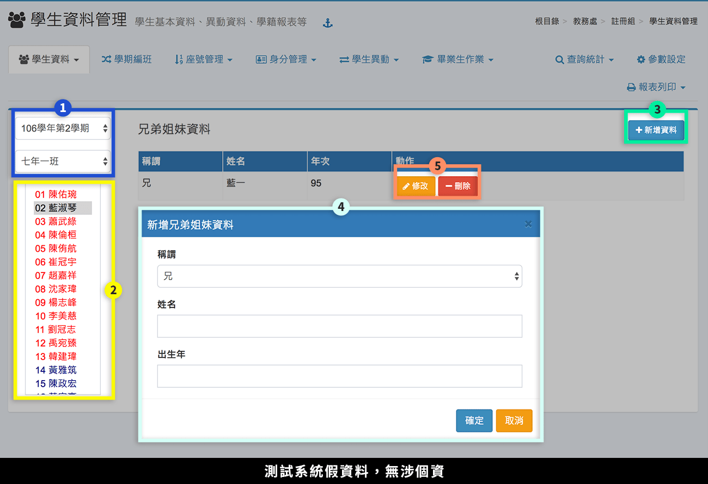

1. 選取 **「學期選單」** 及 **「班級選單」** 可以切換成不同學期的班級。
2. 點選 **「學生列表」** 可以切換不同的學生。
3. 點選 **「新增資料」** 按鈕，會跳出 **「編修兄弟姐妹資料」** 對話框。
4. 在 **「編修兄弟姐妹資料」** 對話框，填寫兄弟姊妹資料，並按下 **「確定」** 按鈕，可以新增兄弟姊妹資料。
5. 點選 **「刪除」** 按鈕，可以刪除該筆兄弟姊妹資料；點選 **「編輯」** 按鈕，會跳出 **「編修兄弟姐妹資料」** 視窗，修改兄弟姊妹資料，並按下 **「確定」** 按鈕，可以修改該筆兄弟姊妹資料。

### 補充資料

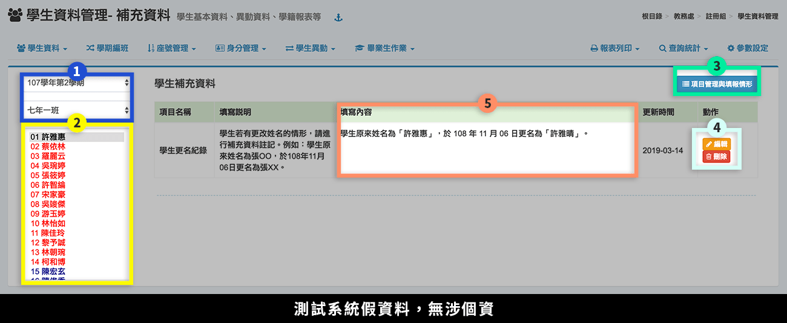

1. 選取 **「學期選單」** 及 **「班級選單」** 可以切換成不同學期的班級。
2. 點選 **「學生列表」** 可以切換不同的學生。
3. 點選**「項目管理與填報情形」**可新增或編修填報項目（如下一圖示）。
4. 點選**「編輯」**、**「刪除」**可編修填寫內容。
5. 填寫內容呈現在標示處。

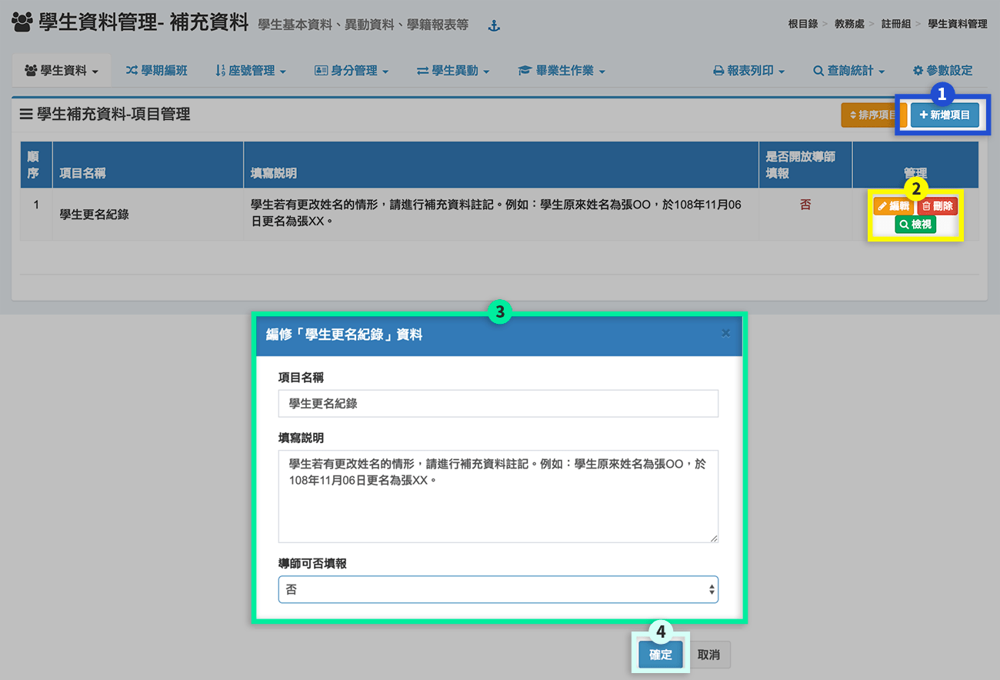

1. 點選**「新增項目」**，新增一項學生補充資料項目，例如：更名紀錄。
2. 點選**「編輯」**、**「刪除」**、**「檢視」**，可編修、查看項目內容。
3. 點選**「編輯」**後有個彈出編修視窗，可輸入**「項目名稱」**、**「填寫說明」**、**「導師可否填報」**。
4. 按下**「確定」**，儲存編修內容。

### 資料整班編修

> 提供一次編修整班相同資料欄位。

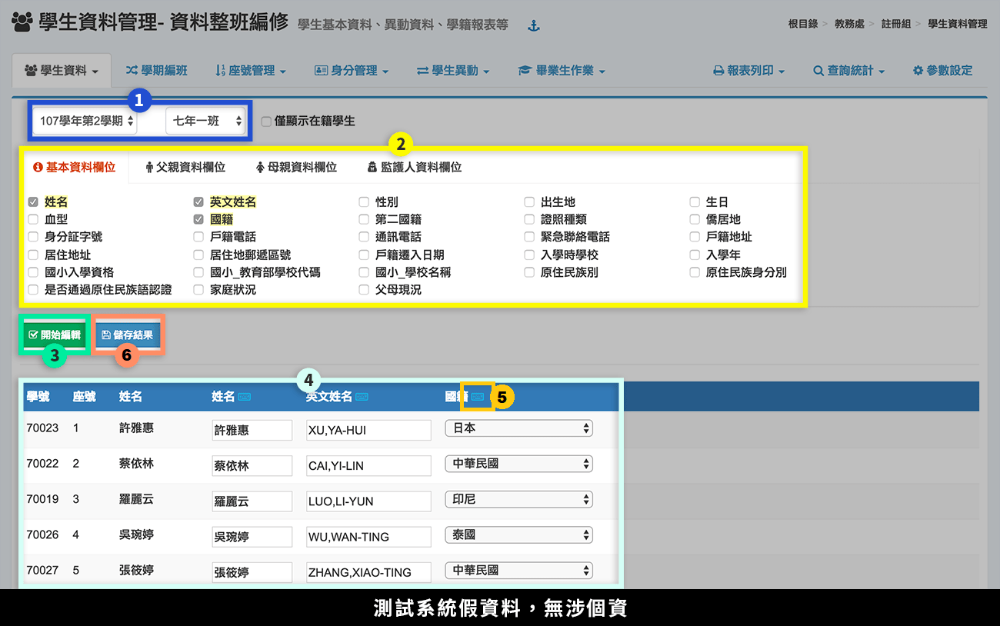

1. 選取 **「學期選單」** 及 **「班級選單」** 可以切換成不同學期的班級。
2. 選擇要編修的**「資料欄位」**。
3. 按下**「開始編輯」**。
4. 標示處可編修整班學生資料。
5. 按下**「儲存結果」**，完成本次編修。

### 匯入新生資料


* 操作此步驟前，請先至 [學期初設定](qi-chu-ding.md)，完成班級設定。
* 若是新學年度的第一學期，請先到 [學期編班](sheng-liao-guan-li.md#qi-ban) 將學生升級後，再匯入新生。
* 新手操作，請參考 [學期初設定大補帖](../chang-cao-zuo-liu-cheng-jiao/qi-chu-ding-da-tie.md) 教學。


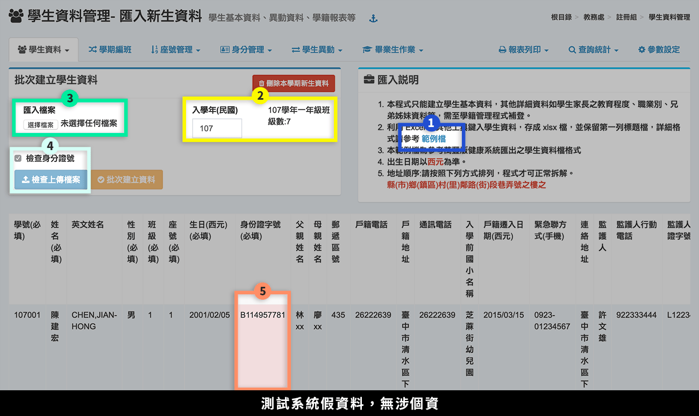

1. 點擊超連結可下載 Excel 格式**範例檔**，請依照檔案格式填入資料，並保留第一列標題。本模組只能建立學生基本資料，其他如學生戶口資料等，需至 [學生基本資料](../xi-guan-li-mo/school.md#ji-ben-liao) 建立。
2. 匯入新生資料前，請輸入**入學年**，並確認是否有設定**班級**。
3. 按下**「選擇檔案」**按鈕，並選擇編輯好之新生 Excel 格式資料。
4. 勾選**「檢查身分證號」**，系統會驗證上傳資料中的身分證號格式是否正確。按下**「檢查上傳檔案」**按鈕，系統會將學生資料顯示在下方。
5. 如標示處出現紅色底，表示匯入資料格式錯誤，且無法點擊「批次建立資料」，請修正再操作一次。


若新生有外籍生或僑生，且尚未取得本國國籍，可將這些學生另外單獨匯入，並**不要勾選**「檢查身分證號」。（其他本國籍學生先匯入並檢查身分證號後，再匯入外籍生）


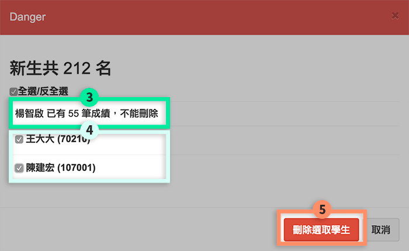

1. 匯入檔資料格式正確後，即可點擊**「批次建立資料」**。
2. 若有錯誤的新生匯入，可按下**「刪除新生資料」**，會彈出編修視窗。
3. 若學生已有成績紀錄，則無法刪除學籍。
4. 無成績紀錄的學生，可勾選後刪除。
5. 按下**「刪除選取學生」**，將刪除學生學籍。

### 批次上傳學生照片

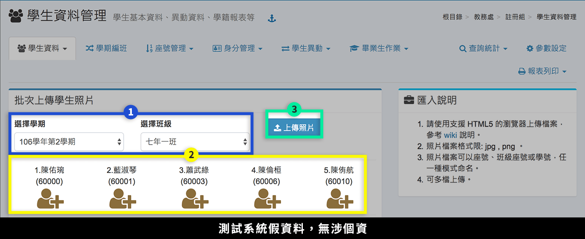

1. 選取**「學期選單」**及**「班級選單」**可以切換成不同學期的班級。
2. 班級學生照片一覽表，想要刪除已上傳照片，可點選照片的**「X」**按鈕。
3. 點選**「上傳照片」**按鈕，會跳出 **「上傳學生照片」**視窗，如下圖。

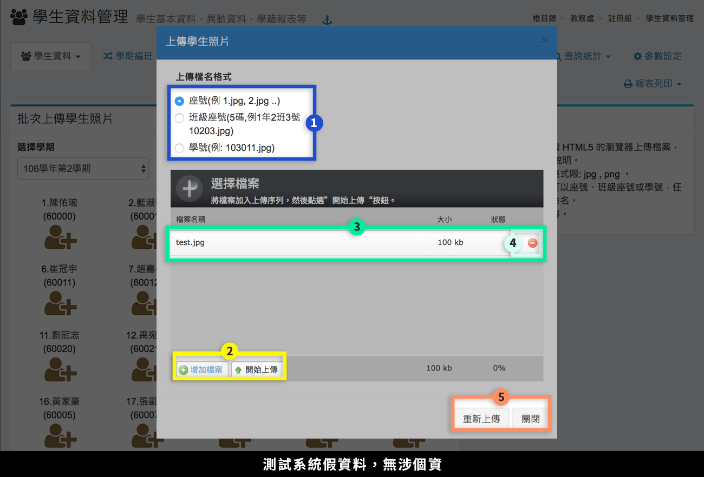

1. 批次上傳的照片檔，請依規定方式命名：座號、班級座號、學號，照片格式限制為 jpg 及 png。
2. 點選**「增加檔案」**按鈕後，從跳出的視窗選取要上傳的照片檔，將要上傳檔案增加到上傳序列中。點選**「開始上傳」**按鈕後，將**「上傳序列」**列表中的檔案上傳到系統資料庫。
3. 「上傳序列」列表，顯示目前已經選取的檔案。
4. 點選**「-」**按鈕，可將已選取的檔案從列表中刪除。
5. 按下**「重新上傳」** 按鈕，可直接**清空**「上傳序列」列表中的所有檔案。點選**「關閉」**按鈕，離開編修視窗。

### 姓名譯音轉換

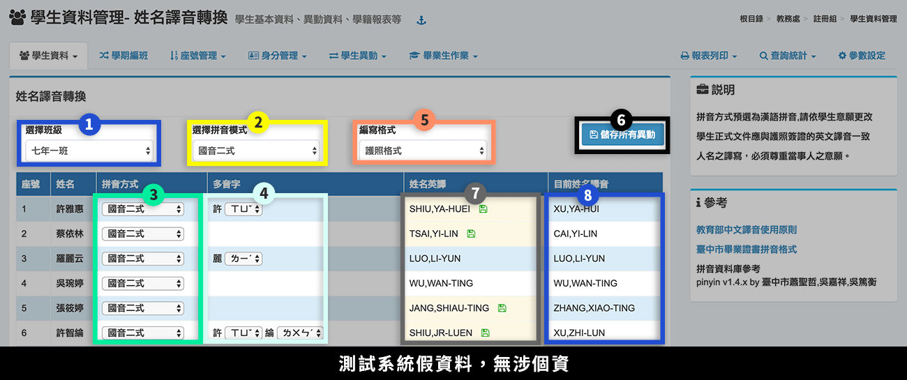

1. 選取**「班級選單」**可以切換班級。
2. 可設定全班**「拼音模式」**：漢語拼音、Wade-Giles 拼音國通用拼音、國音二式。
3. 可個別設定學生**「拼音模式」**：漢語拼音、Wade-Giles 拼音國通用拼音、國音二式。
4. 可選擇**多音字**的讀音。
5. 選擇**「編寫格式」**：護照格式、護照格式無 - 、護照格式 western、common format。
6. **「儲存所有異動」**，會將姓名英譯欄位資料，**全部寫入**系統資料庫中。
7. 若只要儲存部分學生的異動資料，可點選標示處的**「儲存」**圖示。該區塊會依據目前所選取的「拼音模式」、「編寫格式」顯示譯音轉換結果，若譯音結果「目前姓名譯音」不同，會以黃色背景進行標記。
8. **「目前姓名譯音」** 區塊，顯示目前資料庫中該班學生的譯音資料。

## 學期編班

### 學期編班


若是新學年度第一學期，請先操作此步驟，將學生升級後，再[「匯入新生資料」](sheng-liao-guan-li.md#ru-xin-sheng-liao)。




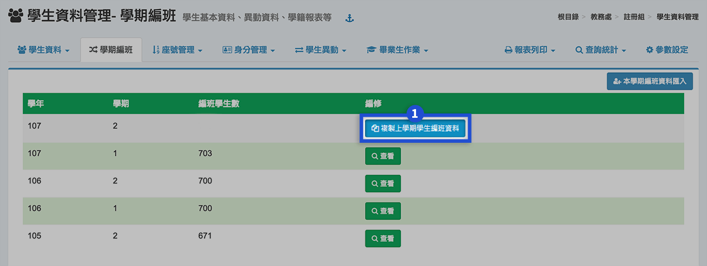

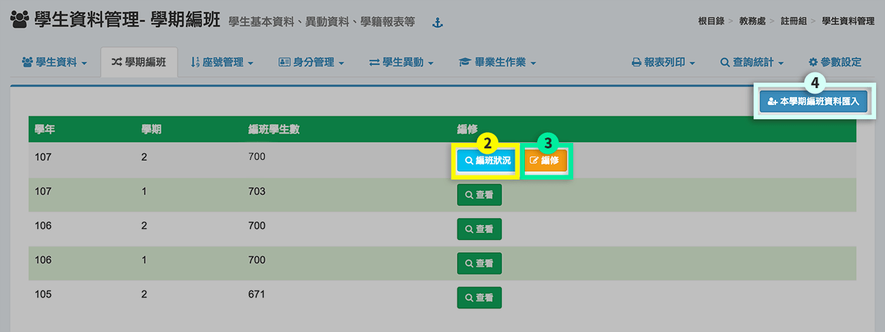

1. 按下**「複製上學期學生編班資料」**將學生從舊學期複製至新學期。若是新學年度第一學期，則會將學生的年級升級。
2. 按下 **「編班狀況」** 按鈕，可以檢視本學期的「學生人數統計表」，並提供列印功能。
3. 按下 **「編修」** 按鈕，可以進行同年級內學生的編班異動。 （參見下一頁籤說明）
4. 另可批次匯入編班資料，按下**「本學期編班資料匯入」**，下載系統提供的範例黨，編修完成後上傳即可。



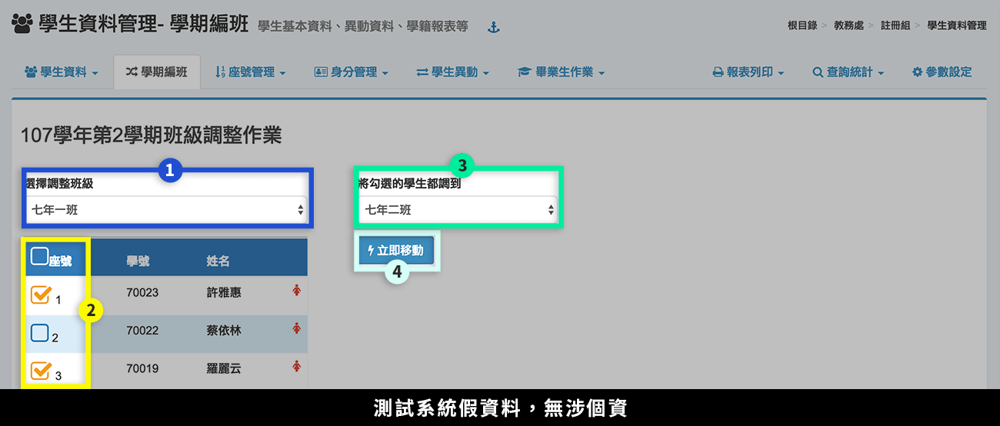

1. 點選 **「調整班級」** ，選擇要調整學生的班級。
2. 在該班級**「勾選」**要調整班級的學生。
3. 點選 **「調動的新班級」**。
4. 按下 **「立即移動」** 按鈕，可以將勾選的學生調到新班級。



### 亂數編班

### S 型編班


1. 請確認畢業生已完成[「畢業轉出」](sheng-liao-guan-li.md#bi-ye-zhuan-chu)。
2. 請確認已將學生升級：[「學期編班 &gt; 複製上學期學生編班資料」](sheng-liao-guan-li.md#xue-qi-bian-ban)。（系統時間需於新學期時間範圍才能點擊此功能按鈕）
3. 若欲於第二學期先產生編班檔，可先不進行上述兩步驟。




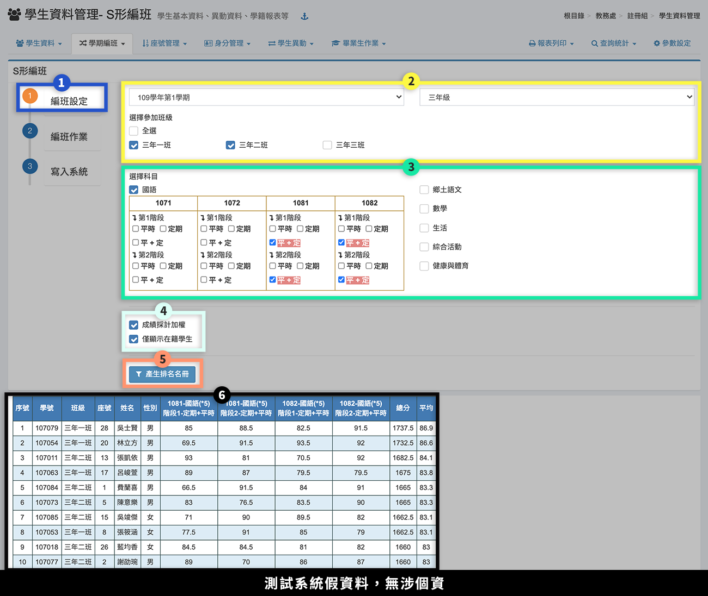

1. 點擊**「編班設定」**。
2. 選擇**「學期、年級、參加班級」**（不參加班級如：藝才班、特教班等）。
3. 選擇**「計算科目、成績」**。
4. 勾選**「是否採計加權、是否僅顯示在籍生」**。
5. 按下**「產生名冊」**。
6. 標示處顯示參與編班學生名冊。



#### 一、學生設定

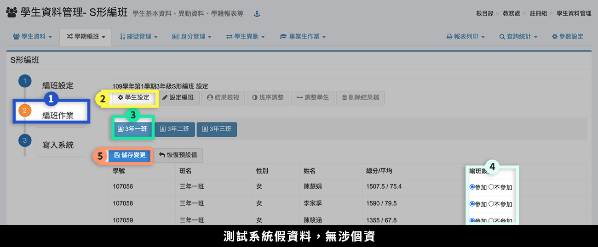

1. 按下**「編班作業」**。
2. 按下**「學生設定」**。
3. 選擇班級。
4. 可個別設定**「不參加」**編班之學生。
5. 按下**「儲存變更」**。

#### 二、設定編班

1. 按下**「設定編班」**。
2. 填入**「編班數」**並按下**「開始編班」**。

#### 三、結果檢視

1. 按下**「結果檢視」**。
2. 可查看**「未參加編班」**、**「有參加且完成編班之班級學生名單」**。

#### 四、班序調整

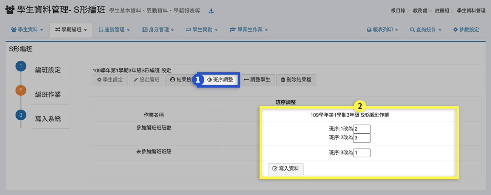

1. 按下**「班序調整」**。
2. 可變更班序，並按下**「寫入資料」**。

#### 五、調整學生

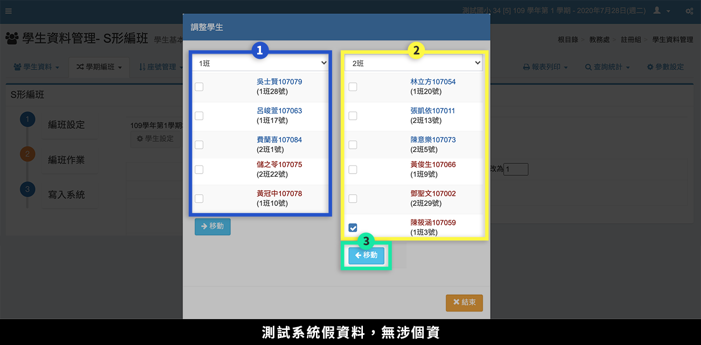

1. 選擇調整班級。
2. 勾選調整之學生。
3. 按下**「移動」**。




寫入系統前請再次確認編班資料，以及寫入之學期、年級，寫入後便無法回復。


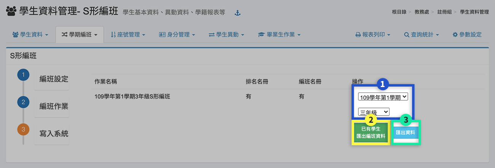

1. 選擇寫入**「學期、年級」**。
2. 匯出學期編班資料，將檔案轉存成 CSV 格式，於[「學期編班」](sheng-liao-guan-li.md#xue-qi-bian-ban-1)模組匯入該檔案。
3. 可**「匯出資料」**，供師生檢閱。



## 座號管理

### 座號管理

> 管理學生座號資料，本模組適合於學期初時配合編班使用，期中時不建議使用，以免影響其他資料的正確性。

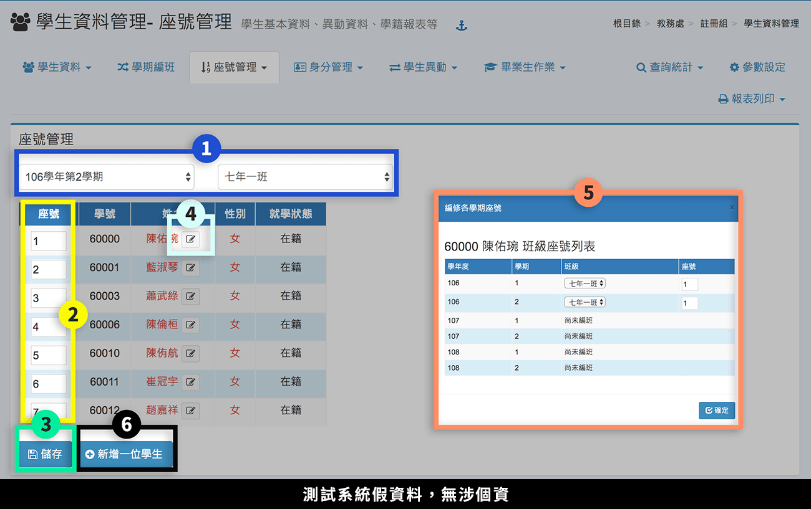

1. 選取 **「學期選單」** 及 **「班級選單」** 可以切換成不同學期的班級。
2. 在座號欄位中填入該生要變更的新座號。
3.  **「儲存」** 按鈕可將該班的學生座號儲存。
4. 點選學生姓名旁的編輯圖示，會彈出編輯視窗，如編號 5 標示處。
5. 在「編修各學期座號」視窗，可以清楚顯示該生自入學以來在學期的班級、座號，在欄位內修改資料後，按下確定即可以修改資料。
6. 點選 **「新增一位學生」** 按鈕，會跳出「新增一位學生到本班」視窗，在「輸入學生學號」欄位內填入要加入的學生學號，按下 **「查詢」** 按鈕，即可將該生加入到目前的班級，其預設座號為最後一號。

### 座號速編

> 提供整班座號快速編輯。

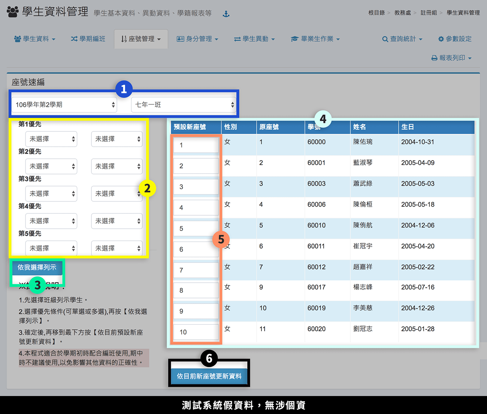

1. 選取 **「學期選單」** 及 **「班級選單」** 可以切換成不同學期的班級。
2. 輸入學生座號排序的**「優先順序」**，一次最多可以選擇 5 個排序條件，例如第 1 優先條件選擇「性別-由高至低」表示男生排在前面女生排在後面，第2優先條件選擇「生日-由高至低」，表示較晚出生的的學生排在前面，較早出生的學生排在後面。
3. 點選 **「依我選擇列示」** 按鈕，可以在區塊 4 預覽排序的結果。
4. 區塊 4 列出目前所選班級的座號及基本資料列表。
5. 區塊 5 的座號欄位表示目前的座號排序狀況，也可以直接在欄位上進行座號微調。
6. 點選 **「依目前新座號更新資料」** 按鈕，表示將會依照區塊 5 的座號欄位，將學生的座號重新調整。

### 學期座號對應

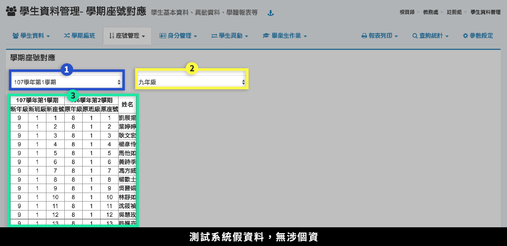

1. 選擇學期。
2. 選擇對應年級。
3. 系統會列出所選年級的學生，所選學期和前一學期的班級、座號對應。

## 身分管理

### 家庭狀況管理

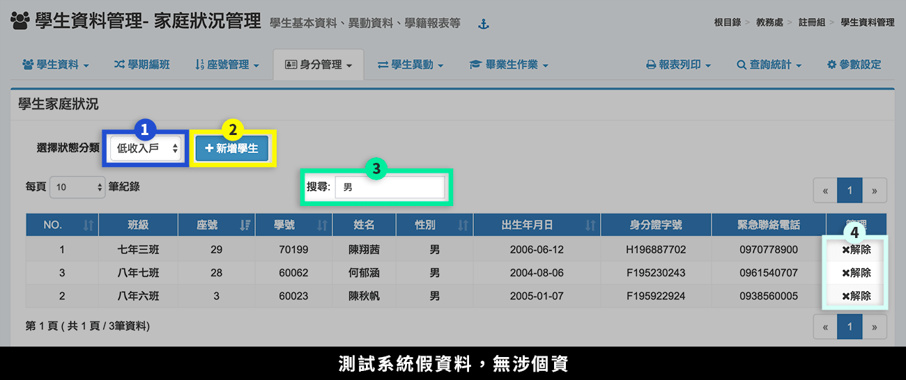

1. 選擇**「低收入戶類別」**。
2. 按下**「新增學生」**。
3. 可在搜尋欄位輸入「班級、座號、學號、姓名、性別、出生年月日、身分證字號、緊急聯絡電話」的部分關鍵字，來查找學生資料。
4. 按下**「x 解除」**可移除該生身分別。

### 原住民管理

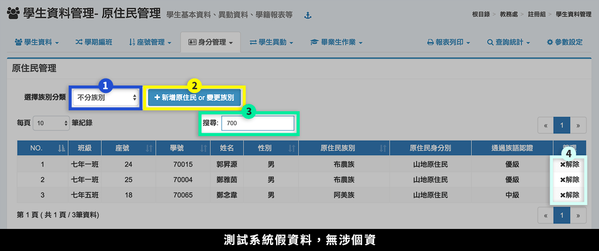

1. 選擇**「原住民族別」**。
2. 按下**「新增原住民 or 變更族別」**。
3. 可在搜尋欄位輸入「班級、座號、學號、姓名、性別、原住民族別、原住民身分別、通過族語認證」的部分關鍵字，來查找學生資料。
4. 按下**「x 解除」**可移除該生身分別。

### 身分別管理

1. 選擇**「身分別」**，如：本人身障、家長身障、功勳子女......等。
2. 按下**「新增學生」**。
3. 可在搜尋欄位輸入「班級、座號、學號、姓名、性別、出生年月日、身分證字號、緊急聯絡電話」的部分關鍵字，來查找學生資料。
4. 按下**「x 解除」**可移除該生身分別。

### 身分別-子類別設定及統計



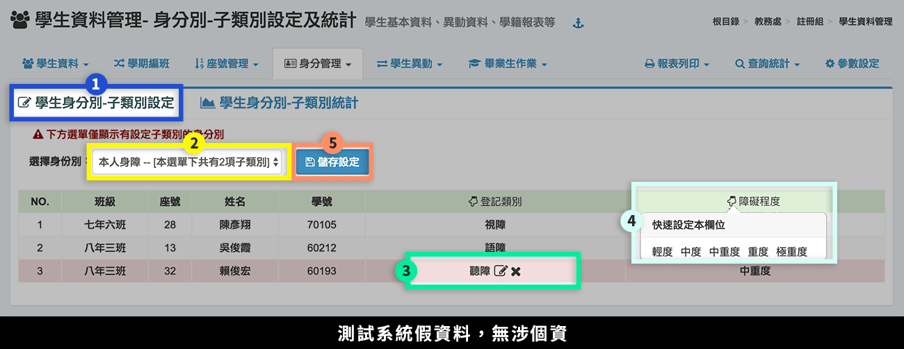

1. 選擇**「學生身分別-子類別設定」**。
2. 選取**「身分別」**清單，可以顯示不同身分別的所有學生。
3. **滑鼠移至要編輯的欄位**，畫面會出現**「編輯」**或**「刪除」**按鈕，按下即可設定類別。
4. 點擊標題欄位的**「手指圖示」**，可快速將所有學生**設成一致的類別**。
5. 當所有身分別子類別均已選好後，點選**「儲存設定」**按鈕，可以將所有異動的子類別設定儲存。



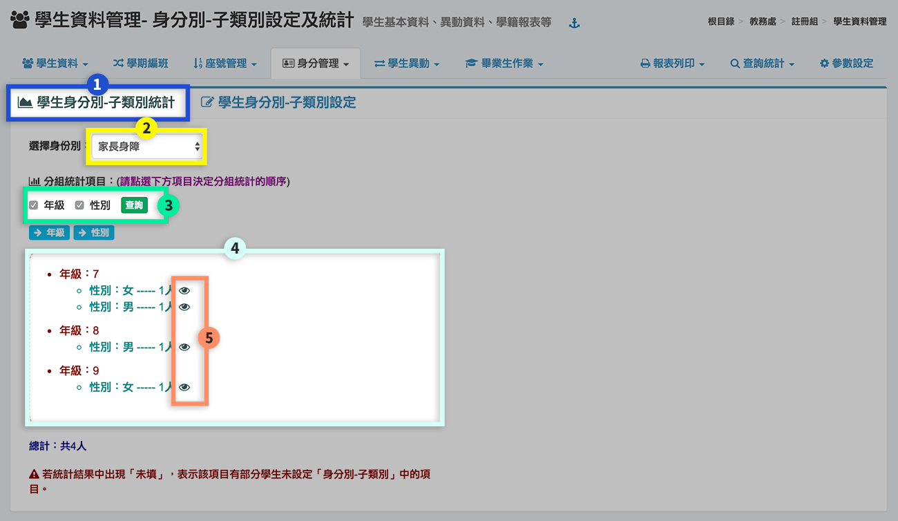

1. 選擇**「學生身分別-子類別統計」**。
2. 選擇**「身分別清單」**。
3. 勾選**「統計項目」**。
4. 標示處呈現統計結果。
5. 按下**眼睛**圖示，可查看學生名單。



### 身分別-子類別選項管理

> 可編輯預設身分別的子類別項目，以及自訂校端身分別與子類別項目。

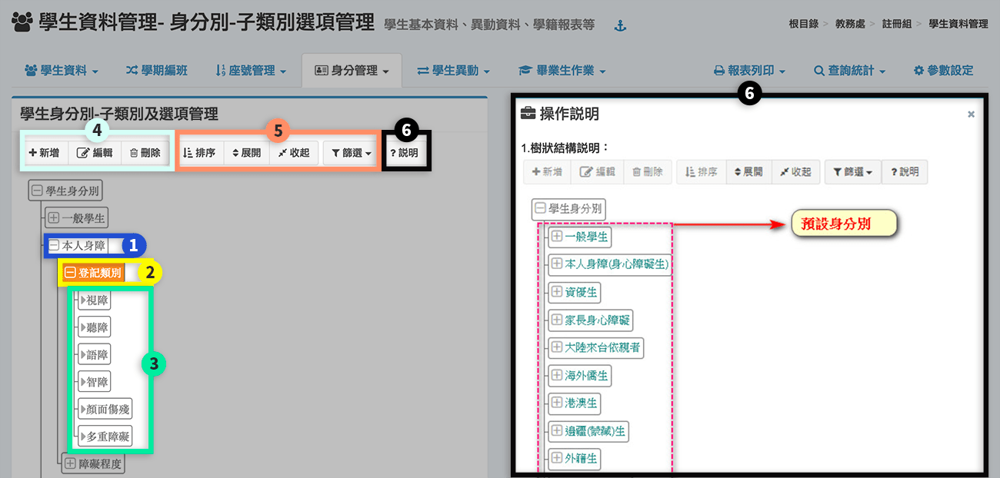

1. 標示處為**「身分別」**。
2. 標示處為**「子類別」**，當點擊到時，會呈現**橘色**，表示可操作編輯（第 4 步驟）。
3. 標示處為**「子類別下的選項」**（必須設定到此選項，才能進行身分子類別的註記）。
4. 點擊樹狀圖中要編輯的項目（呈現橘色），可在標示處**「新增、編輯、刪除子類別或項目」**。
5. 點擊樹狀圖中要編輯的項目（呈現橘色），可針對該項目下的項目**「調整排序」**。按下**「展開**、**收起」**，可調整樹狀圖呈現狀態。按下**「篩選」**，可選擇要呈現的身分別。
6. 點選工具列上的**「說明」**按鈕，右方會顯示樹狀結構的說明，提供參考。

### 學生身分別清冊

> 可自由勾選身分別項目，輸出學生身分別清冊。

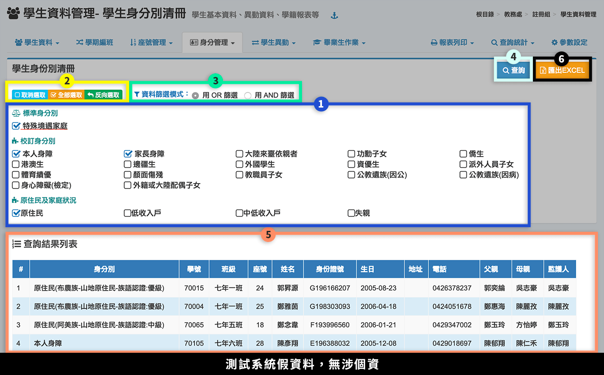

1. 勾選要輸出清冊的**「身分別項目」**。
2. 可選擇**「取消選取」**、**「全部選取」**、**「反向選取」**。
3. 選擇**「資料篩選方式」**：OR 為勾選身分別的聯集（有一身分別符合即列出），AND 為勾選身分別的交集（必須符合所有勾選身分別者才列出）。
4. 按下**「查詢」**。
5. **查詢結果**顯示在標示處。
6. 按下**「匯出 Excel」**匯出清冊。

## 學生異動

### 轉入



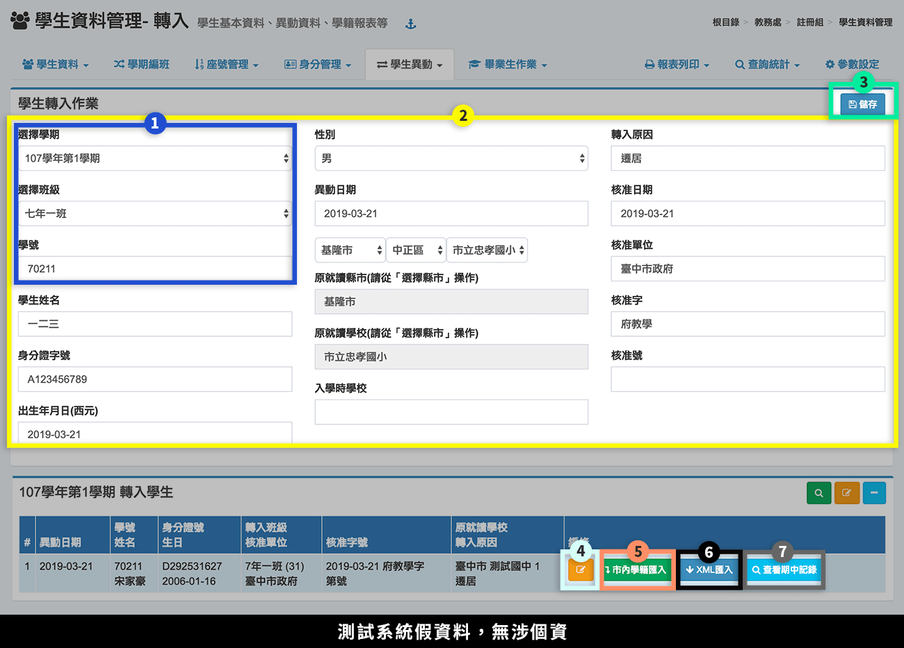

1. 選取**「學期選單」**、**「選擇班級」**，系統會找出該年級最後一個學號，並 +1 號作為轉入生學號。
2. 填入轉入生**「基本資料」**，若該生原就讀學校不在選單裡，請在縣市選單選擇「其他」，即可編輯縣市、學校名稱。
3. **「儲存」**轉入生資料，儲存後該筆資料會顯示在編輯轉入作業區的下方。
4. 在轉入列表中，按下**「編輯」**圖示，可編修該筆異動紀錄。
5. 若轉入生原就讀學校位在本縣市，請點選**「市內學籍匯入」**，操作說明請參考下一頁籤。
6. 若轉入生原就讀學校位在其他縣市，且該縣市學籍交換規格標準為 3.0 版本，請使用**「XML匯入」**。
7. 匯入學生學籍後，可**「查看期中紀錄」**。


* 目前本系統的學籍資料格式是遵照教育部頒布的 [交換規格標準 4.0 ](http://www.ffjh.tyc.edu.tw/FileUpload/epaper/105%E6%95%99%E8%82%B2%E9%83%A8%E5%9C%8B%E6%B0%91%E4%B8%AD%E5%B0%8F%E5%AD%B8%E5%AD%B8%E7%94%9F%E5%AD%B8%E7%B1%8D%E4%BA%A4%E6%8F%9B%E8%A6%8F%E6%A0%BC%E6%A8%99%E6%BA%964.0%E7%89%88.pdf) 所設計，我們支援 SFS3 所匯出之 XML [3.0 學籍格式](http://www.sfs.project.edu.tw/download/DataChangeSpec3.0.pdf)，因此外縣市轉入生所提供的 XML 檔案若非 3.0 標準則無法匯入。
* 本系統不支援 2.0 暨以下版本，需要由校端手動補登學生的資料。




在轉入作業按下**「市內學籍匯入」**，會彈出下列視窗。

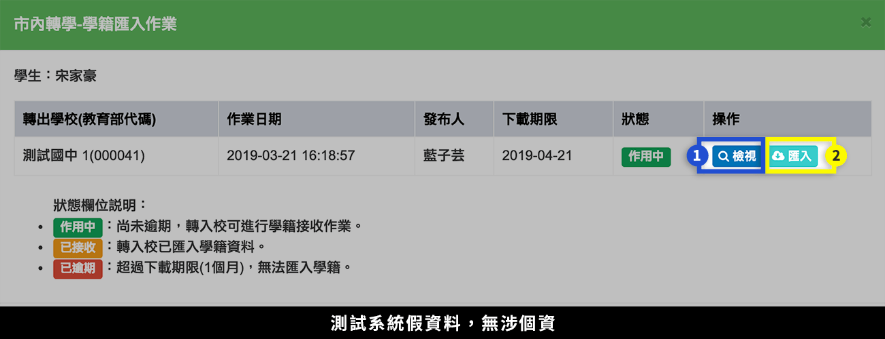

1. 按下**「檢視」**，可查看學生學籍 json 檔。
2. 按下**「匯入」**，將學生他校紀錄匯至本校。


若無顯示檔案可接收，  
1. 請確認學生在轉入作業編輯時，身分證是否輸入正確。  
2. 請確認對方學校是否匯出學籍資料。




一般轉入作業流程請參考下圖，詳細作業規定因各校有所差異，請遵照各校規範。

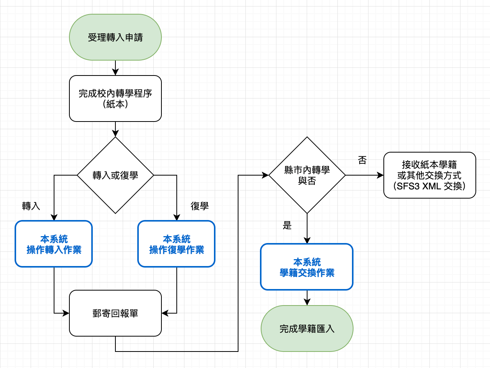



### 調出



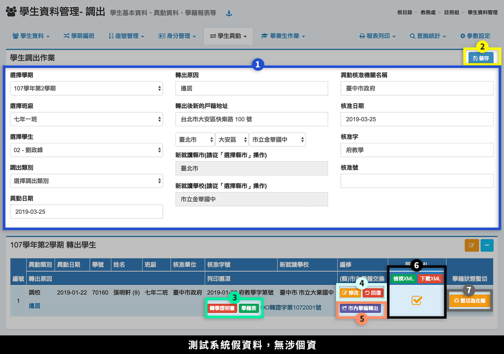

1. 填入調出生**「基本資料」**，若該生新就讀學校不在選單裡，請在縣市選單選擇「其他」，即可編輯縣市、學校名稱。
2. **「儲存」**調出生資料，儲存後該筆資料會顯示在編輯調出作業區的下方。
3. 在調出列表中，可下載**「轉學證明書」**、**「學籍表」**。
4. 在調出列表中，可**「編輯」**該筆異動紀錄，或**「回復」**該筆紀錄，即取消調出。
5. 若調出生新就讀學校位在本縣市，請點選**「市內學籍匯出」**，操作說明請參考下一頁籤。
6. 若調出生新就讀學校位在其他縣市，且該縣市學籍交換規格標準為 3.0 版本，請**「下載 XML」**，並傳送給對方學校註冊組。
7. 欲查看調出生在本校的任何紀錄，可按下**「暫切為在籍」**，操作完畢請務必**「回復為調校」**。



在調出作業按下**「市內學籍匯出」**，會彈出下列視窗。

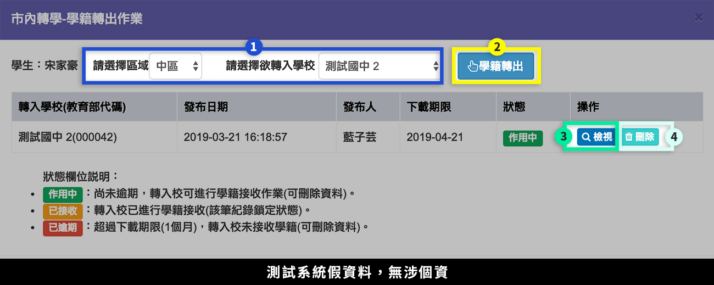

1. 選擇調出生新就讀學校區域、學校名稱。
2. 按下**「學籍匯出」**。
3. 按下**「檢視」**，可查看學生學籍 json 檔。
4. 在對方學校未接收學籍前，可按下**「刪除」**。


如對方學校已接收學籍資料檔，學生在本校仍有資料更新，請重新操作匯出作業，然後請對方學校再接收一次。




一般調出作業流程請參考下圖，詳細作業規定因各校有所差異，請遵照各校規範。

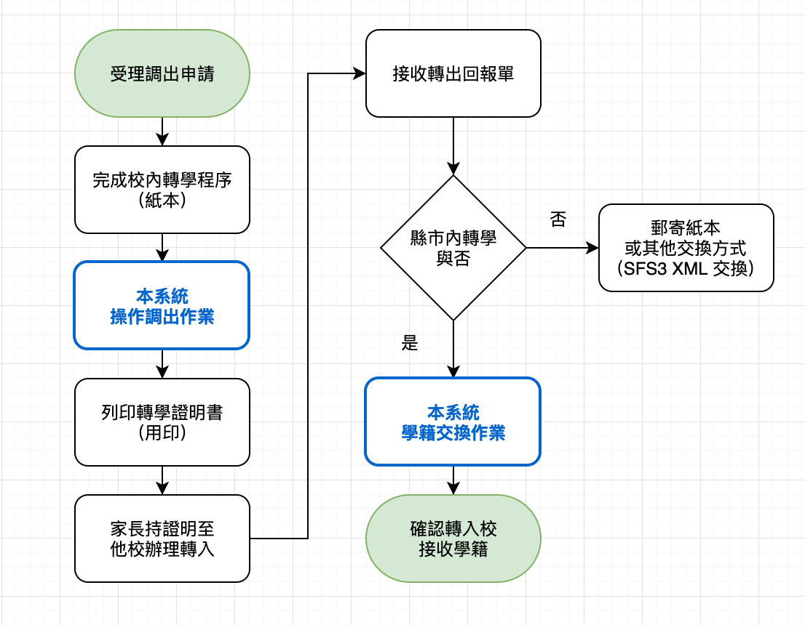



### 復學

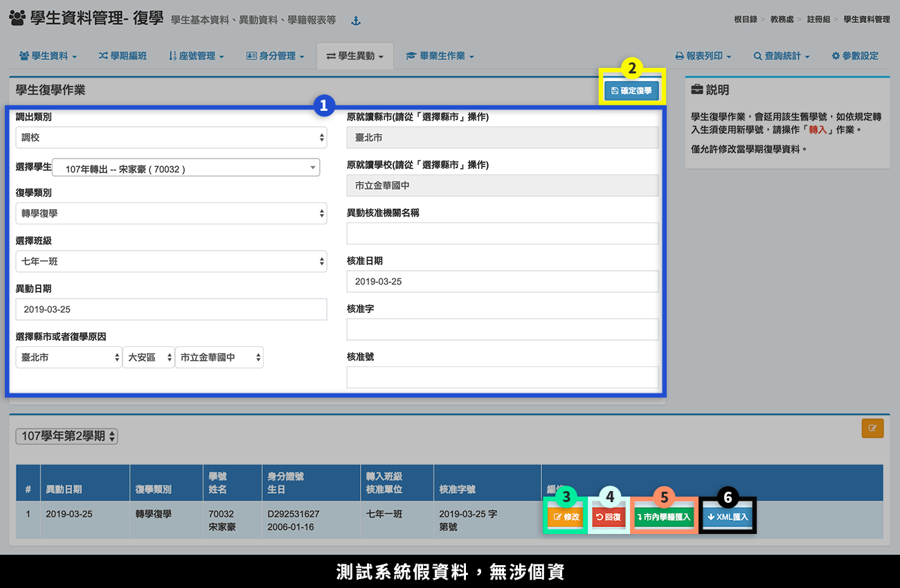

1. 填入復學生**「基本資料」**。
2. 按下**「確定復學」**，可以曾經本校就學過的學生復學。
3. 在復學生列表中，可點選**「修改」**編輯異動紀錄。
4. 按下**「回復」**按鈕，可以取消該生的復學紀錄。
5. 若由本縣市內學校轉入的復學生，可按下**「市內學籍匯入」**（對方學校須先完成調出作業，並匯出學生學籍，本校才能接收）。
6. 按下**「XML 匯入」**按鈕，可以上傳「XML 學籍交換格式」檔案，匯入該生資料。

### 新生入學

> 依據報府核准文號，記錄新生進入本校日期及核定情形的異動紀錄。

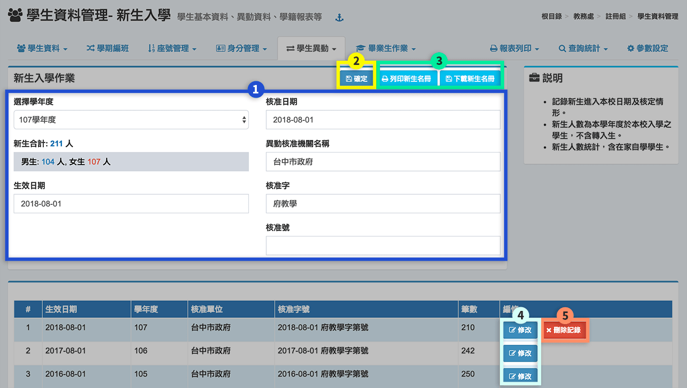

1. 填入的新生入學**「基本資料」**欄位。
2. 按下**「確定」** 按鈕，可以儲存本學年度新生入學資料。
3. 按下**「列印新生名冊」**，會彈出列印預覽視窗；按下**「下載新生名冊」**可下載新生資料 Word 檔。
4. 按下**「修改」**按鈕，可在區塊 1 載入要編修的學年度（亦可直接在區塊 1 選擇要編修的年度），填入修改資料按下「確定」按鈕，可以修改該學年度核定資料。
5. 按下**「刪除紀錄」**按鈕，可以刪除該學年度核定資料。僅當學年度資料可以被刪除，其餘歷年的資料僅能修改不能刪除。


新生人數為本學年度在本校入學的學生數，也就是本校操作「匯入新生」的數量，不含轉入生。


### 畢業轉出

> 畢業生轉出記錄及核定情形。

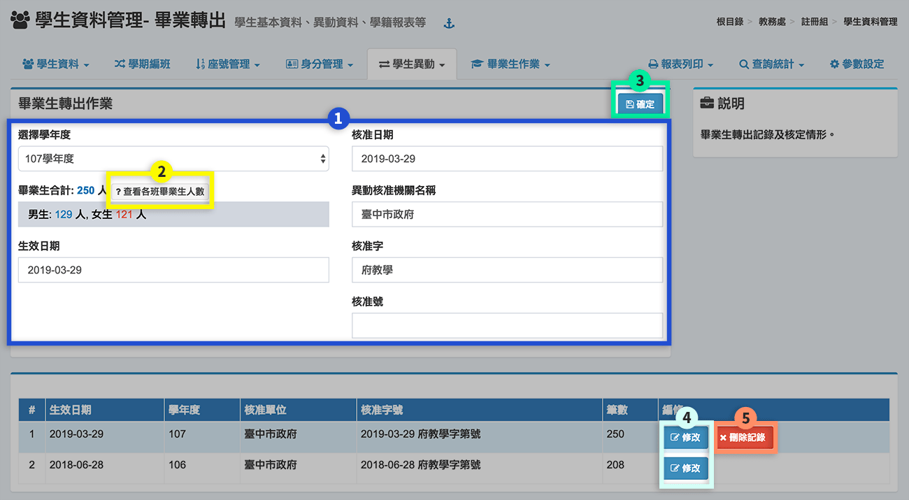

1. 填入的畢業轉出**「基本資料」**欄位。
2. 可按下**「查看各班畢業生人數」**，確認人數是否正確。
3. 按下**「確定」** 按鈕，可以儲存本學年度畢業轉出資料。
4. 按下**「修改」**按鈕，可在區塊 1 載入要編修的學年度（亦可直接在區塊 1 選擇要編修的年度），填入修改資料按下「確定」按鈕，可以修改該學年度核定資料。
5. 按下**「刪除紀錄」**按鈕，可以刪除該學年度核定資料。僅當學年度資料可以被刪除，其餘歷年的資料僅能修改不能刪除。

### 在家自學

> 設定在家自學學生。

1. 選擇**「班級、學生」**。
2. 按下**「確定在家自學」**。
3. 要將學生取消在家自學設定，可在列表中按下**「移除」**。

### 轉入生資料補登

> 轉入生若無法匯入完整學籍，請在補登項目中補登紀錄。



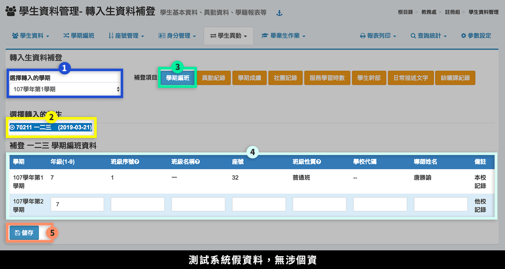

1. 選取轉入生的**「轉入學期」**。
2. 選擇該學期要補登的**「轉入生」**。
3. 選擇補登項目**「學期編班」**。
4. 在欄位內填入該轉入生在他校就讀時，各個年段的編班情形，如班級名稱、座號、導師姓名等。
5. 按下**「儲存」**按鈕，儲存補登資料。選取轉入生的**「轉入學期」**。



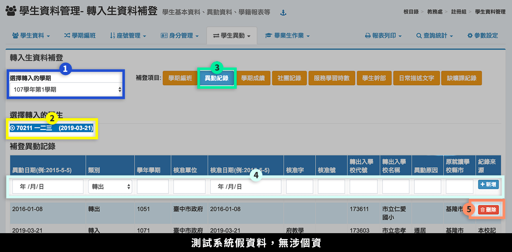

1. 選擇該學期要補登的**「轉入生」**。
2. 選擇補登項目**「異動紀錄」**。
3. 在欄位內填入該轉入生的異動紀錄，按下**「新增」**。
4. 可**「刪除」**補登的異動紀錄。



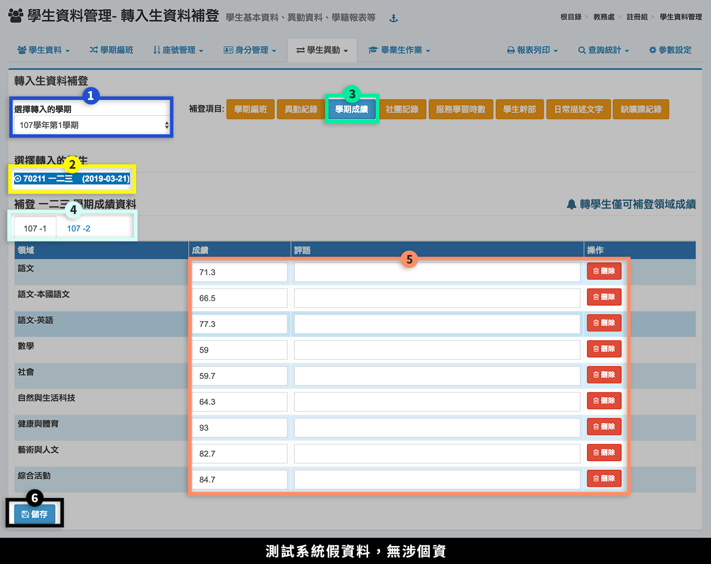

1. 選取轉入生的**「轉入學期」**。
2. 選擇該學期要補登的**「轉入生」**。
3. 選擇補登項目**「學期成績」**。
4. 選擇補登成績之**「學期」**。
5. 在欄位內填入該轉入生的學期成績。
6. 按下**「儲存」**，儲存補登的成績紀錄。


* 依教育部公布的學籍交換規格標準，學籍成績僅交換「領域成績」。
* 若於舊系統（SFS3）辦理轉入的學生，有出現**學籍成績錯誤**情形，是因為 SFS3 允許將轉入生成績補登於分科成績中，請依照下圖步驟刪除分科成績。若轉入生的學籍成績紀錄表成績無誤，則毋須任何操作。


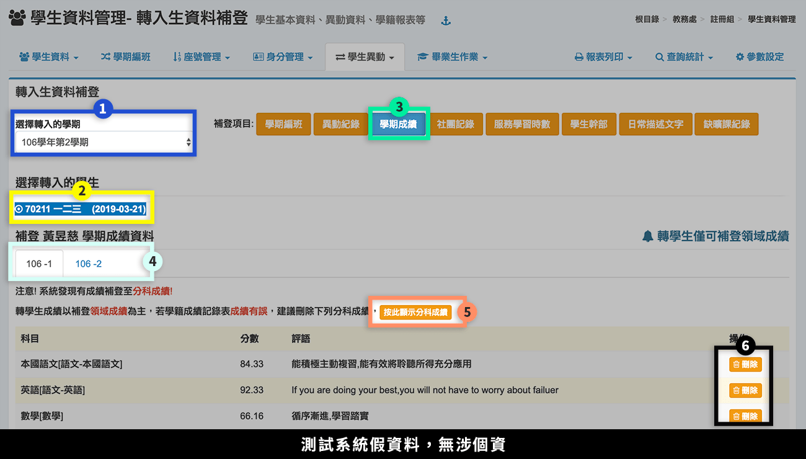

1. 選取轉入生的**「轉入學期」**。
2. 選擇該學期要補登的**「轉入生」**。
3. 選擇補登項目**「學期成績」**。
4. 選擇學籍成績紀錄表中，錯誤成績之**「學期」**。
5. 按下**「按此顯示分科成績」**。
6. 將錯誤成績**「刪除」**，並在此介面補上正確的領域成績。




補登轉入生的社團紀錄，也可以在學務處 [學校社團管理&gt;補登資料](../undefined/xiao-she-guan-li.md#deng-liao) 操作。


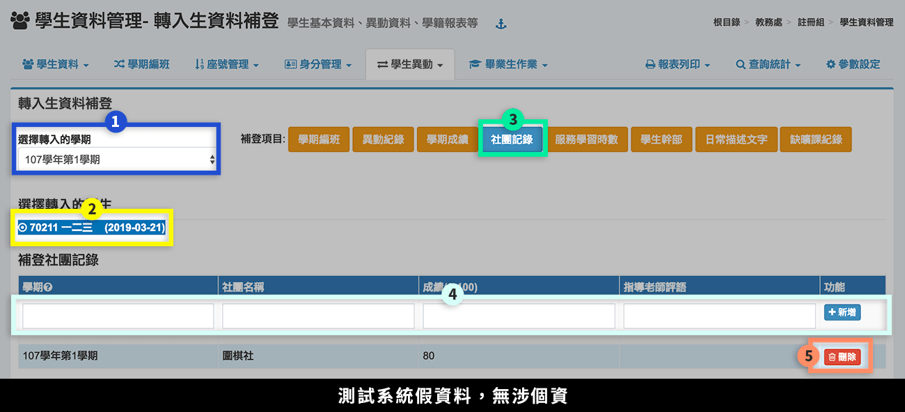

1. 選取轉入生的**「轉入學期」**。
2. 選擇該學期要補登的**「轉入生」**。
3. 選擇補登項目**「社團紀錄」**。
4. 在欄位內填入該轉入生的社團紀錄，按下**「新增」**。
5. 可**「刪除」**補登的社團紀錄。




補登轉入生的服務學習時數，也可以在學務處 [學生服務學習&gt;轉學生資料補登](../undefined/sheng-fu.md#sheng-liao-deng) 操作。


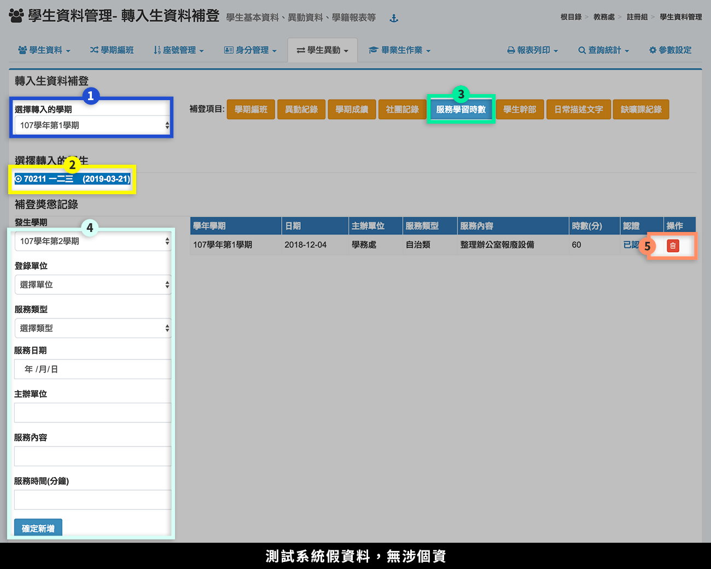

1. 選取轉入生的**「轉入學期」**。
2. 選擇該學期要補登的**「轉入生」**。
3. 選擇補登項目**「服務學習時數」**。
4. 在欄位內填入該轉入生的服務學習紀錄，按下**「確定新增」**。
5. 可**「刪除」**補登的服務學習紀錄。




補登轉入生的幹部紀錄，也可以在學務處 [學生幹部&gt;幹部補登](../undefined/sheng-bu.md#bu-deng) 操作。


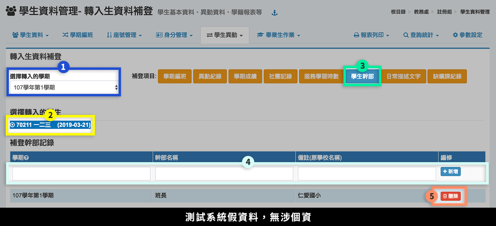

1. 選取轉入生的**「轉入學期」**。
2. 選擇該學期要補登的**「轉入生」**。
3. 選擇補登項目**「學生幹部」**。
4. 在欄位內填入該轉入生的幹部紀錄，按下**「新增」**。
5. 可**「刪除」**補登的幹部紀錄。



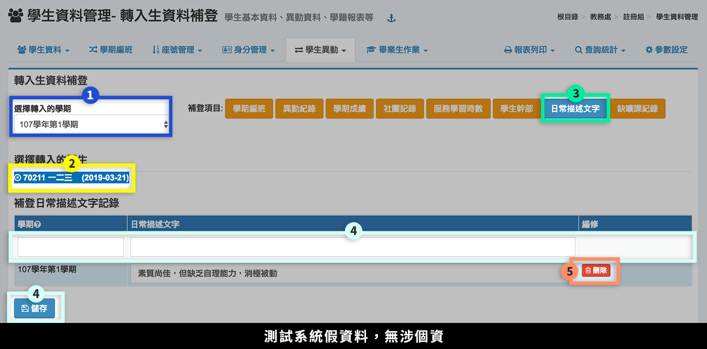

1. 選取轉入生的**「轉入學期」**。
2. 選擇該學期要補登的**「轉入生」**。
3. 選擇補登項目**「日常描述文字」**。
4. 在欄位內填入該轉入生的日常描述文字，按下**「儲存」**。
5. 可**「刪除」**補登的日常描述文字。




補登轉入生的缺曠課紀錄，也可以在學務處 [缺曠課管理&gt;轉入生資料補登](../undefined/que-guan-li.md#ru-sheng-liao-deng) 操作。


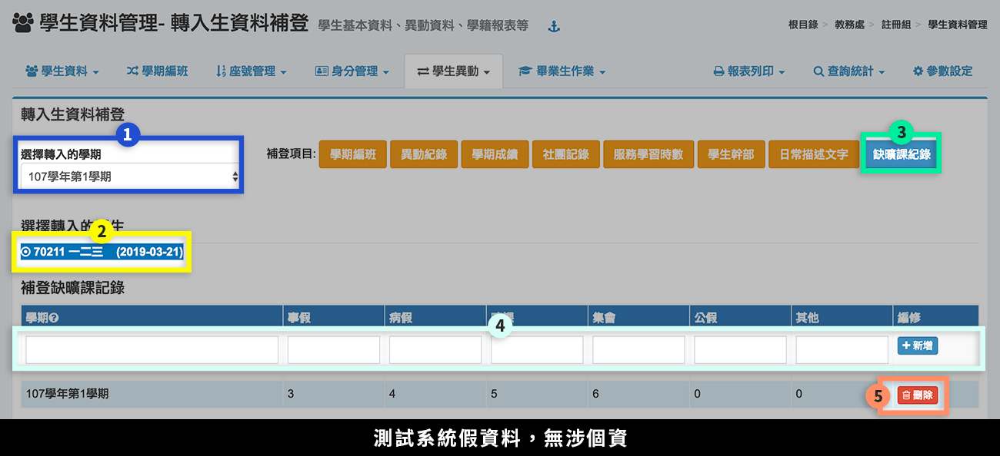

1. 選取轉入生的**「轉入學期」**。
2. 選擇該學期要補登的**「轉入生」**。
3. 選擇補登項目**「缺曠課紀錄」**。
4. 在欄位內填入該轉入生每學期各種假別的缺曠紀錄，按下**「新增」**。
5. 可**「刪除」**補登的幹部紀錄。



### 異動記錄列表

> 查詢及列印所有異動紀錄。

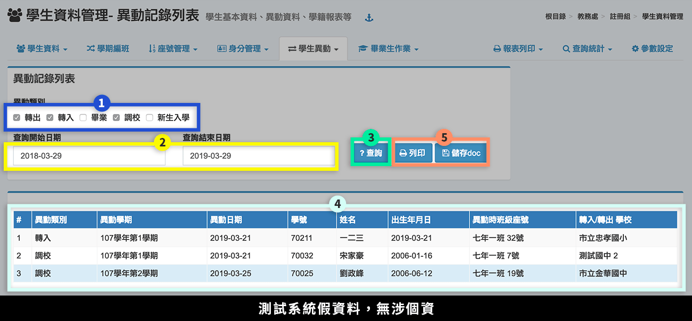

1. 勾選要查詢的**「異動類別」**。
2. 選擇查詢**「日期之起訖」**。
3. 按下**「查詢」**按鈕。
4. 區塊 4 顯示查詢結果。
5. 可**「列印」**或**「儲存」**查詢的異動紀錄。

### 異動統計表

> 列出選擇學期所有異動報表。

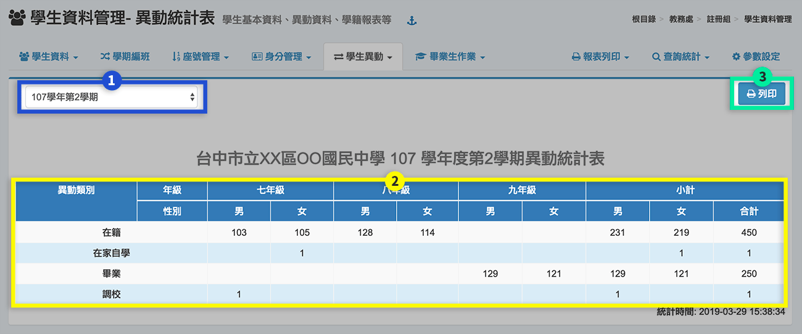

1. 選擇查詢的**「學期」**。
2. 列出所選學期的所有異動資料統計表。
3. 按下**「列印」**按鈕，列印異動統計資料。

## 畢業生作業

### 畢業生一覽表




要開啟或關閉舊學年畢業生作業，請至 [參數設定](sheng-liao-guan-li.md#ding) 操作。


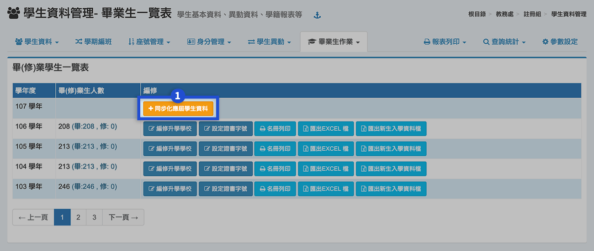

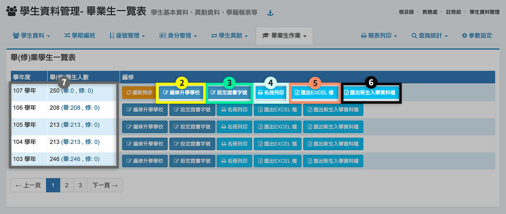

1. 在尚未操作畢業生的學期，按下**「同步化應屆學生資料」**。
2. 按下**「編修升學學校」**按鈕，切到編修升學學校頁面，參考下一頁籤。
3. 按下**「設定證書字號」**按鈕，切換到畢業書字號設定頁面，參考第三頁籤。
4. 按下**「名冊列印」**按鈕，顯示列印畢業生名冊視窗，參考第四頁籤。
5. 按下**「匯出CSV檔」**按鈕，即可匯出畢業證書列印用 CSV 檔案。（印製畢業證書用）
6. 按下**「 匯出新生入學資料檔」**按鈕，即可匯出提供學區內國中新生編班用 CSV 檔案。（供學區國中新生編班匯入用）
7. 標示處顯示各個學年度畢\(修\)業學生人數統計。



在畢業生一覽表頁面，按下**「編修升學學校」**，會跳至下方頁面。

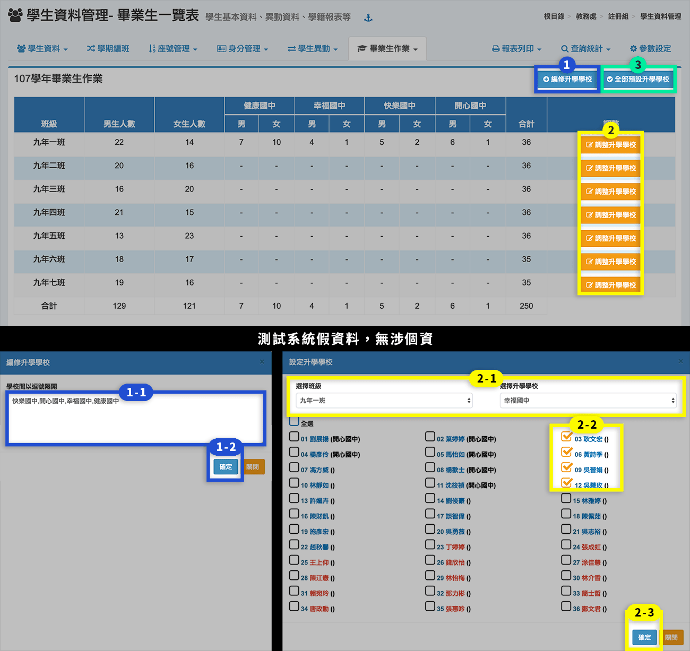

1. 按下**「編修升學學校」**按鈕，會彈出左下視窗。

   1-1. 輸入升學國中名稱，並以逗號隔開（不需空格）。  
   1-2. 按下「確定」，儲存升學學校名稱。

2. 按下**「調整升學學校」**，可針對各班學生狀況進行編修。

   2-1. 選擇班級與升學學校。（一次僅能設定同班級學生，若切換班級，則不會儲存上一班級選取的學生）  
   2-2. 勾選該班學生。  
   2-3. 按下「確定」，儲存學生升學學校設定。

3. 按下**「全部預設升學學校」**，可將全年級學生設定至一樣的升學學校。



在畢業生一覽表頁面，按下**「設定證書字號」**，會跳至下方頁面。

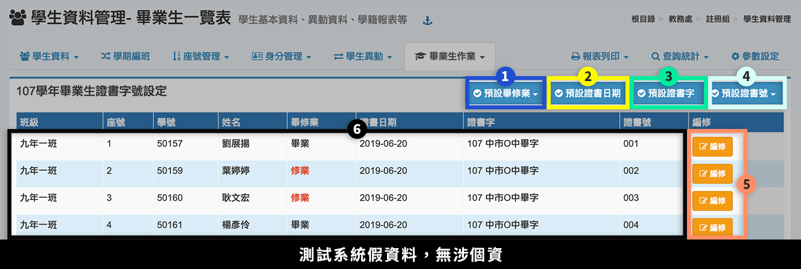

1. 按下**「預設畢修業」** 選單，可以選擇**「全部設為畢業」**、**「全部設為修業」**或**「清除畢修業設定」**。
2. 按下**「預設證書日期」**按鈕，在快顯示視窗中，可以設定全部應屆畢業生的證書日期。
3. 按下**「預設證書字」**按鈕，在快顯示視窗中，可以設定全部應屆畢業生的證書字。
4. 按下**「預設證書號」**選單，可以選擇**「依學號排序設定」**或**「依班級座號排序設定」**，決定證書流水號的排序方式。
5. 按下**「編修」**按鈕，在快顯示視窗中，可以針對個別學生設定其畢業證書相關屬性。
6. 標示處顯示該學年度應屆畢業生證書字號設定狀況。



名冊列印在畢業生一覽表頁面，按下**「編修升學學校」**，會彈出下方視窗。

1. 可以依照升學學校，選擇「班級」、「升學學校」，列印畢業生名冊給學區國中。
2. 可以列印給教育局的畢業生名冊。



### 學籍成績結算

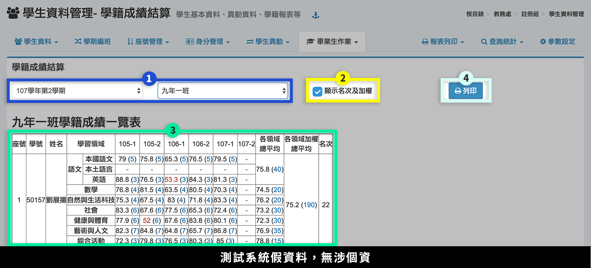

1. 選擇**「學期」**、**「班級」**。
2. 勾選**「顯示名次及加權」**選項，可在畢業成績列表中顯示名次及加權。
3. 標示處顯示所選班級的畢業成績。
4. 按下**「列印」**按鈕，可以列印所選班級的畢業成績。

### 畢業條件篩選

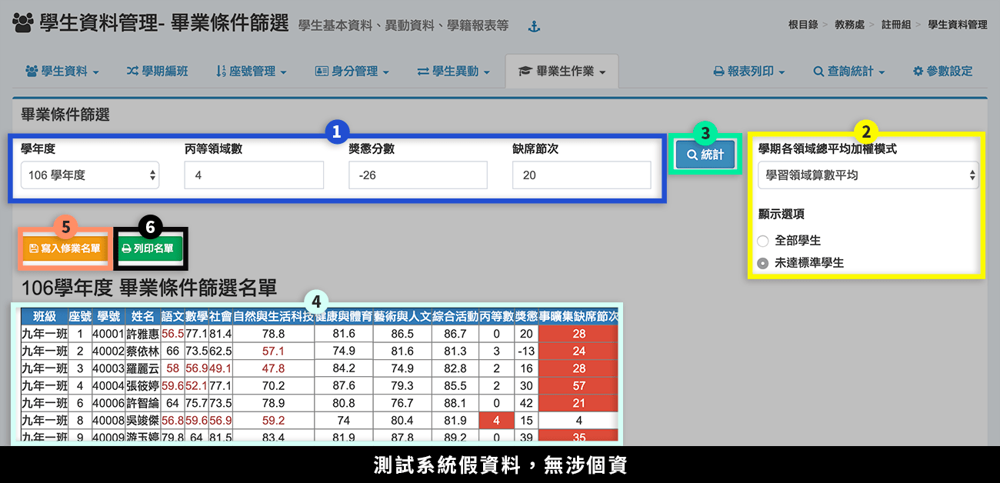

1. 選擇要篩選之  
   **「學年度」**：本功能只提供計算最近之三學年度，如果沒有出現目前之學年度，請於 [畢業生一覽表](sheng-liao-guan-li.md#sheng-yi-biao) 同步化應屆學生資料，將學生名單匯入畢業生資料。

   **「丙等領域數」**：可畢業之最低丙等領域數，如四領域為丙等不達畢業條件，就輸入4。  
   **「獎懲分數」**：可畢業之獎懲最低分數，如三大過為 -27分不達畢業條件，則輸入 -26。  
   **「缺席節次」**：可畢業之缺勤最多節次。

2. 選擇**「領域分數計算方式」**，以及**「顯示選項」**。
3. 按下**「統計」**按鈕，系統會開始計算
4. 標示處顯示統計結果。
5. 可將篩選出未達畢業條件之學生**「寫入修業名單」**。
6. 按下**「列印名單」**，列印篩選結果。

### 修業建議名單

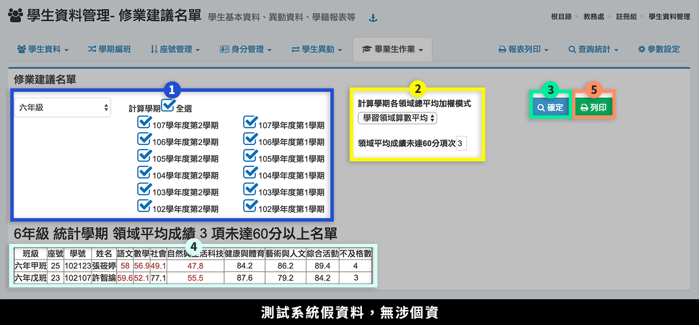

1. 選擇**「年級」**，以及要統計的**「學期」**，本功能只提供計算目前在校學生。
2. 選擇**「領域分數計算方式」**，以及要篩選之**「不及格領域數」**。
3. 按下**「確定」**按鈕。
4. 標示處可以列出符合條件的名單。
5. 按下**「列印」**，列印篩選結果。

### 畢業生成績試算

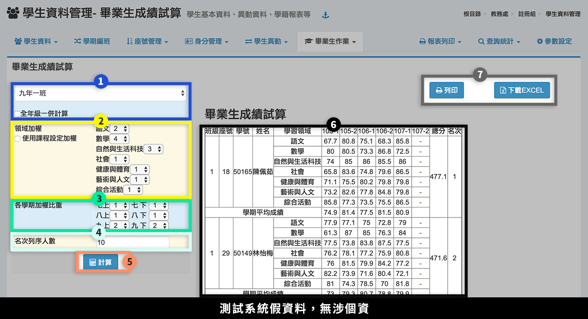

1. 選擇要計算的**「班級」**，或勾選**「全年級一併計算」**。
2. 選擇各**「領域加權」**，或勾選**「使用用課程設定加權」**數值（勾選後，系統會直接運算課程加權分數，不須另外選擇右側科目權重欄位）。
3. 選擇各**「學期加權比重」**。
4. 填入**「名次列印名數」**。
5. 按下**「計算」**。
6. 標示處顯示試算結果。
7. 可**「列印」**，或**「下載 Excel」**檔案。


「領域加權」、「學期加權比重」的預設值，可至 [參數設定](sheng-liao-guan-li.md#ding) 調整。


## 報表列印

### 學籍成績記錄表

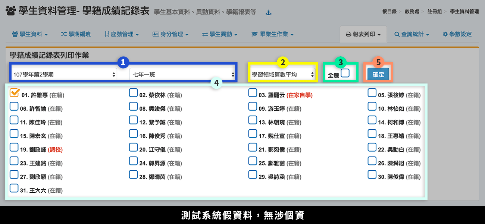

1. 選擇**「學期」**、**「班級」**。
2. 選擇**「成績平均計算方式」**。
3. 勾選**「全選」**選項，可以快速選取全班的學生。
4. 標示處列出所選班級的名單，可以從名單中勾選要列印的學生。
5. 按下**「確定」**按鈕，以開新頁面方式列印所選學生的學籍紀錄。

### 輔導記錄表

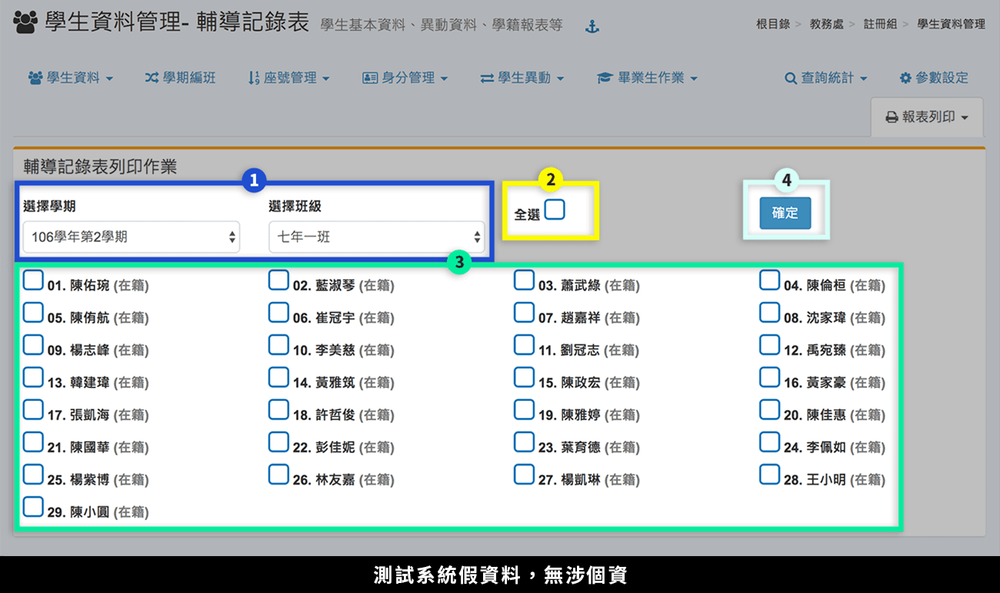

1. 選擇**「學期」**、**「班級」**。
2. 勾選**「全選」**選項，可以快速選取全班的學生。
3. 標示處列出所選班級的名單，可以從名單中勾選要列印的學生。
4. 按下**「確定」** 按鈕，以開新頁面方式列印所選學生的輔導記錄表。

### 名冊輸出

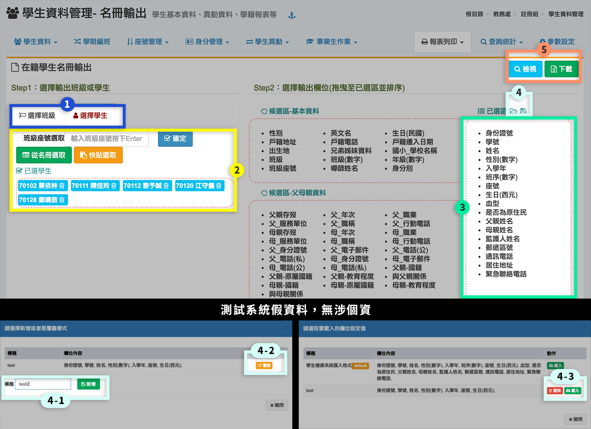

1. 選擇輸出**「班級」**或**「學生」**。
2. 若是選擇學生，有輸入**座號選取**、**從名冊選取**、**快貼選取**三種方式，已選擇的學生姓名會呈現在標示處下方。
3. 將「後選區的輸出項目」**拖曳至「已選區」**。
4. 已選區的項目可以**「儲存」**或**「載入」**，方便設定學校輸出偏好 「儲存」：按下儲存圖示，可儲存當前已選區的項目，會彈出編輯視窗，4-1 可輸入輸出偏好之標題，4-2 或覆蓋當前偏好設定。 「載入」：按下開啟資料夾圖示，4-3 可載入或刪除已存儲的偏好設定。

### 在學證明書

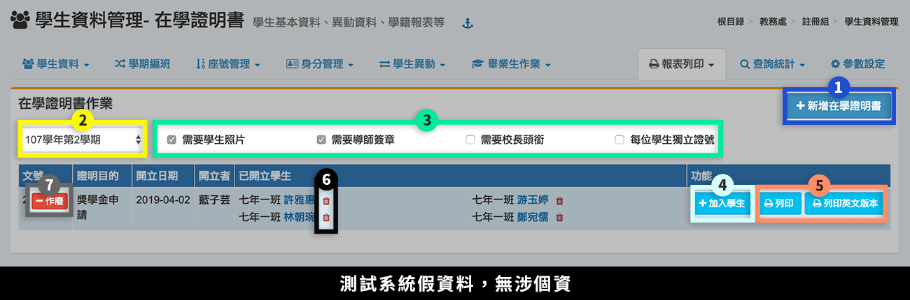

1. 按下「新增在學證明書」，在快顯視窗中，填入在學證明書的開立目的、開立日期。
2. 選擇「學期」選單。
3. 勾選額外輸出選項**「需要學生照片」**、**「需要導師簽章」**、**「需要校長頭銜」**、**「每位學生獨立證號」**。
4. 按下**「加入學生」**，可在該筆在學證明紀錄中加入學生。
5. 按下**「列印」**或**「列印英文版本」**按鈕，可在新視窗中列印所加入學生的在學證明書、英文版在學證明書。
6. 點選學生姓名旁的垃圾桶圖示，可刪除該名學生。
7. 按下**「作廢」**按鈕，可停用該筆在學證明，亦可**「回復」**。

### 學生證列印

#### 列印預設學生證

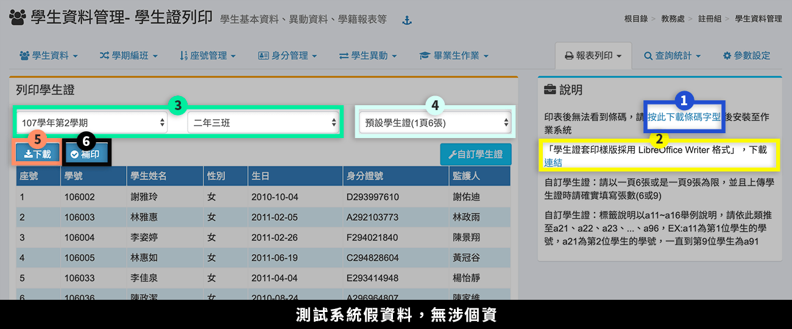

1. 下載**「條碼字型檔」**（使用於學號條碼）。
2. 下載**「LibreOffice 軟體」**，建議下載 6.0 以上版本（必須使用此軟體開啟檔案）。
3. 選擇**「學期」**、**「班級」**。
4. 選擇**「學生證版型」**，分為 9 張、6 張。
5. 按下**「下載」**，可下載所選班級的學生證檔案，請使用 LibreOffice 開啟、列印。
6. 選擇「學生證版型」後，按下**「補印」**，在快顯示視窗中，填入要補印學生證的學號，點選**「下載學生證」**按鈕，即可補印學生證。

#### 自訂學生證



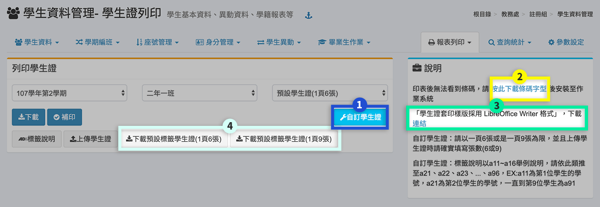

1. 按下**「自訂學生證」**。
2. 下載**「條碼字型檔」**（使用於學號條碼）。
3. 下載**「LibreOffice 軟體」**，建議下載 6.0 以上版本（必須使用此軟體開啟檔案）。
4. 下載**「預設標籤學生證」**檔案。



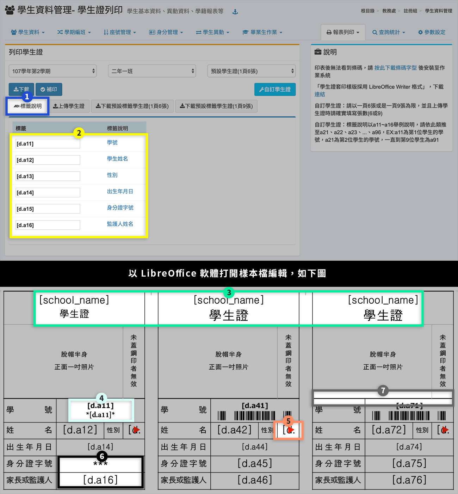

1. 按下**「標籤說明」**。
2. 標示處顯示學生證「套印標籤值」，標籤都以 \[ \] 表示。 編碼邏輯為：以 a11 ~ a16 舉例說明，請依此類推至 a21、a22、a23、...、a96。a11 為第 1 位學生的學號，a21 為第 2 位學生的學號，一直到第 9 位學生為 a91。
3. 使用 LibreOffice 打開下載的**「預設標籤學生證」**檔案，可編輯所有內文的自行、字級大小、顏色等。
4. 若條碼沒有選擇到安裝的「條碼字型檔」，則不會出現條碼。
5. 表格邊界較窄時，標籤會超過欄位，如圖「性別欄」所示，屬正常現象。
6. 若「身分證字號、家長監護人」不想顯示，可將標籤取代為「\*」或其他值。
7. 表格邊界若不符合貴校購買的學生證格子，可自行調整欄寬、列寬。
8. 編輯完成後記得儲存檔案。



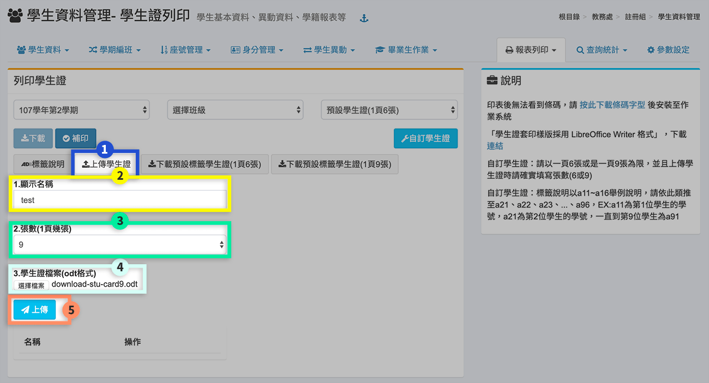

1. 按下**「上傳學生證」**。
2. 填入學生證**「顯示名稱」**。
3. 選擇**「一頁張數」**。
4. 選擇**「檔案」**。
5. 按下**「上傳」**。



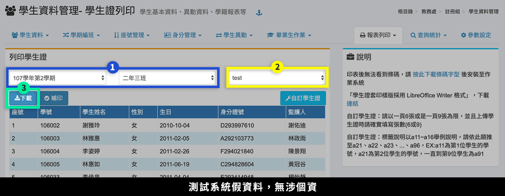

1. 選擇列印之**「學期、班級」**。
2. 選擇貴校上傳的**「自訂學生證樣本」**。
3. 按下**「下載」**，使用 LibreOffice 開啟，即可列印套印好的學生證。



## 查詢統計

### 搜尋學生

1. 選擇一個欄位，填入要查詢的條件，若是搜尋非在籍生，請勾選「含非在學生」。
2. 按下**「送出查詢」**按鈕。
3. 標示處顯示查詢結果。
4. 按下**「詳細資料」**，可檢視學生個人基本資料。

### 人數統計

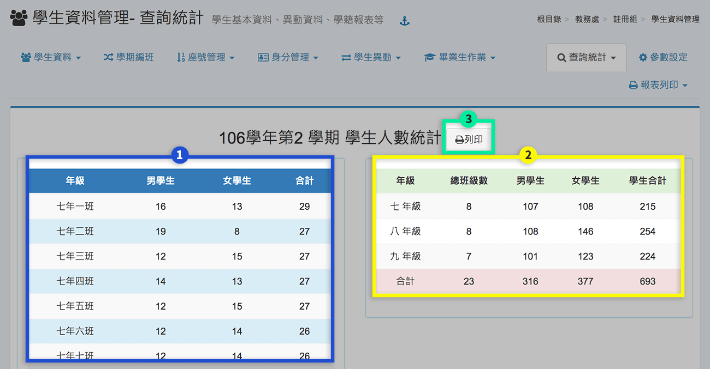

1. 標示處列出本學期各班級男女生人數統計。
2. 標示處列出本學期各年級男女生人數統計。
3. 按下**「列印」**按鈕，跳出新視窗進行列印。

### 歷年總表

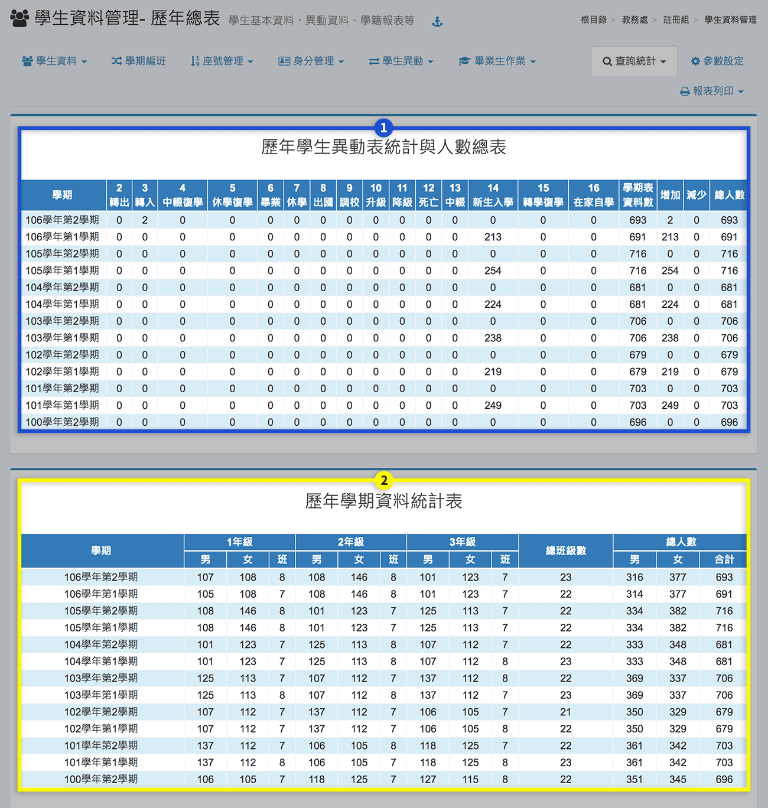

1. 標示處列出「歷年學生異動表統計與人數總表」。
2. 標示處列出「歷年學期資料統計表」（本表僅以每學期的學期表進行統計，未包含學生轉入轉出等異動）。

### 年齡統計

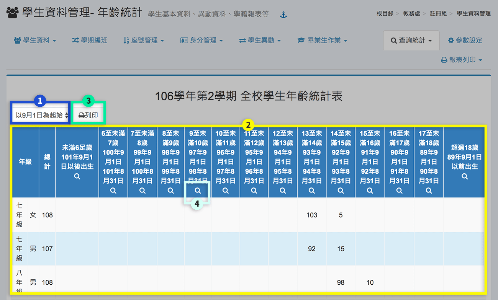

1. 選擇**「以9月1日為起始」**或**「以9月2日為起始」**的統計方式。
2. 標示處列出**「全校學生年齡統計表」**，顯示各年級男女生的年齡分布狀況。
3. 按下**「列印」**按鈕，跳出新視窗進行列印。
4. 按下**「放大鏡」**按鈕，可以顯示及列印該年齡區間內所有學生。

### 生日月分統計

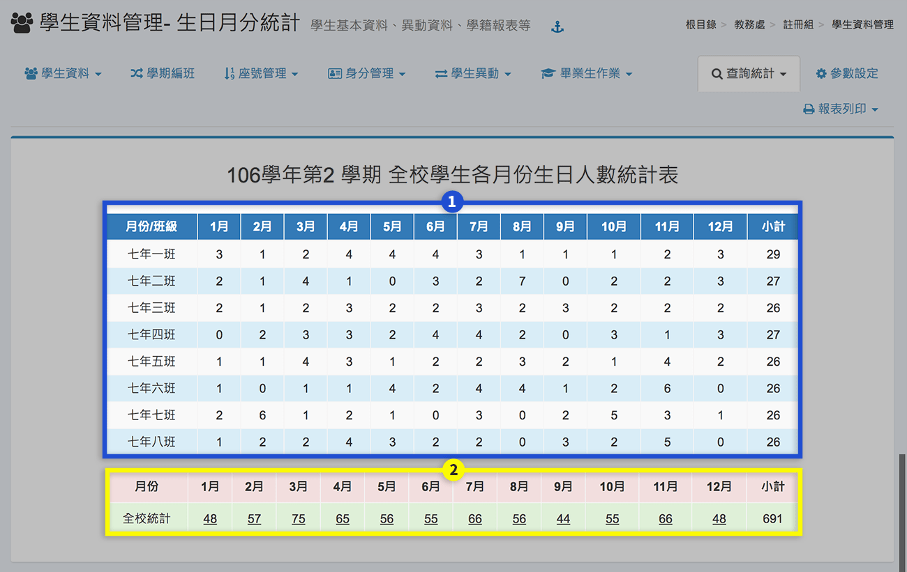

1. 標示處顯示各月份生日的人數總表。
2. 按下各月份總人數，可以列出及列印該月份所有學生。

### 星座統計

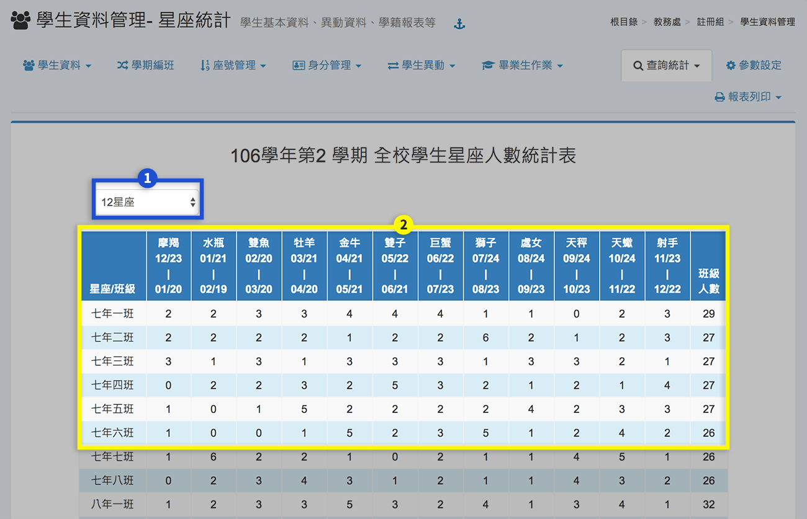

1. 選擇**「12星座」**或**「13星座」**的統計方式。
2. 標示處列出各班星座人數分布。

### 身分統計

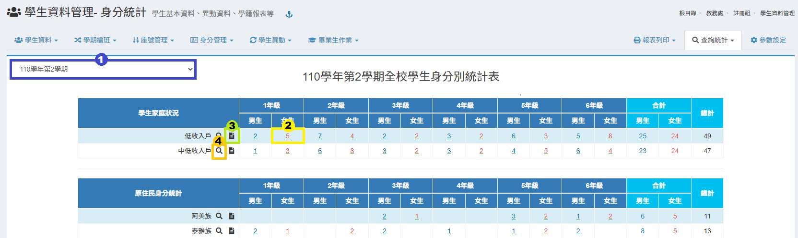

1. 按下統計節果中的**「數字」**，可查看該身分別的學生名單。
2. 按下**「下載檔案」**圖示，可下載該身分別的學生資料 Excel 檔。
3. 按下**「放大鏡」**按鈕，可以開新視窗顯示該身分別所有學生。

### 就學實況查詢

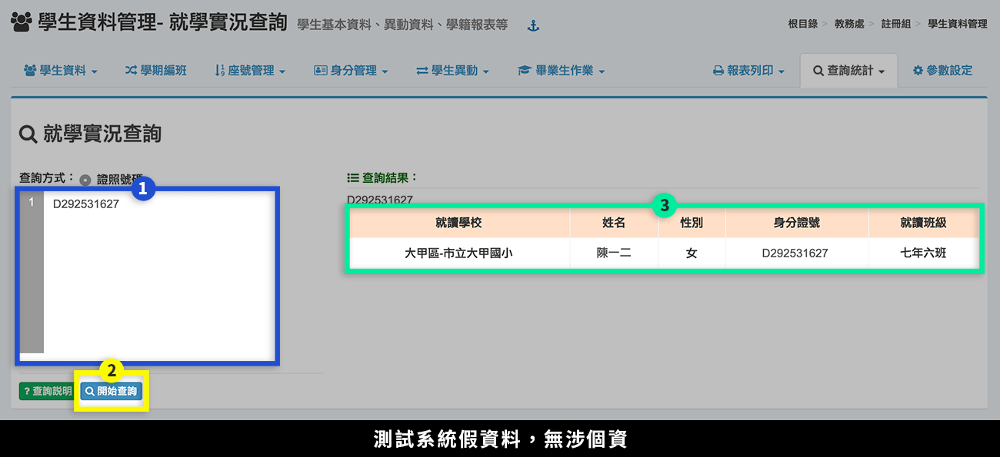

1. 輸入調出生的**「證件號碼」**。
2. 按下**「開始查詢」**。
3. 搜尋結果顯示在標示處。


* 快貼資料以列為單位，一列代表查詢一個學生。
* 證照號碼：可以使用學生之「國民身分證」號碼、「居留證」號碼或者「護照」號碼查詢。
* 查詢資料庫每日清晨進行資料更新。
* 若學生辦理轉學後尚未到就讀學校辦理轉入手續，其資料將查詢不到。


## 參數設定

1. 學生異動-預設異動核准機關名稱 `臺中市政府`
2. 學生異動-轉學證明書預設字 `107 快小轉證`
3. 學生異動-預設核准字 `107 快小轉`
4. 學生異動-復學作業檢查入學年 `是` `否`
5. 學生異動-預設異動理由 `遷居`
6. 學生異動-顯示異動學年數 `6`
7. 在學證明書預設字 `中市快小在證`
8. 畢業證書字號 `快小畢證字`
9. 畢業證書號位數 `3`
10. 允許舊學年畢業生作業

    `是`  
    `否`

11. 允許畢業班導師填報升學學校 `是` `否`
12. 允許導師修改學生基本資料 `不開放 完全開放 開放部分欄位（可選擇欄位）`
13. （若 12. 選擇開放部分欄位）請選擇「學生基本資料」中允許導師修改的欄位「點我選取欄位」
14. 允許導師修改父母監護人資料 `是` `否`
15. 畢業生成績試算領域加權預設值（順序 語文;數學;生活課程;自然與生活科技;社會;健康與體育;藝術與人文;綜合活動） `1;1;1;1;1;1;1;1`
16. 畢業生成績試算學期加權預設值（順序 一上;一下;二上;二下;三上;三下;四上;四下;五上;五下;六上;六下） `1;1;1;1;1;1;1;1;2;2;2;2`
17. 畢業生成績試算名次列序人數預設值 `10`

