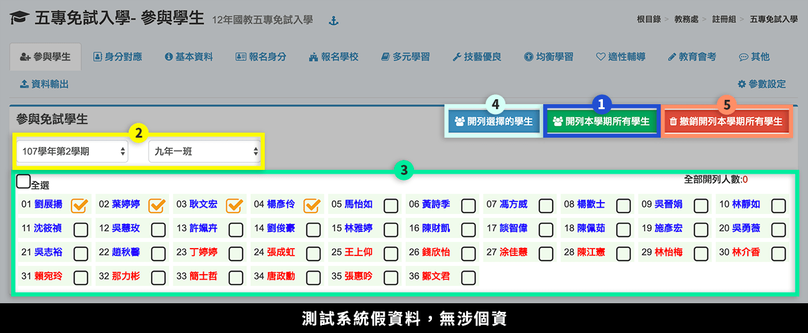
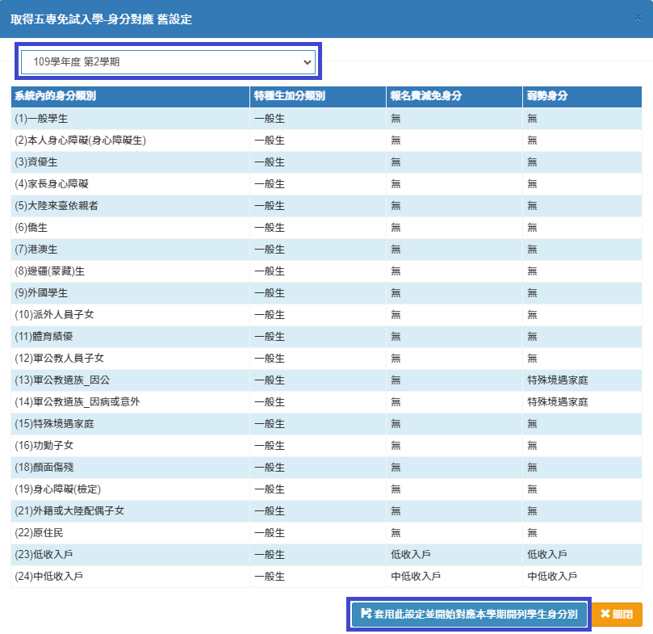
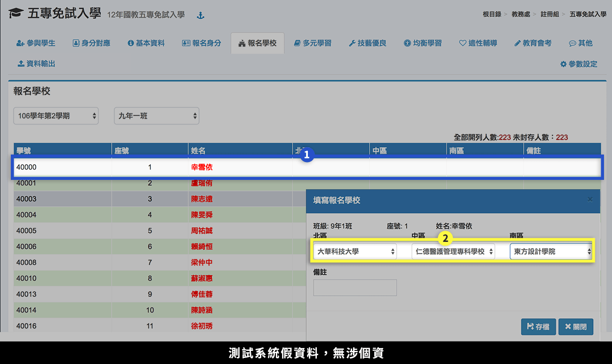
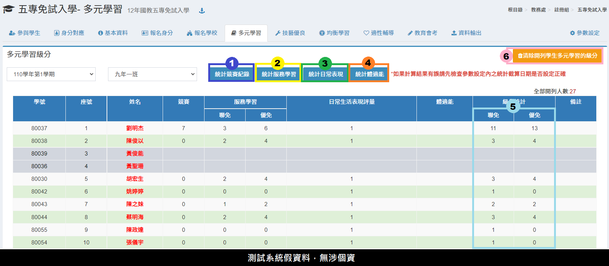
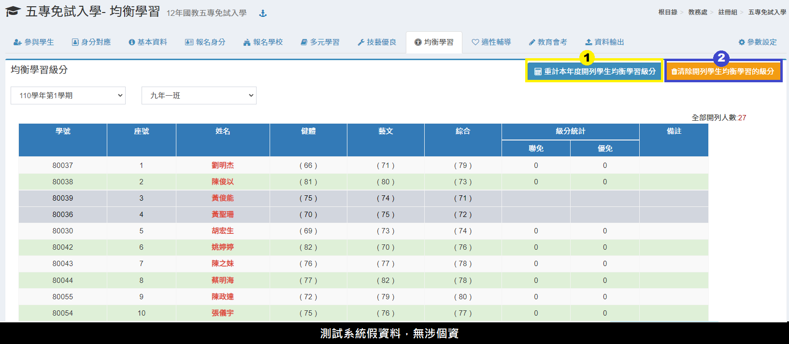
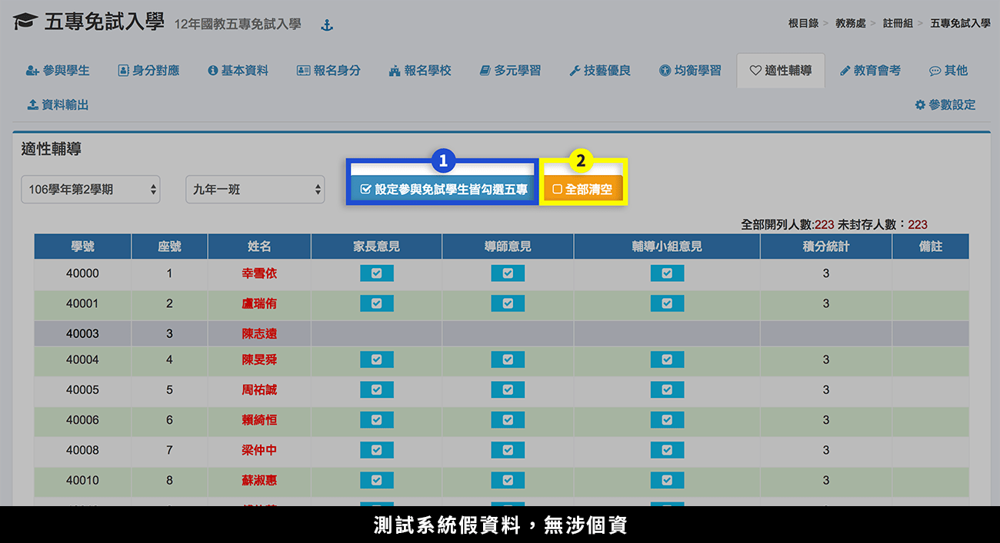
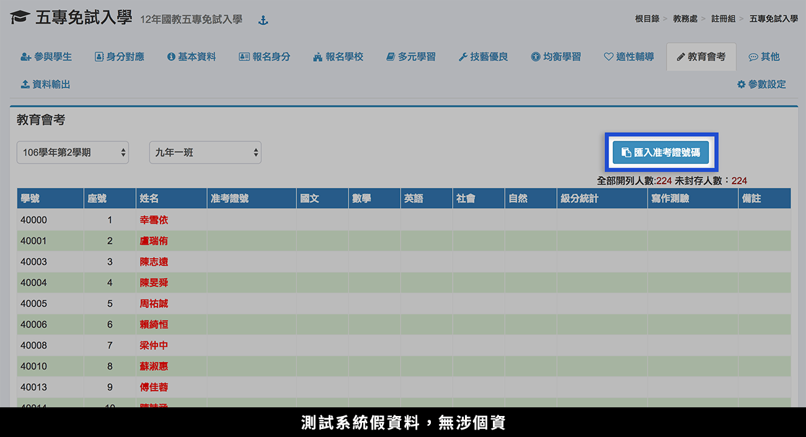
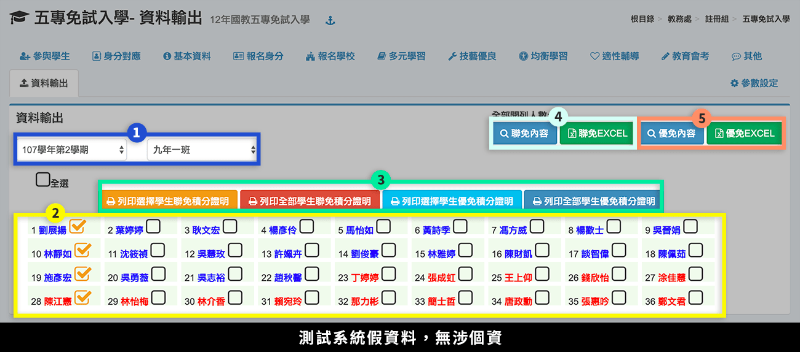

# 五專免試入學

## 參與學生

1. 若要開列所有學生，直接按下**「開列本學期所有學生」**。
2. 若要開列部分學生，先選擇**「學期」**、**「班級」**。
3. 在學生列表中勾選或全選要開列的學生。
4. 按下**「開列選擇的學生」**。
5. 要刪除開列紀錄，按下**「撤銷開列本學期所有學生」**。

## 身分對應

.png>)

1. 選擇**「學期」**。
2. 依序設定系統對應五專免試入學身分。
3. 按下**「儲存並對應學生報名身分」**，可將對應設定儲存，並且將設定套用到已開列學生。
4. 如已在本系統有其他學期設定之五專對應資料，可以點選**「取舊設定」**，選擇要複製之學期設定，檢視後若無誤， 可以選擇**「套用此設定」**，如下圖。


若之後還有新增開列學生，請於封存資料前再次執行本功能。


## 基本資料

.png>)

1. 選擇**「學期」**、**「班級」**，下方會列出該班學生資料。
2. 沒有開列的學生會呈現灰底。

## 報名身分


於執行本功能前，請先於本模組之 [身分對應](wu-mian-ru.md#shen-fen-dui-ying) 功能設定對應及對應各學生之資料。


.png>)

1. 選擇**「學期」**、**「班級」**，下方會列出該班學生資料。
2. 標示處顯示學生身分、加分、減分等。
3. 沒有開列的學生會呈現灰底。

## 報名學校

> 本功能為填報分區報名學校。

1. 滑鼠**「雙擊」**欲輸入選擇學生該列任何位置，會彈出快顯視窗。
2. 依分區**「選擇學校」**，儲存後即可。

## 多元學習


請先至 [參數設定](wu-mian-ru.md#can-shu-she-ding) 調整統計日期。


1. 按下**「統計競賽紀錄」**，
   * 競賽成績由本系統「學生競賽紀錄」模組(career-race)統計。
   * 聯免:「競賽」積分上限為 7 分。
   * 優免:「競賽」積分上限為 7 分。
   * 國際競賽—國際科技展覽及國際運動會獲得第一名得 7 分、第二名得 6 分、第三名得 5 分。
   * 國內競賽—全國競賽第一名得 6 分、第二名得 5 分、第三名得 4 分、 第四至第六名得 3 分，區域及縣（市）競賽第一名得 3 分、第二名得 2 分、第三名得 1 分。
   * 同學年度同項競賽擇優 1 次採計。
   * 參賽者 4 人以上視為團體，團體參賽依個人賽積分折半計算。
2. 按下**「統計服務學習」**。
   * 服務學習成績由本系統\[學生服務學習]模組(service)、\[學生幹部]\(student-leader)統計。
   * 聯免:積分上限為 7 分，幹部加上服務學習超過 7 分以 7 分。
     * 服務學習每8小時得一分。
     * 班級幹部0-6 分，同一學期擔任班級幹部，小老師、或社團幹部，仍以 1 分採計，即同學期最多只採計一個幹部分數。
     * 班級幹部除副班長、副社長，其餘副級幹部皆不採計。
   * 優免
     * 服務學習每1小時得0.25分
     * 班級幹部同一學期擔任班級幹部，小老師、或社團幹部，以 2 分採計，即同學期最多只採 計一個幹部分數。
     * 服務學習總分0-15 分，即幹部加上服務學習超過 15 分以 15 分
3. 按下**「統計日常表現」**。
   * 優免不計日常表現成績。
   * 日常表現成績由系統\[獎懲紀錄]統計，但是銷過日期每年不同須由參數設定修改，請於計算前修改。
   * 無小過以上處分，獎懲相抵後得 1 次大 功者(含以上)得 4 分；無小過以上處 分，獎懲相抵後得 1 次小功者 (含以上) 得 3 分；無小過以上處分，獎懲相抵後 得 1 次嘉獎(含以上)得 2 分。
   * 獎懲相抵後無任何懲處紀錄者得 1 分。
4. 按下**「統計體適能」**。
   * 優免不計體適能成績。
   * 體適能由本系統\[學生體適能]模組紀錄中計算.
   * 肌耐力、柔軟度、瞬發力、心肺耐力等 4 項， 三項達標準得 6 分；二項達標準得 4 分； 一項達標準得 2 分
   * 身障者會由系統抓取學生身分為身心障礙(檢定)者，自動設定為6分。
5. 「多元學習表現」項目積分
   * 聯免: 為「競賽」、「服務學習」、「日常生活表現評 量」與「體適能」四個分項目積分之總和，採計積分上限為 16 分。
   * 優免: 為「競賽」、「服務學習」兩個分項目積分之總和，採計積分上限為 15 分。
6. 若要清除開列學生多元學習的級分，可**雙擊「清除開列學生多元學習的級分」**。

## 技藝優良

> 本功能可填報學生技藝成績，並計算積分。

.png>)


* 本模組成績取自 [技藝學程成績](ji-cheng-cheng.md)，請先在該模組輸入後，再到本模組統計。


1. 按下**「統計記憶優良」**，系統會統計 [技藝學程成績](ji-cheng-cheng.md) 模組中的學生資料。
2. 統計完，標示處會顯示統計結果。
   * 學生技藝成績由本系統之\[技藝學程成績]模組取分，並計算積分。
   * 聯免技藝教育成績達 90 分以上得 3 分；80 分以上未滿 90 分得 2 分；60 分以上未 滿 80 分得 1 分
   * 優免技藝教育成績達 90 分以上得 3 分；80 分以上未滿 90 分得 2.5 分；70 分以上未滿 80 分得 1.5 分；60 分以上未 滿 70 分得 1 分

## 均衡學習

1. 按下**「重計本年度開列學生均衡學習成績」**，可以計算成績。
2. 按下**「清除開列學生均衡學習的級分」**，可以清除資料。

* 本功能為取自系統之學生成績，健體、藝文、綜合三領域五學期平均成績，採無條件捨去後取整數值登錄
  * 聯免:上列三項達 60 分以上得 6 分；二項達 60 分以上得 4 分；一項達 60 分以上得 2 分
  * 優免:上列三項達 60 分以上得 21 分；二項達 60 分以上得 14 分；一項達 60 分以上得 7 分

## 適性輔導

本功能為設定家長意見、導師意見、輔導小組意見。

* 聯免:上列三項皆有勾選得 3 分；任二項有勾 選得 2 分；任一項有勾選得 1 分。
* 優免不採計適性輔導。

1. 按 **「設定參與免試學生皆勾選五專」** 按鈕，就可以一次設定三項皆勾選。
2. 按 **「全部清空」** 按鈕可以清除資料。\

## 教育會考

學校替學生報名會考後，會考中心會提供各校一個包括：報名序號、班級、座號、考生姓名、准考證號碼等欄位的** Excel 檔**。請開啟該檔，然後複製要匯入准考證號碼，貼到快顯示窗中即可。

* 可雙擊學生，輸入學生個別准考證號碼。


* 系統依據有准考證號碼設定為報考國中教育會考 。
* 本功能不處理成績資料。


## 資料輸出

1. 選擇**「學期」**、**「班級」**。
2. **「勾選學生」**或**「全選學生」**。
3. 可列印部分或全部學生的「**聯免積分證明**」、**「優免積分證明」**。
4. 可查看**「聯免內容」**或**「下載聯免 Excel 檔」**。
5. 可查看**「優免內容」**或**「下載優免 Excel 檔」**。

## 參數設定

1. 各項學生資料統計期限\
   `2017-05-15`
2.  市內電話取得欄位&#x20;

    `戶籍電話`&#x20;

    `通訊電話`

    `緊急聯絡電話`
3.  行動電話取得欄位&#x20;

    `戶籍電話`

    `通訊電話`

    `緊急聯絡電話`
4.  學生地址取得欄位

    `戶籍地址`

    `居住地址`
5.  學期選單顯示年度數

    `3`
