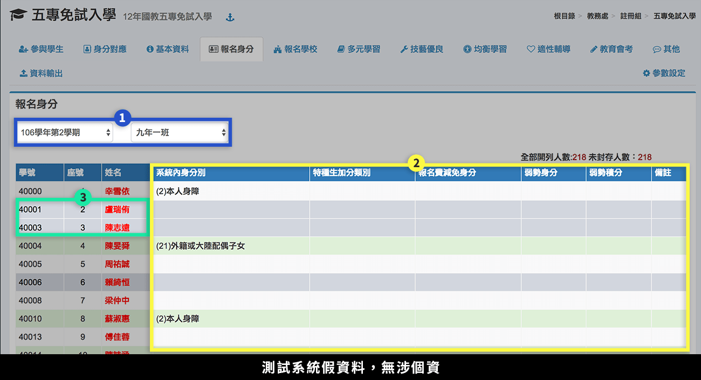
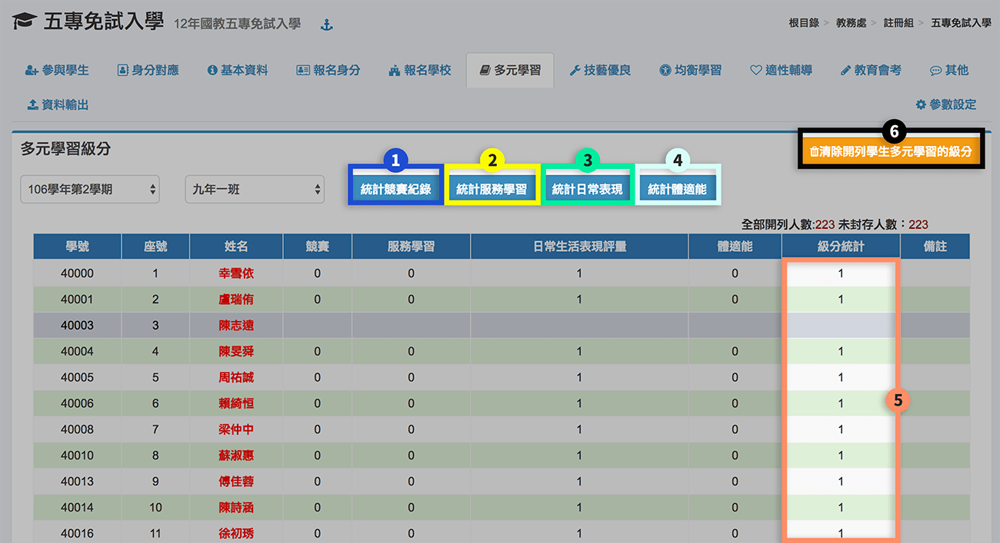
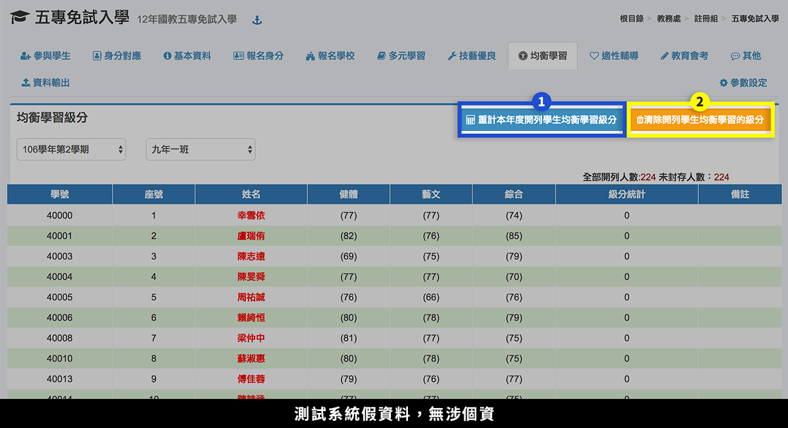

# 五專免試入學

## 參與學生

1. 若要開列所有學生，直接按下**「開列本學期所有學生」**。
2. 若要開列部分學生，先選擇**「學期」**、**「班級」**。
3. 在學生列表中勾選或全選要開列的學生。
4. 按下**「開列選擇的學生」**。
5. 要刪除開列紀錄，按下**「撤銷開列本學期所有學生」**。

## 身分對應

.png>)

1. 選擇**「學期」**。
2. 依序設定系統對應五專免試入學身分。
3. 按下**「儲存並重新設定報名身分」**，可將對應設定儲存，並且將設定套用到已開列學生。
4. 如已在本系統有其他學期設定之五專對應資料，可以點選**「取舊設定」**，選擇要複製之學期設定，檢視後若無誤， 可以選擇**「套用此設定」**，如下圖。


若之後還有新增開列學生，請於封存資料前再次執行本功能。


## 基本資料

.png>)

1. 選擇**「學期」**、**「班級」**，下方會列出該班學生資料。
2. 沒有開列的學生會呈現灰底。

## 報名身分


於執行本功能前，請先於本模組之 [**身分對應**](wu-mian-ru.md#shen-fen) 功能設定對應及對應各學生之資料。


1. 選擇**「學期」**、**「班級」**，下方會列出該班學生資料。
2. 標示處顯示學生身分、加分、減分等。
3. 沒有開列的學生會呈現灰底。

## 報名學校

> 本功能為填報分區報名學校。

1. 滑鼠**「雙擊」**欲輸入選擇學生該列任何位置，會彈出快顯視窗。
2. 依分區**「選擇學校」**，儲存後即可。

## 多元學習


請先至 [參數設定](wu-mian-ru.md#ding) 調整統計日期。


1. 按下**「統計競賽紀錄」**，
   * 系統會統計「學生競賽紀錄」模組的學生紀錄。
2.  按下**「統計服務學習」**。

    > * 服務學習成績由本系統「學生服務學習」模組 (service)、「學生幹部」 (student-leader) 統計。
    > * 服務學習每小時得一分。
    > * 班級幹部 0-6 分，同一學期擔任班級幹部、小老師、社團幹部，仍以 1 分採計，即同學期最多只採計一個幹部分數。
    > * 服務學習總分 0-7 分，即幹部加上服務學習超過 7 分以 7 分。
3.  按下**「統計日常表現」**。

    > * 日常表現成績由系統「獎懲紀錄」統計，但是銷過日期每年不同須由本模組之「參數設定」修改，請於計算前修改。
    > * 無小過以上處分，獎懲相抵後得 1 次大 功者 (含以上) 得 4 分；無小過以上處分，獎懲相抵後得 1 次小功者 (含以上) 得 3 分；無小過以上處分，獎懲相抵後 得 1 次嘉獎 (含以上) 得 2 分； 獎懲相抵 後無任何懲處記錄者得 1 分。
4.  按下**「統計體適能」**。

    > * 體適能由本系統「學生體適能」模組紀錄中計算。
    > * 肌耐力、柔軟度、瞬發力、心肺耐力三 項達標準得 6 分；二項達標準得 4 分； 一項達標準得 2 分。
    > * 身障者會由報名身分部分抓取，自動設定為 6 分。
5. 競賽、服務學習、日常生活表現評量、體適能四項合計，最高 16 分超過以 16 分計，級距為 0.5 分。
6. 若要清除開列學生多元學習的級分，可**雙擊「清除開列學生多元學習的級分」**。

## 技藝優良

> 本功能可填報學生技藝成績，並計算積分。

.png>)


* 本模組成績取自 [技藝學程成績](ji-cheng-cheng.md)，請先在該模組輸入後，再到本模組統計。
* 技藝教育成績達 90 分以上得 3 分；80 分以上未滿 90 分得 2 分；60 分以上未 滿 80 分得 1 分。


1. 按下**「統計記憶優良」**，系統會統計 [技藝學程成績](ji-cheng-cheng.md) 模組中的學生資料。
2. 統計完，標示處會顯示統計結果。

## 均衡學習

本功能為取自系統之學生成績，健體、藝文、綜合三領域五學期平均成績，採無條件捨去後取整數值登錄，上列三項達 60 分以上得 6 分；二項達 60 分以上得 4 分；一項達 60 分以上得 2 分。沒有開列之學生背景為灰色。

1. 按下**「重計本年度開列學生均衡學習成績」**，可以計算成績。
2. 按下**「清除開列學生均衡學習的級分」**，可以清除資料。

## 適性輔導

本功能為設定家長意見、導師意見、輔導小組意見，三項皆有勾選得 3 分；任二項有勾選得 2 分；任一項有勾選得 1 分。沒有開列之學生背景為灰色。

1. 按 **「設定參與免試學生皆勾選五專」** 按鈕，就可以一次設定三項皆勾選。
2. 按 **「全部清空」** 按鈕可以清除資料。\

## 教育會考

學校替學生報名會考後，會考中心會提供各校一個包括：報名序號、班級、座號、考生姓名、准考證號碼等欄位的** Excel 檔**。請開啟該檔，然後複製要匯入准考證號碼，貼到快顯示窗中即可。


* 系統依據有准考證號碼設定為報考國中教育會考 。
* 本功能不處理成績資料。


## 資料輸出

1. 選擇**「學期」**、**「班級」**。
2. **「勾選學生」**或**「全選學生」**。
3. 可列印部分或全部學生的「**聯免積分證明**」、**「優免積分證明」**。
4. 可查看**「聯免內容」**或**「下載聯免 Excel 檔」**。
5. 可查看**「優免內容」**或**「下載優免 Excel 檔」**。

## 參數設定

1. 各項學生資料統計期限\
   `2017-05-15`
