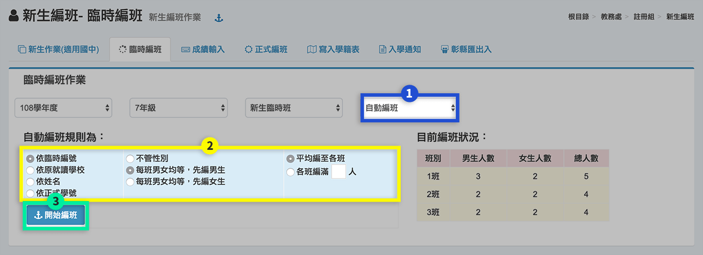

# 新生編班（適用國中）


此模組功能適用國中操作，國小請用 [匯入新生資料](sheng-liao-guan-li.md#ru-xin-sheng-liao)。


## 新生作業




選擇**「學年度」**、**「年級」**及**「作業內容」**開始進行工作。若沒有學年度，請參考以下步驟

1.  如有國小畢業生CS匯出資料匯送至本校，按下**「接收國小端資料」**，會彈出快顯視窗，接續下一步驟。

    1-1. 可點擊**「簽收」**鎖定該國小畢業生轉入資料，亦可**「下載畢業生名冊」**。

    1-2. 勾選需匯入之國小畢業生資料

    1-3. 點擊**「匯入」**即可將勾選之畢業生資料匯入系統&#x20;

    1-4. 可下載該畢業生資料檔進行編修，再使用步驟2上傳。
2.  亦可按下**「匯入新生資料」**，會彈出快顯視窗，接續下一步驟。

    2-1.如非CS系統資料，請參照使用說明，下載**「範例檔」**。資料建立完成後選擇**「匯入年級」**、**「匯入檔案」**後，按下**「上傳檔案」**。

    2-2. 如為CS格式資料，請參照使用說明，下載範例檔或使用於步驟1-4下載之檔案編修，建立完成後選擇**「匯入年級」**、**「匯入檔案」**後，按下**「上傳檔案」**。
3. 上傳成功後，學生名單會顯示在標示處。
4. 可一次**「刪除本學年資料」**。
5. 按下**「人數統計」**，可以顯示該學年度學生入學狀況。
6. 按下**「下載名冊」**，下載本學年學生資料檔。
7. 如有個別新增新生資料，請點擊**「新增學生」**。




1. 匯入學生後，可選擇**「學生資料」**。
2. 可個別**「編輯」**學生資料或額外**「新增學生」**，會彈出快顯視窗，也可**「刪除」**學生資料。
3. 在快顯視窗中，可**「編輯」**學生資料。
4. 按下**「存檔」**，儲存該次編輯。




1. 匯入學生資料後，選擇**「登錄就學」**。
2. 可設定**「設定全部就讀」**或**「設定全部不就讀」**，或是按下**「編輯」**按鈕，進行個別設定。
3. 針對個別學生，設定就讀狀況及不就讀說明。
4. 按下**「儲存」**或**「取消」**，儲存該次編輯或退出編輯。




1. 匯入學生資料後，選擇**「登錄學藝活動」**。
2. 可設定**「設定全部參加」**或**「設定全部不參加」**，或是按下**「編輯」**按鈕，進行個別設定。
3. 針對個別學生，設定參加與不參加。
4. 按下**「儲存」**或**「取消」**，儲存該次編輯或退出編輯。




1. 匯入學生資料後，選擇**「不就讀名冊」**。
2. 若有設定不就讀學生，標示處會顯示學生資料。
3. 可**「列印名冊」**。




1. 匯入學生資料後，選擇**「郵遞區號速編」**。
2. 點選**「設定預設值」**可以一鍵設定郵遞區號，將以彈跳視窗顯示設定視窗。
3. 輸入預設之郵遞區號後按下確定即可將郵遞區號套用至學生資料。
4. 或是直接修改進行個別設定。
5. 按下**「儲存」**儲存該次編輯。



## 臨時編班




1. 選擇**「班別」**：新生臨時班級、新生學藝班。
2. 選擇**「工作項目」**：設定班別。
3. 輸入**「班級數」**。
4. 選擇**「班級名稱」**的種類。
5. 按下**「儲存」**，儲存設定。
6. 儲存完成後，可針對個班別編輯名稱。




1. 選擇**「工作項目」**：人工編班。
2. 選擇**「班級」**。
3. 在學生列表中，可點選圖示將學生調出該班。
4. 按下**「查看未編班學生」**，在右側會顯示尚未編班學生名單。
5. 在學生列表中輸入未編班學生編號，按下「enter」，可新增該生到該班級。
6. 完成編輯後，按下「儲存」，儲存該次編輯。




1. 選擇**「班別」**：新生臨時班級、新生學藝班。
2. 選擇**「工作項目**」：匯入班級座號。
3. 下載**「臨時編班匯入檔案」**進行編修。
4. 選擇**「匯入檔案」**後按下**「上傳檔案」**，將已完成之臨時編班匯入檔上傳至系統。匯入成功後可至人工編班檢視編班結果。




1. 選擇**「工作項目」**：自動編班。
2. 選擇**「編班規則」**。
3. 按下**「開始編班」**，系統會自動排序、編班。



.png>)

1. 選擇**「工作項目」**：編班查詢列印。
2. 輸入**「查詢關鍵字」**。
3. 按下**「搜尋」**。
4. 標示處顯示查詢結果。
5. 可**「列印下載臨時編班名冊」。**



## 成績輸入

> 如果正式編班需要成績依據，請於本功能輸入。

1. 選擇**「學年度」**。
2. 選擇**「年級」**、**「班級」**。
3. 按下**「編輯」**按鈕即可進行編輯。


本成績只限輸入三個成績，如果沒有輸入，則不列入計算平均。輸入之成績只可於 **0-100 分**範圍內。


## 正式編班


要進行正式編班之前，須先進行新學年度之班級設定，請至 [**學期初設定>班級**](qi-chu-ding.md#2-ban) 選單設定。





1. 選擇**「功能選項」**：人工編班。
2. 選擇**「班級」**。如果沒有班級出現，請先至 **學期初設定>班級** 設定。
3. 輸入學生**「臨時編號」**，輸入完成，會自動檢查該生資料，若沒有該學生，將會在學生姓名列出現訊息，請修正臨時編號。
4. 按下**「查看未編班學生」**，可查看未編班學生名單。
5. 設定完成後按下**「儲存」**。
6. 儲存完後，可以在學生名單右方按 **「調出」** 按鈕將該生班級、座號設定清除。




1.  選擇**「功能選項」**：自動編班。

    請依貴校編班需求選擇編班條件。如果編班時男女生分兩次來編的話，第二次的起始班必須是第一次起始班的前一個班；第一次請選順向，第二次請選逆向。
2. 選擇要編入哪些班級。
3. 按下**「開始編班」**，由系統依據編班條件編班。
4. 如果不符合需求可點選**「清除已編資料」**以清除已編班資料。




1. 選擇**「功能選項」**：調整編班。人工編班及自動編班後不符合需求，可以使用本功能進行**「編班調整」** 做對調學生的工作。
2. 請選擇要對調班級之學生。
3. 按 **「對調」** 按鈕即可將兩個學生班級設定對調。




1. 選擇**「功能選項」**：座號調整。人工編班及自動編班後有經過一些調整，或者座號不符合需求，可以操作此功能進行變更。
2. 請設定調整之規則前面輸入次序數字。
3. 按 **「調整座號」** 按鈕即可重新對該班座號做調整。




1. 選擇**「功能選項」**：設定學號。
2. 設定學號前置數字加上流水位數，例輸入 106+4，代表學生學號會是 1060001、1060002...。
3. 選擇學生安排學號的順位條件。
4. 排除某些不雅排序數字，每個數字以分號(;)隔開，例如 1060444;1060438;1060478。
5. 按下**「設定學號」**按鈕即可設定學號。




1. 選擇**「功能選項」**：編班查詢列印。可以依據學生姓名、臨時編號查詢學生之正式編班。
2. 分別輸入或同時輸入條件來搜尋資料，姓名部分可輸入部分姓名。輸入完成可按 **Enter **或按 **「搜尋」**按鈕即可由系統找尋學生資料。
3. 可**「列印、儲存正式編班名冊」**。



## 寫入學籍表


請先到 [學生資料管理>學期編班](sheng-liao-guan-li.md#qi-ban) 將舊生升級，再操作此功能。


1. 按下**「檢視設定」**，系統將會檢視以下設定狀況：新學年班級是否有設定、新生資料設定為就讀之學生是否都有安排班級、座號與學號。
2. 若系統檢視有問題，標示處會呈現錯誤提醒，請依錯誤項目修正。
3. 若學生資料沒有問題，才會出現**「寫入資料」**按鈕，按下後，系統就會將資料轉入正式學籍表內。

## 入學通知

1. 輸入入學通知書內容事項。
2. 選擇列印選項後，按下**「列印」**按鈕後即可列印。

## 彰縣匯出入


本功能為彰化縣學校專用，提供匯出給編班中心的資料檔及匯入編班中心給的資料檔。


.png>)

1. 請到 [學期初設定>班級](qi-chu-ding.md#2-ban) 設定班級。
2. 由本模組 [新生作業](xin-sheng-ban-yong-zhong.md#xin-sheng-zuo) 匯入新生的資料。
3. 由 [新生作業>登錄就讀](xin-sheng-ban-yong-zhong.md#xin-sheng-zuo) 標記是否就讀本校。
4. 額外應用，例如：臨時編班、入學通知單...等（本部分國小可略）。
5. 在上圖按下**「編班檔案轉出」**，產生給編班中心的資料檔。
6. 在上圖按下**「編班檔案轉入」**，匯入編班中心輸出的編班結果資料檔。
7. 由 [新生編班>正式編班>設定學號](xin-sheng-ban-yong-zhong.md#zheng-shi-ban) 設定新生的正式學號。
8. 待新學期後，至 [學生資料管理>學期編班](sheng-liao-guan-li.md#qi-ban) 將其他年級參照上學期資料升級。
9. 由 [新生編班>寫入學籍表](xin-sheng-ban-yong-zhong.md#ru-ji-biao) 正式將新生寫入學籍系統。
