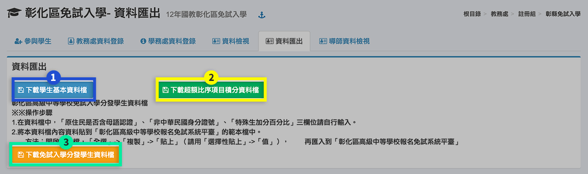

# 彰縣免試入學

## 參與學生

1. 若要開列所有學生，直接按下**「開列本學期所有學生」**。
2. 若要開列部分學生，先選擇**「學期」**、**「班級」**。
3. 在學生列表中勾選或全選要開列的學生。
4. 按下**「開列選擇的學生」**。
5. 要刪除開列紀錄，按下**「撤銷開列本學期所有學生」**。

## 教務處資料登錄

1. 選擇**「學期」**、**「班級」**。
2. 可**「列印或下載該班積分檢核表」**。
3. 按下**「整班編修」**。
4. 在標示處編輯資料。
5. **「儲存」**編修之資料。
6. 可**「重設」**該班資料。

## 學務處資料登錄

1. 選擇**「學期」**、**「班級」**。
2. 可**「列印或下載該班積分檢核表」**。
3. 按下**「整班編修」**。
4. 在標示處編輯資料。
5. **「儲存」**編修之資料。
6. 可**「重設」**該班資料。

## 資料檢視

表列所有開列學生之資料，可核對是否正確。

## 資料匯出

1. 可**「下載學生基本資料檔」**。
2. 可**「下載超額比序項目積分資料檔」**。
3. 可**「下載免試入學分發學生資料檔」**。

## 導師資料檢視


可請資訊組長獨立授權此模組給「級任教師」，唯有開列免試入學學生之班級導師，才能看到該班學生資料。


1. 標示處僅顯示該導師班學生之資料。
2. 可**「列印或下載該班積分檢核表」**。

