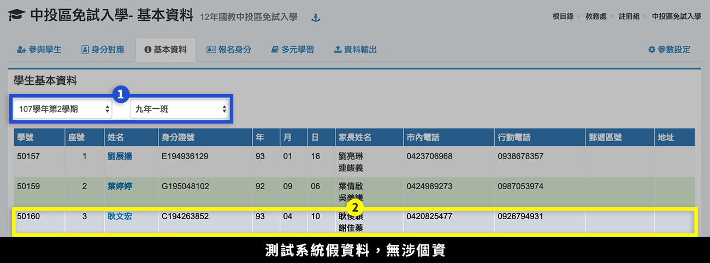
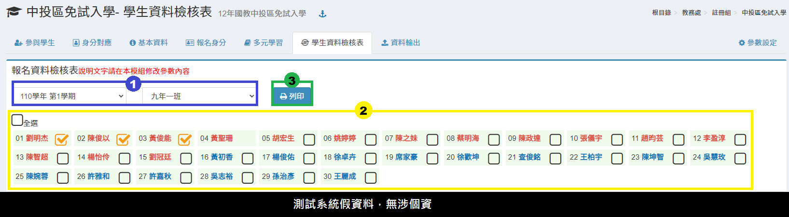

# 中投區免試入學

## 參與學生

.png>)

1. 若要開列所有學生，直接按下**「開列本學期所有學生」**。
2. 若要開列部分學生，先選擇**「學期」**、**「班級」**。
3. 在學生列表中勾選或全選要開列的學生。
4. 按下**「開列選擇的學生」**。
5. 要刪除開列紀錄，按下**「撤銷開列本學期所有學生」**。

## 身分對應

.png>)

1. 選擇**「學期」**。
2. 依序設定系統對應中投區免試入學身分。
3. 按下**「儲存並重新設定報名身分」**，可將對應設定儲存，並且將設定套用到已開列學生。


若之後還有新增開列學生，請於封存資料前再次執行本功能。


## 基本資料

1. 選擇**「學期」**、**「班級」**，下方會列出該班學生資料。
2. 沒有開列的學生會呈現灰底。


市內電話、行動電話資料，可至 [參數設定](zhong-tou-mian-ru.md#ding) 設定**取得欄位**。


## 報名身分


於執行本功能前，請先於本模組之 [**身分對應**](wu-mian-ru.md#shen-fen) 功能設定對應及對應各學生之資料。


.png>)

1. 選擇**「學期」**、**「班級」**，下方會列出該班學生資料。
2. 標示處顯示學生身分分數統計，沒有開列的學生會呈現灰底。
3. 點選**「設定參與免試學生皆符合就讀偏遠」**或**「設定皆不符合就讀偏遠」**，即可一鍵設定所有學生。
4. 如需個別勾選，請於連點2下綠色圖示作勾選。

## 多元學習

.png>)

1. 選擇**「學期」**、**「班級」**。
2. 沒有開列之學生背景為灰色。
3. 多元學習計算由系統內資料計算，按下**「重計本年度開列學生多元學習級分」**按鈕計算。
4. 若要清除開列學生多元學習的級分，按下**「清除開列學生多元學習的級分」**按鈕。
5. 可**「下載」**多元學習學生清冊 Excel 檔。


如果計算結果有誤，請先檢查參數設定內之統計截算日期是否設定正確。


## 學生資料檢核表

1. 選擇**「學期」**、**「班級」**。
2. 選擇**「學生」**。&#x20;
3. 點擊**「列印」**，以新視窗開啟列印學生資料檢核表。


資料檢核表說明文字可至在本模組[參數設定](zhong-tou-mian-ru.md#can-shu-she-ding)設定內容。


## 資料輸出

.png>)

1. 選擇**「學期」**。
2. 按下**「檢視內容」**，會彈出新視窗，可查看學生中投區免試入學報名資料。
3. 按下**「輸出 Excel」**，可下載學生中投區免試入學報名資料。

## 參數設定

#### 中投區免試入學 參數調整

1. 中投區免試入學學校參加類別\
   `免試學區學校`\
   `非免試亦非共同學區學校`
2. 各項學生資料統計期限\
   `2019-05-15`
3. 家長姓名取得欄位（可多選）\
   `父親`\
   `母親`\
   `監護人`
4. 市內電話取得欄位\
   `戶籍電話`\
   `通訊電話`\
   `緊急聯絡電話`
5. 行動電話取得欄位\
   `戶籍電話`\
   `通訊電話`\
   `緊急聯絡電話`
6. 資料檢核表說明
