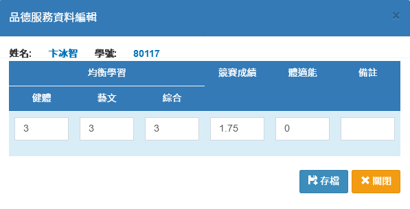

# 雲林區免試入學

## 參與學生

1. 若要開列所有學生，直接按下**「開列本學期所有學生」**。
2. 若要開列部分學生，先選擇**「學期」**、**「班級」**。
3. 在學生列表中勾選或全選要開列的學生。\
   已開列學生，可以個別撤銷開列，請雙擊滑鼠點選該學生:white\_check\_mark:圖示。
4. 按下**「開列選擇的學生」**。
5. 要刪除開列紀錄，按下**「撤銷開列本學期所有學生」**。

## 身分對應

1. 選擇**「學期」**。
2. 依序設定系統對應中投區免試入學身分。
3. 按下**「儲存並重新設定報名身分」**，可將對應設定儲存，並且將設定套用到已開列學生。


如果於身分對應後後，還有再新增開列學生，請於封存資料前再次執行本功能。


## 報名資料


於執行本功能前，請先於本模組之"[**身分對應**](yun-lin-qu-mian-shi-ru-xue.md#shen-fen-dui-ying)"功能設定對應及對應各學生之資料。


1. 選擇**「學期」**、**「班級」**，下方會列出該班學生資料。
2. 沒有開列的學生會呈現灰底。
3. 雙擊開列學生列可編輯修改該生資料，如下圖：\
   \
   _※ 請留意!此處編輯僅供雲林區免試入學模組資料處理，不會連動至學生資料管理的_[_學生資料_](../jiao/sheng-liao-guan-li.md#xue-sheng-zi-liao)_身分。_

## 扶助弱勢

1. 選擇**「學期」**、**「班級」**。
2. 雙擊開列學生列可編輯修改該生資料，如下圖：\
   


若貴校在[參數設定](yun-lin-qu-mian-shi-ru-xue.md#can-shu-she-ding)為偏遠小校，請點選右上角**「統計本年度不符合偏遠小校加分條件學生的級分」**按鈕統計本年度不符合偏遠小校加分條件學生的級分，以設定轉入不到一年學生為不符合偏遠小校加分條件學生的級分。


## 品德服務

1. 選擇**「學期」**、**「班級」**。
2. 按下**「重計本年度品德服務級分」**，可以計算成績。
3. 雙擊開列學生列可編輯修改該生資料，如下圖：\
   \
   _※ 請留意!此處編輯僅供雲林區免試入學模組資料處理，不會連動至學生缺曠課管理。_


本項統計會依據本系統之[缺曠課模組](../undefined/que-guan-li.md)、[學生獎懲模組](../undefined/sheng-guan-li.md)計算。


## 多元學習

1. 選擇**「學期」**、**「班級」**。
2. 多元學習計算由系統內資料計算，按下**「重計本年度開列學生多元學習級分」**按鈕計算。
3. 雙擊開列學生列可編輯修改該生資料，如下圖：\
   


本模組會依據本系統之[學生競賽模組](../xiao-hang-zheng/sheng.md)、學生成績模組、[體適能模組](../undefined/sheng-neng.md)分別計算出各項積分。


## 成績證明

1. 選擇**「學期」**、**「班級」**。
2. 選擇**「學生」**或**「全選」**學生。
3. 點擊**「列印」**列印學生成績證明單，沒有開列之學生無法列印。

## 資料輸出

* HTML格式：以另開視窗方式開啟網頁式檔案。
* Excel格式：下載Excel檔。


* 資料輸出是將資料整理好輸出為雲林區免試入學招生委員會所需要之格式。
* 資料輸出僅能輸出當學年度之資料。


## 參數設定

1. 家長姓名取得欄位(可多選) \
   `父親`　`母親`　`監護人`&#x20;
2. 市內電話取得欄位\
   `戶籍電話`　`通訊電話`　`緊急聯絡電話`
3. 行動電話取得欄位\
   `戶籍電話`　`通訊電話`　`緊急聯絡電話`
4. 本校是否符合就近入學\
   `不符合`　`符合`&#x20;
5. 本校是否符合偏遠小校\
   `不符合` 　`8 至 12 班以下`　 `7 班以下`
