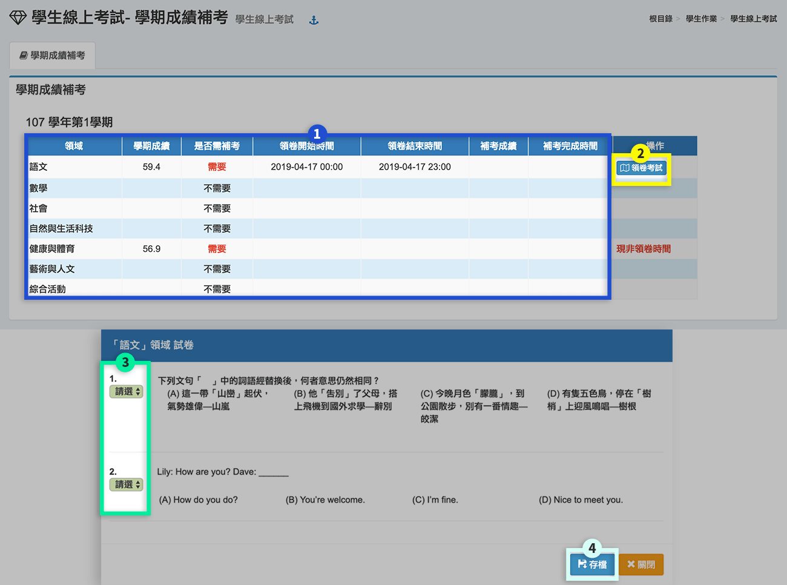

# 學生線上考試

1. 學生登入系統後，在學期成績補考模組，會顯示該學期需要補考的領域狀況。
2. 請聽從老師指示，按下**「領卷考試」**，即可開始考試。
3. 填入題目**「答案」**。
4. 完成作答後，按下**「存檔」**。


* 本功能需教務處將補考設定完成後才可以使用。
* 教務處設定後，如果學生有需要補考之領域，於補考出卷時間內才可以領卷。
* 教務處設定為鎖定 ip 時，將依限定電腦之 ip 決定學生是否可以領卷。
* 如果教務處設定為步可重複領卷，學生不可隨意將領卷視窗關閉，若電腦當機導致學生重複登入，請告知監考教師狀況，由教師協助處理。
* 試卷之題目如有圖片當顯示太小時，可點取圖片出現原始大小圖。


