# 學生作業

## 個人資料




1. 學生請依自身資料填入表單，並於下方按 **「儲存」** 按鈕，儲存填寫之資料。
2. 學生個人相片可以按 **「上傳照片」** 按鈕，於瀏覽電腦中相片位置後，直接上傳相片。
3. 也可以直接用檔案總管拖拉相片至方塊處直接上傳相片。
4. 按 **「刪除」** 圖示按鈕，可以刪除已經上傳之相片。



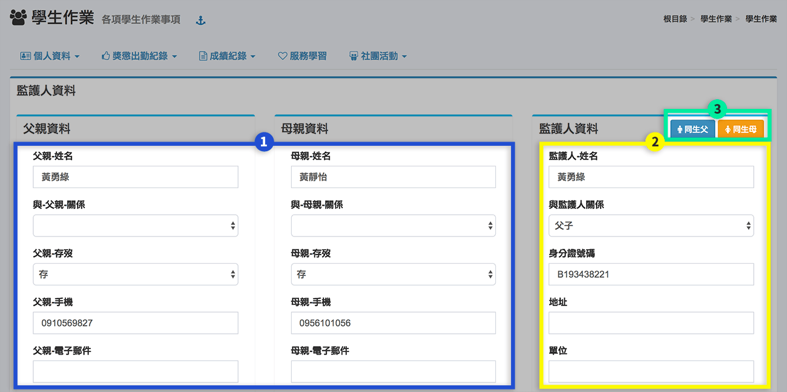

1. 學生請依自身父母親資料填入表單。
2. 請填寫監護人資料。
3. 如果監護人為父親或母親，可以直接按 **「同生父」** 或 **「同生母」** 按鈕直接複製已經填寫的父母親資料。



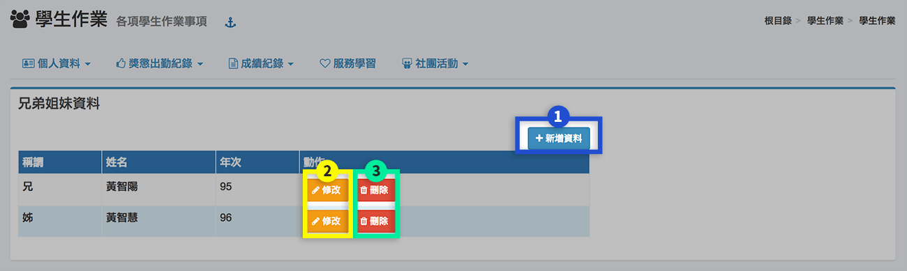

1.  要新增兄弟姊妹資料請按 **「新增資料」** 按鈕，會跳出新視窗如下圖。  

  
    於填寫資料完成後，按 **「確定」** 按鈕儲存。

   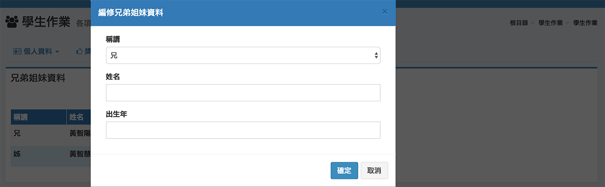

2. 要修改已經建立之兄弟姊妹資料，請按該筆資料列上之 **「修改」** 按鈕，會跳出修改資料之新視窗，於修改後按 **「確定」** 按鈕儲存。
3. 要刪除已經建立的兄弟姊妹資料，請按該筆資料列上之 **「刪除」** 按鈕，於確定刪除後刪除該筆資料。



## 獎懲出勤紀錄



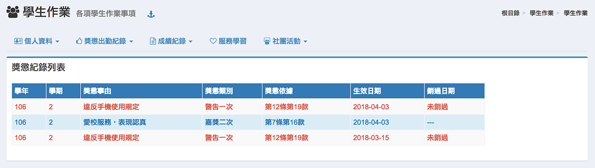



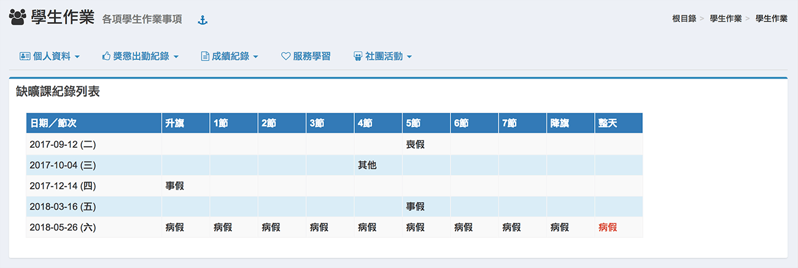



## 成績紀錄



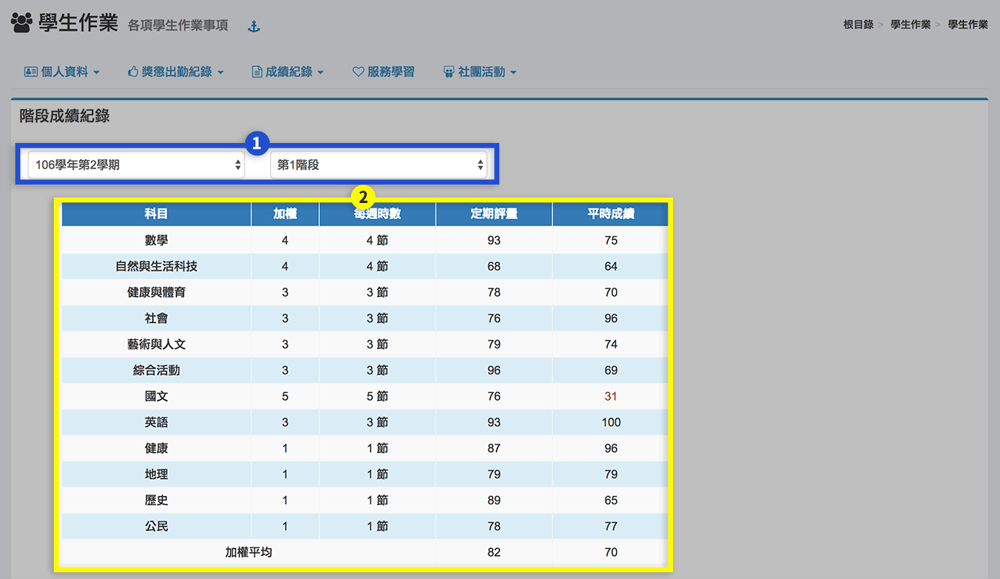

1. 請先選擇要查詢之學期及階段。
2. 在下方就會顯示該階段之成績紀錄。



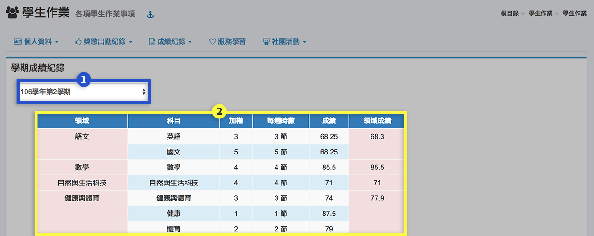

1. 請先選擇要查詢之學期。
2. 在下方就會顯示該學期之成績紀錄。



## 服務學習

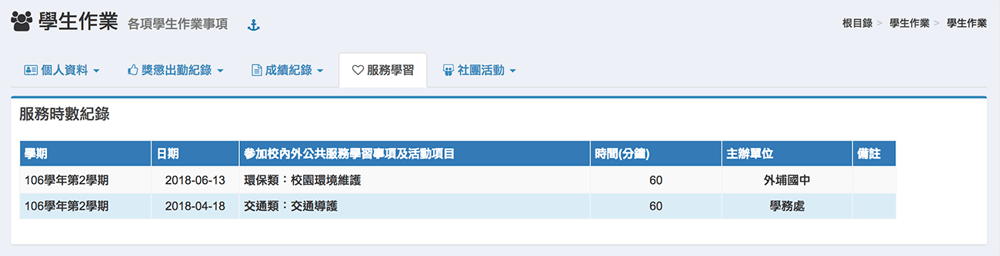

## 社團活動



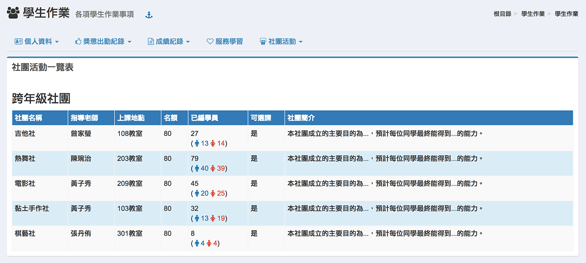



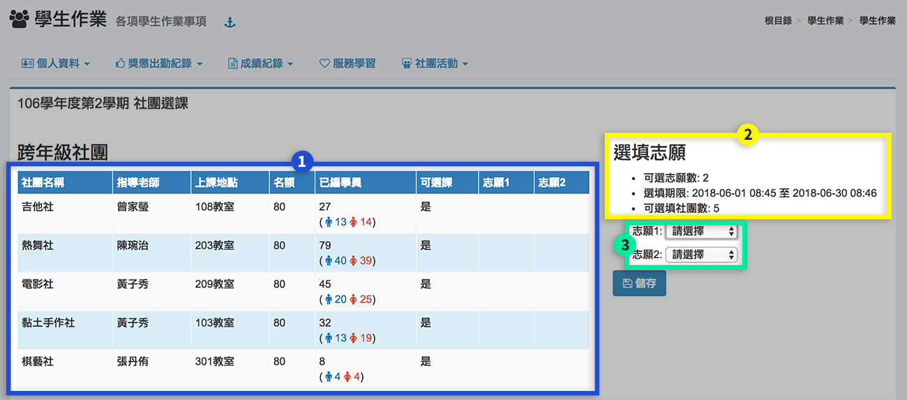

1. 列出可以選填志願之社團資訊。
2. 選填志願注意事項。
3. 填選志願之下拉選單，如果在開放選填範圍時間內，於填寫完畢按 **「儲存」** 按鈕儲存。



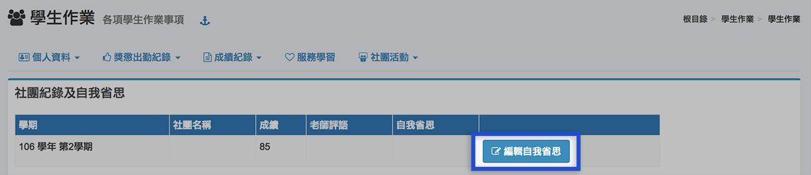

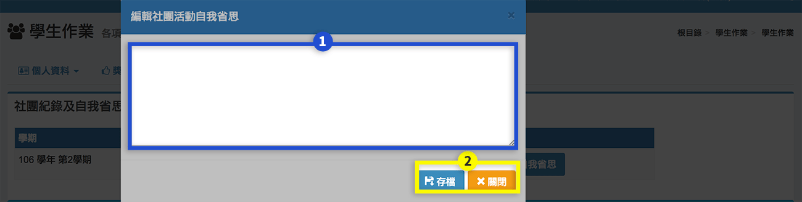



