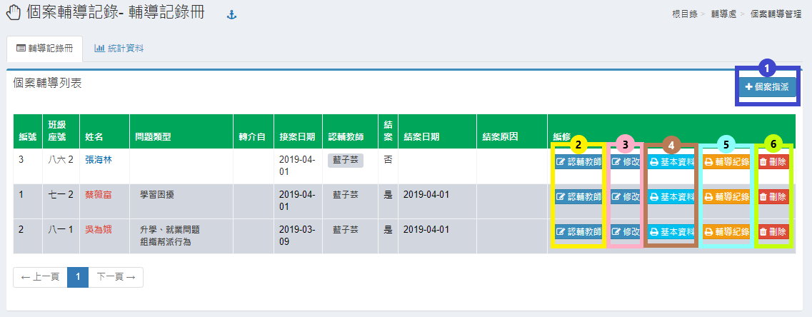
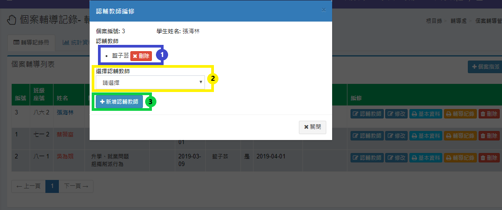
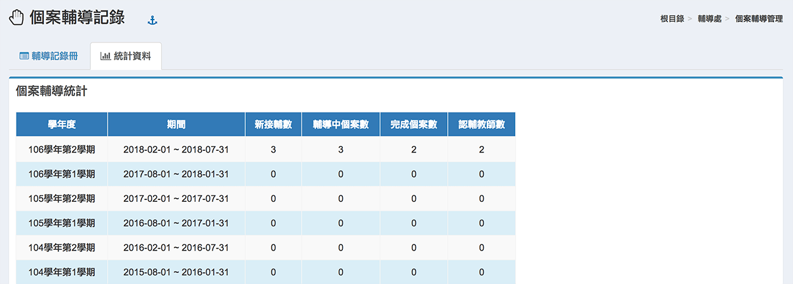

# 個案輔導管理

## 輔導紀錄冊

本功能是提供指派個案輔導教師輔導個案學生，畫面如下圖。

1.在圖下方出現已經指派之個案，如果要新增個案指派，請按 **「個案指派」** 按鈕，進入編修頁面如下圖。

.png>)

> 1. 請先選擇班級，才會有班級學生名單出現。
> 2. 接下來選擇學生。
> 3. 指定要指派之認輔教師，如果要指派之輔導教師不只一人，可於上圖之 **「認輔教師」** 按鈕進入功能指派。

2\. 要修改或增加、刪除指派教師，請按 **「認輔教師」** 按鈕，會跳出視窗如下圖。

> 1. 如果要刪除以指派之輔導教師，可按 **「刪除」** 圖示按鈕。
> 2. 要新增輔導教師，請選擇教師名稱。
> 3. 於選擇完畢後，按 **「新增認輔教師」** 圖示按鈕即可增加認輔教師。

3.區塊 3 可針對個別個案進行 **「修改」**。\
4.區塊 4 可檢視個別個案的**「基本資料」**並進行列印。\
5.區域 5 可檢視個別個案的**「輔導紀錄」**並進行列印。\
6.區塊 6 可針對個別個案進行 **「刪除」**。

## 統計資料

本功能是提供本校歷年之個案輔導統計資料，畫面如下圖。

