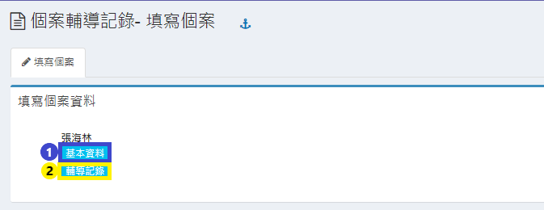
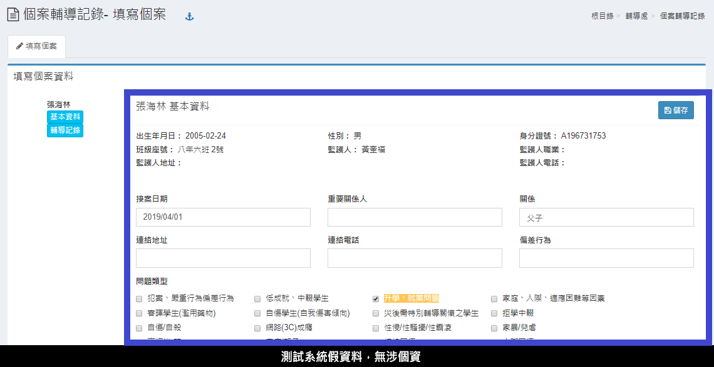
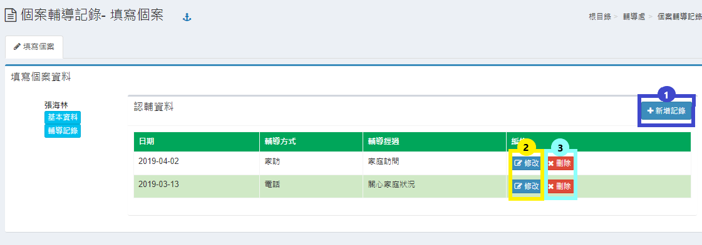
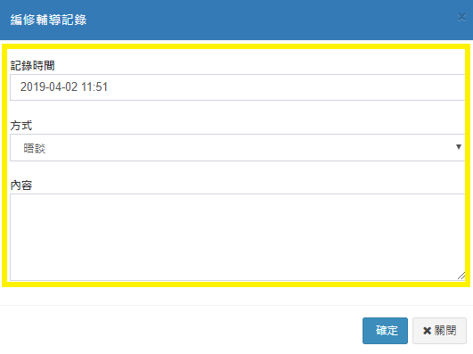

# 個案輔導記錄

## 填寫個案

本功能是有被指派輔導個案學生之認輔教師紀錄輔導狀況之紀錄，當進入畫面時，會如下圖出現以指派之個案學生姓名。

#### 1. 「基本資料」

要觀看或填寫個案之基本資料，請按該生姓名下方之「基本資料」按鈕，會出現如下圖畫面。

#### 2. 「輔導紀錄」

觀看或填寫個案之輔導資料，請按該生姓名下方之「輔導紀錄」按鈕，會出現如下圖畫面。

1. 要新增輔導紀錄請按**「新增紀錄」**按鈕，會出現跳出視窗如下圖。
2. 要修改紀錄請按**「修改」**按鈕圖示，跳出新視窗後，請修改資料後，按儲存按鈕來儲存輸入之資料。
3. 要刪除紀錄請按**「刪除」**按鈕圖示，在確定後刪除。

