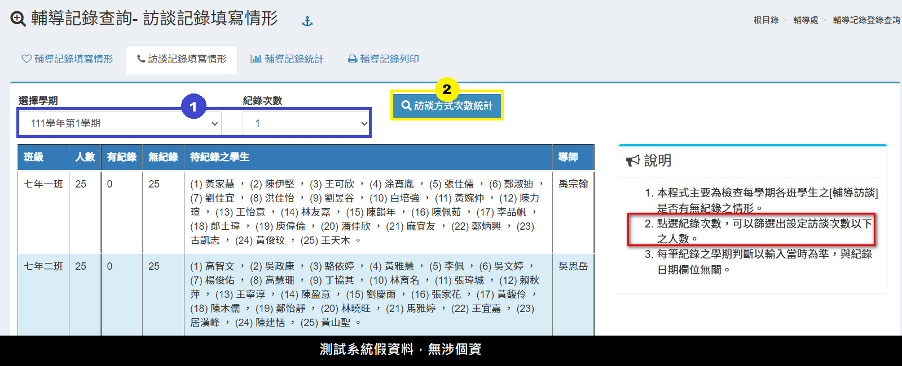
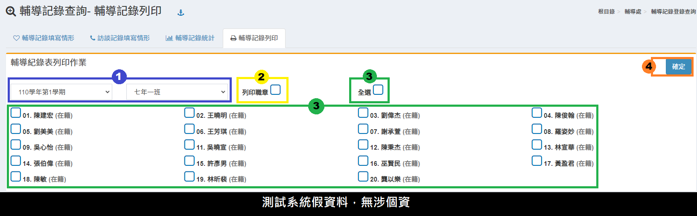

# 輔導記錄登錄查詢

## 輔導記錄填寫情形

本功能是統計導師填寫班級輔導紀錄狀況，請點選學期，呈現如下圖。

1. 請選擇要查詢的統計項目。
2. 在下方會出現所有班級的填寫狀況。

## 訪談記錄填寫情形

本功能是統計導師填寫班級訪談紀錄狀況，請點選學期，亦可使用訪談次數篩選出設定訪談次數以下之人選。呈現如下圖。

## 輔導記錄統計

本功能是統計各項紀錄狀況，請點選學期，呈現如下圖。

.png>)

1. 點選統計類別
2. 下方會出現該類別之統計圖表及數據。

## 輔導記錄列印

本功能可以列印各學年各班學生的輔導紀錄資料。

1. 選擇**「學年」**及**「班級」**。
2. 勾選是否**「列印職章」**
3. 勾選**「學生」**，或點擊**「全選」**勾選整班學生。
4. 點選**「確定」**即開啟新分頁，可列印學生輔導資料紀錄表。
