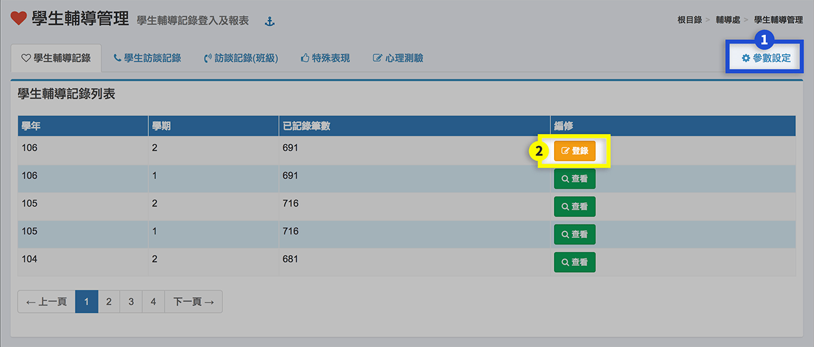
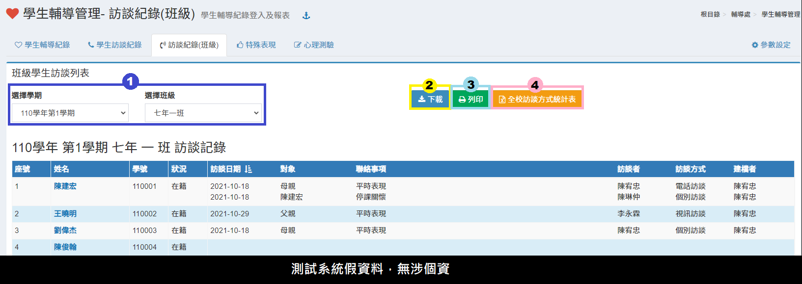
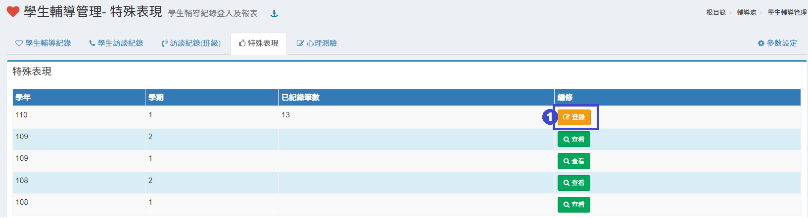
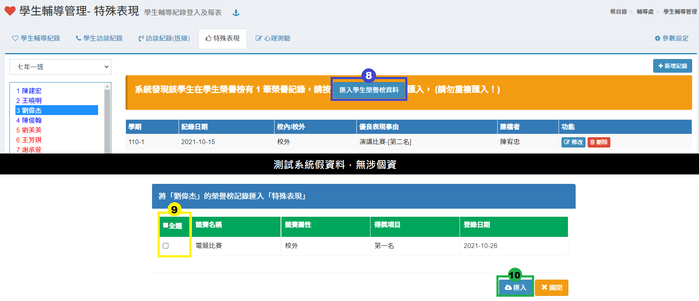
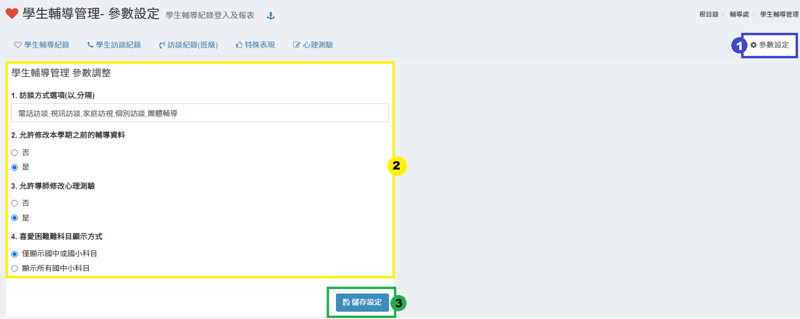

# 學生輔導管理

## 學生輔導記錄

1. &#x20;學生輔導紀錄預設只能記錄當學期資料，如欲修改為可記錄其他學期，請點選 **「參數設定」** ，並將 **「允許修改本學期之前的輔導資料」**設為 **「是」** 。
2.  &#x20;要登錄資料，請按 **「登錄」** 按鈕，進入編修頁面如下圖。 \
    &#x20;

    
3. 請選擇學期。
4. 再選擇學生後，請依該生狀況輸入或選擇適合條件選項。
5. 輸入完成後，請按 **「儲存」** 按鈕儲存紀錄。

## 學生訪談記錄

1.要登錄資料，請按 **「登錄」** 按鈕，進入編修頁面如下圖。

2.請選擇班級及學生。\
3\. 如果要刪除，請按 **「刪除」** 按鈕，於確認刪除後會刪除該筆資料；修改該生該筆資料，請按 **「修改」** 按鈕，並於跳出視窗內修改該筆紀錄。\
4.列印學生訪談紀錄。\
5\. 要新增紀錄，請按 **「新增紀錄」** 按鈕，會跳出視窗如下圖。\
&#x20;

* 請在表單內容輸入紀錄。
* 輸入完成後，請按 **「儲存」** 按鈕。
* 不要輸入或放棄編輯，請按 **「關閉」** 按鈕關閉該視窗。

6.若某生有多筆資須輸入，可以使用快貼功能，如下圖。 \
&#x20;

* 點選使用說明。
* 下載範例檔。
* 根據excel中的指示整理訪談紀錄資料，複製後將資料貼至空白處。

## 訪談記錄（班級）

1. 選擇學期及班級可以列出該班在該學期之訪談紀錄列表。
2. 下載訪談記錄。
3. 列印訪談記錄。
4. 下載全校訪談紀錄統計表。

## 特殊表現

1.要登錄資料，請按 **「登錄」** 按鈕，進入編修頁面如下圖。

2.請先選擇班級學ＶＵ０生後，會列出該生紀錄。

3.如果要刪除，請按 **「刪除」** 按鈕，於確認刪除後會刪除該筆資料；修改該生該筆資料，請按 **「修改」** 按鈕，並於跳出視窗內修改該筆紀錄。

4.要新增紀錄，請按 **「新增紀錄」** 按鈕，會跳出視窗如下圖。

5.請選擇學期，並在表單內容輸入紀錄。

6.輸入完成後，請按 **「儲存」** 按鈕。

7.不要輸入或放棄編輯，請按 **「關閉」** 按鈕關閉該視窗。

8.如學生於榮譽榜有登錄[榮譽紀錄](../xiao-hang-zheng/bang.md#rong-yu-bang-guan-li)，可點擊**「匯入學生榮譽榜資料」**將記錄匯入特殊表現。

9.請於彈跳視窗中勾選欲匯入的榮譽榜紀錄。

10.點擊**「匯入」**即可匯入至特殊表現。&#x20;


請留意榮譽紀錄是否曾匯入特殊表現，系統無法判別是否有重複匯入之問題，故已匯入該紀錄請勿重複匯入。


## 心理測驗

1.如果要登錄當學期紀錄，請點選 **「登錄」** 按鈕，進入編修頁面如下圖。\
2.要觀看舊紀錄，請點選 **「查看」** 按鈕，進入查看資料模式。

3.要列印班級學生之測驗紀錄，請點選 **「列印本學期測驗」** 按鈕。\
4.要新增管理測驗，請點選 **「編修心理測驗」** 按鈕，會跳出新視窗如下圖。

>  \
> &#x20;1.要新增測驗請點選 **「新增測驗」** 按鈕，會在原視窗下方出現表單，如下圖。

> >  \
> > &#x20;於輸入相關資料後，按 **「儲存」** 按鈕即可新增一個心理測驗。

> 2.如果要刪除測驗，請按 **「刪除」** 按鈕，於確認刪除後會刪除該筆資料；修改該筆資料，請按 **「修改」** 按鈕，並於下方的表單內修改該筆紀錄。\
> 3.編修完畢，請按 **「存檔」** 。

5\. 於測驗完畢後，要輸入學生成績紀錄，可以使用快貼方式快速輸入成績紀錄，請按 **「快貼批次匯入」** 按鈕，會跳出新視窗如下圖。

> &#x20;
>
> 1. 請選擇測驗項目，若尚未新增測驗，請至 **「編修心理測驗」** 功能新增測驗。
> 2. 將測驗資料填入區塊 2。
> 3. 請參看快貼說明，貼入成績紀錄。
> 4. 區塊 4 可下載 Excel 匯入檔。
> 5. 點選 **「匯入快貼資料」** 。

6\. 也可以逐筆輸入或修改學生成績紀錄，請選擇學生後按 **「新增 XXX心理測驗紀錄」** 按鈕，跳出新視窗如下圖。


於表單內如輸入該生成績資料，並按「儲存」按鈕即可。


## 參數設定

1. 點選「**參數設定**」後，進入參數設定頁面
2. 根據圖中參數選項進行設定。
3. 操作完畢後點選「**儲存設定**」即可。
