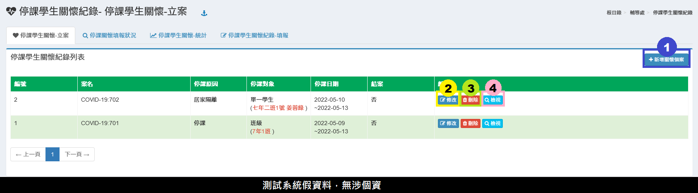
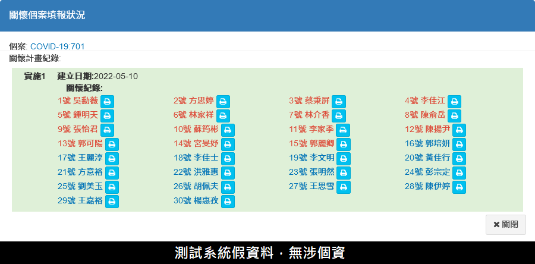
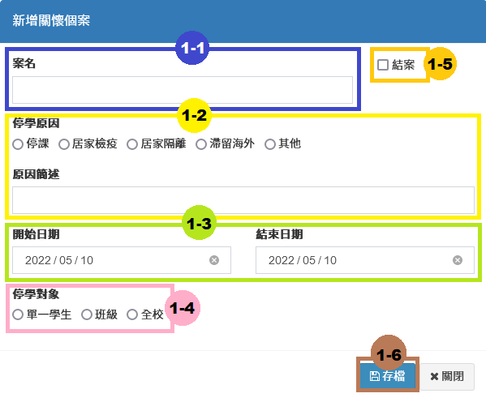
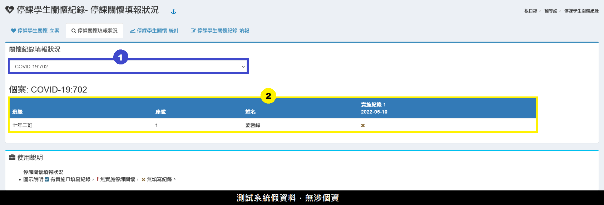
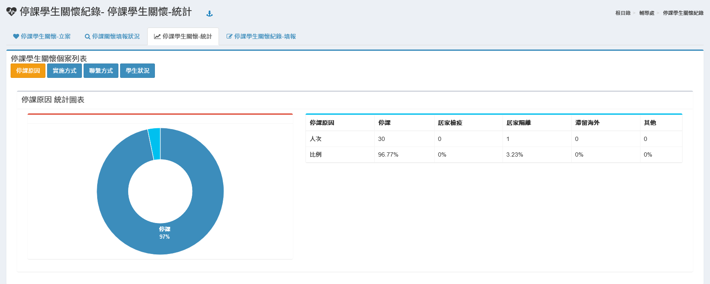
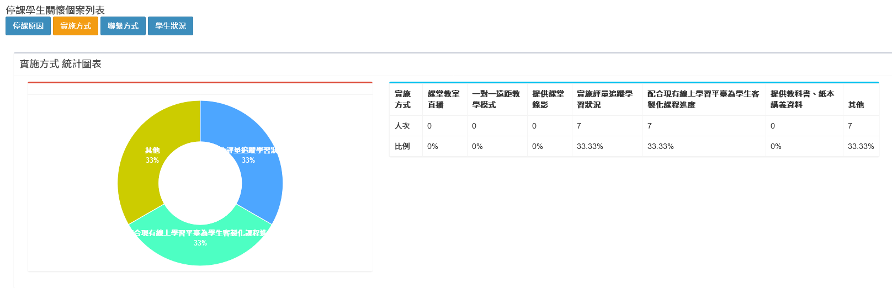
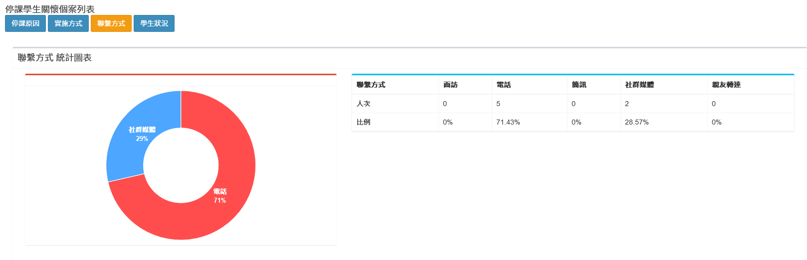
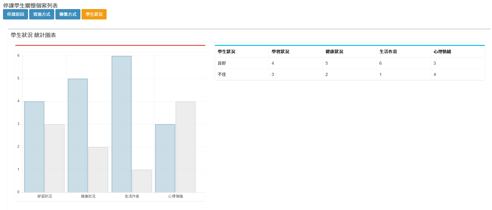
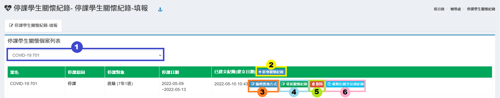
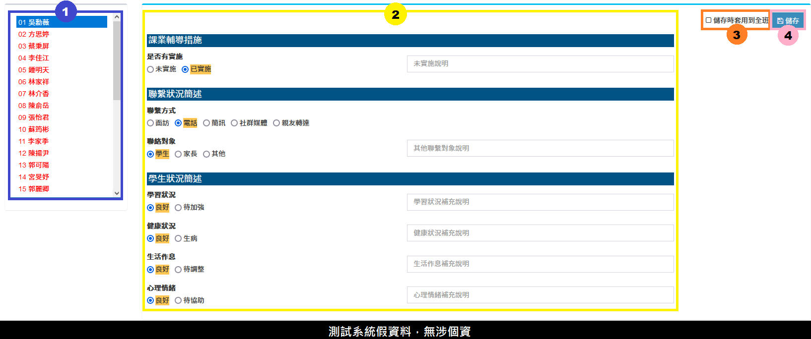

# 停課學生關懷紀錄(限臺中市)

## 模組建置

**1.如何新增關懷模組(建議行政人員操作)**

* 請至`系統管理`
* 選擇`模組管理`
* 點選[`新增模組`](../xi-guan-li-mo/module.md#xin-zeng-mo-zu)
* 新增[`停課學生關懷紀錄`](ting-ke-xue-sheng-guan-huai-ji-lu.md#ting-ke-xue-sheng-guan-huai-li-an)



**2.如何開放填報功能給導師(建議行政人員操作)**

* 請至`系統管理`
* 選擇[`模組管理`](../xi-guan-li-mo/module.md#mo-zu-guan-li)
* 將功能授權給導師



## 停課學生關懷－立案

> #### 可立案停課學生案件供導師填報，建議由行政人員操作。


建議區別「立案者」與「填報者」的權限功能，可參考[模組建置](ting-ke-xue-sheng-guan-huai-ji-lu.md#mo-zu-jian-zhi)。





1. 點擊**「新增關懷個案」**新增個案資料，詳見下一頁籤。
2. 點擊**「修改」**可修改個案資料。
3. 點擊**「刪除」**可刪除個案資料，如已有關懷紀錄無法刪除。
4. 點擊**「檢視」**，可檢視個案填報狀況，點擊**「印表機符號」**可列印關懷紀錄。





1-1. 填寫**「案名」**\
1-2. 填寫**「停學原因」**及**「原因簡述」**\
1-3. 選擇**「起訖日期」**\
1-4. 點選**「停學對象」**：單一學生、班級、全校\
1-5.若該案**「已結案」**，請勾選**。**\
1-6. 點擊「**存檔」儲**存此次編輯紀錄。



#### ※立案教學影片



## 停課關懷填報狀況

> 此模組可查看停課學生的關懷紀錄填報狀況。

1. 選擇**「案名」**。
2. 標示顯示個案填報情況供瀏覽。


填報狀況圖示說明: :ballot\_box\_with\_check:有實施且填寫紀錄， :exclamation:無實施停課關懷， :x:無填寫紀錄。


## 停課學生關懷－統計

> 可查看停課學生關懷紀錄統計圖表資料，建議開放給行政人員。



















## 停課學生關懷紀錄－填報


導師才具備關懷紀錄填報權限，僅能填寫任課班級／學生紀錄。





1. 選擇**「案名」**。
2. 點擊**「新增關懷紀錄」**，新增關懷紀錄並填寫「課業輔導措施」實施方式。詳見下頁籤。
3. 點擊**「編輯實施方式」**，可進行編修調整。
4. 點擊**「填寫關懷紀錄」**，可填寫學生的關懷紀錄。詳見下頁籤。
5. 如欲刪除紀錄，請點擊**「刪除」**。
6. **「複製記錄至訪談紀錄」**，可將停課關懷紀錄複製至輔導訪談紀錄。


請留意！**「複製記錄至訪談紀錄」**系統**無法偵測是否有重複資料**，請注意**不要重複複製**！無填寫紀錄同學不會複製資料。





1. 選擇實施**「起訖日期」**。
2. 填寫**「實施科目」**。
3. 填寫**「實施的方式」**。                                                                                                   　　　　
4. 如實施方式為**「其他」**，於步驟3勾選後，可填寫補充說明。　　　　　　　　　　　　　　　　　　　　　　　
5. 如個案為＂**單一學生＂**，則可點選**「選擇檔案」**上傳課業輔導計畫檔案。
6. 填寫完畢請點擊**「存檔」**儲存此次編輯。
7. 點選**「關閉」**可離開新增視窗。




1. 如關懷紀錄對象為＂班級、全校＂，需**「選擇學生」**。
2. 填寫**「輔導措施、聯繫狀況、學生狀況」**，依需求填寫補充說明。
3. 如需批次套用填報內容，可勾選**「儲存時套用到全班」**。
4. 點擊**「儲存」**儲存此次紀錄。



#### ※　填報教學影片


