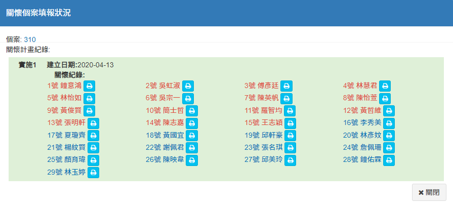
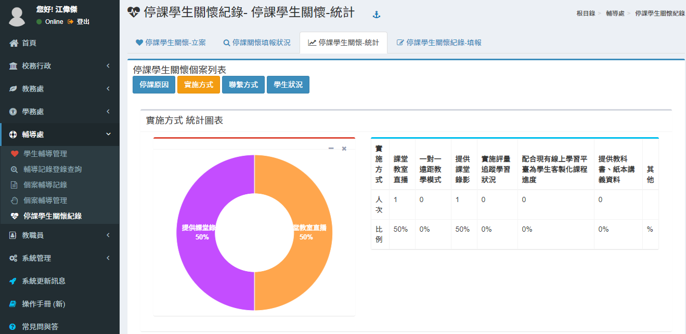

# 停課學生關懷紀錄



### 停課學生關懷紀錄列表

* 新增**個案資料**     1.輸入**案名** 2.選擇**停課原因** 3.輸入**原因簡述** 4.選擇**開始/結束日期** 5.選擇**停課對象** 6.填寫以上資料後請**`存檔`** 7.若要關閉視窗請點擊**`關閉`** 8.若該案**已結案**，**請打勾** 
* 修改**個案資料**
* 刪除**個案資料**
* 檢視**個案填報狀況**  


建議區別立案者與填報者的權限功能。




### **關懷紀錄填報狀況**

* 選擇案名
* 瀏覽個案填報狀況



### 了解各項統計數據分布狀況

#### 停課原因 統計圖表

#### 實施方式 統計圖表

#### 聯繫方式 統計圖表

#### 學生狀況統計圖表




### 停課學生關懷紀錄填報

1. **新增學生關懷紀錄**    一.選擇實施起訖日期 二.填寫實施的科目 三.填寫實施的方式 四.填寫實施方式說明 五.填寫完畢請`存檔` 六.點選`關閉`可離開新增視窗 
2. **可編輯學生關懷紀錄** 
3. **導師填寫關懷紀錄**  

    **** 

   > * 填寫`輔導措施`
   > * 填寫`聯繫狀況`
   > * 填寫`學生狀況`

4. **刪除紀錄**
5. **可將停課關懷紀錄複製至輔導訪談紀錄**   ****



