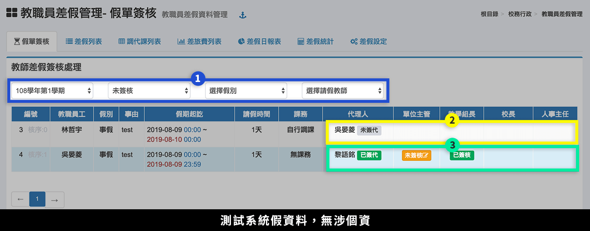
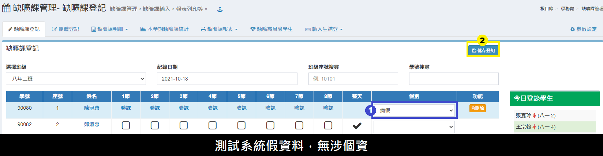
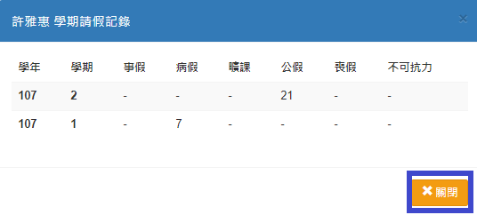
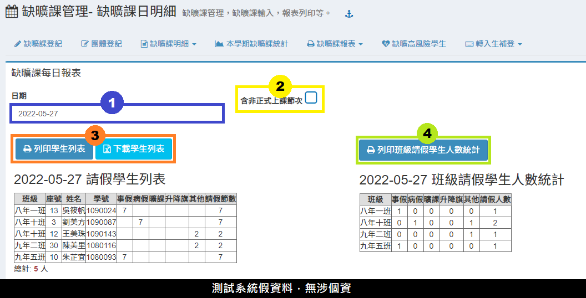
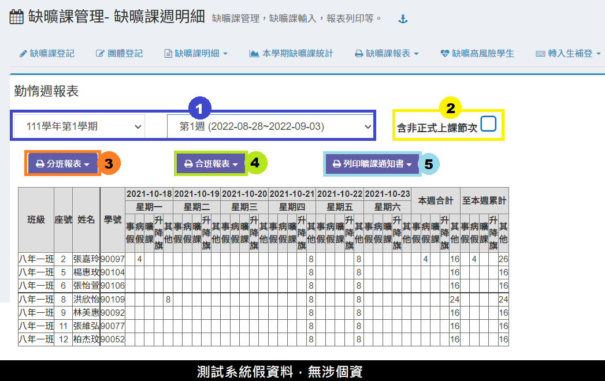
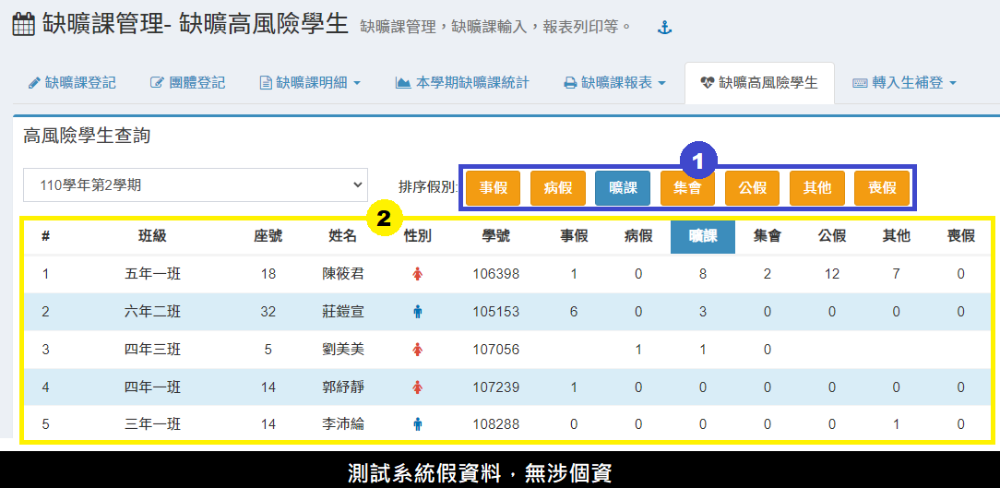
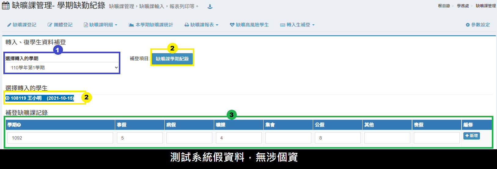
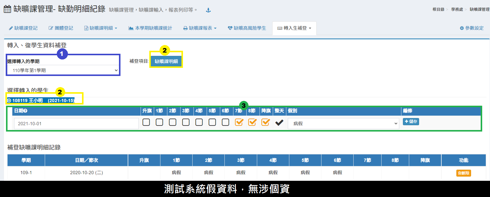
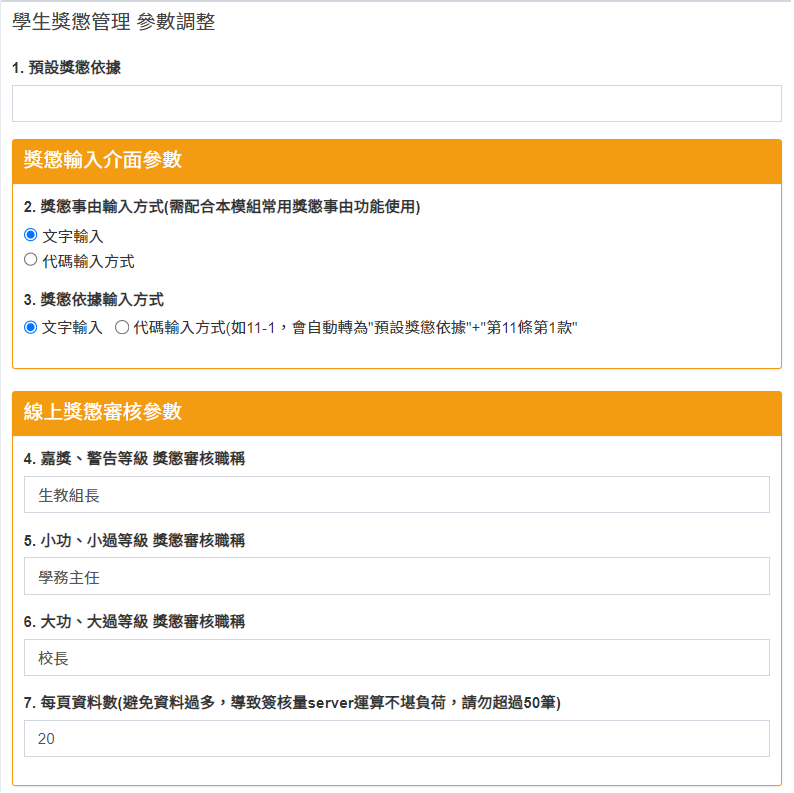

# 缺曠課管理

## 缺曠課登記

1. 請先選擇班級及要登錄之日期。
2. 依照請假學生請假節數及假別個別登錄。如果學生請假一天，可以點選該生整天打勾按鈕。
3. 登錄完畢請按 「**儲存登記**」 按鈕。
4. 可**「刪除」**已登錄的缺曠紀錄，或**「新增註記」**。


整天有無包含升降旗請至[ 參數設定 ](que-guan-li.md#can-shu-she-ding)中調整，如含升降旗，可勾選右方整天是否含升降旗。


### 修改假別

1. 找到學生缺曠紀錄，調整**「假別選單」**。
2. 按下**「儲存登記」**。

## 團體登記

> 提供當學期團體缺曠登錄功能。適合處理較多學生請相同假別(如團體比賽)之登錄。

.png>)

1. 請先選擇要登錄之**「缺曠課日期」**。&#x20;
2. 可以利用學號搜尋學生登錄，適合團體登錄名單班級較分散時操作。&#x20;
3. 點擊**「選擇學生」**，會跳出選擇畫面，如下圖。\
   可個別選擇或全選班級學生，也可更換班級繼續選擇學生，選擇完畢後儲存。
4. 此處顯示所選學生人數及姓名，如要去除可直接點選姓名右方**「刪除」**圖示移除該學生
5. 於登錄日期內選擇節次、整天或多天作設定。&#x20;
6. 請選擇**「請假假別」**。&#x20;
7. 完成設定後，請按 **「儲存登記」**，已完成儲存資料。


請注意！團體登記僅提供本學期資料登錄，不提供非本學期缺曠課紀錄補登。


## 缺曠課明細

### 缺曠課明細

> 本功可列出全班或個人缺曠課明細。

1.請先選擇**「班級」**，不選擇學生。\
2.請輸入統計日期期限，下方即會列出全班明細。點擊「**學生姓名」**即可跳至步驟4。\
3.也可以利用班級座號或是學號搜尋學生缺曠課明細。

<figure><figcaption></figcaption></figure>

4.輸入完畢後下方會分別列出請假明細及請假類別統計時數統計。\
5.按 「**友善列印**」可以列印出該生個人勤惰明細表。\
6.如需修改假別，可於列表右方勾選**「選取」**，並於上方選擇修改假別後，按 「**修改**」以改變假別。\
7.如需個別修改單一節次，請於該**「節次假別」**以滑鼠連續點擊兩次，即可進行個別修改。


統計國中以節數為統計單位；國小以日數為統計單位，不足1日不列入統計；集會只統計升降旗曠課的學生。


### 缺曠課統計明細

> 此功能為列印班級學生缺曠課假別統計

1. 選擇**「班級」**。
2. 選擇**「開始日期」**以及**「結束日期」**。
3. 操作完上述兩項動作後，頁面將呈現班級假別統計表，即可**「列印」**。

## 本學期缺曠課統計

此功能可以檢視當學期各班缺曠課紀錄以及學生個人歷年紀錄。

1. 選擇班級。
2. 點擊「**學生姓名**」可以檢視學生各個學期缺曠課次數統計，如下圖。\
   &#x20; \
   \*點擊「**關閉**」可以回到原來的頁面。
3. 列印本學期缺曠課統計表。

## 缺曠課報表

### 缺曠課日明細

> 本功能提供列印每日請假學生資料及班級學生請假統計。

1. 請選擇**「日期」**。
2. 可勾選**「含非正式上課節次」**，統計含非正式課程的缺曠紀錄。
3. 點擊**「列印」**可列印每日學生或班級的缺曠課日報表。


* 如要顯示防疫假，請於本模組[參數設定](que-guan-li.md#can-shu-she-ding)中設定"週報表列印包含防疫假"。
* 含非正式上課節次需於[學期初設定－節次](../jiao/qi-chu-ding.md#bian-xiu-jie-ci)中設定節次，並勾選**「登錄缺曠課」**。


### 缺曠課週明細

本功能提供列印以及下載週報表列印功能，請選擇要列印周次。

1. 請選擇**「學期」**及**「週次」**
2. 點擊**「分班列印」**可列印／下載各班週報表提供各班張貼。
3. 也可點擊**「合班列印」**列印／下載合班週報表提供全校公告。
4. 點擊**「列印曠課通知書」**，可列印各學生通知家長通知書。


如週報表要列印防疫假，請於本模組[參數設定](que-guan-li.md#can-shu-she-ding)中設定"週、月報表列印包含防疫假"。


### 缺曠課月報表

.png>)

1. 請選擇**「學期**」、**「統計月份」**及**「統計起訖日」**。
2. 點擊**「分班列印」**可列印／下載各班月報表提供各班張貼。&#x20;
3. 點擊**「合班列印」**列印／下載合班週報表提供全校公告。


如月報表要列印防疫假，請於本模組[參數設定](que-guan-li.md#can-shu-she-ding)中設定"週、月報表列印包含防疫假"。


### 班級歷年缺曠課統計報表

1. 請選擇**「班級」**。
2. 點擊**「列印」**可列印班級歷年缺曠課統計報表。

## 缺曠高風險學生

本功能依各項假別查詢請假排序，以提供學生請假狀況，觀察是否列入高風險個案之可能，預防中輟情狀發生。


* 資料顯示為學期缺曠課記錄
* 國中以節數為統計單位; 國小以日數為統計單位


## 轉入生資料補登

### 學期缺勤紀錄

1. 選擇**「轉入學期」**。
2. 選擇轉入學生並進行缺曠課補登。
3. 根據對應的欄位填入學生缺曠課紀錄並**「新增」**。


學期請輸入學年+學期別, 如: 99學年第1學期, 則輸入 991 。


### 缺勤明細紀錄

1. 選擇**「轉入學期」**。
2. 選擇轉入學生並進行缺曠課補登。
3. 根據對應的欄位勾選學生缺曠課紀錄並**「儲存」**。


* 學期會由請假日期自動判別學期。
* 如果選擇之節次原有其他假別將會被新的假別覆蓋。


## 參數設定

點選「**參數設定**」後，進入參數設定頁面

1. 可以進行各項參數的調整。
2. 操作完點擊「儲存設定」即可完成。
