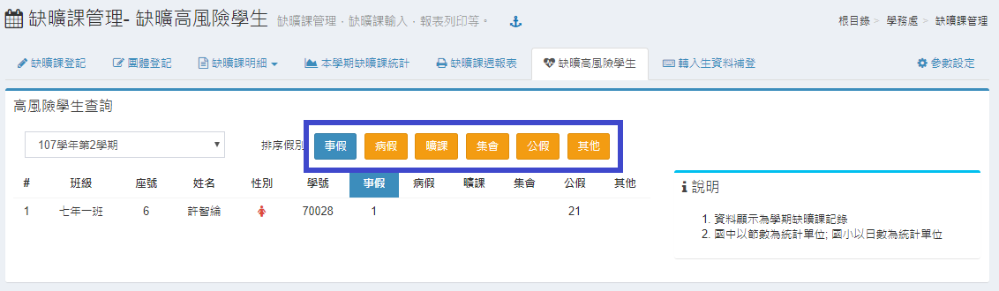

# 缺曠課管理

## 缺曠課登記

1. 缺曠課登記只能處理當學期學生缺曠課資料，請先選擇班級及要登錄之日期。
2. 依照請假學生請假節數及假別個別登錄。
3. 登錄完畢請按 「**儲存登記**」 按鈕。
4. 如果學生請假一天，可以點選該生整天打勾按鈕，但需請設定整天有無包含升降旗，勾選後也可以針對個別節次或升降旗修改。
5. 可以快速輸入學號及班級座號找到登錄學生登錄缺曠課。

### 修改假別

1. 找到學生缺曠紀錄，調整**「假別選單」**。
2. 按下**「儲存登記」**。

## 團體登記

1.本功能適合於輸入較多學生請相同假別(如團體比賽)之登錄，請先選擇要登錄之日期。\
2.可以利用學號搜尋學生，適合單一假別登錄之操作。\
3.請先選擇學生，請按 「**選擇學生**」 按鈕。

4.於跳出視窗內選擇班級。\
5.請選擇該班學生，可個別選或選全班，也可更換班級繼續選擇學生。\
6.完成選擇學生後，請按 「**確定選擇**」會自動關閉視窗回到上一頁。

.png>)

7.在視窗內右方會出現上一步驟所選學生人數及姓名，如要去除可直接點選姓名右方「**刪除**」圖示移除該學生\
8.於登錄日期內選擇節次、整天或多天作設定。\
9.請選擇請假假別。\
10.完成設定後，請按 「**儲存登記**」，已完成儲存資料。

## 缺曠課明細




1.本功可列出全班或個人缺曠課明細，統計國中以節數為統計單位;國小以日數為統計單位，不足1日不列入統計;集會只統計升降旗曠課的學生列出全班明細，請先選擇班級，不選擇學生。\
2.請輸入統計日期期限，下方即會列出全班明細。\
3.可以利用班級座號或是學號搜尋學生缺曠課明細

4.選擇個別學生下方會分別列出請假明細及請假類別統計時數統計。\
5.按 「**友善列印**」可以列印出該生個人勤惰明細表。\
6.如需修改假別，可於列表中選擇欲修改之項目，點選假別，並按 「**修改**」以改變假別。



此功能為列印班級學生缺曠課假別統計

1. 選擇班級。
2. 選擇開始日期以及結束日期。
3. 操作完上述兩項動作後，頁面將呈現班級假別統計表，即可列印。



## 本學期缺曠課統計

此功能可以檢視當學期各班缺曠課紀錄以及學生個人歷年紀錄。

1. 選擇班級。
2. 點擊「**學生姓名**」可以檢視學生各個學期缺曠課次數統計，如下圖。\
     \
   \*點擊「**關閉**」可以回到原來的頁面。
3. 列印本學期缺曠課統計表。

## 缺曠課週報表

本功能提供列印以及下載週報表列印功能，請選擇要列印周次。

1. 按「**分班列印**」可列印各班周報表提供各班張貼。
2. 也可按「**合班列印**」提供全校公告。
3. 按「**列印通知書**」，可列印各學生通知家長通知書。

## 缺曠高風險學生

本功能依各項假別查詢請假排序，以提供學生請假狀況，觀察是否列入高風險個案之可能，預防中輟情狀發生。

## 轉入生資料補登

1. 選擇轉入學期。
2. 選擇轉入學生並進行缺曠課補登。
3. 根據對應的欄位填入學生缺曠課紀錄並新增。


學期請輸入學年+學期別, 如: 99學年第1學期, 則輸入 991 。


## 參數設定

點選「**參數設定**」後，進入參數設定頁面

.png>)

1. 可以進行各項參數的調整。
2. 操作完點擊「儲存設定」即可完成。
