# 日常成績管理

## 統計日常成績

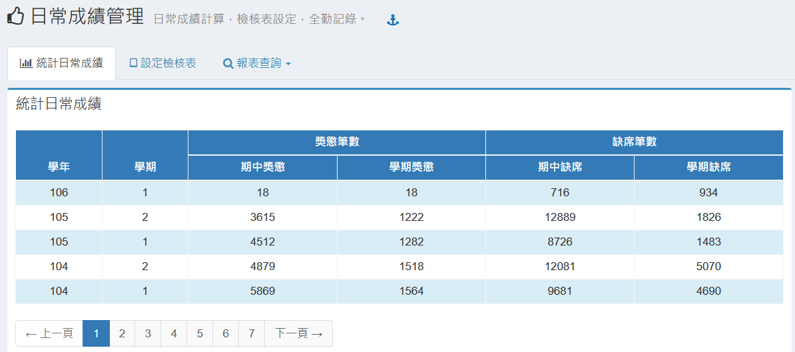

本項作業列出各學期之獎懲及缺勤統計。

## 日常描述文字輸入

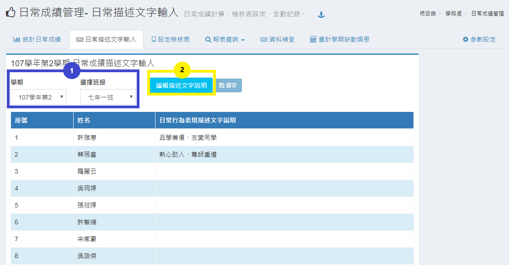

1.選擇學期和班級。  
2.點擊「**編輯描述文字說明**」並輸入文字，如下圖。

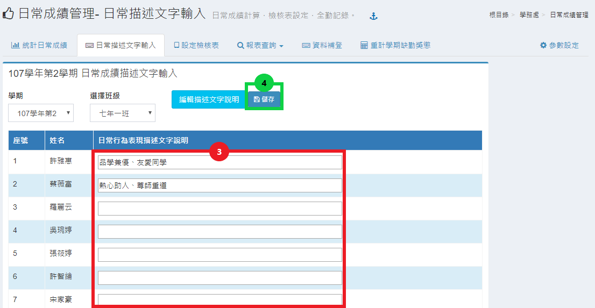

3.在欄位中輸入學生日常行為表現描述文字說明。  
4.輸入完點擊「**儲存**」即可完成操作。

## 設定檢核表

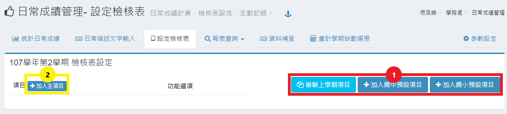

1.可以選擇系統提供的國中及國小預設項目或是複製學校上學期的設定。  
2.增加主項目\(如圖示項目:愛整潔、守秩序..\) 請按「**加入主項目**」按鈕，於輸入文字之後按「**OK**」按鈕，即可加入主項目，如下圖。  

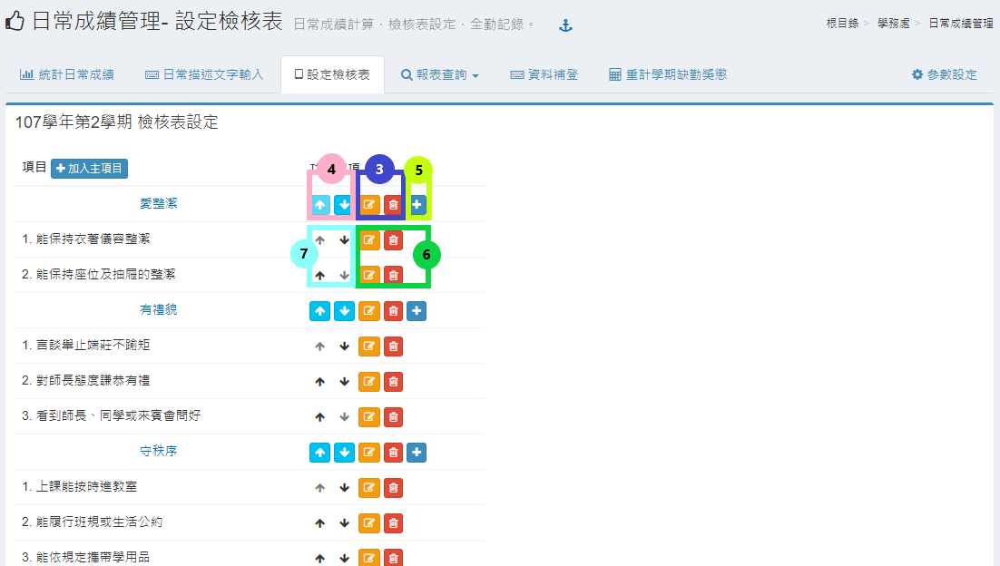

3.主項目右方之編輯按鈕，可以修改主項目名稱，刪除按鈕可以刪除主項目，但是必須主項目下沒有附屬項目才可刪除。  
4.主項目右方之上下按鈕，是可以調整主項目之順位。當主項目順位調整時，附屬項目會隨著主項目一起調整。  
5.主項目右方之加號按鈕，可以增加附屬項目\(如圖式主項目 愛整潔 下之 能保持衣著儀容整潔\)。  
6.附屬項目右方之編輯按鈕，可以修改附屬項目名稱，刪除按鈕可以刪除附屬項目。  
7.附屬項目右方之上下按鈕，是可以調整附屬項目之順位。

## 報表查詢



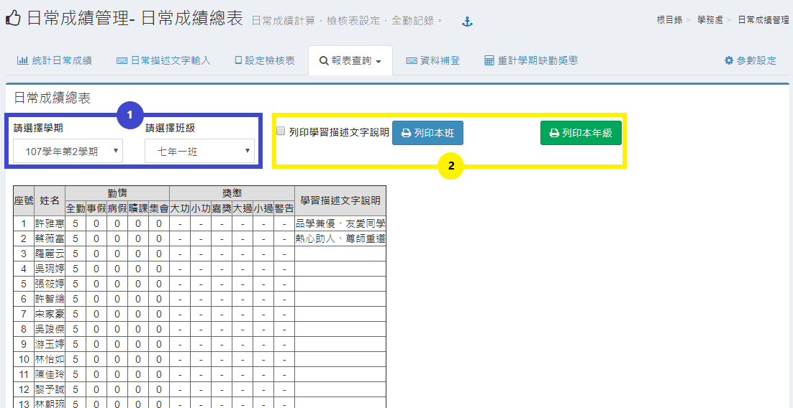

1. 選擇學期與班級。
2. 選擇列印「**本班**」或「**本年級**」可勾選是否列印學習描述文字說明。




1. 本功能提供列印學生學習行為表現學期通知單，請先勾選要列印之項目。
2. 另外也提供核章選項可以選擇是否要勾選。
3. 設定列印通知單之標題。
4. 設定通知單加註文字，文字內容可以純文字或以HTML標籤進行格式設定標註。
5. 點選列印班級或按「**全選**」按鈕選擇全部班級，再按「**選好送出**」按鈕即可列印。



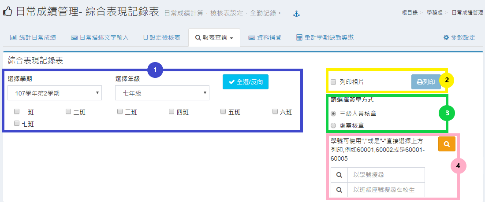

1. 選擇學期、年級、班級。
2. 選擇完畢後即可點擊「**列印**」；若須相片，請勾選「**列印相片**」。
3. 可以選擇「**三級人員核章**」或「**處室核章**」。
4. 可以以「**學號**」或是「**班級座號**」搜尋學生。



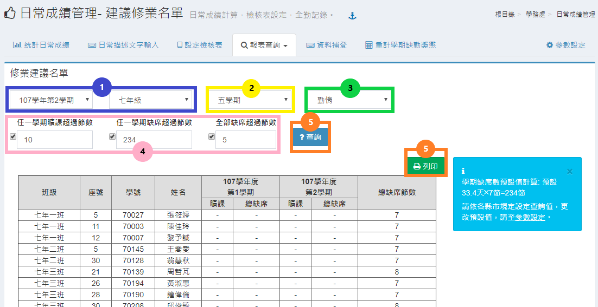

1. 選擇學期與年級。
2. 可選擇「**五學期**」或「**六學期**」。
3. 可選擇「**勤惰**」或「**獎懲**」。
4. 可依各校設定曠課或缺席的次數進行查詢。
5. 點選「**查詢**」會依上述之設定，列出相關資料；也可點擊「**列印**」，列印出篩選後的資料。



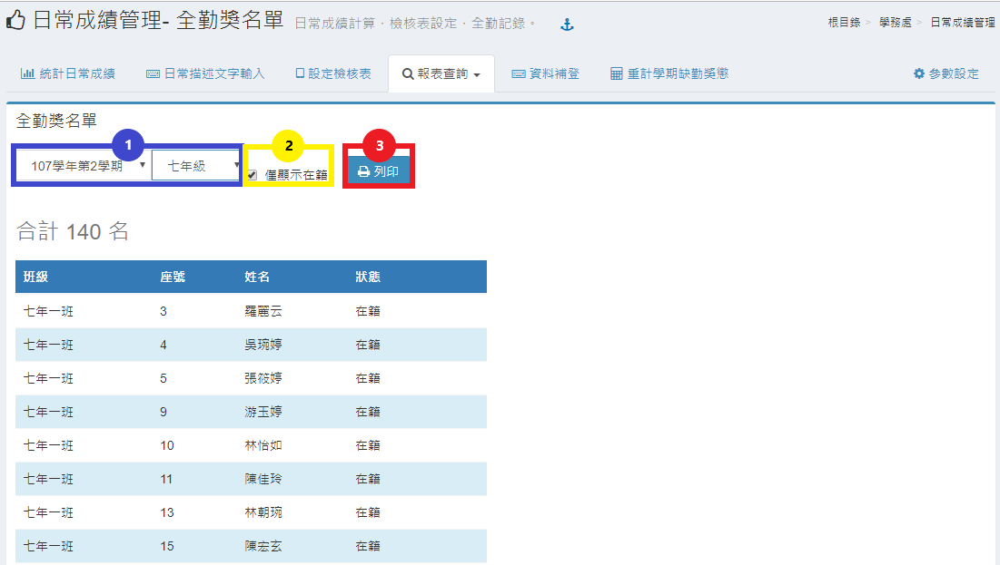

1. 選擇學年度以及年級。
2. 提供列印查詢學生全勤獎名單，請選擇是否僅選擇在籍學生。
3. 按「**列印**」按鈕即可列印。



## 資料補登

1. 選擇學期。
2. 選擇學生。
3. 輸入學期以及日常描述文字。
4. 若須刪除補登紀錄，請點擊「**刪除**」即可。


學期請輸入學年+學期別，如: 99學年第1學期, 則輸入 991。


## 重計學期缺勤獎懲

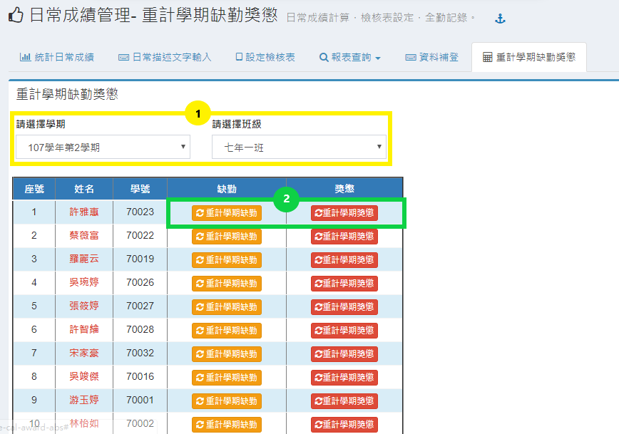

1. 選擇學期與班級。
2. 可以針對學生個人缺勤和獎懲進行重新計算，須按下「**重計學期缺勤**」或「**重計學期獎懲**」即可重計。

## 參數設定

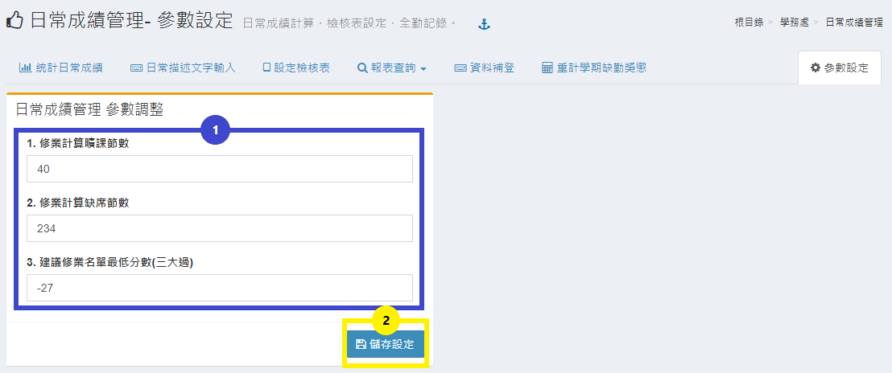

1. 可以進行曠課、缺席的修業計算，也可以調整建議修業名單的最低分數。
2. 設定完參數後，點擊「**儲存設定**」即可完成操作。

