# 日常成績管理

## 統計日常成績

本項作業列出各學期之獎懲及缺勤統計。

## 日常描述文字

### 日常描述文字輸入

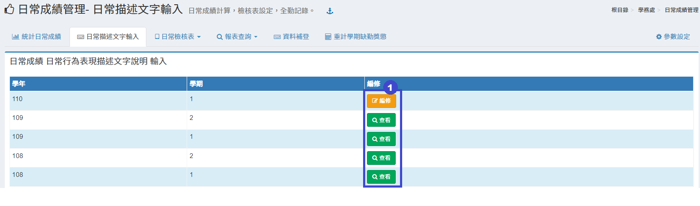

1.選擇編輯本學期或查看舊學期資料。

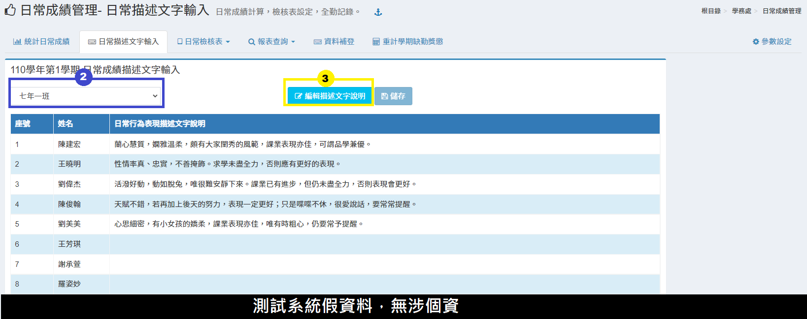

2.選擇**「班級」。**\
3.點擊「**編輯描述文字說明**」並輸入文字，如下圖。

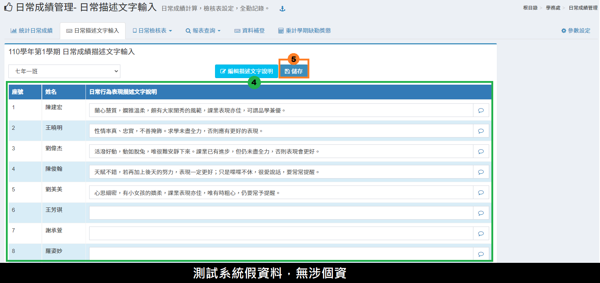

4.在欄位中輸入學生日常行為表現描述文字說明。\
5.輸入完點擊「**儲存**」即可完成操作。


如需編輯非本學期資料，請至[參數設定](ri-chang-cheng-guan-li.md#can-shu-she-ding)更改權限。


### 日常描述輸入狀況

<figure>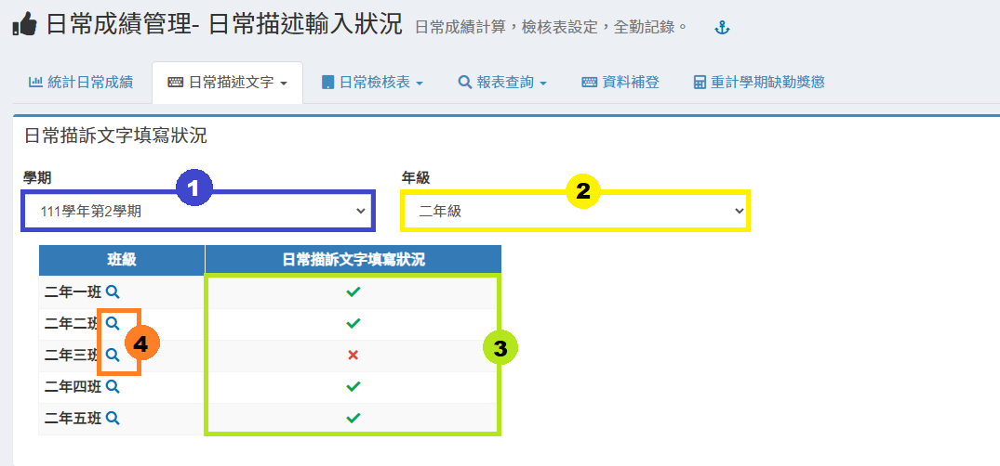<figcaption></figcaption></figure>

1. 選擇**「學期」**。
2. 選擇**「年級」**。
3. 此處顯示各班日常描述文字輸入情況。
4. 點擊**「放大鏡」**圖示，可查看班級日常描述文字內容列表。

## 日常檢核表




日常生活檢核表僅可處理當學期作業，無法處理非本學期內容。


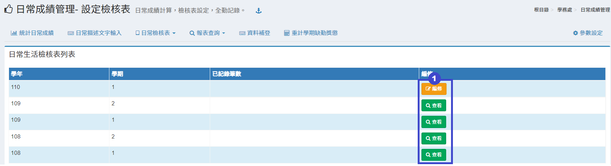

1.選擇編輯本學期或查看舊學期資料後進入編修畫，如下圖。

1.可以選擇系統提供的國中及國小預設項目或是複製學校上學期的設定。\
2.增加主項目(如圖示項目:愛整潔、守秩序..) 請按「**加入主項目**」按鈕，於輸入文字之後按「**OK**」按鈕，即可加入主項目，如下圖。

&#x20;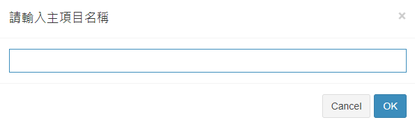&#x20;

3.主項目右方之編輯按鈕，可以修改主項目名稱，刪除按鈕可以刪除主項目，但是必須主項目下沒有附屬項目才可刪除。\
4.主項目右方之上下按鈕，是可以調整主項目之順位。當主項目順位調整時，附屬項目會隨著主項目一起調整。\
5.主項目右方之加號按鈕，可以增加附屬項目(如圖式主項目 愛整潔 下之 能保持衣著儀容整潔)。\
6.附屬項目右方之編輯按鈕，可以修改附屬項目名稱，刪除按鈕可以刪除附屬項目。\
7.附屬項目右方之上下按鈕，是可以調整附屬項目之順位。




日常生活檢核表僅可處理當學期作業，無法處理非本學期內容。


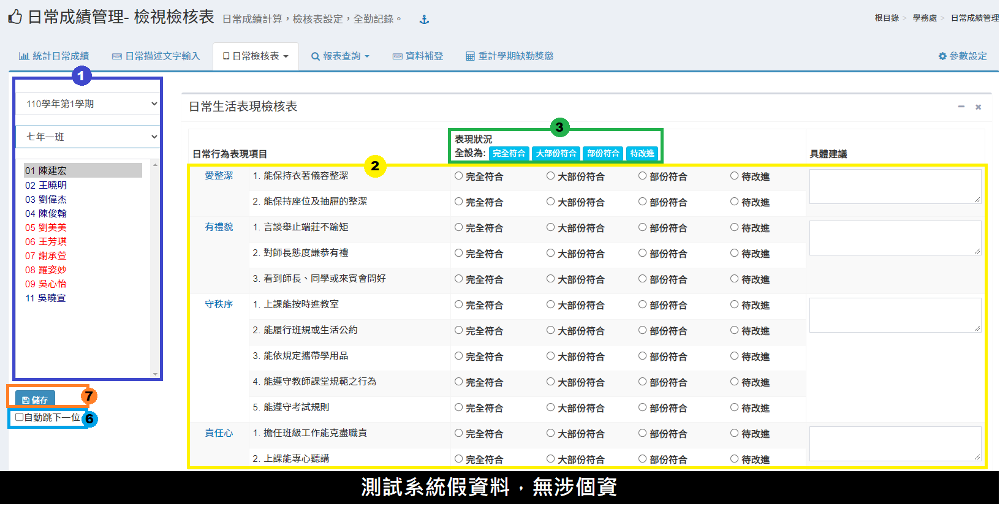

1.選擇**「學年度」**、**「班級」**、**「學生」**&#x20;

2.勾選該生日常表現行為項目及填入具體建議

3.可點選表現狀況一鍵預設該生表現後再進行個別修改

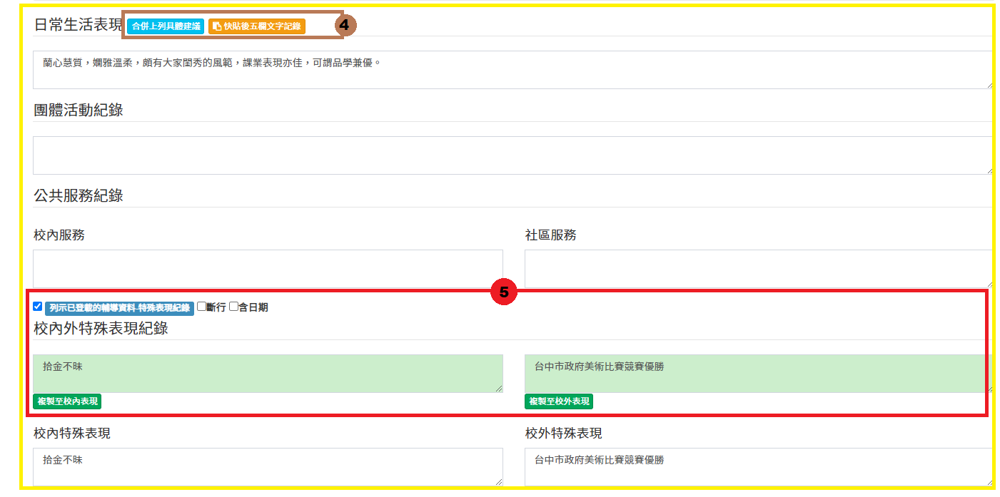

4.點擊**「合併上列具體建議」**，可將具體建議將匯入日常生活表現欄位，或點擊**「快貼」**依使用說明快速編輯後五欄文字紀錄。

5.勾選**「列示已登載的輔導資料」**及其條件，將顯示輔導紀錄特殊表現紀錄於下方綠色框欄內，點擊**「複製至校內／校外表現」**系統會將該紀錄自動匯入至下方特殊表現文字欄內。

6.可勾選自動跳下一位，將於儲存後直接跳下一位學生。

7.點擊**「儲存」**，儲存該次編輯。



## 報表查詢




1. 選擇學期與班級。
2. 選擇列印「**本班**」或「**本年級**」可勾選是否列印學習描述文字說明。



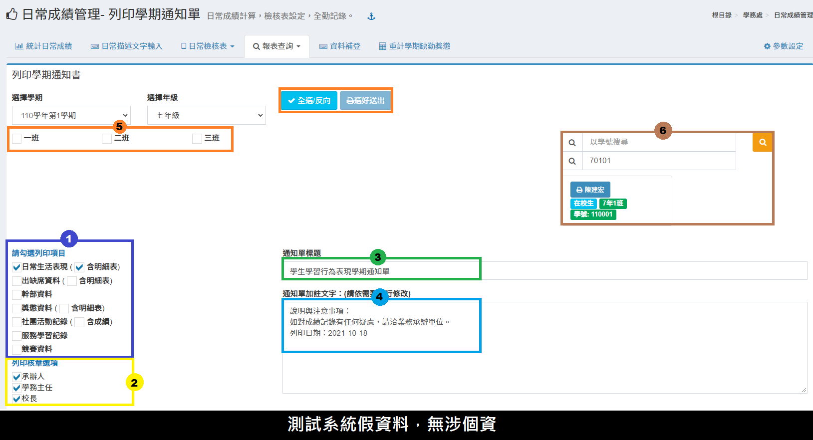

1. 本功能提供列印學生學習行為表現學期通知單，請先勾選要列印之項目。
2. 另外也提供核章選項可以選擇是否要勾選。
3. 設定列印通知單之標題。
4. 設定通知單加註文字，文字內容可以純文字或以HTML標籤進行格式設定標註。
5. 點選列印班級或按「**全選**」按鈕選擇全部班級，再按「**選好送出**」按鈕即可列印。
6. 亦可用學號或班級座號查詢，個別列印學生學期通知書




1. 選擇學期、年級、班級。
2. 選擇完畢後即可點擊「**列印**」；若須相片，請勾選「**列印相片**」。
3. 可以選擇「**三級人員核章**」或「**處室核章**」。
4. 可以以「**學號**」或是「**班級座號**」搜尋學生。




此模組為國中端功能。


1. 選擇學期與年級。
2. 可選擇「**五學期**」或「**六學期**」。
3. 可選擇「**勤惰**」或「**獎懲**」。
4. 可依各校設定曠課或缺席的次數進行查詢。
5. 點選「**查詢**」會依上述之設定，列出相關資料；也可點擊「**列印**」，列印出篩選後的資料。


請依各縣市規定設定查詢值，欲更改預設值，請至[參數設定](https://demo.cloudschool.tw/behavior/behavior-params)。




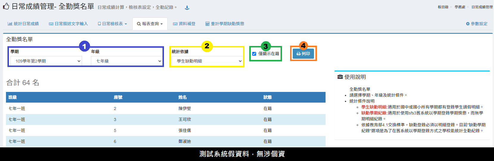

1. 選擇學年度及年級。
2. 選擇統計依據：學生缺勤明細、缺勤學期紀錄。
3. 提供列印查詢學生全勤獎名單，請選擇是否僅選擇在籍學生。
4. 按「**列印**」按鈕即可列印。


統計條件說明

* 學生缺勤明細:適用於國中或國小所有學期都有登錄學生請假明細。
* 缺勤學期紀錄:適用於使用sfs3舊系統以學期登錄學期獎懲，而無學期明細紀錄。
* 依據教育部4.1交換標準，缺勤登錄必須以明細登錄。目前"缺勤學期紀錄"選項是為了在舊系統以學期登錄方式之學校能統計全勤紀錄。




## 資料補登

.png>)

1. 選擇學期。
2. 選擇學生。
3. 輸入學期以及日常描述文字。
4. 若須刪除補登紀錄，請點擊「**刪除**」即可。


學期請輸入學年+學期別，如: 99學年第1學期, 則輸入 991。


## 重計學期缺勤獎懲

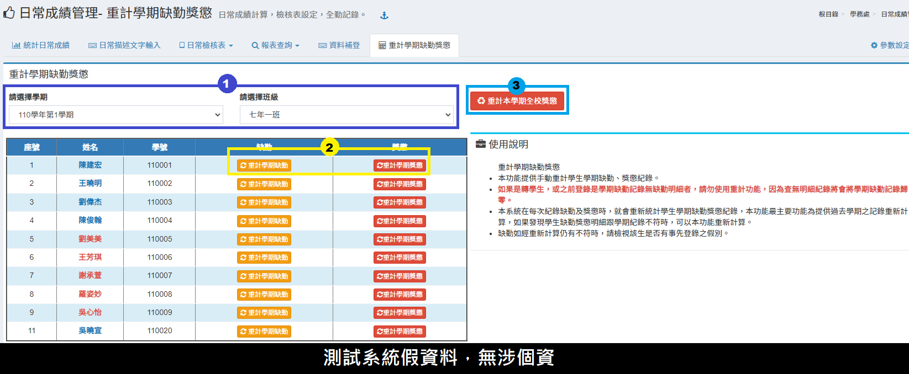

1. 選擇學期與班級。
2. 可以針對學生個人缺勤和獎懲進行重新計算，按下「**重計學期缺勤**」或「**重計學期獎懲**」即可重計。
3. 可點擊**「重計本學期學校獎懲」**，重計所有本學期學生獎懲。

## 參數設定

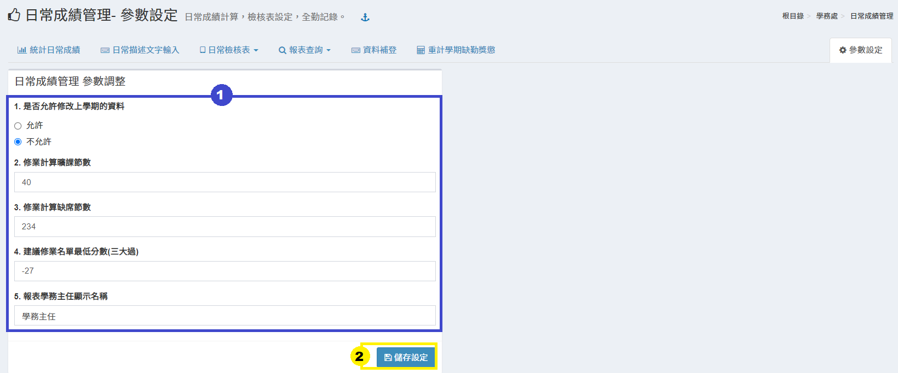

1. 可以設定修改非本學期資料權限及進行曠課、缺席的修業計算，也可以調整建議修業名單的最低分數。
2. 設定完參數後，點擊「**儲存設定**」即可完成操作。
