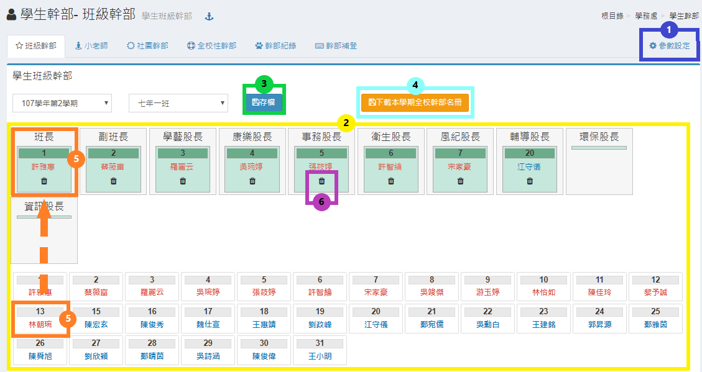
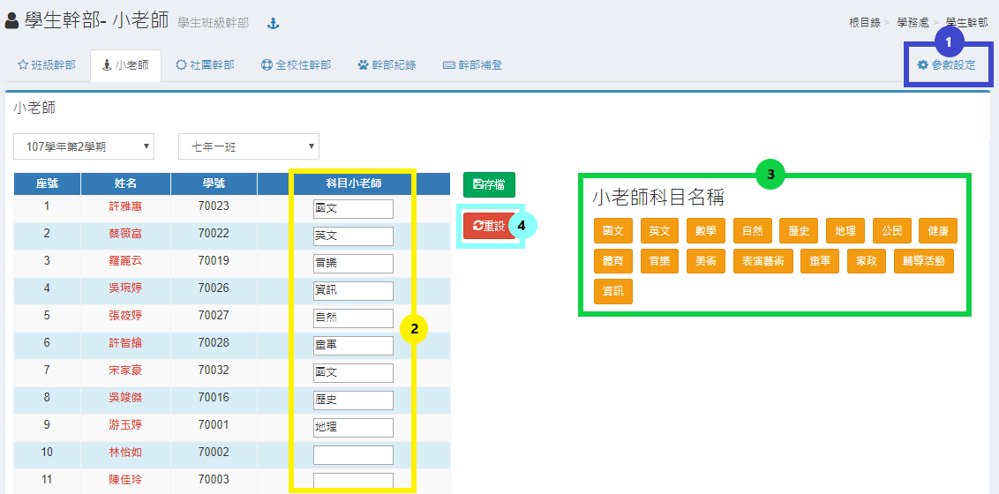
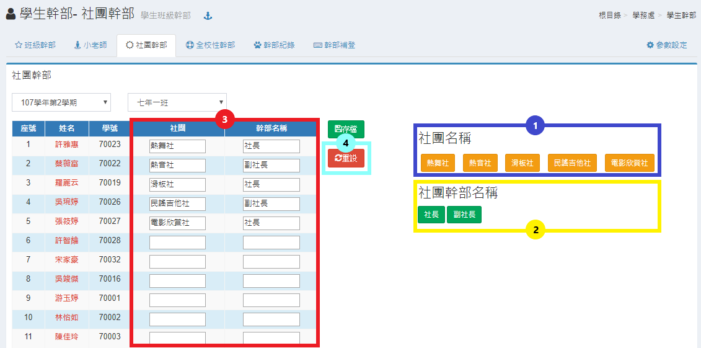
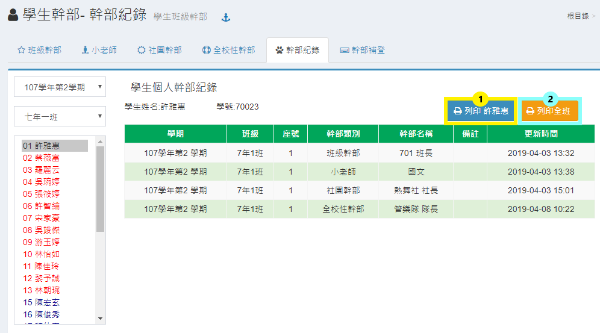
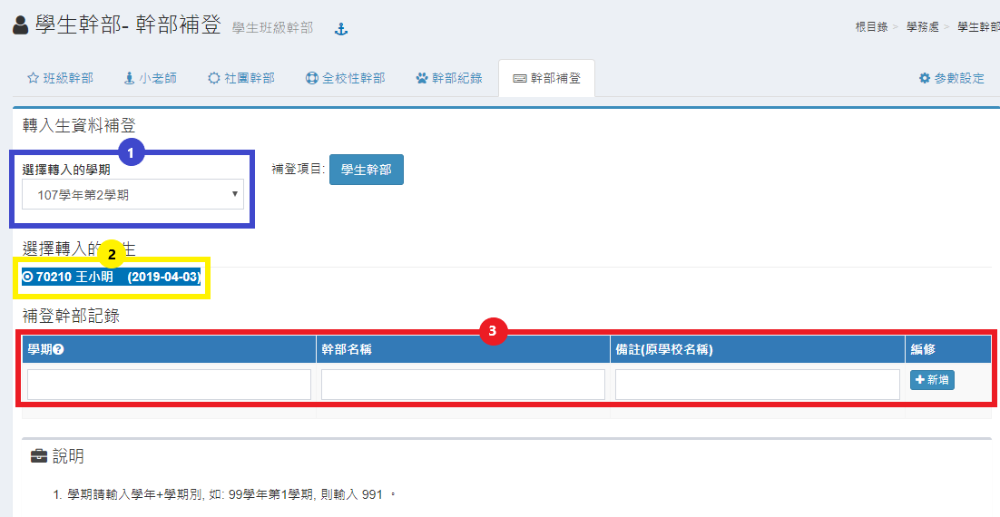

# 學生幹部

## 班級幹部

1. 班級幹部名稱若不符合貴校設定，請系統管理者在本模組 **&lt;&lt;參數設定&gt;&gt;** 中修改。
2. 拖拉下方學生方塊至上方職稱方塊內。
3. 設定完成後點選 **「存檔」** 保留設定。
4. 按 **「下載本學期全校幹部名冊」** 按鈕，可以下載全校分年級、全校性幹部、社團幹部 Excel 名冊
5. 要修改職稱人員，直接拉其他學生方塊至該職稱即覆蓋該設定，修改後點選 **「存檔」** 保留設定。
6. 如果要刪除該職稱人員也可點選職稱內學生學號下方之圖式刪除，修改後點選 **「存檔」** 保留設定。


1.同一個學生可以擔任不同職稱。  
2.同一個職稱若須由兩位學生擔任，請至「**參數設定**」進行操作。


## 小老師

1. 小老師科目名稱可以由本模組 **&lt;&lt;參數設定&gt;&gt;** 中增加修改。
2. 可直接於選定之學生輸入位置鍵盤輸小老師科目，同樣修改後點選 **「存檔」** 保留設定。
3. 快速輸入方式以先點選學生名字該列任何位置或輸入位置皆可，然後分別依參數設定之團體名稱及幹部名稱點選，設定完成後點選 **「存檔」**。需要修改，依上述方式點選，同樣修改後點選 **「存檔」** 保留設定。
4. 要重新輸入該班資料，可點選 **「重設」** 清空所有表單資料。


同一個科目的小老師可以由多位學生擔任。


## 社團幹部

1. 社團名稱配合本系統學校社團管理內社團設定。
2. 社團幹部名稱若不符合貴校設定，請在本模組 **&lt;&lt;參數設定&gt;&gt;** 中修改。
3. 快速輸入方式以先點選學生名字該列任何位置或輸入位置皆可，然後分別依參數設定之社團名稱及幹部名稱點選，設定完成後點選 **「存檔」**。要修改職稱人員，依上述方式點選，同樣修改後點選 **「存檔」** 保留設定。
4. 如果要重新輸入該班資料，可點選 **「重設」** 清空所有表單資料。

## 全校性幹部

1. 全校性幹部團體及幹部名稱若不符合貴校設定，請在本模組 **&lt;&lt;參數設定&gt;&gt;** 中修改。
2. 快速輸入方式以先點選學生名字該列任何位置或輸入位置皆可，然後分別依參數設定之團體名稱及幹部名稱點選，設定完成後點選 **「存檔」**。要修改職稱人員，依上述方式點選，同樣修改後點選 **「存檔」** 保留設定。
3. 如果要重新輸入該班資料，可按 **「重設」** 按鈕清空所有表單資料。

## 幹部紀錄

1. 請選擇班級及學生，右方會列出該生所有幹部紀錄，按 **「列印」** 按鈕 可列印該生紀錄。
2. 按 **「列印全班」** 按鈕可列印該班所有學生幹部紀錄。

## 幹部補登

1. 選擇學期。
2. 選擇學生
3. 學期請輸入學年 + 學期別，如：99 學年第 1 學期，則輸入 991，其他請依序填入資料，輸入一筆後可按 **「新增」** 按鈕存入資料並可繼續輸入其他紀錄。


此模組補登的資料，在幹部模組內無法查得，但成績單內可正常輸出。


## 參數設定

1.依學校班級所需，在欄位內以隔行方式輸入「**班級幹部**」職稱。  
2.依班級小老師所需，在欄位內以隔行方式輸入「**科目**」名稱。  
3.依學校各社團所需，在欄位內以隔行方式輸入「**社團幹部**」職稱。

4.依學校所需，在欄位內以隔行方式輸入「**全校性社團**」名稱。  
5.依全校性社團所需，在欄位內以隔行方式輸入「**幹部**」名稱。  
6.操作以上設定後，請點擊「**儲存設定**」完成儲存動作。

