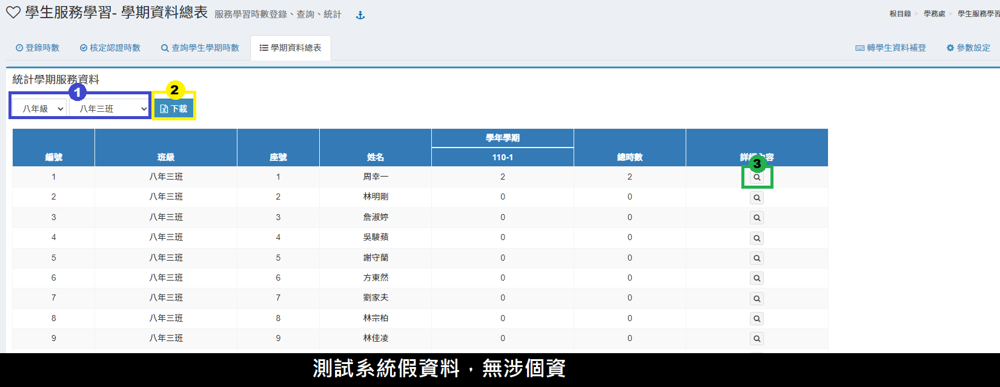

# 學生服務學習

## 登錄時數

1. 服務學習時數登錄在選擇學期之後，會在下方顯示該學期本人所新增之服務學習登錄。
2. 要新增服務學習項目，請按 **「新增服務學習項目」** 按鈕，並於跳出視窗內填入日期、登錄單位、服務類型、主辦單位、服務內容等，即會在下方顯示新增項目。
3. 如項目內容須修改，請按 **「修改」** 按鈕，在跳出視窗內進行修改。
4. 要刪除已新增之項目，可以按 **「刪除」** 按鈕，在確認後刪除。
5. 新增項目後，須新增學生，請按 **「加入學生」** 按鈕，在跳出視窗內選擇學生，選取學生可變換班級選取，輸入相關內容後按下**「登錄服務時數」**即可存入學生服務時數資料，如下圖
6.  也可點擊**「快貼匯入」**可一次登錄多筆學生服務學習時數，請參照快貼說明操作，如下圖

    
7.  在新增項目後，欲修改學生時數設定，請點按 **「顯示」** 按鈕，就會出現如同下方圖示之內容。

    
8. 採計時數可以個別輸入時間，或者按 **「預填時間」** 按鈕，先統一輸入時間後，再個別手動調整。
9. 註記文字可以個別輸入，或者按 **「預設註記」** 按鈕，先統一輸入註記後，再個別手動調整。
10. 如需要刪除某個已選擇學生時數設定，可以按 **「刪除」** 按鈕，刪除該學生之設定。
11. 所有設定／異動修改後一定要按 **「異動儲存」** 按鈕後，系統才會把資料存入。


已認證之項目無法進行編修／刪除，需先取消該項目認證方能編修／刪除該登錄紀錄。


## 核定認證時數

1. 核定認證時數會列出尚未通過認證之服務學習項目，如為本人新增項目則不會出現 **「加入認證」** 按鈕。
2. 按 **「顯示學生」** 按鈕，可以在新視窗顯示本服務學習項目之學生資料，但無法修改。
3. 要核定認證項目，可以按該項目之 **「加入認證」** 按鈕，即可認證該項目，同時該按鈕會改成 **「取消認證」** 按鈕，如果要取消可按 **「取消認證」** 按鈕。
4. 可按 **「列出已認證」** 按鈕，顯示已經通過認證之項目，其操作方法同上列所述。
5. 可按 **「列出全部」** 按鈕，顯示所有項目，其操作方法同上步驟3所述 。


登錄及核定認證人員預設為需不同教師，若要改為可同一人登錄及認證可在本模組[參數設定](sheng-fu.md#can-shu-she-ding)內調整。


## 查詢學生學期時數

1. 要查詢或列印學生服務明細總表，可選擇學期、班級以及是否顯示全部的學期紀錄。
2. 勾選學生或點選 **「全選」** 選取全部學生。
3. 按 **「列印勾選學生明細」** 按鈕，跳出新視窗，若需列印可按下 **「確定」** 鈕後列印資料，若不列印可以按 **「取消」** 直接顯示學生資料。

## 學期資料總表

1. 請選擇年級、班級，即可顯示該學期該年級所有學生之統計資料。
2. 點擊**「下載」**，可下載學生服務學習-學期總表 。
3. 點擊放大鏡圖示，可檢視學生服務時數資料。

## 轉學生資料補登

1.選擇學期。\
2.選擇學生。\
3.依照圖片中的項目，補登學生在他校的服務學習內容。\
4.若要刪除學生補登紀錄點擊「**垃圾桶**」即可刪除。

5.選填完以上項目後，點選「**確認新增**」即可完成補登服務學習紀錄。

## 參數設定

.png>)

1.  設定服務學習可以瀏覽或登錄資料的最近「**學年數**」。

    `3`
2.  設定服務時數四捨五入至「**小數第幾位**」。

    `2`
3.  設定是否允許修改非本學期之前的資料。

    `允許`

    `不允許`
4.  設定是否允許登錄者本人自行核定服務學習。

    `允許`

    `不允許`
5. 操作完以上設定，請點擊「**儲存設定**」即可完成。
