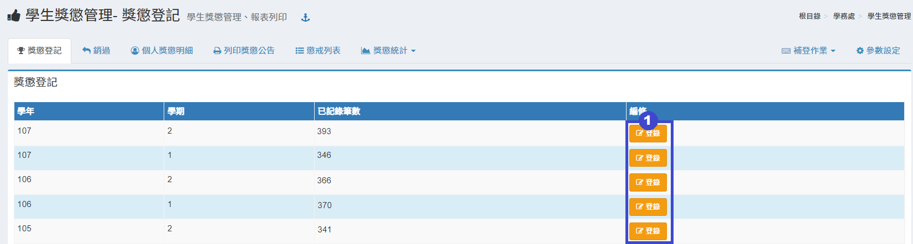
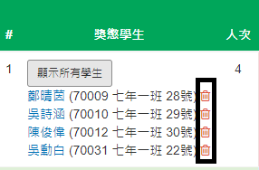
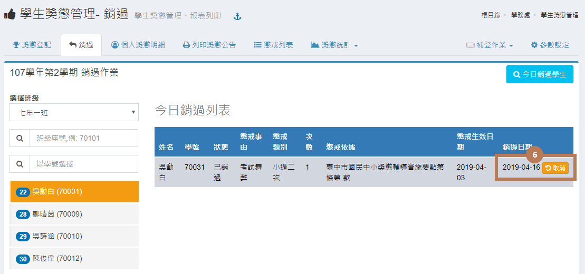
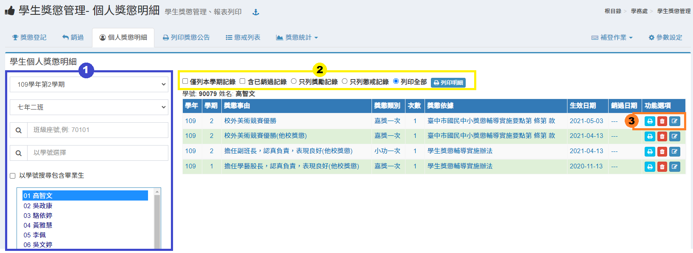
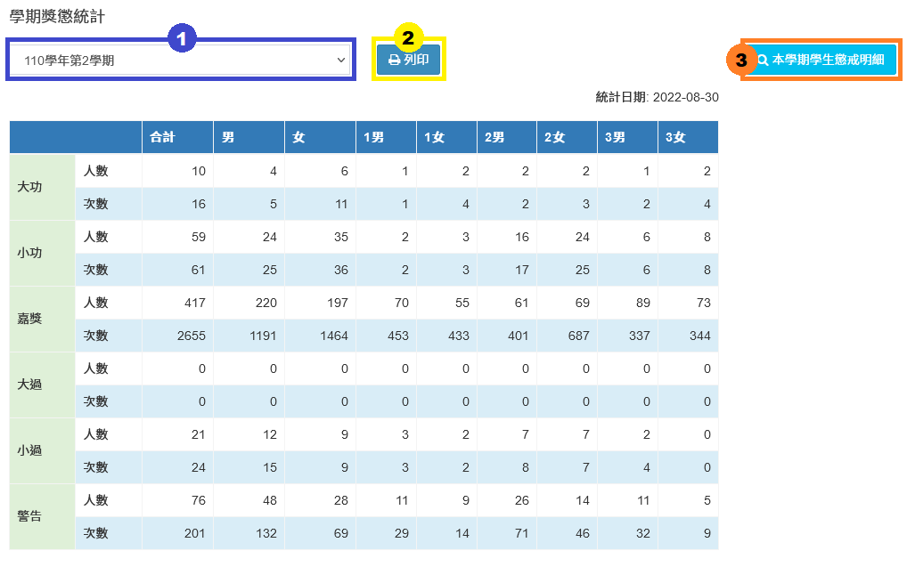
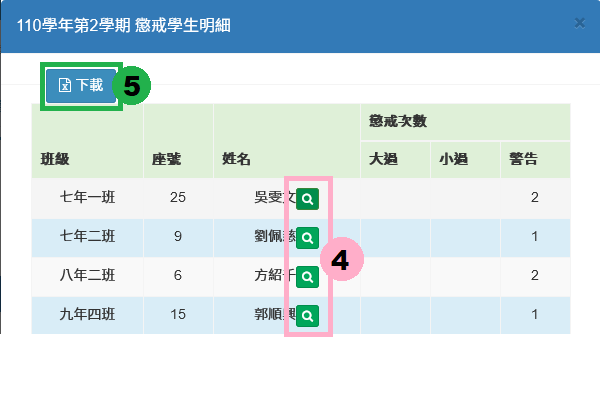
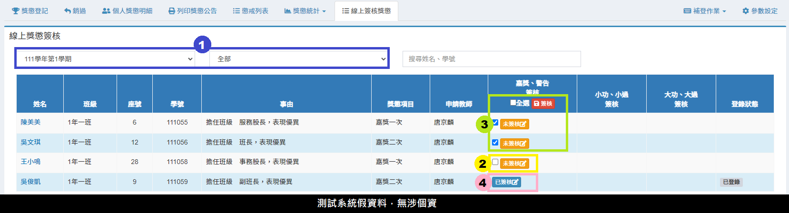
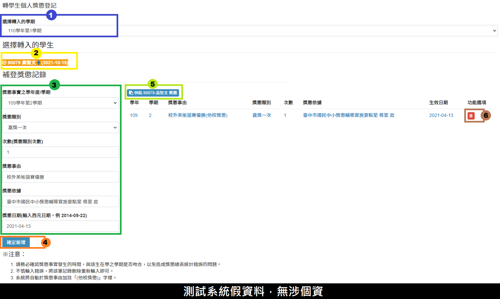

# 學生獎懲管理

## 獎懲登記

1.於學期按下 「**登錄**」 按鈕，就會出現下方圖示。

2.下方會有週次選項，點選週次其下方會顯示該週登錄之紀錄。\
3.顯示該週所登錄之記錄有哪幾種獎懲，裡面之數字代表有幾筆紀錄，點選該種獎懲可篩選顯示該種獎懲之紀錄。\
4.如果要刪除某筆學生紀錄可在「**顯示所有學生**」按下按鈕，在確認按鈕後會出現以下畫面後按下「**刪除**」按鈕即可刪除學生紀錄。  \
5.功能選項:

* 要增加某筆紀錄之學生，可按「**加入學生**」 按鈕，在跳出視窗內選擇班級、選擇學生後就可增加同筆紀錄之學生。
* 要修改該筆紀錄獎懲類別、獎懲事由等可按「**修改**」 按鈕，於修改後按確定後即可修改。
* 要刪除某筆紀錄，可按「**刪除**」 按鈕，但要注意會一併刪除該筆所有學生之紀錄，在確認視窗後會刪除該筆紀錄。
* 按「**列印**」 按鈕，可列印該筆所有學生之獎懲通知書。

6.要登錄新的獎懲，請輸入獎懲日期、獎懲類別、獎懲事由後，按「**選擇學生**」 按鈕，在跳出視窗內選擇學生，並按儲存後即可新增紀錄。

7.若有數量較大的獎懲資料，可以使用「**獎懲快貼**」的功能，從系統中下載Execl範例檔，依照「**快貼說明**」的步驟操作即可完成快貼。

## 銷過

1. 銷過功能在選擇班級後，在左方選單只顯示該班有記過紀錄之學生，也可以使用班級座號或是學號搜尋學生懲戒紀錄。
2. 點選某學生後，在右方區塊會出現該學生所有懲戒紀錄。
3. 要銷該學生某筆記過紀錄，可修改銷過日期或保持當天時間不修改後按 「**確定銷過**」 按鈕即可銷過。銷過後會出現「**取消**」 按鈕及「**列印通知單**」按鈕。
4. 若學生有較多紀錄需要銷過，請「**勾選**」記錄並點擊「**批次處理**」即可。
5. 點擊「**今日銷過學生**」可以瀏覽當日銷過記錄，如下圖。 &#x20;
6. 若要回復銷過記錄，請點擊「**取消**」即可完成。

## 個人獎懲明細

1. 獎懲明細請選擇班級後，在左方區塊先選擇學生點選某學生後，在右方區塊會出現該學生所有獎懲紀錄；也可以使用班級座號或是學號搜尋學生獎懲紀錄。
2. 請依照列印需求勾選僅列本學期記錄、 含已銷過記錄、只列獎勵記錄、只列懲戒記錄、列印全部，再按「**列印明細**」 按鈕，即可列印該生獎懲紀錄。
3. 功能選項:
   * 可列印該生某項紀錄之通知單，請按選擇之紀錄右方「**列印通知單**」按鈕即可列印通知單。
   * 可以刪除該生獎懲記錄，請點擊「**刪除**」按鈕即可完成刪除操作。
   * 也可編輯獎懲記錄，點擊「**編輯**」即可操作。

## 列印獎懲公告

1. 列印獎懲公告請選擇周次，下方會顯示該周次登錄之獎懲。
2. 點擊「**列印公告**」，會出現以下選項作為選擇:\
   _**．列印獎勵公告**_\
   _**．列印懲戒公告**_\
   _**．列印今日獎勵**_\
   _**．列印今日懲戒**_
3. 點擊「**下載檔案**」，會出現以下選擇作為選擇:\
   _**．下載獎勵公告**_\
   _**．下載全校懲戒公告**_\
   _**．下載分班懲戒公告**_\
   _**．下載今日獎勵**_\
   _**．下載今日懲戒**_
4. 可以下載當週懲戒通知書。

## 獎懲列表

1. 懲戒列表會列出有記有記過紀錄之記過統計，勾選「**含已銷過紀錄**」則會包含已銷過紀錄統計。
2. 點選學生姓名會跳出新視窗顯示該學生所有獎懲明細資料，如下圖。 &#x20;
3. 可以下載獎懲列表記錄Excel檔。

## 獎懲統計




1. 選擇學期。
2. 列印該學期獎懲統計。
3. 點擊「本學期學生懲戒明細」可查看學期懲戒學生列表，顯示單一學期有懲戒紀錄學生。
4. 點擊**「放大鏡」**可查看懲戒明細。
5. 可下載Excel檔。


學期獎懲統計會統計出所選學期所有獎懲之數量。





* 選擇學期以及班級。
* 可以選擇下載班級或是全校獎懲統計。


本功能是統計該班學生在校所有學期之獎懲數。




## 獎懲申報

## 線上簽核獎懲

> 此模組功能可線上簽核獎懲，目前系統僅開放班級幹部獎勵線上簽核。


* 簽核權限請至**「學生獎懲管理＞**[**參數設定**](sheng-guan-li.md#can-shu-she-ding)**」**中設定各獎項簽核職稱。
* 導師需於**「教職員＞導師作業＞班級幹部＞**[**班級幹部獎勵設定**](../jiao-1/zuo.md#ban-ji-gan-bu-jiang-li-she-ding)**」**設定幹部獎勵申請，此模組才可使用。


<figure><figcaption></figcaption></figure>

1. 可選擇**「學期」**、**「簽核狀態」**進行篩選。
2. 點擊**「未簽核」**按鈕，可進行個別簽核。
3. 可勾選多位選生後，點擊**「簽核」**進行批次簽核，亦可勾選**「全選」**全部簽核。
4. 再次點選**「已簽核」**可取消簽核。


* 系統會自動將已完成簽核的獎勵記錄至獎懲模組資料，無需再手動登錄，顯示於登錄狀態。
* 若**「取消審核」**已登錄之獎懲，系統將會自動刪除該筆獎懲，無需進入獎懲模組刪除紀錄


## 常用獎懲事由


此處設定的獎懲事由可套印至[獎懲登記](sheng-guan-li.md#jiang-cheng-deng-ji)但須先於參數設定中先設定**獎懲輸入介面參數-獎懲事由輸入方式**。


<figure><figcaption></figcaption></figure>

1. 點擊**「＋新增」**可新增常用獎懲事由。
2. 點擊**「編輯」**可編輯獎懲事由內容。
3. 點擊**「刪除」**可刪除該常用獎懲事由。
4. 點擊**「下載」**可下載獎懲事由列表EXCEL檔。

## 補登作業

### 轉學生個人獎懲登記

1. 選擇**「學期」**。
2. 選擇**「學生」**。
3. 依照各項目補登學生在他校的獎懲紀錄內容。&#x20;
4. 按下**「確定新增」**儲存學生在他校獎懲新增紀錄。&#x20;
5. 如學生有多筆他校獎懲紀錄，可點選**「快貼獎懲」**，並依照快貼說明操作即可。
6. 若要刪除學生補登紀錄點擊垃圾桶圖示即可刪除。


請務必確認獎懲事實發生的時間，與該生在學之學期是否吻合，以免造成獎懲總表統計錯誤的問題。


## 參數設定

<figure><figcaption></figcaption></figure>

1. 可以依各校所需調整參數設定，輸入完畢請點擊「**儲存設定**」即可完成操作。


* **「獎懲事由」**需搭配＂常用獎懲事由＂模組使用。
* **「線上獎懲審核職稱」**須與各校設定之教職員的職稱完全符合方能進行簽核作業。

