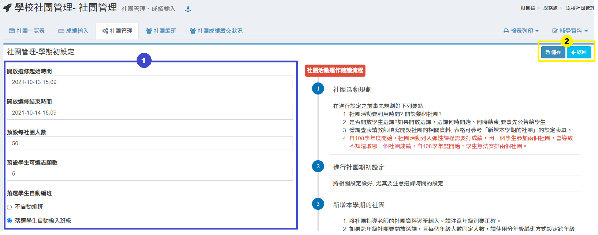
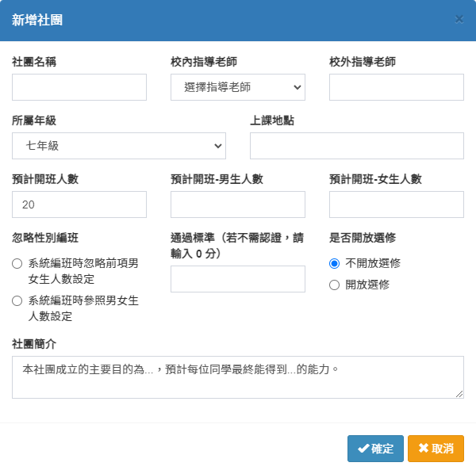
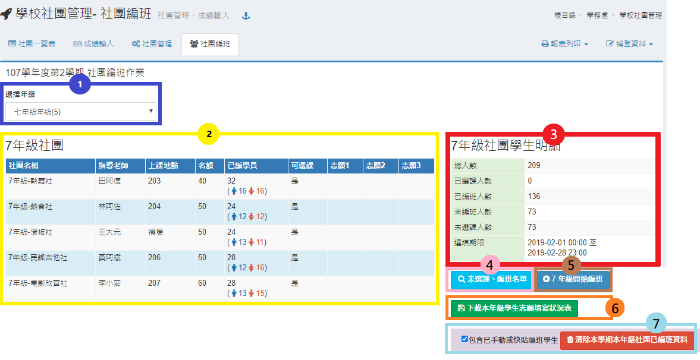
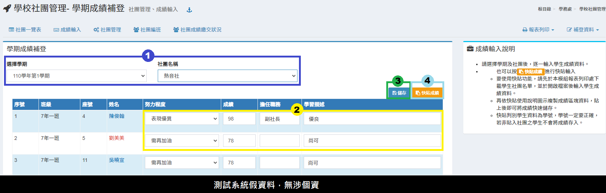
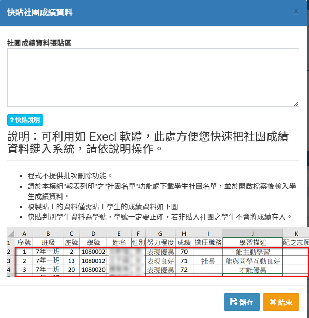

# 學校社團管理

1. 在進行設定之前事先規劃好下列要點:
   * 社團活動要利用時間? 開設幾個社團?
   * 是否開放學生選課?如果開放選課，選課何時開始、何時結束,要事先公告給學生
   * 發調查表請教師填寫開設社團的相關資料, 表格可參考「**新增本學期的社團**」的設定表單。
2.  進行社團期初設定

    > 將相關設定設好, 尤其要注意選課時間的設定
3. 新增本學期的社團
   * 將社團指導老師的社團資料逐筆輸入。請注意年級別要正確。
   * 跨年級的社團, 不建議開放選課, 請先手動直接選擇學員,再使用自動分配。
   * 如果跨年級社團仍要開放選課, 建議做法是依年級分成多個社團的方式處理。例如：合唱團是跨年級社團，可招收一年級和二年級的學生，總共要招收60位，那麼在系統這邊新增社團時，就分別針對一年級和二年級都各開設一個合唱團社團，兩個社團總人數仍維持60人即可。
4. 進行選課
   * 提醒學生，選課的地方在【**學生作業**】模組的「**社團選課**」選項中。
   * 提醒學生，選課時注意社團人數限制與已填寫志願數的情況。
   * 如果設定落選學生自編班請提醒學生，落選或未選課者，仍會強制編班。
   * 提醒學生，在選課結束前，隨時可以更改自己的志願序。所以要隨時注意自己喜歡的社團的志願填寫情況，若太熱門的社團，被選到的機率太低時，最好進行調整，以免最後全部落選，被編到不喜歡的社團。
   * 管理者隨時可從【**社團編班**】功能裡，查詢還有那些同學尚未選課。
5. 社團編班
   * 請依年級個別進行編班。
   * 原則上編班程式會盡可能依預設設定好的性別人數進行編班，但未必能符合設定的結果。例如：籃球社原本預訂招收男女生各15人，但在選填志願時，若第一志願有就有男生30人選擇，女生卻只有10人選擇，則編班的結果仍會產生男生20人，女生10人的結果。
6.  列印社團名單

    公告名單，到此已可開始社團活動的進行
7.  社團成績輸入

    如果貴校不需要打成績，請在社團設定那邊，將通過標準設為0分。
8.  學生自我省思

    提醒學生，期末結束前必須要到【**學生作業**】模組的「**社團紀錄及省思**」，填寫社團活動自我省思。

## 社團一覽表

本功能列出已設定的社團、社團教師、已編組學生等。

## 成績輸入

1. 社團指導老師可選擇自己指導的社團進行成績輸入。
2. 輸入項目包含成績、職位、學習描述。
3. 輸入完畢後請點選「**儲存**」即可完成操作。

## 社團管理

.png>)

1.  期初設定\
    &#x20;&#x20;

    ● 請逐項依照貴校需求填入資料。

    ● 儲存。\

2. 新增社團\
    \
   將社團指導老師的社團資料逐筆輸入。請注意年級別要正確。\

3. 刪除不需要的社團，請點該社團之「**刪除**」按鈕，但若該社團已有編入學生，請先刪除編入學生資料才可刪除。若要修改該社團設定，請按「**修改**」按鈕。\

4.  複製上學期社團 \
     \
    ● 複製本學期之前的社團，省去逐筆設定社團，也可一併複製該社團學生。

    ● 請先選擇要複製的社團，如果出現的是已存在，為該社團在本學期已重複。

    ● 要一併複製社團學生，請先勾選該社團，只勾選複製學生，系統不會處理。\

5.  統一設定通過分數\
    &#x20;&#x20;

    ● 本功能是將有社團同時輸入統一分數，您仍可針對個別社團進行分數調整。

    ● 學生參加社團活動，若期末評分未達此標準，則無法得到社團認證。

    ● 若貴校不需認證，則請輸入 0 分。\

6. 手動編班\
   &#x20; \
   1.選擇班級。\
   2.選擇學生，若要選擇班級所有學生，請勾選「**全選**」。\
   3.可以顯示已編班的學生狀況，若要刪除學生，請點擊「**刪除**」圖示；刪除全部學生，請點擊「**全部刪除**」。

&#x20;

## 社團編班

1. 選擇年級。
2. 可檢視各年級社團內容。
3. 可檢視各年級社團學生明細。
4. 若需檢視尚未選課和編班的學生，請點擊「**未選課、編班名單**」。\
   &#x20;
5. 學生填寫志願期限過後，就可以按**「開始編班」**按鈕，系統就開始依據社團設定及學生填之志願編班。
6. 系統提供下載各年級學生選填社團志願的狀況。
7. 若要刪除當學期社團編班記錄，請點擊「**清除鍵**」。如果要保留已經事先安排之學生編社資料，可取消勾選**"包含已手動編班學生"**，並於確認後清除資料。

## 社團成績繳交狀況

.png>)

1. 選擇**「學年」**，該學期社團成績繳交狀況將顯示於下方資訊欄&#x20;
2. 點選放大鏡圖示可顯示該社團成績輸入內容

## 報表列印



此功能可以查詢和列印班級的社團資料。

1. 選擇學年和班級。
2. 可選擇列印該班社團記錄或是該年級社團記錄。
3. 可選擇列印全校的社團記錄；若需下載檔案，系統有提供班級、年級或全校的excel檔。



此功能可以查詢和列印每個年級的社團資訊。

1. 選擇學年和年級。
2. 可列印年級社團名單以及下載社團名冊excel。



此功能可以查詢和列印學生歷年來的社團紀錄。

1. 選擇學期和班級。
2. 若有選擇全班學生，請勾選「**全選**」；若資料需含成績，請勾選「**含成績**」。
3. 操作上述動作後，請點選「**列印**」。



## 補登資料



本功能可以補登學生社團成績及學習描述。

1. 請選擇學期和社團名稱。
2. 選擇努力程度並輸入成績、職稱及學習描述。
3. 輸入完畢請點選「**儲存**」。
4. 若要一次輸入多筆資料，可以點擊「**快貼成績**」。  \
   依照「**快貼說明**」操作，即可完成作業。



本功能可以補登轉入學生之社團資料。

1. 請選擇轉入學期後，下方出現轉入生學號、姓名，請點選該生姓名，下方就會出現輸入表單。
2. 輸入後，請按「**新增**」按鈕儲存。


學期請輸入學年+學期別, 如: 99學年第1學期, 則輸入 991 。



