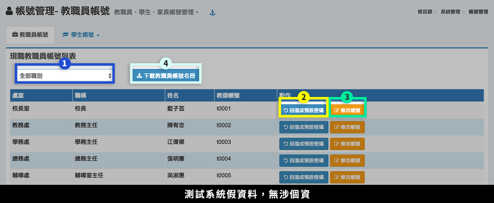
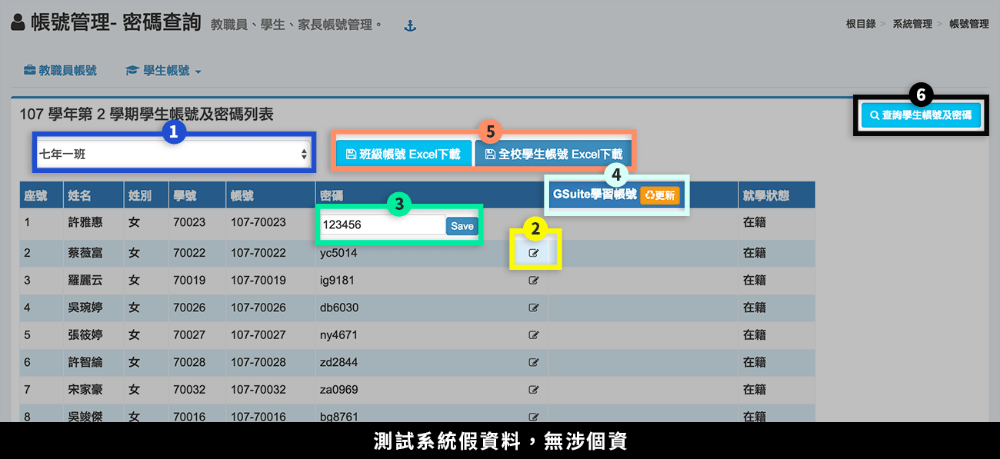
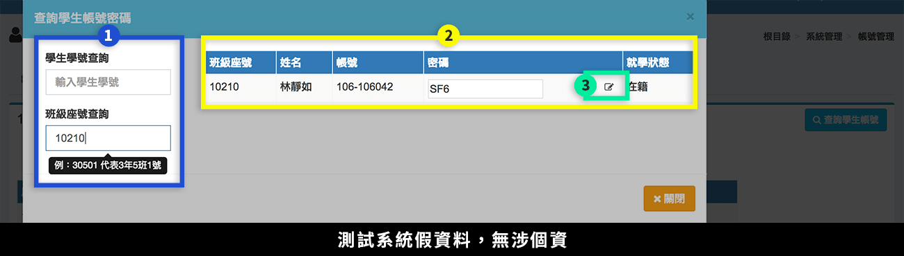
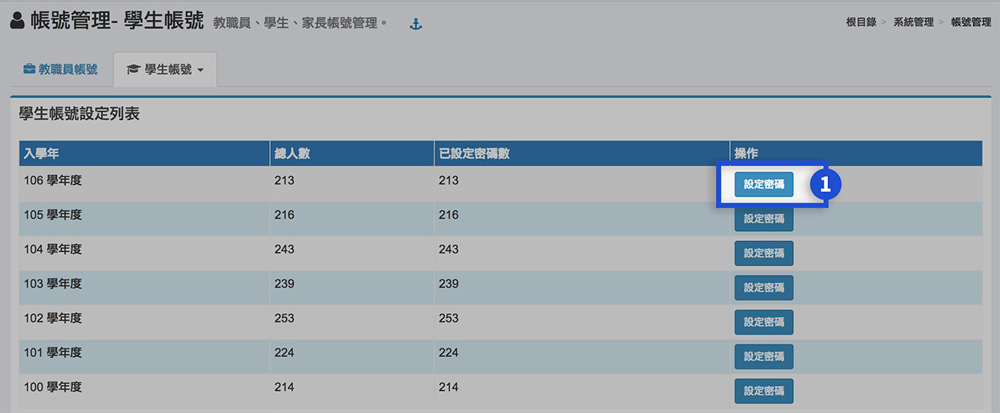
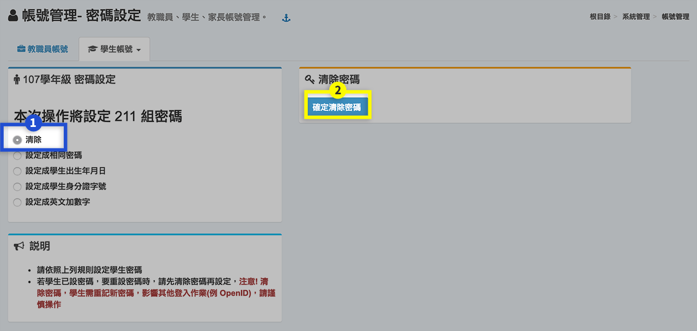
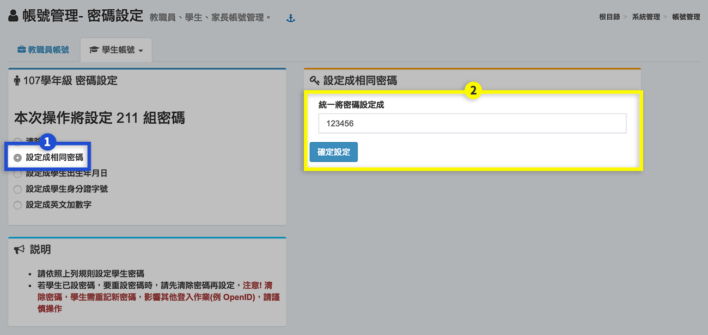
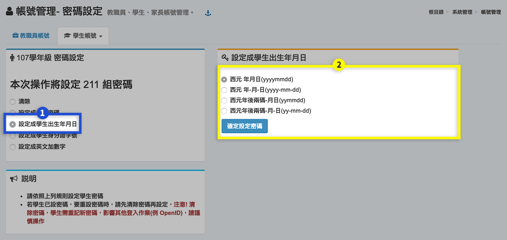
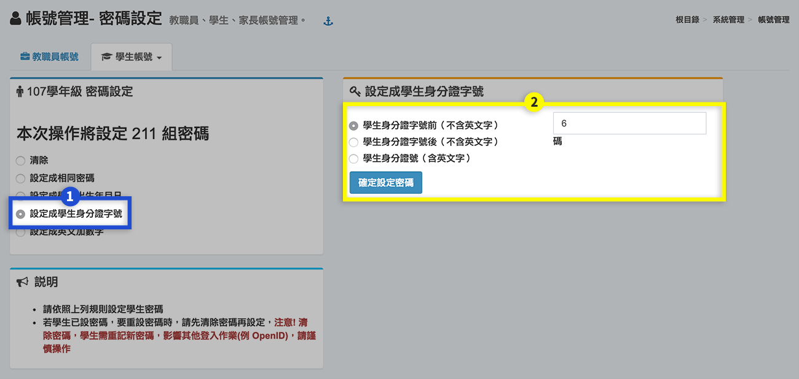
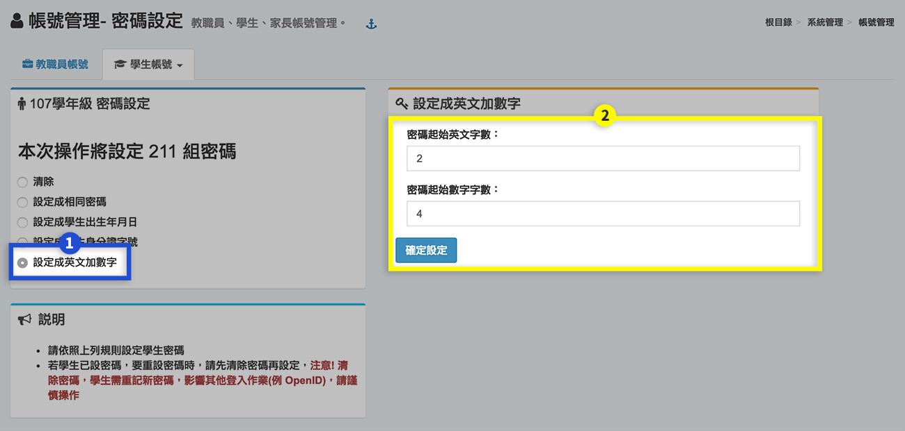

# 帳號管理


本系統使用者密碼**至少設定 6 碼**。


## 教職員帳號

> 提供教師帳號查詢與設定，以及回復為預設教師密碼。

1. 按下**「職別分類選單」**選單，可以依據職稱的不同來列出現職教職員帳號。
2. 按下**「回復成預設密碼」**按鈕，可將該帳號恢復為預設密碼。


本系統不提供查詢教師密碼！若有教師忘記密碼，可恢復為預設密碼，預設密碼可在模組管理>帳號管理>參數調整進行設定。


## 學生帳號

### 密碼查詢

1. 選擇欲查詢的班級。
2. 按下**「修改密碼」**的圖示，可以顯示修改密碼的欄位。
3. 在欄位內出入欲修改的密碼，按下**「Save」**按鈕，可以修改該生密碼。
4. 同步 GSuite 學習帳號。
5. 提供班級、全校學生帳號與密碼下載（Excel 檔）。
6. 按下**「查詢學生帳號」**，可以查詢單一學生的密碼資料（如下圖）。

1. 可依**「學號」**、**「班級座號」**方式來查詢單一學生的帳號及密碼資料，輸入資料後請按下**「Enter」**鍵查詢。
2. 顯示所查詢學生的帳號及密碼資料。
3. 按下**「修改密碼圖示」**，可以顯示修改密碼的欄位，輸入欲修改的密碼後，請按下**「Enter」**鍵儲存資料。

### 密碼設定

> 提供整學年學生批次設定密碼，如下步驟操作。




選擇一個學年，按下**「設定密碼」**，可以進入該**「入學年」**學生的密碼設定畫面。




* 若該學年學生已設有密碼，須先清除密碼，才能執行批次設定。
* 注意! 清除密碼，學生需重記新密碼，影響其他登入作業(例 OpenID)，請謹慎操作。


1. 選擇**「清除」**選項。
2. 按下**「確定清除密碼」**按鈕，將清除該入學年所有學生的密碼。



進入設定密碼頁面，系統會提醒本次將設定幾組密碼（未設密碼者或為符合所選密碼格式者）。本系統提供四種學生密碼格式，擇一設定即可。




1. 選擇**「設成相同密碼」**選項，將顯示設成相同密碼功能。
2. 在欄位中**輸入密碼**，按下**「確定設定」**按鈕，將該入學年所有學生設為一致的密碼。




1. 選擇**「設定成學生出生年月日」**選項，將顯示相關功能選項。
2. 按下**「確定設定密碼」**按鈕，將依據所選擇的生日格式設定學生密碼。




1. 選擇**「設定成學生身分證字號」**選項，將顯示相關功能選項。
2. 按下**「確定設定密碼」**按鈕，將依據所選擇的身分證字號前或後幾碼作為學生密碼。




1. 選擇**「設定成英文加數字」**選項。
2. 按下**「確定設定」**按鈕，將依據所填入的**「英文字數」**及**「數字字數」**隨機決定學生密碼。


