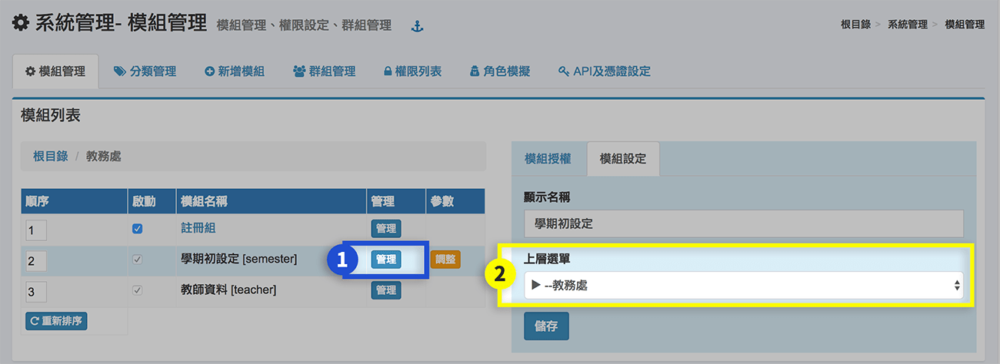

# 模組管理

## 模組管理

> 提供系統管理員設定模組授權對象、模組階層位置，以及調整參數。




1. 編修授權時，在選單或模組列按下 **「管理」** 按鈕。
2.  授權類別可選擇類型：處室群組、職稱群組、職稱類別群組、系統群組、自訂群組等，詳述如下：

    > * 處室群組：例教務處、學務處、輔導室..等，只要職稱在所選處室的人員就能獲得授權。
    > * 職稱群組：例註冊組長、教學組長、輔導主任..等，授權範圍較處室群組小，依職務性質授權的模組，建議選擇此分類授權。
    > * 職稱類別類別群組：例教師兼主任、教師兼組長、專任教師..等，可跨處室授權不同職稱人員。
    > * 系統群組：例系統管理員、訪客、教職員、家長、學生等，當授權對象為訪客時，表示不須帳號登入的訪客可操作，要特別留意是否為不當的授權。（預設系統群組是禁止授權的，欲調整設定請參考下一頁籤說明）
    > * 自訂群組：可依授權需要，預設自訂群組是沒有選項可選，須先至[自訂群組](module.md#zi-ding-qun-zu)新增群組並加入人員。
3. 模組中每一個子項目可個別授權，預設為全選。
4. 在順序欄的輸入框鍵入各模組順序值，按下**「重新排序」 **按鈕可調整模組在分類中的順序。
5. 開關一個模組時，按下該模組的選取方塊，核心模組預設不能關閉，例**「學期初設定 、 教師資料 ...」等**。




為避免模組誤授權給「學生、家長、訪客...等」，系統預設取消授權「系統群組」，如有需要，請依下方步驟「開啟系統群組授權」，並謹慎操作。


1. 點擊**「系統管理」**。
2. 在模組管理右方按下**「調整」**。
3. 在「4. 取消系統授權類別」勾**「否」**。
4. 按下**「確定」**。
5. 選擇要授權的模組，按下**「管理」**。
6. 右方「授權類別」即可選擇**「系統群組」**：訪客、註冊會員、系統管理員、教職員、學生、家長、校友。


注意，系統群組（除了系統管理員）只能授權個別「模組項目」，不能授權整個「上層選單」！





1. 在選單或模組列按下 **「管理」** 按鈕，編修在右側區模組設定頁面。
2. 編修顯示名稱或所屬 **「上層選單」** 。
3. 如異動上層選單，須注意授權狀態是否正確，可瀏覽[**「權限列表」**](module.md#module-privilege)查看。



> 部分模組提供個別**「參數調整」**，及模組頁面中的**「參數設定」**頁籤。

1. 在模組列按下 **「調整」** 按鈕。
2. 更動變數值後按 **「確定」** 鍵儲定。



## 分類管理

> 管理者可按照學校組織運作或教職員操作習慣，編修系統選單。

1. 按 **「分類管理」** 頁籤，進入設定。
2. 選擇一個分類，按 **「新增子項」** 加入新分類選單。
3. 按 **「修改」** 按鈕，在頁面右側顯示修改欄位。
4. 可更換選單圖示。


編修選單後，應查看是否影響群組授權而須重新授權，可瀏覽[**「權限列表」**](module.md#module-privilege)查看。



分類下沒有任何子選單時，才可以刪除分類。


## 新增模組

> 當 CloudSchool 系統有新的應用模組時，可透過**「新增模組」**，將模組加入分類選單中。

1. 模組名稱為系統預設名稱不可修改。
2. 預設的顯示名稱可修改，但為維護方便建議保留預設的顯示名稱。
3. **「上層選單」**指的是將模組安裝到的選單位置。


注意，模組的權限會繼承上層選單設定


## 自訂群組

> 自訂群組名稱及群組人員管理，方便作模組特殊授權設定。

1. 鍵入群組名稱後，按 **「新增群組」**。
2. 點選**「加入自訂群組」**，可多選職稱群組、處室群組、職別群組。
3. 點選**「加入人員」**，可在文字輸入區輸入教職員姓名，並加入群組。
4. 按 **「刪除群組」** 按鈕，將群組刪除。如來源內含"群組"，需先刪除來源群組方能刪除該自訂群組。
5. 點擊群組人員名稱可將該人員移出群組。

## 權限列表 

> 檢查系統授權狀況，查核授權群組及群組人員，是否符合資訊安全原則。

## 角色模擬

> 角色模擬為系統人員的權限，系統可授權不同角色的人員有不同的權限，列表人員可轉換為其他人員的角色。




*

注意，新增的人員「具有模擬別人」權限。


1. 在輸入框鍵入教職員姓名，按 **「Enter 」**鍵，於下拉選單列表選擇欲加入具有模擬權限的人員。
2. 移除時按 **「移除」** 鍵，解除模擬權限，系統將記錄授權起始及結束時間。




注意，模擬他人時，做任何操作都會被系統記錄，且記錄的人員為「被模擬者」。


1. 執行摸擬動作時，先點擊右上角個人資料圖示。
2. 再按 **「角色模擬」** 按鈕，選擇人員進行摸擬。




1. 結束模擬時，點擊右上角個人資料圖示
2. 再按 **「回復為XXX」** 按鈕，回復為原登入人員。



## 指定系統管理員


每校容許設定至多二位系統管理員。


1. 點選**「指定系統管理者」**，並鍵入該人員帳號。
2. 系統管理員離職時，須由另一位系統管理員設定**「解除」**。


系統管理員離職時，其所設定的校外 API KEY 將失效，若需重新啟用，請由另一位系統管理員或新任系統管理員續用或重設。


## API 及憑證設定

> 提供各校可加值更多應用服務，並透過 API 介接本系統資料。

1. 點選**「新增學校伺服器 API」**，並填入名稱、類型、限用伺服器 IP 位址（選填）、已授權的重新導向 URL（選填）。
2. 點擊用戶端 ID **「查看」**，可查看 ID、用戶端密碼、建立日期等。
3. 點擊使用範圍**「查看」**，可查看授權項目。
4. 可編輯或刪除 API 設定。
