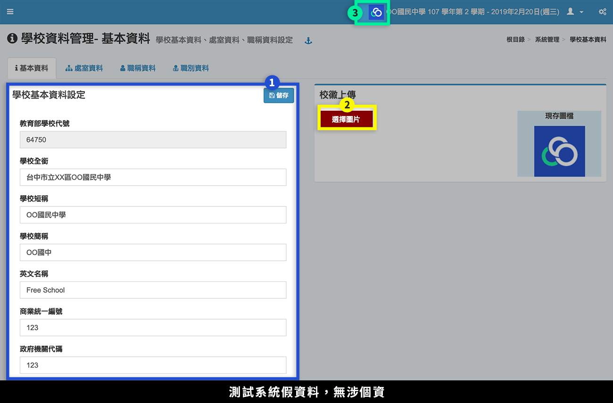
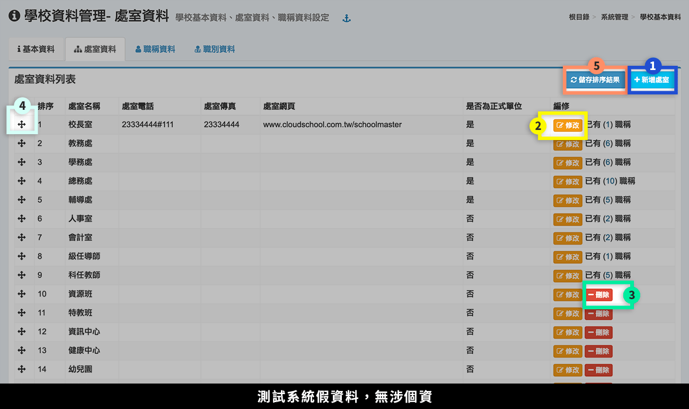
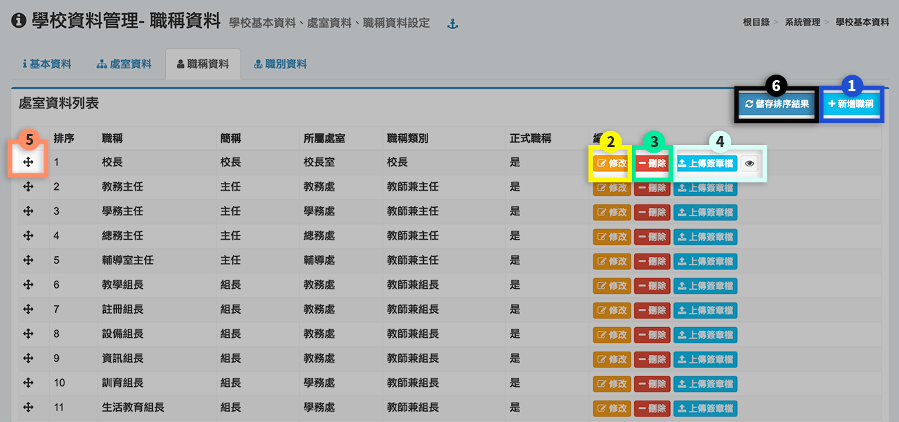
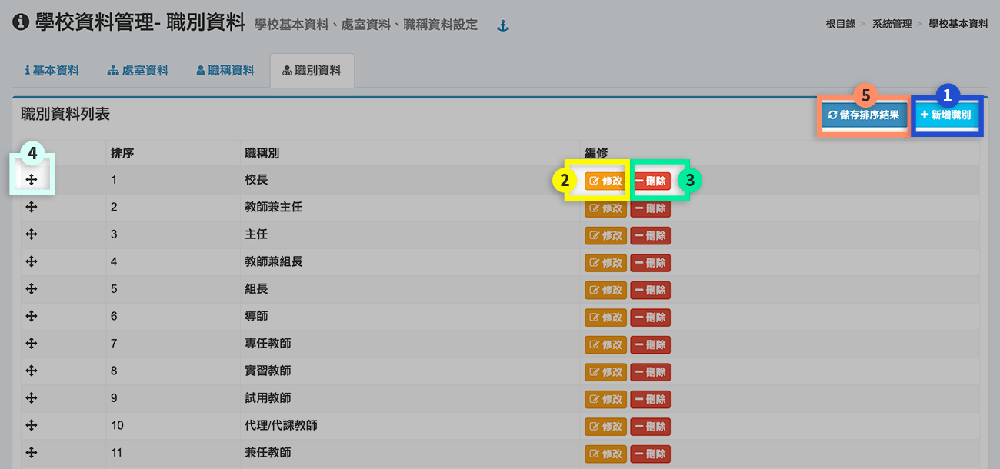

# 學校基本資料

## 基本資料


注意，學校基本資料務必正確，跨校之間的資料交換會帶出學校基本資料，錯誤資料將影響資料交換的進行。


1. 除教育部學校代號不可更改，其他學校基本資料請如實填寫。
2. 點選**「選擇圖片」**，可上傳學校校徽。
3. 在此顯示上傳之校徽，點擊會連結到學校網址（請至**步驟1. 基本資料設定**填寫）

## 處室資料

1. 按下**「新增處室」**按鈕，新增一個處室。
2. 按下**「修改」**按鈕，編輯一個處室。
3. 按下**「刪除」**按鈕，刪除一個處室，如處室下有職稱資料，須先刪除職稱資料才能刪除處室資料。
4. 拖拉處室列可重新排序處室。
5. 當重新拖拉排序後，按下**「儲存排序結果」**儲存排序設定。

## 職稱資料

1. 按下**「新增職稱」**按鈕，新增一個職稱。
2. 按下**「修改」**按鈕，編輯一個職稱。
3. 按下**「刪除」**按鈕，刪除一個職稱；如有教職員設定了該職稱，須先至教師資料設定，移除該職稱設定，才能刪除職稱。
4. 上傳簽章檔，凡校長、主任、組長等職稱，可上傳簽章檔。以上傳之簽章檔，可點擊眼睛圖示查看，簽章檔會顯示在各類學籍成績報表中。
5. 拖拉職稱列可重新排序職稱。
6. 當重新拖拉排序後，按下**「儲存排序結果」**儲存排序設定。

## 職別資料

1. 按下「**新增職別」**按鈕，新增一個職別。
2. 按下「**修改」**按鈕，編輯一個職別。
3. 按下「**刪除」**按鈕，刪除一個職別；如有職稱設定了該職別，須先至「職稱資料」，移除該職別設定，才能刪除職別。
4. 拖拉職別列可重新排序職別。
5. 當重新拖拉排序後，按下**「儲存排序結果」**儲存排序設定。

