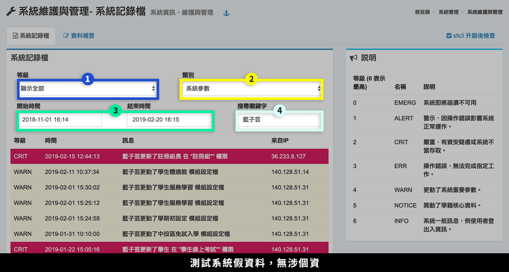
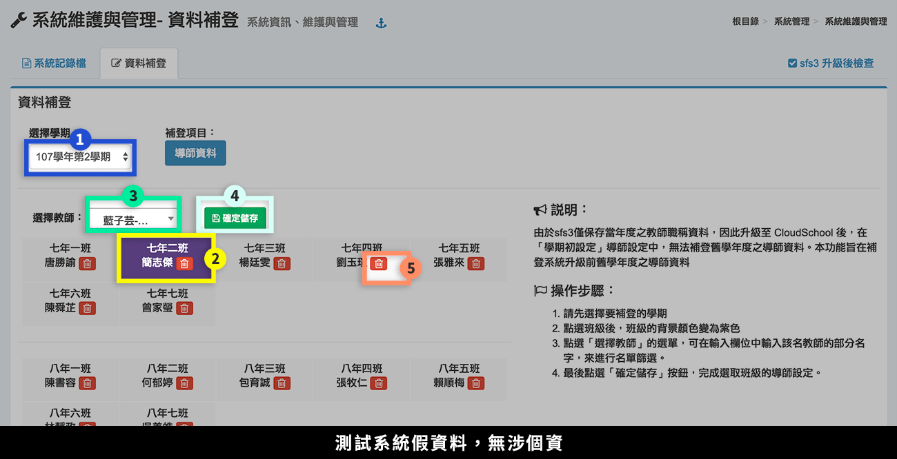
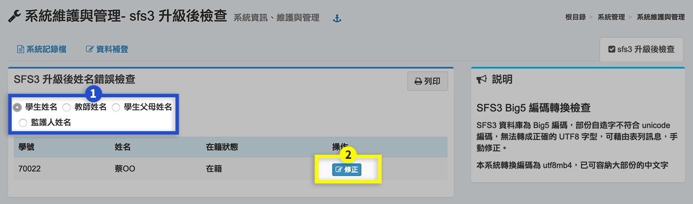

# 系統維護與管理

## 系統記錄檔

> 提供系統紀錄檔，依資訊安全分為不同等級：EMERG、ALERT、CRIT、ERR、WARN、NOTICE、INFO。

1. 依 7 個「等級」篩選紀錄檔。
2. 依「類別」篩選紀錄檔，分別有：登出入訊息、系統參數、學生相關、教師相關、系統相關等五類。
3. 依「時間區段」篩選紀錄檔。
4. 依「關鍵字」篩選紀錄檔。

## 資料補登

> 由於 SFS3 系統僅保存當年度之教師職稱資料，因此升級至 Cloud School 後，在「學期初設定」導師設定中，並無舊學年之導師資料，須在此補登。

1. 選擇補登之學期。
2. 點選班級，背景為紫色表示已選取該班級。
3. 選擇導師。
4. 儲存設定。
5. 亦可點選**「刪除」**導師資料。

## SFS3 升級後檢查

> SFS3 資料庫為 Big5 編碼，部份自造字不符合 unicode 編碼，無法轉成正確的 UTF8 字型，可藉由本功能查詢並手動修正。

1. 選擇姓名檢查對象。
2. 系統自動查出有錯誤的姓名，點選**「修正」**，更正為正確姓名。


若該生姓名為罕用字，且在 [全字庫](https://www.cns11643.gov.tw/) 中尚未編入 unicode，請到本公司 [造字系統](http://faq.cloudschool.tw/font-code) 申請造字。


